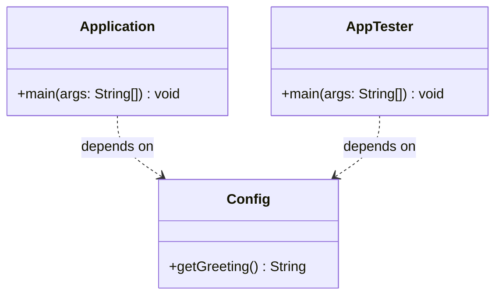

# Today's Objective

* **Today's Focus**: Transitioning from passive understanding to active implementation. You will finish your readings, reimplement your Day 1 execution code completely from memory (no referencing yesterday's files), write simple assertion-based verification tests, and draw your first static UML class/package diagram.
* **Why Today's Work Matters**: Reimplementing from memory forces you to internalize syntax and structural mechanics. Visualizing structure using UML diagrams bridges the gap between raw code syntax and architectural design.
* **How it Connects to Previous Lessons**: Yesterday, you learned the theory of compilation, JVM bytecode, and manual classpaths. Today, you put that theory to a memory test and map those code units visually.
* **How it Prepares You for Future Lessons**: Understanding compile-time coupling and drawing class diagrams prepares you directly for Object-Oriented Analysis & Design (Phase 2) and dependency inversion/SOLID principles (Phase 3).
* **Estimated Study Duration**: 3 hours (out of 4 hours available).

---

# Warm-up (10–15 minutes)

Let's review the mechanics of yesterday's compilation and classpath work.

### Quick Recall Questions
1. When running a class `com.handbook.Main` from the root folder, what directory path does the JVM expect the `.class` file to be in?
2. If your code compiles successfully but you receive a `java.lang.NoClassDefFoundError` when running it, what is the most likely cause?
3. What is the syntax difference between specifying a classpath in Windows vs. Unix-like systems?
4. What is the role of the `-d` flag in the `javac` compiler command?
5. True or False: If a method signature is changed in a dependency class but the consumer class is not recompiled, the JVM will always throw an error at startup.

### Warm-up Coding Exercise
Write a single terminal command that compiles a Java class named `Validator.java` and places the compiled `.class` file directly into a folder named `build/classes/`.

---

# Step 1 — Video Lectures

Today is focused on hands-on recall and visual modeling. To support today's modeling, watch this highly concise explanation of UML Class Diagrams:

* **Title**: UML Class Diagram Tutorial
* **Instructor**: Derek Banas
* **Platform**: YouTube (High-quality software engineering educator)
* **URL**: [https://www.youtube.com/watch?v=3cmzqFeoblk](https://www.youtube.com/watch?v=3cmzqFeoblk)
* **Duration**: 14 minutes
* **Recommended Playback Speed**: 1.0x (1.25x for review)
* **Important Timestamps**:
  * `0:00 - 3:00`: Core relationships (Association, Dependency, Generalization).
  * `4:00 - 6:00`: Expressing attributes, methods, and visibility.
* **Focus Areas**:
  * Note how dependency arrows (dotted lines with open arrows) represent "uses" relationships, pointing from the user to the used class.
* **Notes to Take**:
  * Sketch the standard 3-compartment box for representing a class (Name, Attributes, Methods).
  * Note the symbols for visibility: `+` (public), `-` (private), `#` (protected), `~` (package-private).

---

# Step 2 — Reading

### Book Track
* **Title**: *Head First Java*
* **Edition**: 3rd Edition
* **Author**: Kathy Sierra, Bert Bates, Trisha Gee
* **Chapter**: Chapter 2: "A Trip to Objectville"
* **Section**: Pages 27–48 (focusing on classes, objects, and instantiation)
* **Reading Objective**: Understand how classes act as blueprints for runtime heap objects and how references connect objects.
* **Estimated Reading Time**: 45 minutes

---

# Step 3 — Coding Practice

### Exercise 1: Reimplementation from Memory (Medium)
* **Objective**: Write, compile, and run your multi-class application from memory without looking at yesterday's files.
* **Difficulty**: Medium
* **Expected Outcome**: Create a class `Config` that returns a system greeting, and an `Application` class that calls `Config` and prints the output. Compile them manually, move `Config.class` to a separate `bin/` directory, and run the program successfully using the classpath argument.
* **Hints**: Start by planning your directory structure before writing any code.
* **Common Mistakes**: Accidentally opening yesterday's folder to copy syntax. If you get stuck, try reading the compiler error message first before looking up syntax.

### Exercise 2: Assertion Testing (Medium)
* **Objective**: Introduce verification without frameworks, using Java's built-in assertion engine.
* **Difficulty**: Medium
* **Expected Outcome**: Create a third class `AppTester.java` containing a main method. Call `Config`'s greeting method and use the `assert` keyword to verify its output (e.g., `assert greeting.equals("Expected String");`). Run the tester with the assertions enabled flag: `java -ea AppTester`.
* **Hints**: The `-ea` flag stands for *enableassertions*. Without it, the JVM ignores the assert statements entirely.
* **Common Mistakes**: Forgetting to run with `-ea`, which makes tests pass silently even if they are failing.

---

# Step 4 — Hands-on Lab

No lab is scheduled today. (The hands-on lab for this lesson is scheduled for Day 3).

---

# Step 5 — Project Work

No project milestone is scheduled today. (The project connection is completed at the end of the module).

---

# Step 6 — UML / Design Exercise

### UML Exercise: Static Structure Diagram
* **Why it matters**: In software architecture, understanding compile-time relationships is crucial. If Class A imports or references Class B, Class A depends on Class B. If Class B changes, Class A may need recompilation. This is a static dependency.
* **What should appear in the diagram**:
  1. A package block containing the `Application` and `AppTester` classes.
  2. A separate package block (or directory context) containing the `Config` class.
  3. A dotted dependency arrow `-->` representing that `Application` and `AppTester` depend on `Config`.
  4. Proper class compartments showing the method signatures (e.g. `+ main(args: String[]): void` and `+ getGreeting(): String`).
* **Common Mistakes**:
  * Pointing the dependency arrow in the wrong direction (it must point *to* `Config`).
  * Conflating static compile-time references with runtime execution flows.

*You can write this diagram in Markdown using Mermaid syntax:*


---

# Step 7 — Engineering Insight

### Compile-time Dependencies vs. Runtime Dependencies
A classic junior mistake is failing to distinguish between compile-time dependencies (what `javac` needs to build the bytecode) and runtime dependencies (what `java` needs to load and execute classes).

* **Compile-time dependencies** are hard dependencies declared in your source files via imports and type declarations. The compiler uses these to verify type safety.
* **Runtime dependencies** are resolved dynamically by the JVM ClassLoader. A class might compile fine because an interface is present, but fail at runtime because the actual implementation class is missing from the classpath.

Understanding this distinction is the key to designing extensible plugin systems, service registries, and dependency injection frameworks (like Spring), which deliberately decouple compile-time types from runtime implementations.

---

# Step 8 — Open Source Connection

In **JUnit 5**, the core test engine uses reflection to decouple compile-time tests from the execution engine.
* The test execution launcher (e.g., `org.junit.platform.launcher.Launcher`) has **zero compile-time knowledge** of your test classes.
* At runtime, it scans the classpath, loads your class files dynamically using class loaders, inspects them for annotations like `@Test`, and executes them.
* This separates compile-time test runner code from dynamic runtime user code.

---

# Step 9 — End-of-Day Reflection

1. If you compile a program and then delete a class that is never instantiated during execution, will the JVM still complain at startup? Why or why not?
2. What is the difference between a compile-time dependency and a runtime dependency?
3. How does the `-ea` flag affect the bytecode generated by the compiler? (Does it change the `.class` file or change how the JVM interprets it?)
4. In your UML diagram, why is the relationship between `Application` and `Config` a dependency (`..>`) rather than an association (`-->`)?
5. Why are package-private classes (default visibility, no modifier) useful for managing compile-time dependencies?

---

# Step 10 — Notes Template

Save a copy of this template to `notes/P00.M01.L01.md` (or append it if already created):

```markdown
# Notes: P00.M01.L01 - Java Program Structure and Execution

## Key Concepts

## Important Definitions

## Things That Clicked Today

## Things I Still Don't Understand

## Mistakes I Made

## Real-world Connections

## Questions To Revisit
```

---

# Step 11 — Journal Template

Save a copy of this template to `journal/2026-07-02.md`:

```markdown
# Daily Journal: 2026-07-02

## What I accomplished today

## Biggest insight

## Biggest challenge

## Questions I still have

## Time spent

## Confidence (1–10)

## Plan for tomorrow
```

---

# Final Checklist

- [ ] Warm-up complete
- [ ] UML Class Diagram video watched
- [ ] Book reading completed (Head First Java Chapter 2)
- [ ] Coding Exercise 1 (Memory Reimplementation) completed
- [ ] Coding Exercise 2 (Assertion Verification) completed
- [ ] UML Static dependency diagram drawn (Mermaid or Paper)
- [ ] Reflection questions answered
- [ ] Notes file (`notes/P00.M01.L01.md`) updated
- [ ] Journal file (`journal/2026-07-02.md`) created from template
- [ ] Git commit completed with the designated message

---

### Recommended Git Commit Command:
```bash
git add .
git commit -m "study(P00.M01.L01): complete day 2"
```
