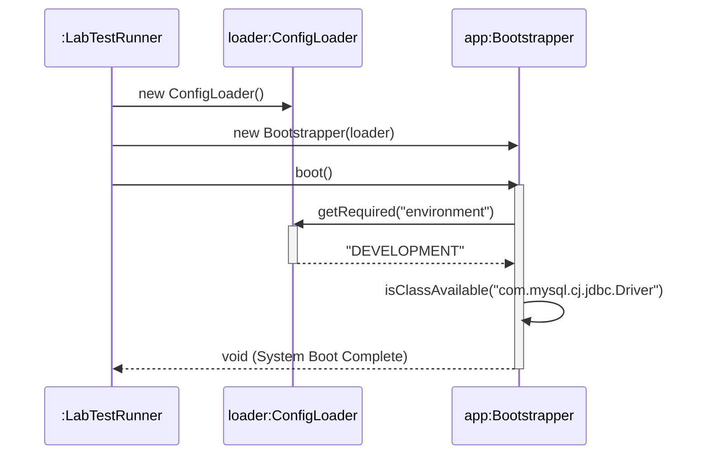

# Today's Objective

* **Today's Focus**: This is the final day of your first lesson! You will debug a broken access control compilation issue, implement the complete hands-on Lab project, write assertion-based validation tests, and draw a UML sequence diagram showing dynamic runtime execution.
* **Why Today's Work Matters**: Completing the lesson lab integrates compilation, class loading, packages, and code boundaries into a single working program. Visualizing it with a sequence diagram reinforces the difference between static structures (UML class diagrams) and dynamic runtime interactions (UML sequence diagrams).
* **How it Connects to Previous Lessons**: Day 1 and 2 covered compilation, classpaths, and static structure mapping. Today, you breathe life into this code, testing its behavior under valid and invalid runtime constraints.
* **How it Prepares You for Future Lessons**: This lab lays the foundation for organizing Java code within packages, separating main directories from test directories, and preparing you for Maven/Gradle layout structures (P00.M03.L02).
* **Estimated Study Duration**: 3 hours (out of 4 hours available).

---

# Warm-up (10–15 minutes)

Let's review static structure and compilation boundaries from Day 2.

### Quick Recall Questions
1. In a UML class diagram, what does a dotted arrow with an open arrowhead (`..>`) signify?
2. What visibility modifier is applied if you do not specify any access modifier (e.g., `class Helper`)? Can classes in other packages import it?
3. How do static dependencies (compile-time imports) differ from dynamic execution dependencies?
4. What flag does the JVM need to execute `assert` statements?
5. Why are package folders (e.g., `com/handbook/`) matching package declarations (e.g., `package com.handbook;`) mandatory for compiling multi-class projects?

### Warm-up Coding Exercise
Write the code for a package declaration and import statement for a class `Engine` in the package `com.handbook.core` importing a class `Part` from `com.handbook.components`.

---

# Step 1 — Video Lectures

Today's focus is on behavioral execution over time. Watch this concise explanation of UML Sequence Diagrams:

* **Title**: UML Sequence Diagrams
* **Instructor**: Lucidchart Course Staff
* **Platform**: YouTube
* **URL**: [https://www.youtube.com/watch?v=pCK6prSq8aw](https://www.youtube.com/watch?v=pCK6prSq8aw)
* **Duration**: 9 minutes
* **Recommended Playback Speed**: 1.0x
* **Important Timestamps**:
  * `0:40 - 2:20`: Standard shapes (Actors, Lifelines, Activation Boxes).
  * `2:30 - 5:00`: Message arrows (Synchronous, Asynchronous, Return, Self-message).
* **Focus Areas**:
  * Focus on how lifelines represent object instances (not classes) and how vertical height represents the progression of time.
* **Notes to Take**:
  * Draw a quick example of a synchronous invocation message pointing to another lifeline, and its dashed return arrow pointing back.

---

# Step 2 — Reading

### Blog / Documentation Track
* **Title**: *Java Documentation - Packages*
* **Publisher**: Oracle (Official Documentation)
* **URL**: [https://docs.oracle.com/javase/tutorial/java/package/index.html](https://docs.oracle.com/javase/tutorial/java/package/index.html)
* **Section**: "Creating and Using Packages" and "Using Package Members"
* **Reading Objective**: Consolidate access control rules across packages.
* **Estimated Reading Time**: 20 minutes

---

# Step 3 — Coding Practice

### Exercise: Access Control Debugging (Medium)
* **Objective**: Debug a compilation error caused by package boundaries.
* **Difficulty**: Medium
* **Expected Outcome**: Create two files in different package folders:
  1. `handbook/phase00/p00m01l01/service/InternalConfig.java` (declare it as package-private class: `class InternalConfig`).
  2. `handbook/phase00/p00m01l01/app/Main.java` (attempts to import and instantiate `InternalConfig`).
  Compile them. Observe the compilation error. Fix the error by declaring `InternalConfig` as `public` and compile successfully.
* **Hints**: Compile from the parent directory of `handbook/`.
* **Common Mistakes**: Compiling the files by running `javac` from inside the package folders rather than compiling from the root directory.

---

# Step 4 — Hands-on Lab

### Lab: Application Bootstrapper & Class Loader Validator

#### Problem Statement
Design a console-based Java bootstrapper that loads system configurations from a text properties file, validates that class invariants are correct, checks if optional dependency classes are loadable on the classpath, and boots a simulated subsystem gracefully.

#### Requirements
1. **Packages**: Organize your source code under the package `handbook.phase00.p00m01l01`.
2. **Bootstrapper Class**: Exposes a `boot()` method that coordinates config loading and classloader checks.
3. **ConfigLoader Class**: Reads config key-value pairs. Throws custom runtime exceptions if required values are missing.
4. **Verification**: Write a test runner `LabTestRunner` containing assertion checks verifying that validation exceptions are correctly thrown when key parameters are missing.

#### Starter Folder Structure
```text
src/main/java/handbook/phase00/p00m01l01/Bootstrapper.java
src/main/java/handbook/phase00/p00m01l01/ConfigLoader.java
src/test/java/handbook/phase00/p00m01l01/LabTestRunner.java
docs/P00.M01.L01-diagram.md
```

#### Code Implementation Guidelines

##### ConfigLoader.java
```java
package handbook.phase00.p00m01l01;
import java.util.HashMap;
import java.util.Map;

public class ConfigLoader {
    private final Map<String, String> configs = new HashMap<>();

    public void setConfig(String key, String value) {
        configs.put(key, value);
    }

    public String getRequired(String key) {
        String val = configs.get(key);
        if (val == null || val.trim().isEmpty()) {
            throw new IllegalArgumentException("Missing required config: " + key);
        }
        return val;
    }
}
```

##### Bootstrapper.java
```java
package handbook.phase00.p00m01l01;

public class Bootstrapper {
    private final ConfigLoader loader;

    public Bootstrapper(ConfigLoader loader) {
        this.loader = loader;
    }

    public boolean isClassAvailable(String className) {
        try {
            Class.forName(className);
            return true;
        } catch (ClassNotFoundException e) {
            return false;
        }
    }

    public void boot() {
        String env = loader.getRequired("environment");
        System.out.println("System starting in " + env + " environment...");
        
        // Dynamic Class Loader Verification
        boolean hasOptionalDriver = isClassAvailable("com.mysql.cj.jdbc.Driver");
        System.out.println("Optional MySQL Driver loadable: " + hasOptionalDriver);
    }
}
```

##### LabTestRunner.java
```java
package handbook.phase00.p00m01l01;

public class LabTestRunner {
    public static void main(String[] args) {
        System.out.println("Running Lab Tests...");

        // Test Case 1: Invariant Check Failure
        ConfigLoader loader = new ConfigLoader();
        Bootstrapper app = new Bootstrapper(loader);

        boolean exceptionThrown = false;
        try {
            app.boot();
        } catch (IllegalArgumentException e) {
            exceptionThrown = true;
            System.out.println("Test Case 1 Passed: Caught expected missing config exception.");
        }
        assert exceptionThrown : "Invariant validation failed to throw IllegalArgumentException!";

        // Test Case 2: Successful Boot
        loader.setConfig("environment", "DEVELOPMENT");
        app.boot(); // should complete without exception
        System.out.println("Test Case 2 Passed: Booted successfully.");

        System.out.println("All Lab Tests Completed Successfully!");
    }
}
```

#### Compilation & Execution Commands
Run the commands from the root `src/` directory (where your packages start):
```bash
# Compilation
javac main/java/handbook/phase00/p00m01l01/*.java test/java/handbook/phase00/p00m01l01/*.java -d bin

# Execution of test runner
java -ea -cp bin handbook.phase00.p00m01l01.LabTestRunner
```

#### Acceptance Criteria
* Code compiles cleanly using the commands above.
* Executing `LabTestRunner` with the `-ea` (enable assertions) flag succeeds without throwing an `AssertionError`.
* Logs confirm exception validation caught the missing configuration.

#### Stretch Goals
* Try adding standard properties parsing to read configuration from a `config.properties` file using `java.util.Properties`.
* Check if class loaders print the system classloader hierarchy inside `Bootstrapper.java` (using `ClassLoader.getSystemClassLoader()`).

---

# Step 5 — Project Work

No project milestone is scheduled today. (The project connection is completed at the end of the module).

---

# Step 6 — UML / Design Exercise

### UML Sequence Diagram
Draw a sequence diagram visualizing the dynamic execution flow of `LabTestRunner` booting the application.
* **Why it matters**: A sequence diagram models runtime message-passing, showing exactly how execution control flows between objects over time.
* **What should appear in the diagram**:
  1. Three object lifelines: `:LabTestRunner`, `loader:ConfigLoader`, and `app:Bootstrapper`.
  2. The creation call from `:LabTestRunner` instantiating `ConfigLoader` and `Bootstrapper`.
  3. The `boot()` message call from `:LabTestRunner` to `app:Bootstrapper`.
  4. The internal `getRequired("environment")` query from `app:Bootstrapper` to `loader:ConfigLoader`.
  5. The return execution flow from `ConfigLoader` back to `Bootstrapper`.
  6. The dynamic lookup class loading query `forName(...)` sent to the JVM class registry.
* **Common Mistakes**:
  * Writing class names (e.g., `ConfigLoader`) on lifelines instead of instance names (e.g., `loader:ConfigLoader`).
  * Forgetting return arrows (dashed lines) for method execution completions.

*You can write this diagram in Markdown using Mermaid syntax:*


---

# Step 7 — Engineering Insight

### Dynamic Class Loading & Runtime Linking
Unlike languages like C/C++ which statically link all functions into a single compiled binary executable at build-time, Java is a dynamically linked runtime system.
* **Dynamic Linking** means class loading happens on-demand (lazily). When your code first references class `A`, the JVM class loader attempts to read the bytes from the `.class` file matching package `A` on the classpath.
* **Resolution & Initialization**: Once loaded, it validates the bytecode format, allocates static fields, and initializes class variables.
* **Fault Tolerance**: This lazy loading is highly flexible. For example, in our `Bootstrapper` class, we check for a optional JDBC driver class `com.mysql.cj.jdbc.Driver`. If it is absent on the classpath, the compiler still compiles `Bootstrapper` fine (since it is a String reference), and the runtime catches the missing dependency as a soft Boolean check instead of crashing!

---

# Step 8 — Open Source Connection

In **Spring Boot**, the platform packages everything inside a single executable "Fat JAR".
* Standard Java class loaders cannot read classes inside nested `.jar` files inside another jar.
* To solve this, Spring Boot implements `org.springframework.boot.loader.JarLauncher`.
* This launcher starts first, creates custom class loaders that know how to unpack and read class bytes inside nested archives, and registers them dynamically before starting your application's `main` method.

---

# Step 9 — End-of-Day Reflection

1. If you run a class sequence diagram, which direction does time flow? How does it differ from a structural diagram?
2. If `Class.forName("com.UnknownClass")` is evaluated, what checked exception does Java throw? Why is it a checked exception?
3. How does lazy class loading protect applications from crashing if optional features (e.g., third-party integrations) are missing?
4. When writing `assert exceptionThrown : "Invariant validation failed"`, what happens to execution if assertions are not enabled (`-ea` flag omitted)?
5. Why is separating production classes (main) and test classes (test) into separate folder structures useful for classpath management?

---

# Step 10 — Notes Template

Append this template to `notes/P00.M01.L01.md`:

```markdown
# Notes: P00.M01.L01 - Java Program Structure and Execution

## Key Concepts

## Important Definitions

## Things That Clicked Today

## Things I Still Don't Understand

## Mistakes I Made

## Real-world Connections

## Questions To Revisit
```

---

# Step 11 — Journal Template

Save a copy of this template to `journal/2026-07-03.md`:

```markdown
# Daily Journal: 2026-07-03

## What I accomplished today

## Biggest insight

## Biggest challenge

## Questions I still have

## Time spent

## Confidence (1–10)

## Plan for tomorrow
```

---

# Final Checklist

- [ ] Warm-up complete
- [ ] UML Sequence Diagram video watched
- [ ] Oracle Java Packages documentation read
- [ ] Coding Exercise (Access Control Debugging) completed
- [ ] Lab: Application Bootstrapper & Class Loader Validator implemented
- [ ] LabTestRunner executed successfully with `-ea` flag
- [ ] UML Sequence diagram drawn (Mermaid or Paper)
- [ ] Reflection questions answered
- [ ] Notes file (`notes/P00.M01.L01.md`) updated and finalized
- [ ] Journal file (`journal/2026-07-03.md`) created from template
- [ ] Git commit completed with the designated message

---

### Recommended Git Commit Command:
```bash
git add .
git commit -m "study(P00.M01.L01): complete day 3"
```
