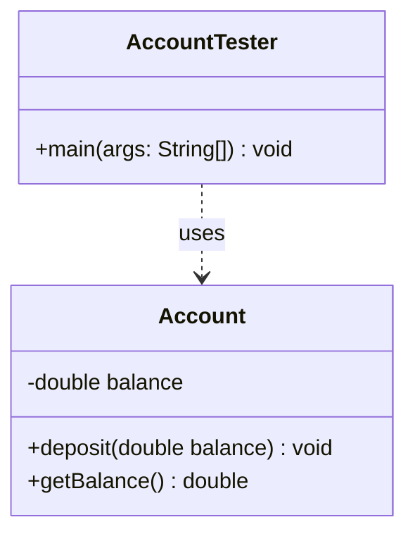

# Today's Objective

* **Today's Focus**: Deepening your understanding of class state and behavior (instance variables vs. local variables), variable shadowing, simple encapsulation (getters/setters), and mapping these relationships statically using UML.
* **Why Today's Work Matters**: Understanding how state (instance variables) dictates behavior (methods) is the core of Object-Oriented Programming. Knowing the scope and lifecycle of variables prevents shadowing bugs and incorrect calculations in production business logic.
* **How it Connects to Previous Lessons**: Yesterday, you learned where primitive and reference variables are allocated in memory (Stack vs. Heap). Today, you will explore how local method variables on the Stack interact with object instance variables on the Heap.
* **How it Prepares You for Future Lessons**: This sets the foundation for encapsulation, invariants, and access control (P01.M01.L02), ensuring you write objects that protect their internal state from corruption.
* **Estimated Study Duration**: 3 hours (out of 4 hours available).

---

# Warm-up (10–15 minutes)

Let's review memory allocation and parameter passing from Day 1 of this lesson.

### Quick Recall Questions
1. In Java, what happens to object instances on the Heap when a method stack frame pops?
2. True or False: If you pass an object reference to a method and assign a new object to that parameter inside the method, the caller's reference updates to the new object.
3. What is the size in bits of a `double` type vs. a `float` type in Java?
4. What happens when a `byte` variable with a value of `127` is incremented by `1`?
5. Why are local variables inside method frames not automatically initialized with default values, whereas instance variables are?

### Warm-up Coding Exercise
Write a method `double divide(int a, int b)` that performs double division of the two integers and returns the precise decimal result, avoiding integer truncation.

---

# Step 1 — Video Lectures

To reinforce object state, methods, and visibility, watch this clear educational video:

* **Title**: Java Getters and Setters - Encapsulation Tutorial
* **Instructor**: Coding with John (High-quality Java educator)
* **Platform**: YouTube
* **URL**: [https://www.youtube.com/watch?v=F3G8D-bSgac](https://www.youtube.com/watch?v=F3G8D-bSgac)
* **Duration**: 10 minutes
* **Recommended Playback Speed**: 1.0x
* **Focus Areas**:
  * Focus on why we declare class variables as `private` and control access via public getters and setters.
* **Notes to Take**:
  * Write down the definition of "Encapsulation" in your own words.
  * Note how getters and setters allow us to validate incoming parameter values before writing them to memory.

---

# Step 2 — Reading

### Book Track
* **Title**: *Head First Java*
* **Edition**: 3rd Edition
* **Author**: Kathy Sierra, Bert Bates, Trisha Gee
* **Chapter**: Chapter 4: "How Objects Behave"
* **Section**: Pages 71–94 (focusing on method arguments, return values, encapsulation, and instance variables vs. local variables)
* **Reading Objective**: Understand how state affects behavior, the difference between instance and local variables, and how encapsulation protects state.
* **Estimated Reading Time**: 45 minutes

---

# Step 3 — Coding Practice

### Exercise 1: Reimplementing Reassignment Check (Medium)
* **Objective**: Reimplement parameter passing checks from memory to solidify reference mechanics.
* **Difficulty**: Medium
* **Expected Outcome**: Write a class `PassVerifier.java`. Implement a method `updateValue(StringBuilder builder)` that appends a suffix, and tries to reassign the parameter `builder = null`. Verify using assertions that the original StringBuilder retains the appended suffix and is NOT null after the method call.
* **Hints**: Compile and execute with assertions enabled (`-ea`).
* **Common Mistakes**: Expecting the original reference in `main` to become `null`.

### Exercise 2: Variable Shadowing and "this" (Medium)
* **Objective**: Identify variable shadowing and use `this` to resolve it.
* **Difficulty**: Medium
* **Expected Outcome**: Create a class `Account.java` with a private instance variable `double balance`. Expose a method `void deposit(double balance)` and a getter `double getBalance()`. Inside `deposit`, use `this.balance` to distinguish the instance variable from the method parameter `balance`. Create a test class verifying that deposits successfully update the account balance.
* **Hints**: `this.balance = balance;` assigns the local parameter to the instance variable.
* **Common Mistakes**: Writing `balance = balance;`, which simply assigns the local variable to itself, leaving the instance variable unchanged (value remains 0.0).

---

# Step 4 — Hands-on Lab

No lab is scheduled today. (The hands-on lab for this lesson is scheduled for Day 3).

---

# Step 5 — Project Work

No project milestone is scheduled today. (The project connection is completed at the end of the module).

---

# Step 6 — UML / Design Exercise

### UML Exercise: Static Class Diagram
Draw a static UML class diagram representing the `Account` and `AccountTester` classes.
* **Why it matters**: A class diagram captures class properties, method contracts, types, and visibilities, giving developers a clear picture of the static codebase layout.
* **What should appear in the diagram**:
  1. An `Account` class box with:
     * A private attribute compartment: `- balance : double`
     * A public method compartment: `+ deposit(amount : double) : void` and `+ getBalance() : double`
  2. An `AccountTester` class box showing a `+ main(args : String[]) : void` method.
  3. A dotted dependency arrow pointing from `AccountTester` to `Account`.
* **Common Mistakes**:
  * Using public `+` visibility for instance variables that should be private `-`.
  * Omitting variable types or method return signatures.

*You can write this diagram in Markdown using Mermaid syntax:*


---

# Step 7 — Engineering Insight

### The Mechanics of Variable Shadowing
In Java, blocks of code define scope boundaries. 
* If a method defines a local variable (or a parameter) with the exact same name as an instance variable, the local variable **shadows** the instance variable.
* Inside that method, referencing the variable name defaults to the local scope.
* To access the instance scope, you must qualify the call using the `this` keyword, which represents the current instance reference on the heap.
* **Best Practice**: Senior engineers use `this` intentionally inside setters and constructors to assign parameters to fields, but avoid shadowing elsewhere to keep code clean and self-explanatory.

---

# Step 8 — Open Source Connection

In the **Java Development Kit (JDK)**, core classes practice strict encapsulation:
* Look at `java.lang.Integer`. The actual integer value is stored in a private final field: `private final int value;`.
* It cannot be accessed directly. Instead, you access it through public getter methods like `intValue()`, `doubleValue()`, etc.
* This ensures the class's internal state remains immutable and protected from unexpected modification.

---

# Step 9 — End-of-Day Reflection

1. If you declare a local variable inside a method with the same name as an instance variable, what happens to the instance variable? How do you access it?
2. Why is it a good design practice to declare instance variables as `private`?
3. What is the default value of an unitialized instance variable of type `int` vs. `double` vs. an object reference?
4. If a method return type is `void`, can it have a `return` statement? Why or why not?
5. How does variable shadowing impact readability? When is it acceptable, and when should it be avoided?

---

# Step 10 — Notes Template

Append this template to `notes/P00.M01.L02.md`:

```markdown
# Notes: P00.M01.L02 - Variables, types, operators, and control flow

## Key Concepts

## Important Definitions

## Things That Clicked Today

## Things I Still Don't Understand

## Mistakes I Made

## Real-world Connections

## Questions To Revisit
```

---

# Step 11 — Journal Template

Save a copy of this template to `journal/2026-07-05.md`:

```markdown
# Daily Journal: 2026-07-05

## What I accomplished today

## Biggest insight

## Biggest challenge

## Questions I still have

## Time spent

## Confidence (1–10)

## Plan for tomorrow
```

---

# Final Checklist

- [ ] Warm-up complete
- [ ] Getters, Setters & Encapsulation video tutorial watched
- [ ] Book reading completed (Head First Java Chapter 4)
- [ ] Coding Exercise 1 (PassVerifier) completed
- [ ] Coding Exercise 2 (Account and Shadowing) completed
- [ ] UML Static class diagram drawn (Mermaid or Paper)
- [ ] Reflection questions answered
- [ ] Notes file (`notes/P00.M01.L02.md`) updated
- [ ] Journal file (`journal/2026-07-05.md`) created from template
- [ ] Git commit completed with the designated message

---

### Recommended Git Commit Command:
```bash
git add .
git commit -m "study(P00.M01.L02): complete day 2"
```
