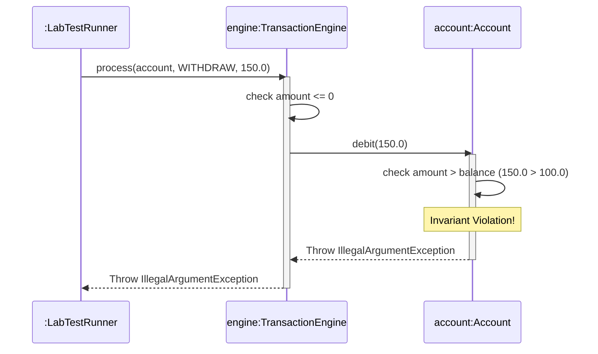

# Today's Objective

* **Today's Focus**: Implementing the Lesson 2 Lab, debugging conditional logic (short-circuit evaluation bugs), and mapping runtime transaction flows dynamically using a UML sequence diagram.
* **Why Today's Work Matters**: Designing systems that process state transitions requires writing robust logic that prevents overflow errors, invalid state transitions, and null references. You will build a bulletproof transaction processor and understand why floating-point math is a double-edged sword.
* **How it Connects to Previous Lessons**: Yesterday, you mapped structural variables and classes. Today, you will combine those variables, operators, and control flow checks (`if-else`, loops) to model transactional behavior.
* **How it Prepares You for Future Lessons**: This prepares you directly for designing robust exception boundaries (P00.M02.L02) and defensive coding models that are crucial in high-performance enterprise applications.
* **Estimated Study Duration**: 3 hours (out of 4 hours available).

---

# Warm-up (10–15 minutes)

Let's review variable scopes, visibility, and encapsulation from Day 2.

### Quick Recall Questions
1. How does the JVM distinguish an instance variable from a method parameter with the same name?
2. What is the default access modifier of a class member if no modifier is declared, and where is it visible?
3. Why are getters and setters preferred over public fields even for basic data structures?
4. In a UML class diagram, what does a private modifier symbol look like?
5. True or False: You can declare a class instance variable as `var` (local variable type inference).

### Warm-up Coding Exercise
Write a short code snippet of a class `Item` with a private field `int quantity` and a setter `setQuantity(int qty)` that throws an `IllegalArgumentException` if the quantity is negative.

---

# Step 1 — Video Lectures

To support your lab's control flow logic, watch this quick tutorial on Java's logical operators:

* **Title**: Java Logical Operators - Short-Circuit Evaluation
* **Instructor**: Cave of Programming / John Purcell
* **Platform**: YouTube
* **URL**: [https://www.youtube.com/watch?v=kYv_C2nF2w0](https://www.youtube.com/watch?v=kYv_C2nF2w0)
* **Duration**: 8 minutes
* **Recommended Playback Speed**: 1.0x
* **Focus Areas**:
  * Focus on the difference between single operators (`&`, `|`) and short-circuit operators (`&&`, `||`).
* **Notes to Take**:
  * Write down the definition of "Short-Circuit Evaluation".
  * Create a truth table for `&&` and `||`.

---

# Step 2 — Reading

### Blog / Documentation Track
* **Title**: *Floating-Point Arithmetic Issues and Limitations*
* **Publisher**: Python/Java Documentation & general CS guides
* **URL**: [https://docs.oracle.com/cd/E19957-01/806-3568/double.html](https://docs.oracle.com/cd/E19957-01/806-3568/double.html)
* **Reading Objective**: Understand why float and double types exhibit round-off errors and why they must not be used for precise monetary computations.
* **Estimated Reading Time**: 15 minutes

---

# Step 3 — Coding Practice

### Exercise: Short-Circuit Debugging (Medium)
* **Objective**: Fix a runtime NullPointerException caused by using non-short-circuiting operators.
* **Difficulty**: Medium
* **Expected Outcome**: Create a class `ShortCircuitPlayground.java`. Write a method `boolean isNameLong(String name)` that checks: `if (name != null & name.length() > 10)`. Run the code by passing `null`. Observe the `NullPointerException`. Fix it by replacing `&` with `&&`.
* **Hints**: The single `&` forces the JVM to evaluate both sides, even if the left side evaluates to `false` (meaning the object is null).
* **Common Mistakes**: Conflating bitwise/logical AND (`&`) with conditional short-circuit AND (`&&`).

---

# Step 4 — Hands-on Lab

### Lab: BankAccount Transaction Engine

#### Problem Statement
Design a modular Java transaction processor that accepts transaction requests (deposits and withdrawals) for a specific account. The engine must validate preconditions (prevent nulls and negative amounts), enforce business invariants (prevent account overdrafts), and check for numeric overflow boundaries (prevent double overflows).

#### Requirements
1. **Packages**: Organize your source code under the package `handbook.phase00.p00m01l02`.
2. **Account Class**: Encapsulates `double balance`. Exposes safe deposit and withdraw methods.
3. **TransactionEngine Class**: Processes a transaction action. Validates parameters using conditional statements.
4. **LabTestRunner**: Validates the engine using assertion tests with `-ea` flag.

#### Starter Folder Structure
```text
src/main/java/handbook/phase00/p00m01l02/Account.java
src/main/java/handbook/phase00/p00m01l02/TransactionEngine.java
src/test/java/handbook/phase00/p00m01l02/LabTestRunner.java
docs/P00.M01.L02-diagram.md
```

#### Code Implementation Guidelines

##### Account.java
```java
package handbook.phase00.p00m01l02;

public class Account {
    private double balance;

    public Account(double initialBalance) {
        if (initialBalance < 0) {
            throw new IllegalArgumentException("Initial balance cannot be negative");
        }
        this.balance = initialBalance;
    }

    public double getBalance() {
        return this.balance;
    }

    public void credit(double amount) {
        // Enforce numeric overflow check
        if (this.balance + amount > Double.MAX_VALUE || this.balance + amount < this.balance) {
            throw new ArithmeticException("Balance overflow limit reached!");
        }
        this.balance += amount;
    }

    public void debit(double amount) {
        if (amount > this.balance) {
            throw new IllegalArgumentException("Overdraft prevented: Insufficient funds.");
        }
        this.balance -= amount;
    }
}
```

##### TransactionEngine.java
```java
package handbook.phase00.p00m01l02;

public class TransactionEngine {
    public enum TxType { DEPOSIT, WITHDRAW }

    public void process(Account account, TxType type, double amount) {
        // Precondition Checks
        if (account == null) {
            throw new IllegalArgumentException("Account context cannot be null");
        }
        if (amount <= 0) {
            throw new IllegalArgumentException("Transaction amount must be positive");
        }

        // Control Flow
        if (type == TxType.DEPOSIT) {
            account.credit(amount);
        } else if (type == TxType.WITHDRAW) {
            account.debit(amount);
        } else {
            throw new UnsupportedOperationException("Unknown transaction type");
        }
    }
}
```

##### LabTestRunner.java
```java
package handbook.phase00.p00m01l02;

public class LabTestRunner {
    public static void main(String[] args) {
        System.out.println("Running Transaction Engine Lab Tests...");

        Account account = new Account(100.0);
        TransactionEngine engine = new TransactionEngine();

        // Test Case 1: Insufficient funds validation
        boolean caughtOverdraft = false;
        try {
            engine.process(account, TransactionEngine.TxType.WITHDRAW, 150.0);
        } catch (IllegalArgumentException e) {
            caughtOverdraft = true;
            System.out.println("Test Case 1 Passed: Overdraft caught.");
        }
        assert caughtOverdraft : "Overdraft failed to trigger exception!";

        // Test Case 2: Negative amount validation
        boolean caughtNegative = false;
        try {
            engine.process(account, TransactionEngine.TxType.DEPOSIT, -50.0);
        } catch (IllegalArgumentException e) {
            caughtNegative = true;
            System.out.println("Test Case 2 Passed: Negative check caught.");
        }
        assert caughtNegative : "Negative checks failed to trigger exception!";

        // Test Case 3: Overflow validation
        Account richAccount = new Account(Double.MAX_VALUE - 10);
        boolean caughtOverflow = false;
        try {
            engine.process(richAccount, TransactionEngine.TxType.DEPOSIT, 20.0);
        } catch (ArithmeticException e) {
            caughtOverflow = true;
            System.out.println("Test Case 3 Passed: Double overflow caught.");
        }
        assert caughtOverflow : "Overflow checks failed to trigger exception!";

        System.out.println("All Transaction Engine Lab Tests Completed Successfully!");
    }
}
```

#### Compilation & Execution Commands
Run from the root `src/` directory:
```bash
# Compilation
javac main/java/handbook/phase00/p00m01l02/*.java test/java/handbook/phase00/p00m01l02/*.java -d bin

# Execution
java -ea -cp bin handbook.phase00.p00m01l02.LabTestRunner
```

---

# Step 5 — Project Work

No project milestone is scheduled today. (The project connection is completed at the end of the module).

---

# Step 6 — UML / Design Exercise

### UML Sequence Diagram
Draw a sequence diagram visualizing the flow of `LabTestRunner` initiating a transaction check.
* **Why it matters**: It maps the interactions over time, detailing call and return sequences between classes.
* **What should appear in the diagram**:
  1. Lifelines: `:LabTestRunner`, `engine:TransactionEngine`, and `account:Account`.
  2. The call message `process(account, WITHDRAW, 150.0)`.
  3. The internal check messages.
  4. The call `debit(150.0)` from `engine` to `account`.
  5. The execution throw event (exception block/failure path return).
* **Common Mistakes**:
  * Representing static methods as dynamic object lifetimes.
  * Omitting the return arrows on successful executions.

*You can write this diagram in Markdown using Mermaid syntax:*


---

# Step 7 — Engineering Insight

### Financial Precision Rules
Floating-point variables (`float` and `double`) represent numbers in binary scientific notation (IEEE 754 standard). 
* Since fractions like `0.1` or `0.01` cannot be cleanly represented in binary, calculations accumulate minor rounding errors. E.g., `1.00 - 9 * 0.10` does not equal `0.10` in Java floating-point math.
* **Senior Strategy**: For monetary systems, never use `double`. Instead:
  1. Use `java.math.BigDecimal` (which is precise but slower and requires method calls for operations).
  2. Represent money as integer cents (e.g., an account balance of `$1.00` is stored as `100` in a `long`).
  For simplicity in this beginner lab, we use `double` but validate numeric overflow constraints.

---

# Step 8 — Open Source Connection

In **Apache Commons Math** and core Java 8 libraries:
* The JDK introduced arithmetic-safe methods inside `java.lang.Math` like `Math.addExact(int x, int y)` and `Math.multiplyExact(long x, long y)`.
* These methods perform primitive operations but automatically throw an `ArithmeticException` if the result overflows the data type boundaries, preventing silent numeric errors in critical production software.

---

# Step 9 — End-of-Day Reflection

1. Explain the difference between `name != null & name.length() > 0` and `name != null && name.length() > 0`.
2. Why is double division different from integer division in Java?
3. What happens if you try to divide an integer by `0` in Java? What happens if you divide a double by `0.0`?
4. How do you prevent silent numerical wrap-around (overflow) when adding numbers in Java?
5. Why are local variables allocated on the Stack instead of the Heap?

---

# Step 10 — Notes Template

Append this template to `notes/P00.M01.L02.md`:

```markdown
# Notes: P00.M01.L02 - Variables, types, operators, and control flow

## Key Concepts

## Important Definitions

## Things That Clicked Today

## Things I Still Don't Understand

## Mistakes I Made

## Real-world Connections

## Questions To Revisit
```

---

# Step 11 — Journal Template

Save a copy of this template to `journal/2026-07-06.md`:

```markdown
# Daily Journal: 2026-07-06

## What I accomplished today

## Biggest insight

## Biggest challenge

## Questions I still have

## Time spent

## Confidence (1–10)

## Plan for tomorrow
```

---

# Final Checklist

- [ ] Warm-up complete
- [ ] UML Sequence Diagram/Short-circuit video watched
- [ ] Floating-point issues article read
- [ ] Coding Exercise (Short-circuit debugging) completed
- [ ] Lab: BankAccount Transaction Engine implemented
- [ ] LabTestRunner executed successfully with `-ea` flag
- [ ] UML Sequence diagram drawn (Mermaid or Paper)
- [ ] Reflection questions answered
- [ ] Notes file (`notes/P00.M01.L02.md`) updated and finalized
- [ ] Journal file (`journal/2026-07-06.md`) created from template
- [ ] Git commit completed with the designated message

---

### Recommended Git Commit Command:
```bash
git add .
git commit -m "study(P00.M01.L02): complete day 3"
```
