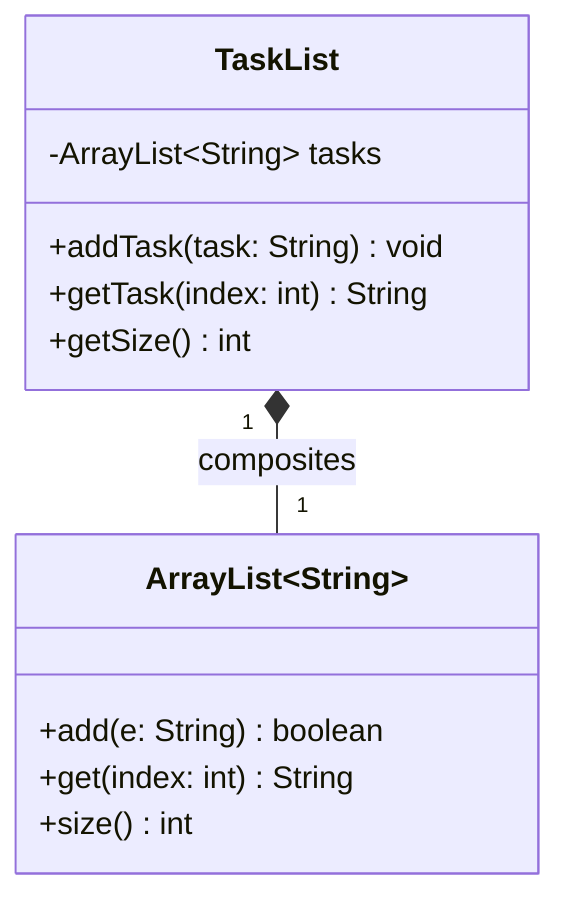

# Today's Objective

* **Today's Focus**: Completing the reading on the Java standard library API, writing custom collection wrapper classes that enforce state validation (invariants), and drawing static UML class diagrams depicting **Composition** (the "has-a" relationship).
* **Why Today's Work Matters**: Senior engineers avoid inheriting directly from generic collections (e.g. extending `ArrayList`). Instead, they use composition to wrap collections and expose a clean, minimal public API. This keeps internal data secure and ensures state invariants are strictly verified.
* **How it Connects to Previous Lessons**: Yesterday, you explored how raw arrays and dynamic `ArrayList` classes manage memory. Today, you will combine those storage engines with encapsulation concepts to write a robust wrapper container.
* **How it Prepares You for Future Lessons**: This composition pattern prepares you directly for responsibility assignment rules (GRASP principles - Phase 2) and the open-closed design principle (SOLID - Phase 3).
* **Estimated Study Duration**: 3 hours (out of 4 hours available).

---

# Warm-up (10–15 minutes)

Let's review arrays, collections, and String immutability from Day 1 of this lesson.

### Quick Recall Questions
1. Why does modifying a `String` inside a loop result in high memory overhead?
2. What is the String Pool, and where does it reside in JVM memory?
3. How does `StringBuilder` optimize string concatenation operations?
4. What runtime exceptions are thrown when accessing invalid indices of an array vs. an `ArrayList`?
5. Why are primitive types like `double` or `int` autoboxed when added to a generic collection?

### Warm-up Coding Exercise
Write a method `String reverseString(String input)` that uses a `StringBuilder` to reverse the characters of the input string without using the built-in `.reverse()` method.

---

# Step 1 — Video Lectures

To support today's design exercise on encapsulation and object relationships, watch this educational video:

* **Title**: UML Relationships: Association, Aggregation, & Composition
* **Instructor**: Derek Banas
* **Platform**: YouTube
* **URL**: [https://www.youtube.com/watch?v=3cmzqFeoblk](https://www.youtube.com/watch?v=3cmzqFeoblk)
* **Duration**: ~10 minutes (focusing on composition diagrams)
* **Recommended Playback Speed**: 1.0x
* **Focus Areas**:
  * Pay attention to the **composition** symbol: a solid/filled diamond arrow pointing from the container class to the contained class.
* **Notes to Take**:
  * Define the difference between "Aggregation" (weak containment, lifetimes are independent) and "Composition" (strong containment, child lifetime is bound to the parent).

---

# Step 2 — Reading

### Book Track
* **Title**: *Head First Java*
* **Edition**: 3rd Edition
* **Author**: Kathy Sierra, Bert Bates, Trisha Gee
* **Chapter**: Chapter 6: "Using the Java Library"
* **Section**: Pages 151–164 (focusing on standard packages, class imports, and generics introduction)
* **Reading Objective**: Understand how the Java Standard API is modularized, how package imports work, and why generic collection classes enforce type safety at compile time.
* **Estimated Reading Time**: 30 minutes

---

# Step 3 — Coding Practice

### Exercise 1: Reimplementing StringBuilder Benchmark (Medium)
* **Objective**: Reimplement the String vs. StringBuilder performance comparison loop from memory.
* **Difficulty**: Medium
* **Expected Outcome**: Create a class `MemoryBenchmark.java`. Write a test that appends to a String and a StringBuilder 5,000 times, measuring execution duration in milliseconds. Compile and run from the console.
* **Hints**: Try to structure the benchmark cleanly, outputting a comparative ratio of execution speeds.
* **Common Mistakes**: Accidentally reviewing yesterday's code to copy structure. Rely entirely on your recall.

### Exercise 2: Wrapped Collection with Invariant Validation (Medium)
* **Objective**: Protect generic collection boundaries using composition and encapsulation.
* **Difficulty**: Medium
* **Expected Outcome**: Create a class `TaskList.java` which encapsulates a private `ArrayList<String>`. Expose three methods:
  1. `void addTask(String task)`: adds a task. Throws `IllegalArgumentException` if the input is null, blank, or contains duplicates.
  2. `String getTask(int index)`: returns a task at the index.
  3. `int getSize()`: returns the total tasks.
  Create a tester class `TaskListTester.java` using assertions (`-ea` flag) to verify that null tasks are rejected and size counts update accurately.
* **Hints**: Use `.trim().isEmpty()` for blank string validation.
* **Common Mistakes**: Exposing a getter that returns the raw `ArrayList` instance (e.g. `public ArrayList<String> getTasks()`). Doing so breaks encapsulation, allowing clients to modify the list directly and bypass your validation rules!

---

# Step 4 — Hands-on Lab

No lab is scheduled today. (The hands-on lab for this lesson is scheduled for Day 3).

---

# Step 5 — Project Work

No project milestone is scheduled today. (The project connection is completed at the end of the module).

---

# Step 6 — UML / Design Exercise

### UML Exercise: Composition Diagram
Draw a static UML class diagram illustrating the composition relationship between `TaskList` and `ArrayList`.
* **Why it matters**: In Object-Oriented design, visual models help identify structural coupling. Since `TaskList` wraps `ArrayList`, their relationship is a strict Composition (strong containment). `ArrayList` has no independent lifecycle; if `TaskList` is garbage-collected, the list is collected with it.
* **What should appear in the diagram**:
  1. A class box for `TaskList` with its private attribute (`- tasks: ArrayList<String>`) and public methods.
  2. A class box representing the library `ArrayList<String>`.
  3. A line connecting them with a **filled diamond** `◆` at the `TaskList` end, indicating that `TaskList` owns/composites `ArrayList`.
* **Common Mistakes**:
  * Using an open hollow diamond (which denotes Aggregation, i.e., weak containment).
  * Drawing the diamond on the wrong class (the diamond must always attach to the container owner class).

*You can write this diagram in Markdown using Mermaid syntax:*


---

# Step 7 — Engineering Insight

### Composition over Inheritance in Collections
A common beginner mistake is inheriting directly from collections to create domain wrappers:
```java
// Danger: Inheritance
public class TaskList extends ArrayList<String> { ... }
```
While this seems convenient because you get all `ArrayList` methods for free, it breaks encapsulation. A user of `TaskList` can call `clear()`, `set()`, or `remove()` directly on the list, bypassing your validations.

**Senior Approach**: Use composition instead:
```java
// Secure: Composition
public class TaskList {
    private final ArrayList<String> tasks = new ArrayList<>();
    // Expose only what you want, validating inputs
}
```
Composition creates a secure invariant-enforcement boundary, shielding the internal storage implementation from raw external access.

---

# Step 8 — Open Source Connection

In the **Java Collection Library (JDK)**:
* `java.util.Collections` exposes helper methods like `Collections.unmodifiableList(List<T> list)`.
* Under the hood, this class uses **composition**. It wraps your original list inside a private class `UnmodifiableList` and overrides all modifying methods (like `add()`, `remove()`) to throw an `UnsupportedOperationException`.
* This protects the source list from external modification while reusing its read capabilities.

---

# Step 9 — End-of-Day Reflection

1. Explain why inheriting from `ArrayList<String>` to build a `TaskList` is a design flaw.
2. In UML, what is the difference between Aggregation (hollow diamond) and Composition (filled diamond)?
3. Why is it important to make your encapsulated collections final (`private final ArrayList<String> tasks`)?
4. When you pass a string to `addTask`, are you passing a copy of the string data or a copy of the reference address?
5. How does generic type safety protect Java collections from runtime errors?

---

# Step 10 — Notes Template

Append this template to `notes/P00.M01.L03.md`:

```markdown
# Notes: P00.M01.L03 - Arrays, strings, collections, and iteration

## Key Concepts

## Important Definitions

## Things That Clicked Today

## Things I Still Don't Understand

## Mistakes I Made

## Real-world Connections

## Questions To Revisit
```

---

# Step 11 — Journal Template

Save a copy of this template to `journal/2026-07-14.md`:

```markdown
# Daily Journal: 2026-07-14

## What I accomplished today

## Biggest insight

## Biggest challenge

## Questions I still have

## Time spent

## Confidence (1–10)

## Plan for tomorrow
```

---

# Final Checklist

- [ ] Warm-up complete
- [ ] UML Relationships video tutorial watched
- [ ] Book reading completed (Head First Java Chapter 6, pages 151–164)
- [ ] Coding Exercise 1 (MemoryBenchmark) completed
- [ ] Coding Exercise 2 (TaskList and Composition) completed
- [ ] UML Composition diagram drawn (Mermaid or Paper)
- [ ] Reflection questions answered
- [ ] Notes file (`notes/P00.M01.L03.md`) updated
- [ ] Journal file (`journal/2026-07-14.md`) created from template
- [ ] Git commit completed with the designated message

---

### Recommended Git Commit Command:
```bash
git add .
git commit -m "study(P00.M01.L03): complete day 2"
```
