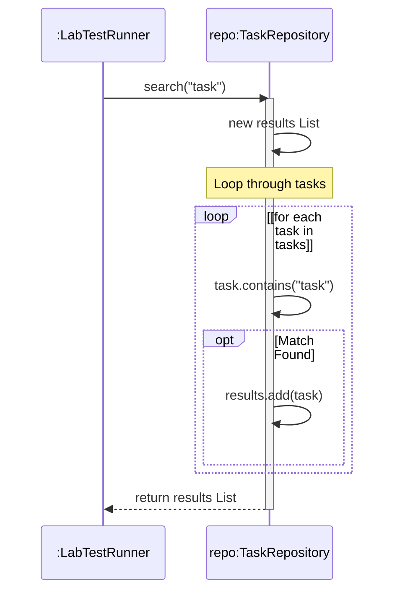

# Today's Objective

* **Today's Focus**: Implementing the Lesson 3 Lab (an In-Memory Task Storage and Search Engine), debugging traversal-modification crashes (`ConcurrentModificationException`), preventing encapsulation leaks via **Defensive Copying**, and drawing UML sequence diagrams showing loop iterations.
* **Why Today's Work Matters**: State retrieval is as critical as state validation. If your query methods return references to internal collections, clients can bypass all validation rules and corrupt your object state. Today, you will learn how to write query methods that protect internal collections using defensive copies.
* **How it Connects to Previous Lessons**: Yesterday, you wrapped lists and used composition to enforce validation boundaries. Today, you will extend that container to support search queries and enforce secure boundaries during state reads.
* **How it Prepares You for Future Lessons**: Understanding defensive copying is key to writing thread-safe code (Java Concurrency - Phase 9) and constructing domain Aggregates in Domain-Driven Design (Phase 10).
* **Estimated Study Duration**: 3 hours (out of 4 hours available).

---

# Warm-up (10–15 minutes)

Let's review collections, composition, and object relations from Day 2 of this lesson.

### Quick Recall Questions
1. Why is composition preferred over inheritance when working with standard collections?
2. What is the difference between Aggregation and Composition in UML relationships?
3. How does generic compile-time type checking protect collections from runtime crashes?
4. If class `TaskList` wraps `ArrayList`, which end of the relation line gets the solid diamond symbol?
5. Why are package structures and class directories aligned in Java?

### Warm-up Coding Exercise
Write a method `boolean hasDuplicates(String[] items)` that returns true if any string inside the array appears more than once. (Do not use nested loops if possible; hint: use a temporary collection).

---

# Step 1 — Video Lectures

To support today's sequence modeling containing iterations and loops, watch this short guide:

* **Title**: UML Sequence Diagrams - Loops, Optionals, and Conditionals
* **Instructor**: Lucidchart Course Staff
* **Platform**: YouTube
* **URL**: [https://www.youtube.com/watch?v=pCK6prSq8aw](https://www.youtube.com/watch?v=pCK6prSq8aw) (Focus on Advanced fragments)
* **Duration**: ~5 minutes
* **Focus Areas**:
  * Focus on the **`loop`** fragment box, which indicates that a block of messages is executed multiple times until a condition is met.
* **Notes to Take**:
  * Sketch a sequence diagram showing a loop fragment containing a message call.
  * Note how the loop condition is written inside square brackets (e.g. `[for each item]`).

---

# Step 2 — Reading

### Blog / Documentation Track
* **Title**: *Java Object Copying: Reference Copy, Shallow Copy, and Deep Copy*
* **Publisher**: Baeldung (High-quality Java guide)
* **URL**: [https://www.baeldung.com/java-copy-list](https://www.baeldung.com/java-copy-list)
* **Reading Objective**: Comprehend the distinction between copying a reference address, creating a shallow collection copy, and performing a deep object clone.
* **Estimated Reading Time**: 15 minutes

---

# Step 3 — Coding Practice

### Exercise: ConcurrentModificationException Debugging (Medium)
* **Objective**: Identify and fix the runtime exception thrown when modifying lists during iteration.
* **Difficulty**: Medium
* **Expected Outcome**: Create a class `IteratorPlayground.java`. Declare an `ArrayList<String>` with three values. Write a standard `for-each` loop that attempts to remove an item if it matches a condition. Run it, observe the `ConcurrentModificationException`. Fix it by using a manual `Iterator` and its `.remove()` method, or Java 8's `.removeIf()` method.
* **Hints**: The enhanced `for` loop uses an iterator implicitly. Modifying the list directly invalidates the iterator's modification count.
* **Common Mistakes**: Expecting a normal `for-each` loop to allow removals without throwing exceptions.

---

# Step 4 — Hands-on Lab

### Lab: InMemory Task Storage & Filtering Engine

#### Problem Statement
Design an in-memory task database `TaskRepository` under the package `handbook.phase00.p00m01l03`. The repository must allow adding tasks with validation, searching for tasks matching a substring filter, and returning lists. Crucially, the repository must prevent **encapsulation leaks** by returning defensive copies of all query lists.

#### Requirements
1. **Packages**: Organize your source code under the package `handbook.phase00.p00m01l03`.
2. **TaskRepository Class**:
   * Encapsulates `private final ArrayList<String> tasks`.
   * `void add(String task)`: Validates task is not null/empty, and checks for duplicates.
   * `ArrayList<String> findAll()`: Returns a list of all tasks. Must use **defensive copying**.
   * `ArrayList<String> search(String query)`: Returns a list of tasks containing the query substring (case-insensitive search).
3. **LabTestRunner**: Validates task addition, filtering, and encapsulation security using assertions.

#### Starter Folder Structure
```text
src/main/java/handbook/phase00/p00m01l03/TaskRepository.java
src/test/java/handbook/phase00/p00m01l03/LabTestRunner.java
docs/P00.M01.L03-diagram.md
```

#### Code Implementation Guidelines

##### TaskRepository.java
```java
package handbook.phase00.p00m01l03;
import java.util.ArrayList;

public class TaskRepository {
    private final ArrayList<String> tasks = new ArrayList<>();

    public void add(String task) {
        if (task == null || task.trim().isEmpty()) {
            throw new IllegalArgumentException("Task content cannot be empty.");
        }
        // Case-insensitive duplicate check
        for (String t : tasks) {
            if (t.equalsIgnoreCase(task.trim())) {
                throw new IllegalArgumentException("Duplicate task detected: " + task);
            }
        }
        tasks.add(task.trim());
    }

    // Return a defensive copy to prevent encapsulation leak
    public ArrayList<String> findAll() {
        return new ArrayList<>(this.tasks); 
    }

    public ArrayList<String> search(String query) {
        ArrayList<String> results = new ArrayList<>();
        if (query == null || query.trim().isEmpty()) {
            return results; // Return empty list on empty query
        }
        
        String lowerQuery = query.toLowerCase().trim();
        for (String task : tasks) {
            if (task.toLowerCase().contains(lowerQuery)) {
                results.add(task);
            }
        }
        return results; // results is already a new list (implicit defensive copy)
    }
}
```

##### LabTestRunner.java
```java
package handbook.phase00.p00m01l03;
import java.util.ArrayList;

public class LabTestRunner {
    public static void main(String[] args) {
        System.out.println("Running Task Engine Lab Tests...");

        TaskRepository repo = new TaskRepository();
        repo.add("Review LLD handbook");
        repo.add("Compile task bootstrapper");
        repo.add("Draw UML sequence diagrams");

        // Test Case 1: Search Filtering
        ArrayList<String> results = repo.search("task");
        assert results.size() == 1 : "Search failed to filter matching tasks!";
        assert results.get(0).equals("Compile task bootstrapper") : "Incorrect search result returned!";
        System.out.println("Test Case 1 Passed: Search filter correct.");

        // Test Case 2: Encapsulation Leak Prevention
        ArrayList<String> allTasks = repo.findAll();
        // Attempt to corrupt the repository from the outside!
        allTasks.clear(); 
        
        // If encapsulation is secure, the internal list remains untouched:
        assert repo.findAll().size() == 3 : "Security leak: External modification affected internal database!";
        System.out.println("Test Case 2 Passed: Encapsulation remains secure.");

        System.out.println("All Task Engine Lab Tests Completed Successfully!");
    }
}
```

#### Compilation & Execution Commands
Run from the root `src/` directory:
```bash
# Compilation
javac main/java/handbook/phase00/p00m01l03/*.java test/java/handbook/phase00/p00m01l03/*.java -d bin

# Execution
java -ea -cp bin handbook.phase00.p00m01l03.LabTestRunner
```

---

# Step 5 — Project Work

No project milestone is scheduled today. (The project connection is completed at the end of the module).

---

# Step 6 — UML / Design Exercise

### UML Sequence Diagram
Draw a sequence diagram visualizing the flow of `LabTestRunner` querying the repository.
* **Why it matters**: It maps the loop iteration checks occurring inside the search algorithm over time.
* **What should appear in the diagram**:
  1. Lifelines: `:LabTestRunner` and `repo:TaskRepository`.
  2. The call message `search("task")`.
  3. A **`loop`** fragment block depicting the list traversal.
  4. Inside the loop, self-invocation messages: `contains(query)` and `add(task)`.
  5. The return of the new `results` list.
* **Common Mistakes**:
  * Writing loop logic without wrapping it in a clear `loop` boundary block.

*You can write this diagram in Markdown using Mermaid syntax:*


---

# Step 7 — Engineering Insight

### Encapsulation Leaks & Defensive Copying
Encapsulation is not just about making fields `private`. It is about protecting the state boundary during both reads and writes.

If a class exposes a getter that returns a reference to a private internal collection (e.g. `public List<String> getTasks() { return this.tasks; }`), encapsulation is broken. Any external caller receives a reference to that list in the heap. They can call `.clear()`, bypass validation filters, and alter the state directly.

**Defensive Copying** solves this. By returning a new copy of the list (`new ArrayList<>(this.tasks)`), the caller receives a separate object instance on the heap. If they modify their copy, your internal list remains untouched.

---

# Step 8 — Open Source Connection

In Java framework code (e.g., **Spring Framework**):
* When querying registered beans or configurations (e.g., in application contexts), the return lists are copied defensively or wrapped in an unmodifiable wrapper (e.g. `Collections.unmodifiableList`).
* This ensures that external extension points and developers cannot accidentally alter or clear critical internal framework directories.

---

# Step 9 — End-of-Day Reflection

1. Why does calling `.clear()` on a list returned by a getter affect the class internally if defensive copying was not used?
2. Explain the reason behind `ConcurrentModificationException`. What modifications trigger it?
3. What is the difference between a shallow copy and a deep copy of a collection in Java?
4. How does the `loop` keyword represent repetitive execution in UML sequence diagrams?
5. Why are case-insensitive validation checks necessary for matching search criteria?

---

# Step 10 — Notes Template

Append this template to `notes/P00.M01.L03.md`:

```markdown
# Notes: P00.M01.L03 - Arrays, strings, collections, and iteration

## Key Concepts

## Important Definitions

## Things That Clicked Today

## Things I Still Don't Understand

## Mistakes I Made

## Real-world Connections

## Questions To Revisit
```

---

# Step 11 — Journal Template

Save a copy of this template to `journal/2026-07-15.md`:

```markdown
# Daily Journal: 2026-07-15

## What I accomplished today

## Biggest insight

## Biggest challenge

## Questions I still have

## Time spent

## Confidence (1–10)

## Plan for tomorrow
```

---

# Final Checklist

- [ ] Warm-up complete
- [ ] UML Sequence Loop video tutorial watched
- [ ] Baeldung Java list copying article read
- [ ] Coding Exercise (ConcurrentModificationException) completed
- [ ] Lab: InMemory Task Storage & Filtering Engine implemented
- [ ] LabTestRunner executed successfully with `-ea` flag
- [ ] UML Sequence diagram with loop block drawn (Mermaid or Paper)
- [ ] Reflection questions answered
- [ ] Notes file (`notes/P00.M01.L03.md`) updated and finalized
- [ ] Journal file (`journal/2026-07-15.md`) created from template
- [ ] Git commit completed with the designated message

---

### Recommended Git Commit Command:
```bash
git add .
git commit -m "study(P00.M01.L03): complete day 3"
```
