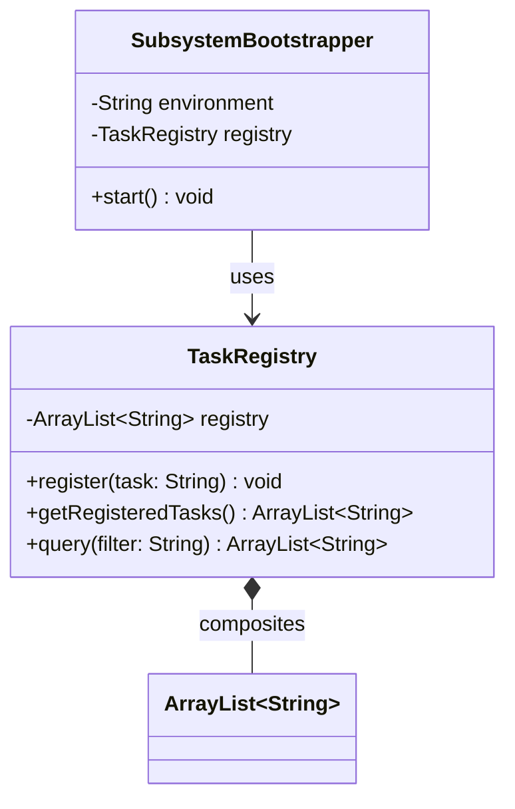

# Today's Objective

* **Today's Focus**: Implementing the **Module 00.01 Project (InMemory Task Registry Core)**. You will integrate the lessons of Module 1: compilation/execution structures (L01), variables/types/operators (L02), and collections/iteration/defensive copying (L03) into a single functional, well-documented, and thoroughly tested subsystem.
* **Why Today's Work Matters**: Learning isolated lessons is easy; integrating them to solve a complex engineering task is where true software mastery begins. Today's project simulates building a core registration engine with strict validations, defensive copy boundaries, and automated assertions.
* **How it Connects to Previous Lessons**: This project takes your bootstrappers (L01), transaction math (L02), and defensive copy repositories (L03) and folds them into a cohesive subsystem registry.
* **How it Prepares You for Future Lessons**: Designing this standalone registry prepares you directly for functions, exception frameworks, and unit testing in Module 2 (P00.M02).
* **Estimated Study Duration**: 4 hours (entire available session).

---

# Warm-up (15–20 minutes)

Let's review the entire Module 1 lifecycle (P00.M01.L01 to P00.M01.L03).

### Quick Recall Questions
1. How does the JVM classloader resolve class dependencies dynamically at runtime?
2. What are the memory and execution differences between Stack allocations and Heap allocations?
3. Why does `Double.MAX_VALUE + 10 == Double.MAX_VALUE` evaluate to `true` while `Double.MAX_VALUE + Double.MAX_VALUE` overflows to `Infinity`?
4. What is the danger of returning a direct reference to an internal collection from a getter method?
5. How does a sequence diagram loop fragment differ from a standard branch fragment?

### Warm-up Coding Exercise
Write a terminal compilation command that compiles all source files under `projects/module-01-project/src/main/java/` and places the output in a directory named `projects/module-01-project/bin/`.

---

# Step 1 — Video Lectures

To guide your approach to modular project design and packaging, watch this short tutorial on clean package modularity:

* **Title**: Java Packages & Project Folder Structure Best Practices
* **Instructor**: Coding with John
* **Platform**: YouTube
* **URL**: [https://www.youtube.com/watch?v=lhELGQIp4gg](https://www.youtube.com/watch?v=lhELGQIp4gg)
* **Duration**: 12 minutes
* **Recommended Playback Speed**: 1.0x
* **Focus Areas**:
  * Focus on how package naming namespaces (e.g. `com.company.project.module`) partition logical namespaces and keep dependencies clean.

---

# Step 2 — Reading

### Blog Track
* **Title**: *Write Self-Testing Code*
* **Author**: Martin Fowler
* **URL**: [https://martinfowler.com/bliki/SelfTestingCode.html](https://martinfowler.com/bliki/SelfTestingCode.html)
* **Reading Objective**: Understand why building automated tests alongside features is a developer's primary safety net when writing software.
* **Estimated Reading Time**: 20 minutes

---

# Step 3 — Coding Practice

### Exercise: Registry Entry Validator (Easy)
* **Objective**: Write an input validation helper class that checks strings for structural rules.
* **Difficulty**: Easy
* **Expected Outcome**: Create a class `EntryValidator.java`. Write a static method `boolean isValidEntry(String entry)` that returns `true` if the entry is not null, not empty, and its length is between 3 and 50 characters. Write assertion checks.
* **Hints**: Use `.trim()` before measuring length to ignore trailing spaces.

---

# Step 4 — Hands-on Lab

Today is a project day. The project itself functions as today's extended lab. (See Step 5 for details).

---

# Step 5 — Project Work

### Project Milestone: InMemory Task Registry Core

#### Problem Statement
Build a command-line bootable task registration subsystem `InMemory Task Registry Core`. The application must read boot settings, register task elements with validation constraints (no empty inputs, no duplicates), track registration logs, and provide search capabilities. The system must prevent encapsulation leaks and be validated using an automated test runner.

#### Suggested Folder Structure
Create this layout inside your workspace:
```text
projects/module-01-project/
  README.md
  docs/
    architecture.md
    adr/0001-design-registry.md
    diagrams/
  src/
    main/java/handbook/phase00/project01/
      SubsystemBootstrapper.java
      TaskRegistry.java
    test/java/handbook/phase00/project01/
      ProjectTestRunner.java
```

#### 1. File: `projects/module-01-project/docs/adr/0001-design-registry.md`
Write a design record detailing why you chose composition over inheritance and why you implemented defensive copies:
```markdown
# ADR 0001: Design of InMemory Task Registry

## Context
We need to design a task storage subsystem that supports validation, searches, and is safe from external state corruption.

## Decision
We chose Composition over Inheritance by wrapping an internal `ArrayList` instead of extending it. We enforce defensive copying on all list return queries.

## Consequence
Ensures absolute encapsulation; callers cannot corrupt internal database states.
```

#### 2. File: `projects/module-01-project/src/main/java/handbook/phase00/project01/TaskRegistry.java`
```java
package handbook.phase00.project01;
import java.util.ArrayList;

public class TaskRegistry {
    private final ArrayList<String> registry = new ArrayList<>();

    public void register(String task) {
        if (task == null || task.trim().isEmpty()) {
            throw new IllegalArgumentException("Task cannot be null or empty.");
        }
        String cleaned = task.trim();
        if (cleaned.length() < 3 || cleaned.length() > 50) {
            throw new IllegalArgumentException("Task must be between 3 and 50 characters.");
        }
        for (String t : registry) {
            if (t.equalsIgnoreCase(cleaned)) {
                throw new IllegalArgumentException("Task already registered: " + cleaned);
            }
        }
        registry.add(cleaned);
    }

    public ArrayList<String> getRegisteredTasks() {
        return new ArrayList<>(this.registry); // Defensive copy
    }

    public ArrayList<String> query(String filter) {
        ArrayList<String> matches = new ArrayList<>();
        if (filter == null || filter.trim().isEmpty()) {
            return matches;
        }
        String lowerFilter = filter.toLowerCase().trim();
        for (String t : registry) {
            if (t.toLowerCase().contains(lowerFilter)) {
                matches.add(t);
            }
        }
        return matches;
    }
}
```

#### 3. File: `projects/module-01-project/src/main/java/handbook/phase00/project01/SubsystemBootstrapper.java`
```java
package handbook.phase00.project01;

public class SubsystemBootstrapper {
    private final TaskRegistry registry;
    private final String environment;

    public SubsystemBootstrapper(TaskRegistry registry, String environment) {
        if (environment == null || environment.trim().isEmpty()) {
            throw new IllegalArgumentException("Environment boot parameter required.");
        }
        this.registry = registry;
        this.environment = environment.trim();
    }

    public void start() {
        System.out.println("Booting Task Registry Subsystem in [" + environment + "]...");
        System.out.println("Subsystem initial registry count: " + registry.getRegisteredTasks().size());
    }
}
```

#### 4. File: `projects/module-01-project/src/test/java/handbook/phase00/project01/ProjectTestRunner.java`
```java
package handbook.phase00.project01;
import java.util.ArrayList;

public class ProjectTestRunner {
    public static void main(String[] args) {
        System.out.println("Starting Project Integration Tests...");

        TaskRegistry registry = new TaskRegistry();
        SubsystemBootstrapper bootstrapper = new SubsystemBootstrapper(registry, "TESTING");

        // 1. Verify Boot
        bootstrapper.start();

        // 2. Test Invariants (Empty Task)
        boolean caughtEmpty = false;
        try {
            registry.register("   ");
        } catch (IllegalArgumentException e) {
            caughtEmpty = true;
        }
        assert caughtEmpty : "Empty task registration did not throw error!";

        // 3. Test Invariants (Duplicate Task)
        registry.register("Write system test");
        boolean caughtDuplicate = false;
        try {
            registry.register("WRITE SYSTEM TEST");
        } catch (IllegalArgumentException e) {
            caughtDuplicate = true;
        }
        assert caughtDuplicate : "Duplicate task registration did not throw error!";

        // 4. Test Search Query
        registry.register("Audit safety logs");
        ArrayList<String> queryResult = registry.query("safety");
        assert queryResult.size() == 1 : "Query failed to find search string.";
        assert queryResult.get(0).equals("Audit safety logs") : "Incorrect search result.";

        // 5. Test Encapsulation Leak
        ArrayList<String> escapeList = registry.getRegisteredTasks();
        escapeList.clear(); // Attempt external modification
        assert registry.getRegisteredTasks().size() == 2 : "Encapsulation breach: internal database corrupted.";

        System.out.println("All Project Integration Tests Passed Cleanly!");
    }
}
```

#### Compilation & Execution Commands
Run these commands from `projects/module-01-project` directory:
```bash
# Compilation
javac src/main/java/handbook/phase00/project01/*.java src/test/java/handbook/phase00/project01/*.java -d bin

# Execution
java -ea -cp bin handbook.phase00.project01.ProjectTestRunner
```

---

# Step 6 — UML / Design Exercise

### UML Class Diagram
Draw a static UML class diagram mapping the entire registry structure.
* **Why it matters**: A class diagram establishes the static design contracts before writing the code, mapping variable scopes and types visually.
* **What should appear in the diagram**:
  1. A class box for `SubsystemBootstrapper` containing `environment` and `registry`.
  2. A class box for `TaskRegistry` showing its composition of `ArrayList<String>`.
  3. Association lines showing `SubsystemBootstrapper` uses `TaskRegistry` (`-->`), and `TaskRegistry` composites `ArrayList` (`◆--`).

*You can write this diagram in Markdown using Mermaid syntax:*


---

# Step 7 — Engineering Insight

### Modularity and Integration
As codebases scale, writing isolated classes is not enough. You must think about **subsystem integration boundaries**. 

A good subsystem is:
1. **Self-contained**: It hides its internal data structures (`ArrayList`) completely behind a public facade (`TaskRegistry`).
2. **Defensive**: It validates its inputs on entry (checking boundaries) and protects its outputs on read (defensive copying).
3. **Bootstrappable**: It provides a bootstrapper class (`SubsystemBootstrapper`) that enforces external configuration dependencies at startup.

By adhering to these rules, you write modular components that can be composed to form complex platforms without fear of cascading runtime failures.

---

# Step 8 — Open Source Connection

In **Apache Tomcat**:
* The system boots using the `Bootstrap` class.
* This class initializes internal registration registries like the `StandardServer` and `StandardService` components.
* These components hold internal lists of connector classes and servlet contexts, exposing query methods that return defensive copies or unmodifiable array representations to keep the engine configuration locked and secure.

---

# Step 9 — End-of-Day Reflection

1. Explain how `TaskRegistry` integrates variables, collections, and control flow in its search query method.
2. Why is storing an `environment` parameter in `SubsystemBootstrapper` useful for production engineering?
3. How does this project structure mirror the recommended repository layout in `20_PROJECT_PORTFOLIO.md`?
4. What is the benefit of keeping your Architecture Decision Records (ADRs) checked into source control alongside the code?
5. Why are validation exceptions checked in the test runner using assertions?

---

# Step 10 — Notes Template

Save a copy of this template to `projects/module-01-project/docs/architecture.md`:

```markdown
# Architecture Notes: Module 00.01 Project

## Subsystem Vision

## Dynamic Execution Flow

## Encapsulation Strategy

## Trade-offs and Constraints
```

---

# Step 11 — Journal Template

Save a copy of this template to `journal/2026-07-16.md`:

```markdown
# Daily Journal: 2026-07-16

## What I accomplished today

## Biggest insight

## Biggest challenge

## Questions I still have

## Time spent

## Confidence (1–10)

## Plan for tomorrow
```

---

# Final Checklist

- [ ] Warm-up complete
- [ ] Modularity package video tutorial watched
- [ ] Fowler's Self-Testing Code article read
- [ ] Helper Exercise (EntryValidator) completed
- [ ] Project directory and file structures created
- [ ] Design record (`docs/adr/0001-design-registry.md`) written
- [ ] Classes (`TaskRegistry`, `SubsystemBootstrapper`) implemented
- [ ] Integration test runner (`ProjectTestRunner`) executed with `-ea` flag
- [ ] UML class relationship diagram completed
- [ ] Architecture notes template saved in docs
- [ ] Daily journal written
- [ ] Git commit completed with designated message

---

### Recommended Git Commit Command:
```bash
git add .
git commit -m "project(P00.M01): complete module 0.1 project"
```
