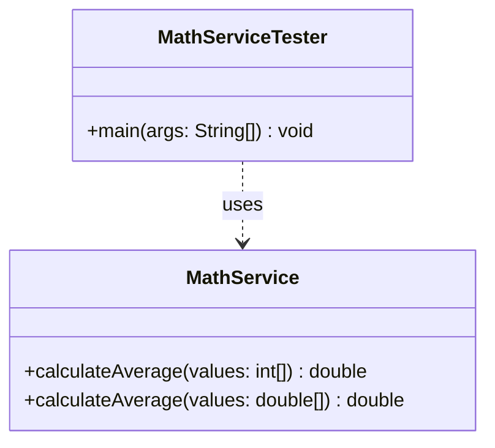

# Today's Objective

* **Today's Focus**: Mastering Method Signatures, Method Overloading mechanics (compile-time polymorphism), argument validation, and mapping method designs visually using static UML class diagrams.
* **Why Today's Work Matters**: Designing cohesive classes requires creating clear, descriptive method contracts. A senior engineer must understand how the compiler resolves overloaded methods at compile-time and why overloading by return type is impossible.
* **How it Connects to Previous Lessons**: Yesterday, you traced the physical lifecycle of stack frames and variable scopes. Today, you will build on that to structure clean, overloaded method APIs that handle multiple parameter types safely.
* **How it Prepares You for Future Lessons**: This prepares you directly for polymorphism and interface-driven design (P01.M02.L03) where dynamic method dispatch resolves execution at runtime.
* **Estimated Study Duration**: 3 hours (out of 4 hours available).

---

# Warm-up (10–15 minutes)

Let's review stack frames, scopes, and local lifetimes from Day 1 of this lesson.

### Quick Recall Questions
1. When a method executes recursive calls, how does the JVM prevent stack frames from overwriting each other's local variables?
2. What happens to a method parameter variable in memory when the method completes execution?
3. If you declare a variable inside a helper class method with the same name as an instance variable of that class, how do you access the instance variable?
4. True or False: Declaring a variable inside an `if` block hides it from the rest of the method scope.
5. In JUnit 5, how does the framework capture stack frames during a test assertion failure?

### Warm-up Coding Exercise
Write a method `boolean isEven(int number)` that returns `true` if a number is even, and write the compile command that places its `.class` file in `bin/`.

---

# Step 1 — Video Lectures

To support your understanding of method structure and overloading boundaries, watch this quick educational video:

* **Title**: Java Method Overloading Explained
* **Instructor**: Coding with John
* **Platform**: YouTube
* **URL**: [https://www.youtube.com/watch?v=kYv_C2nF2w0](https://www.youtube.com/watch?v=R9Z2Fw5vWos)
* **Duration**: 9 minutes
* **Recommended Playback Speed**: 1.0x
* **Focus Areas**:
  * Focus on why the compiler matches method calls using the parameter list (type, number, and order) rather than the method's return type.
* **Notes to Take**:
  * Define the term *Method Signature*.
  * Write down the compiler rules for method overloading.

---

# Step 2 — Reading

### Documentation Track
* **Title**: *Defining Methods & Passing Information to a Method*
* **Publisher**: Oracle (Official Java Tutorials)
* **URL**: [https://docs.oracle.com/javase/tutorial/java/javaOO/methods.html](https://docs.oracle.com/javase/tutorial/java/javaOO/methods.html)
* **Reading Objective**: Consolidate understanding of method overloading, return types, varargs parameters, and parameter name constraints.
* **Estimated Reading Time**: 30 minutes

---

# Step 3 — Coding Practice

### Exercise 1: Reimplementing Stack Frame Simulation (Medium)
* **Objective**: Reimplement yesterday's recursion/nesting tracking class `StackSimulation` entirely from memory.
* **Difficulty**: Medium
* **Expected Outcome**: Create the class from memory. Run nested method calls modifying variables and verifying that caller variables are unmodified on stack frame returns. Ensure it compiles and runs cleanly.
* **Hints**: Do not look at yesterday's source files. Rely entirely on your mental map.
* **Common Mistakes**: Opening the previous project to copy printing formats.

### Exercise 2: Method Overloading & Input Validation (Medium)
* **Objective**: Define overloaded method signatures and enforce input boundaries.
* **Difficulty**: Medium
* **Expected Outcome**: Create a class `MathService.java`. Expose two overloaded methods:
  1. `double calculateAverage(int[] values)`: Calculates average for an array of integers.
  2. `double calculateAverage(double[] values)`: Calculates average for an array of doubles.
  In both methods, validate that the input array is not null and not empty. If invalid, throw `IllegalArgumentException`. Expose a tester class `MathServiceTester.java` using assertions (`-ea` flag) to verify the results and the validation triggers.
* **Hints**: Remember that `values.length == 0` check must come *after* the `values == null` check using the short-circuit `||` operator.
* **Common Mistakes**: Trying to write `double calculateAverage(int[] values)` and `int calculateAverage(int[] values)` in the same class. This will fail compilation because the method signatures are identical (return types are ignored in signature resolution).

---

# Step 4 — Hands-on Lab

No lab is scheduled today. (The hands-on lab for this lesson is scheduled for Day 3).

---

# Step 5 — Project Work

No project milestone is scheduled today. (The project connection is completed at the end of the module).

---

# Step 6 — UML / Design Exercise

### UML Exercise: Static Method Overloading Diagram
Draw a static UML class diagram representing the `MathService` and `MathServiceTester` classes.
* **Why it matters**: In API design, method signatures define the entry criteria for your class. Capturing overloaded methods visually helps developers see how the class handles polymorphic inputs.
* **What should appear in the diagram**:
  1. A class box for `MathService` detailing both overloaded methods with their parameter types and return type:
     * `+ calculateAverage(values : int[]) : double`
     * `+ calculateAverage(values : double[]) : double`
  2. A class box for `MathServiceTester`.
  3. A dotted dependency arrow from `MathServiceTester` pointing to `MathService`.
* **Common Mistakes**:
  * Omitting the parameter types or parentheses in the method description.
  * Writing only one of the overloaded methods, assuming the compiler treats them as the same.

*You can write this diagram in Markdown using Mermaid syntax:*


---

# Step 7 — Engineering Insight

### Compile-time Polymorphism (Overloading)
Method Overloading is a form of compile-time polymorphism (also called **Static Binding**).
* **The Rule**: In Java, a method's signature consists of the **method name** and the **parameter list** (type, order, count). The return type and thrown exceptions are **not** part of the method signature.
* **Compile Resolution**: When you call `calculateAverage(myIntArray)`, the compiler binds the call to the `int[]` version of the bytecode during compilation. It does not wait until runtime.
* **Why Return Types Are Ignored**: Consider calling `calculateAverage(myIntArray);` without assigning its result to a variable. If Java allowed overloading by return type, the compiler would have no way of knowing whether you wanted the `double` or `int` return version.

---

# Step 8 — Open Source Connection

In the **Java Standard Library (JDK)**:
* `java.util.Arrays` makes extensive use of method overloading.
* It exposes over 15 overloaded variants of `Arrays.sort()`, such as `Arrays.sort(int[])`, `Arrays.sort(double[])`, `Arrays.sort(char[])`, etc.
* This provides a unified API name (`sort`) to developers while optimizing the internal execution algorithm for each primitive data type.

---

# Step 9 — End-of-Day Reflection

1. Why does Java allow you to overload methods by changing parameter types, but not by changing return types?
2. What is a method signature? List its component parts.
3. If you call `calculateAverage(null)`, which version of your overloaded method gets executed? (Does it compile?)
4. How does static binding (overloading) differ from dynamic binding (overriding)?
5. Why are varargs parameters (e.g. `int... values`) useful, and what constraints apply when using them in method signatures?

---

# Step 10 — Notes Template

Append this template to `notes/P00.M02.L01.md`:

```markdown
# Notes: P00.M02.L01 - Methods, parameters, return values, and scope

## Key Concepts

## Important Definitions

## Things That Clicked Today

## Things I Still Don't Understand

## Mistakes I Made

## Real-world Connections

## Questions To Revisit
```

---

# Step 11 — Journal Template

Save a copy of this template to `journal/2026-07-18.md`:

```markdown
# Daily Journal: 2026-07-18

## What I accomplished today

## Biggest insight

## Biggest challenge

## Questions I still have

## Time spent

## Confidence (1–10)

## Plan for tomorrow
```

---

# Final Checklist

- [ ] Warm-up complete
- [ ] Method Overloading video tutorial watched
- [ ] Oracle Defining Methods tutorial read
- [ ] Coding Exercise 1 (Memory Stack Frame recall) completed
- [ ] Coding Exercise 2 (MathService and Overloading) completed
- [ ] UML Static overloading class diagram drawn (Mermaid or Paper)
- [ ] Reflection questions answered
- [ ] Notes file (`notes/P00.M02.L01.md`) updated
- [ ] Journal file (`journal/2026-07-18.md`) created from template
- [ ] Git commit completed with the designated message

---

### Recommended Git Commit Command:
```bash
git add .
git commit -m "study(P00.M02.L01): complete day 2"
```
