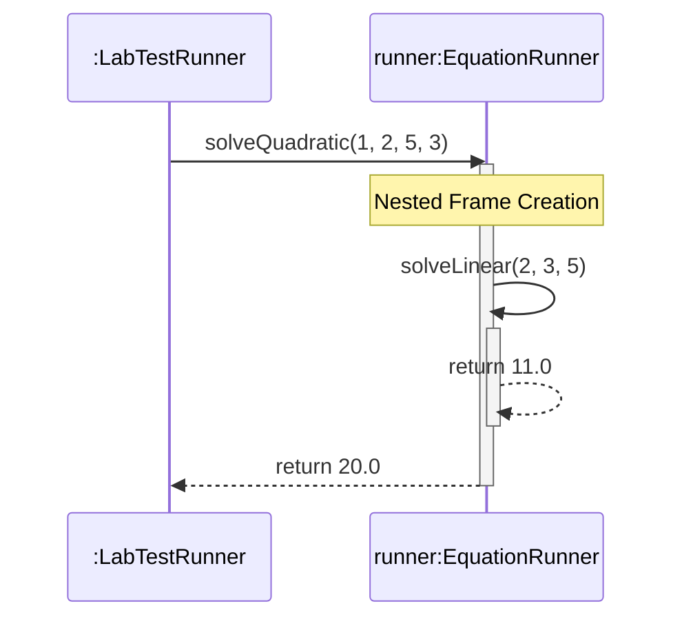

# Today's Objective

* **Today's Focus**: Implementing the Lesson 4 Lab (a Scoped Equation Solver Engine), debugging reference mutation side-effects, and drawing a UML sequence diagram capturing nested stack activation frames.
* **Why Today's Work Matters**: Understanding how values traverse method boundaries is critical. While Java is strictly pass-by-value, passing a mutable object reference allows methods to modify the object's internal fields, leading to accidental state corruption (side-effects). Today you will write validation engines and model these call flows.
* **How it Connects to Previous Lessons**: Yesterday, you designed overloaded static interfaces. Today, you will code the execution engine, checking inputs and protecting parameters against side-effect mutations.
* **How it Prepares You for Future Lessons**: This sets the stage for exception hierarchies and error handling (P00.M02.L02), where runtime failures pop stack frames and generate traces.
* **Estimated Study Duration**: 3 hours (out of 4 hours available).

---

# Warm-up (10–15 minutes)

Let's review method overloading, binding, and signatures from Day 2.

### Quick Recall Questions
1. In Java, what components make up a method's signature? Is the return type included?
2. What is the difference between compile-time method resolution (static binding) and runtime method dispatch (dynamic binding)?
3. Why does defining two methods with identical parameters but different return types cause a compilation error?
4. How does the compiler resolve overloaded method calls when you pass a `null` argument?
5. How does `java.util.Arrays` utilize method overloading to provide a clean sorting utility?

### Warm-up Coding Exercise
Write an overloaded class declaration containing two methods: `int max(int a, int b)` and `double max(double a, double b)`. Write the command to compile this class.

---

# Step 1 — Video Lectures

To support today's sequence modeling showing nested method execution, watch this short tutorial:

* **Title**: UML Sequence Diagrams - Nesting & Activation Bars
* **Instructor**: Visual Paradigm / Lucidchart Course Staff
* **Platform**: YouTube
* **URL**: [https://www.youtube.com/watch?v=pCK6prSq8aw](https://www.youtube.com/watch?v=pCK6prSq8aw) (Focus on Activation lifespans)
* **Duration**: ~6 minutes
* **Focus Areas**:
  * Pay attention to how the **activation bar** (the thin rectangle on a lifeline) grows or overlaps when an object calls a method on itself, or when Method A calls Method B, indicating that multiple stack frames are active.
* **Notes to Take**:
  * Sketch overlapping activation bars on a single lifeline representing a recursive or nested self-call.

---

# Step 2 — Reading

### Blog Track
* **Title**: *Java is Pass-by-Value, Not Pass-by-Reference*
* **Publisher**: Baeldung / Oracle Technical Articles
* **URL**: [https://www.baeldung.com/java-pass-by-value-or-pass-by-reference](https://www.baeldung.com/java-pass-by-value-or-pass-by-reference)
* **Reading Objective**: Consolidate understanding of why passing object references copy the address value, and how this permits mutating internal object states while preventing reference reassignment.
* **Estimated Reading Time**: 15 minutes

---

# Step 3 — Coding Practice

### Exercise: Mutable Reference Mutation Debugging (Medium)
* **Objective**: Identify how mutable parameters can cause accidental side-effects outside the method scope.
* **Difficulty**: Medium
* **Expected Outcome**: Create a class `ReferenceMutationPlayground.java`. Declare a simple class `Coordinate` with fields `int x, y` and getters/setters. Write a method `void shift(Coordinate c)` that calls `c.setX(99)`. In your main method, create a Coordinate instance (e.g. `c = (10, 10)`), call `shift(c)`, and verify using assertions that the coordinates changed in `main`, proving that passing a reference copy still permits object mutation.
* **Hints**: The reference value (memory address) was copied, but both copies point to the same object on the heap.
* **Common Mistakes**: Expecting that because Java is pass-by-value, the fields of an object cannot be changed inside a method.

---

# Step 4 — Hands-on Lab

### Lab: Scoped Equation Runner & Evaluation Subsystem

#### Problem Statement
Design an evaluation runner `EquationRunner` under the package `handbook.phase00.p00m02l01`. The engine executes math equations by pushing parameter variables through nested method scopes. It must validate constraints (boundaries), handle calculation operations, and check that references are not mutated during evaluation.

#### Requirements
1. **Packages**: Organize your source code under the package `handbook.phase00.p00m02l01`.
2. **EquationRunner Class**:
   * `double solveLinear(double m, double x, double c)`: Computes $y = mx + c$. Enforces validation bounds (e.g., $m$ cannot be zero).
   * `double solveQuadratic(double a, double b, double c, double x)`: Computes $y = ax^2 + bx + c$. Internally calls `solveLinear` to evaluate the linear portion, demonstrating nested stack execution.
3. **LabTestRunner**: Verifies calculation results, parameter safety, and bounds exceptions using assertions.

#### Starter Folder Structure
```text
src/main/java/handbook/phase00/p00m02l01/EquationRunner.java
src/test/java/handbook/phase00/p00m02l01/LabTestRunner.java
docs/P00.M02.L01-diagram.md
```

#### Code Implementation Guidelines

##### EquationRunner.java
```java
package handbook.phase00.p00m02l01;

public class EquationRunner {

    public double solveLinear(double m, double x, double c) {
        if (m == 0.0) {
            throw new IllegalArgumentException("Slope 'm' cannot be zero in a linear equation.");
        }
        return (m * x) + c;
    }

    public double solveQuadratic(double a, double b, double c, double x) {
        if (a == 0.0) {
            throw new IllegalArgumentException("Coefficient 'a' cannot be zero in a quadratic equation.");
        }
        // Nesting: We compute ax^2 and delegate the bx + c linear portion
        double linearPortion = solveLinear(b, x, c);
        return (a * x * x) + linearPortion;
    }
}
```

##### LabTestRunner.java
```java
package handbook.phase00.p00m02l01;

public class LabTestRunner {
    public static void main(String[] args) {
        System.out.println("Running Equation Subsystem Lab Tests...");

        EquationRunner runner = new EquationRunner();

        // Test Case 1: Solve Linear Equation (y = 2x + 5, x = 3 -> 11)
        double resultLinear = runner.solveLinear(2.0, 3.0, 5.0);
        assert resultLinear == 11.0 : "Linear calculation returned incorrect result!";
        System.out.println("Test Case 1 Passed: Linear solved correctly.");

        // Test Case 2: Nested Quadratic Equation (y = 1x^2 + 2x + 5, x = 3 -> 9 + 6 + 5 = 20)
        double resultQuadratic = runner.solveQuadratic(1.0, 2.0, 5.0, 3.0);
        assert resultQuadratic == 20.0 : "Quadratic calculation returned incorrect result!";
        System.out.println("Test Case 2 Passed: Quadratic solved correctly (nested stack frame verified).");

        // Test Case 3: Bounds Check Invariant
        boolean caughtBoundsError = false;
        try {
            runner.solveLinear(0.0, 5.0, 2.0);
        } catch (IllegalArgumentException e) {
            caughtBoundsError = true;
            System.out.println("Test Case 3 Passed: Slope bound exception caught.");
        }
        assert caughtBoundsError : "Failed to catch slope boundary validation error!";

        System.out.println("All Equation Subsystem Lab Tests Passed Successfully!");
    }
}
```

#### Compilation & Execution Commands
Run from the root `src/` directory:
```bash
# Compilation
javac main/java/handbook/phase00/p00m02l01/*.java test/java/handbook/phase00/p00m02l01/*.java -d bin

# Execution
java -ea -cp bin handbook.phase00.p00m02l01.LabTestRunner
```

---

# Step 5 — Project Work

No project milestone is scheduled today. (The project connection is completed at the end of the module).

---

# Step 6 — UML / Design Exercise

### UML Sequence Diagram
Draw a sequence diagram visualizing the nested method execution flow of solving a quadratic equation.
* **Why it matters**: A sequence diagram reveals how nested call frames stack up at runtime. When `solveQuadratic` calls `solveLinear`, its activation bar stays active while `solveLinear`'s frame runs, visually proving how nested execution operates.
* **What should appear in the diagram**:
  1. Lifelines: `:LabTestRunner` and `runner:EquationRunner`.
  2. The call `solveQuadratic(1.0, 2.0, 5.0, 3.0)`.
  3. An activation bar starting on `runner`.
  4. An internal self-call message from `runner` to itself: `solveLinear(2.0, 3.0, 5.0)`.
  5. An overlapping activation bar stacking on top of the original on the `runner` lifeline.
  6. The return of the linear portion (`11.0`) and the subsequent final return of the quadratic result (`20.0`).
* **Common Mistakes**:
  * Drawing two separate lifelines for the same object instance. All method calls to the same instance must stack on its single lifeline.

*You can write this diagram in Markdown using Mermaid syntax:*


---

# Step 7 — Engineering Insight

### Parameter Security & Defensive Copying of Inputs
Java's pass-by-value guarantees that the caller's reference variable will not be reassigned inside a method. However, because both variables point to the same heap object, the method can modify that object's internal state.

#### The Risk:
If you write a class `UserRegistry` that accepts a mutable `java.util.Date registrationDate`, a caller can pass a date object, registry accepts it, and then the caller modifies the date object outside. Because the registry stored the same object reference, its internal state is mutated silently!

#### Senior Strategy:
To protect parameter boundaries, perform **defensive copying on entry**:
```java
public void setRegistrationDate(Date date) {
    // Create a new object to isolate state
    this.registrationDate = new Date(date.getTime()); 
}
```
This isolates your class's internal state from external side-effect mutations.

---

# Step 8 — Open Source Connection

In **JUnit 5**:
* The test execution engine creates a brand new instance of the test class for every single `@Test` method execution.
* This ensures that instance-scoped variables set up by one test method do not leak or carry over to the next test method, preventing state contamination and maintaining pure test isolation across call stack frames.

---

# Step 9 — End-of-Day Reflection

1. If a method reassigns an object reference parameter to `null` inside its block, does the caller's object reference in the outer scope become `null`? Why?
2. How does overlapping activation bars in a sequence diagram represent the concept of a call stack?
3. Why is it dangerous to accept a mutable object reference (like an array or custom object) directly into a class field?
4. When does a JVM stack frame get cleared from memory? Does it depend on the garbage collector?
5. How can you write a class that is immune to parameter mutation side-effects? (Hint: Think about immutability).

---

# Step 10 — Notes Template

Append this template to `notes/P00.M02.L01.md`:

```markdown
# Notes: P00.M02.L01 - Methods, parameters, return values, and scope

## Key Concepts

## Important Definitions

## Things That Clicked Today

## Things I Still Don't Understand

## Mistakes I Made

## Real-world Connections

## Questions To Revisit
```

---

# Step 11 — Journal Template

Save a copy of this template to `journal/2026-07-19.md`:

```markdown
# Daily Journal: 2026-07-19

## What I accomplished today

## Biggest insight

## Biggest challenge

## Questions I still have

## Time spent

## Confidence (1–10)

## Plan for tomorrow
```

---

# Final Checklist

- [ ] Warm-up complete
- [ ] UML Sequence activation bars tutorial watched
- [ ] Baeldung Pass-by-value article read
- [ ] Coding Exercise (ReferenceMutationPlayground) completed
- [ ] Lab: Scoped Equation Runner implemented
- [ ] LabTestRunner executed successfully with `-ea` flag
- [ ] UML Sequence diagram with nested call stacks drawn (Mermaid or Paper)
- [ ] Reflection questions answered
- [ ] Notes file (`notes/P00.M02.L01.md`) updated and finalized
- [ ] Journal file (`journal/2026-07-19.md`) created from template
- [ ] Git commit completed with the designated message

---

### Recommended Git Commit Command:
```bash
git add .
git commit -m "study(P00.M02.L01): complete day 3"
```
