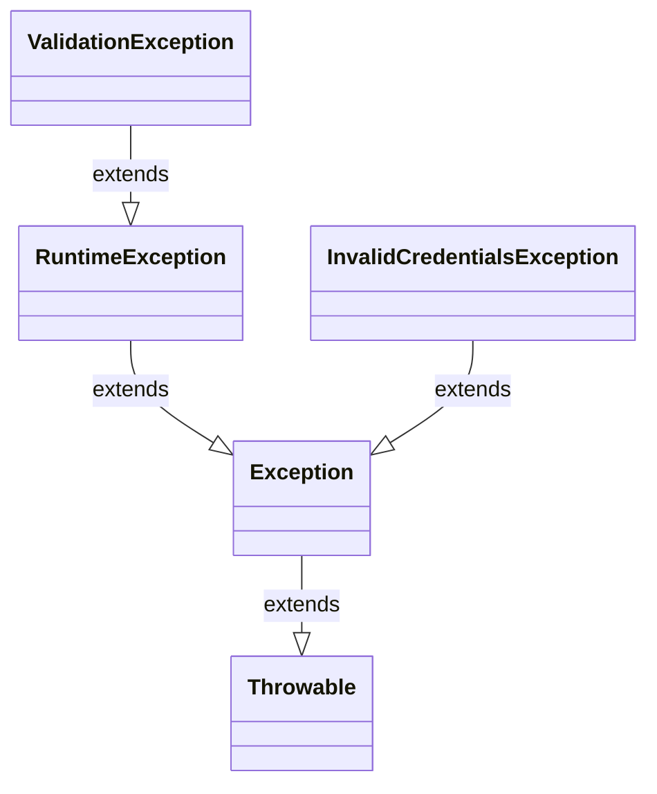

# Today's Objective

* **Today's Focus**: Implementing method call stacks from memory, handling multiple catch blocks, declaring throws contracts, and mapping custom exception hierarchies using static UML class diagrams.
* **Why Today's Work Matters**: Large applications throw many types of errors. A senior engineer must design class boundaries that handle different exception types specifically (e.g. logging a database error but notifying a user of a validation error) and know how exception hierarchy matches catch blocks.
* **How it Connects to Previous Lessons**: Yesterday, you learned the basic checked/unchecked exception split and wrote simple try-catch blocks. Today, you will write more complex exception handlers that catch multiple exception types.
* **How it Prepares You for Future Lessons**: This prepares you directly for building custom API error classes and global exception mappers in REST controllers (P15.M02).
* **Estimated Study Duration**: 3 hours (out of 4 hours available).

---

# Warm-up (10–15 minutes)

Let's review the exception hierarchy and catch blocks from Day 1 of this lesson.

### Quick Recall Questions
1. In Java, what is the parent class of all exceptions and errors?
2. What compiler rule differentiates Checked Exceptions from Unchecked Exceptions?
3. True or False: If a method declares `throws Exception`, the caller is forced to catch or declare it, even if the method only throws `RuntimeException` at runtime.
4. When does the `finally` block execute, and what is its primary purpose?
5. Why is catching `Throwable` generally discouraged in application code?

### Warm-up Coding Exercise
Write a method `int parseInteger(String val)` that parses a string into an integer, catches `NumberFormatException`, and returns `-1` on failure.

---

# Step 1 — Video Lectures

To support today's design exercise on exception hierarchies, watch this quick educational tutorial:

* **Title**: Java Multiple Catch Blocks & Exception Hierarchy
* **Instructor**: Cave of Programming / John Purcell
* **Platform**: YouTube
* **URL**: [https://www.youtube.com/watch?v=R9Z2Fw5vWos](https://www.youtube.com/watch?v=IPWvNleP5Z0)
* **Duration**: 8 minutes
* **Recommended Playback Speed**: 1.0x
* **Focus Areas**:
  * Focus on why the order of catch blocks matters: subclass catches must always come *before* parent class catches, otherwise the code will fail to compile (unreachable catch block).
* **Notes to Take**:
  * Write down the compilation rule for ordering multiple catch blocks.
  * Sketch the exception parent-child relationship hierarchy.

---

# Step 2 — Reading

### Book Track
* **Title**: *Head First Java*
* **Edition**: 3rd Edition
* **Author**: Kathy Sierra, Bert Bates, Trisha Gee
* **Chapter**: Chapter 11: "Risky Behavior"
* **Section**: Pages 339–354 (focusing on multiple catch blocks, exception matching rules, and throws declarations)
* **Reading Objective**: Understand how the JVM matches a thrown exception to the first compatible catch block in order, and how throws declarations document method failure contracts.
* **Estimated Reading Time**: 30 minutes

---

# Step 3 — Coding Practice

### Exercise 1: Reimplementing Authenticator Guard Clauses (Medium)
* **Objective**: Reimplement yesterday's custom checked exception and authenticator guard check logic from memory.
* **Difficulty**: Medium
* **Expected Outcome**: Create the classes `InvalidCredentialsException` and `Authenticator` from memory. Verify using assertions that null usernames throw `IllegalArgumentException` and invalid details throw `InvalidCredentialsException`. Compile from console.
* **Hints**: Do not look at yesterday's files. Write the method signatures entirely from recall.
* **Common Mistakes**: Expecting the compiler to let you throw a checked exception without declaring it in the method signature (`throws InvalidCredentialsException`).

### Exercise 2: Multiple Exception Handling (Medium)
* **Objective**: Catch and handle different exceptions specifically using multiple catch blocks.
* **Difficulty**: Medium
* **Expected Outcome**: Create a class `DataProcessor.java` with a method `int processData(String input, int index)`.
  * If `input` is null, throw `NullPointerException` (unchecked).
  * If `index` is invalid for a substring check, catch `StringIndexOutOfBoundsException` and print "Bounds check error".
  * If parsing the string fails, catch `NumberFormatException` and print "Number parse error".
  Write a test runner verifying that each input triggers the correct specific catch block.
* **Hints**: Place specific exception catch blocks before the generic `Exception` catch block.
* **Common Mistakes**: Putting `catch (Exception e)` at the very top of the catch blocks, causing all subsequent catch blocks to be unreachable.

---

# Step 4 — Hands-on Lab

No lab is scheduled today. (The hands-on lab for this lesson is scheduled for Day 3).

---

# Step 5 — Project Work

No project milestone is scheduled today. (The project connection is completed at the end of the module).

---

# Step 6 — UML / Design Exercise

### UML Exercise: Exception Class Hierarchy
Draw a static UML class diagram illustrating how your custom exception fits into the Java exception class hierarchy.
* **Why it matters**: Exceptions are classes. Understanding inheritance relationships is key to designing error models and catch blocks.
* **What should appear in the diagram**:
  1. A box for the standard JDK class `Throwable`.
  2. A box for `Exception` (inheriting from `Throwable`).
  3. A box for `RuntimeException` (inheriting from `Exception`).
  4. Your custom checked exception `InvalidCredentialsException` (inheriting from `Exception`).
  5. Your custom unchecked exception `ValidationException` (inheriting from `RuntimeException`).
  6. Direct generalization arrows (`^--` or solid lines with open triangles) pointing from children to parents.
* **Common Mistakes**:
  * Pointing generalization arrows from parent to child (they must point to the parent class).
  * Conflating checked exception parents (`Exception`) with unchecked exception parents (`RuntimeException`).

*You can write this diagram in Markdown using Mermaid syntax:*


---

# Step 7 — Engineering Insight

### The Catch Ordering Rule
In Java, exceptions are caught by **matching type compatibility**.
* When an exception is thrown, the JVM checks catch blocks sequentially from top to bottom.
* It executes the **first** catch block whose declared exception class is the same as or a superclass of the thrown exception.
* **The Compilation Constraint**: If a catch block for a superclass (e.g. `Exception`) is placed above a catch block for a subclass (e.g. `NullPointerException`), the subclass catch block is unreachable, causing a compile-time error. Always order catch blocks from **most specific** (child classes) to **most generic** (parent classes).

---

# Step 8 — Open Source Connection

In the **JUnit 5 Engine**:
* The test execution loop catches all subclass exceptions thrown by your tests.
* Internally, it uses multiple catch blocks to distinguish between `AssertionError` (test failed), `AssumptionViolatedException` (test skipped), and generic `Throwable` (test errored with unexpected failure).
* This allows JUnit to generate accurate reports identifying why each test ceased execution.

---

# Step 9 — End-of-Day Reflection

1. Why does the compiler complain if a `catch(Exception e)` block is placed before a `catch(NullPointerException e)` block?
2. What is an unreachable catch block compile error? How do you resolve it?
3. How does throwing an exception inside a method affect the execution of subsequent lines inside that method?
4. In UML class diagrams, what symbol represents the inheritance (extends) relationship between exception classes?
5. Why are custom exception types useful compared to throwing standard generic exceptions?

---

# Step 10 — Notes Template

Append this template to `notes/P00.M02.L02.md`:

```markdown
# Notes: P00.M02.L02 - Exceptions, error handling, and defensive checks

## Key Concepts

## Important Definitions

## Things That Clicked Today

## Things I Still Don't Understand

## Mistakes I Made

## Real-world Connections

## Questions To Revisit
```

---

# Step 11 — Journal Template

Save a copy of this template to `journal/2026-07-21.md`:

```markdown
# Daily Journal: 2026-07-21

## What I accomplished today

## Biggest insight

## Biggest challenge

## Questions I still have

## Time spent

## Confidence (1–10)

## Plan for tomorrow
```

---

# Final Checklist

- [ ] Warm-up complete
- [ ] Multiple Catch Blocks video tutorial watched
- [ ] Book reading completed (Head First Java Chapter 11, pages 339–354)
- [ ] Coding Exercise 1 (Authenticator recall) completed
- [ ] Coding Exercise 2 (DataProcessor multiple catch blocks) completed
- [ ] UML Exception inheritance diagram drawn (Mermaid or Paper)
- [ ] Reflection questions answered
- [ ] Notes file (`notes/P00.M02.L02.md`) updated
- [ ] Journal file (`journal/2026-07-21.md`) created from template
- [ ] Git commit completed with the designated message

---

### Recommended Git Commit Command:
```bash
git add .
git commit -m "study(P00.M02.L02): complete day 2"
```
