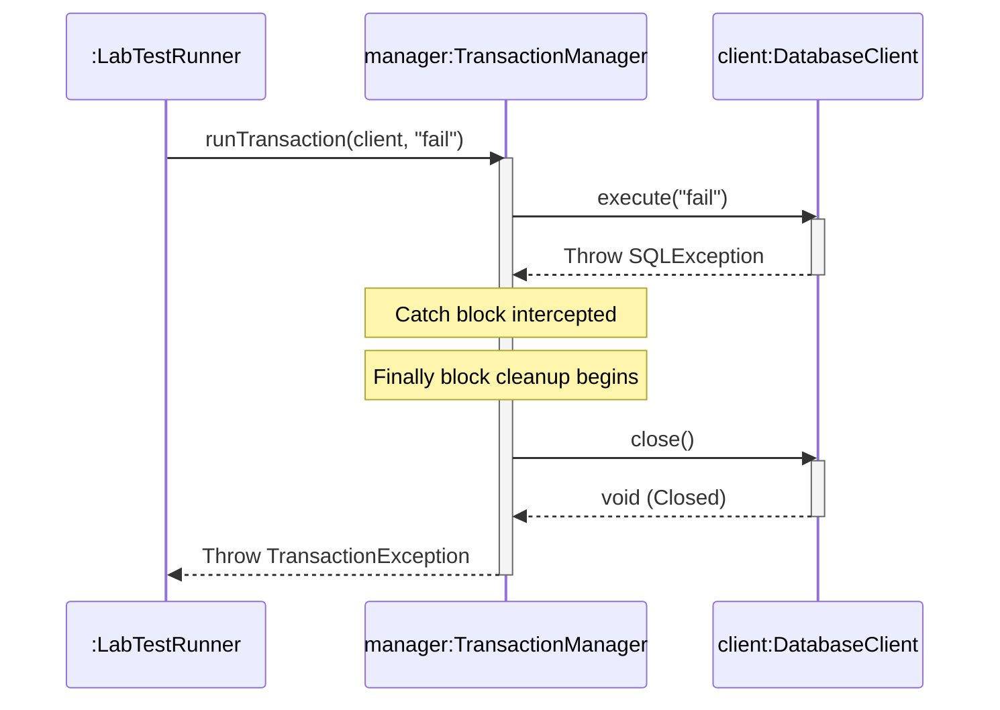

# Today's Objective

* **Today's Focus**: Implementing the Lesson 5 Lab (a Resilient Database Transaction Simulator), debugging exception propagation failures, exception chaining (retaining original root causes), and modeling exception handling flows inside UML sequence diagrams.
* **Why Today's Work Matters**: Real-world applications rely on database connections, network sockets, and file system descriptors that can fail unexpectedly. A senior engineer must write fault-tolerant transaction managers that catch resource failures, wrap them into clean domain exceptions (exception chaining), and guarantee connection cleanups in `finally` blocks.
* **How it Connects to Previous Lessons**: Yesterday, you mapped inheritance hierarchies and caught multiple exceptions. Today, you will put these handlers to work, simulating network database calls and checking resource release states under failure scenarios.
* **How it Prepares You for Future Lessons**: This resource cleanup design is essential when working with JDBC transactions (P10.M01) and thread concurrency pools (P09.M01) where unreleased connections cause severe production out-of-memory crashes.
* **Estimated Study Duration**: 3 hours (out of 4 hours available).

---

# Warm-up (10–15 minutes)

Let's review multiple catch blocks and signature throws contracts from Day 2.

### Quick Recall Questions
1. In what order must catch blocks be declared when catching exception classes that belong to the same inheritance branch?
2. If you catch a checked exception and throw a new checked exception, what must you declare in the method signature?
3. True or False: If a catch block executes a return statement, the subsequent `finally` block is skipped.
4. What compile-time error occurs if you put a `catch(Exception)` block above a `catch(IOException)` block?
5. Why are custom exception types preferred over generic JDK exception classes?

### Warm-up Coding Exercise
Write a method `void validateAge(int age)` that throws a `ValidationException` (unchecked) if the age is less than 18 or greater than 150.

---

# Step 1 — Video Lectures

To support today's sequence modeling containing conditional exceptional flows, watch this guide:

* **Title**: UML Sequence Diagrams - Exception Handling & Alternative Flows
* **Instructor**: Visual Paradigm / Lucidchart Course Staff
* **Platform**: YouTube
* **URL**: [https://www.youtube.com/watch?v=pCK6prSq8aw](https://www.youtube.com/watch?v=pCK6prSq8aw) (Focus on Alt/Break fragments)
* **Duration**: ~6 minutes
* **Focus Areas**:
  * Focus on how the **`alt`** (alternative) fragment box partitions success flows (happy paths) from exceptional catch flows (error paths).
* **Notes to Take**:
  * Sketch an `alt` fragment box with two compartments separated by a dashed line, representing `[success]` and `[exception]`.

---

# Step 2 — Reading

### Blog Track
* **Title**: *Exception Chaining in Java*
* **Publisher**: Baeldung (High-quality Java guides)
* **URL**: [https://www.baeldung.com/java-exception-chaining](https://www.baeldung.com/java-exception-chaining)
* **Reading Objective**: Understand how to wrap low-level checked errors into high-level unchecked exceptions while preserving the original root cause stack trace.
* **Estimated Reading Time**: 15 minutes

---

# Step 3 — Coding Practice

### Exercise: Exception Chaining & Stack Traces (Medium)
* **Objective**: Propagate low-level errors securely using exception chaining.
* **Difficulty**: Medium
* **Expected Outcome**: Create a class `PropagationPlayground.java`.
  * Write a method `void queryDatabase() throws java.sql.SQLException` (throw a simulatedSQLException).
  * Write a method `void runTask()` that calls `queryDatabase()`, catches the checked `SQLException`, and wraps it inside a new unchecked `RuntimeException` passing the SQLException as the cause constructor argument: `throw new RuntimeException("DB query failed", e);`.
  In your main method, call `runTask()`, catch `RuntimeException`, print its stack trace (`e.printStackTrace()`), and verify that the output trace includes the original `SQLException` root cause.
* **Hints**: `Throwable` subclasses accept a `Throwable cause` argument in their constructors.
* **Common Mistakes**: Re-throwing a new exception without passing the original exception as a cause parameter, which permanently destroys the root stack trace history.

---

# Step 4 — Hands-on Lab

### Lab: Resilient Database Transaction Simulator

#### Problem Statement
Design a database execution simulation wrapper `DatabaseClient` and a transaction manager `TransactionManager` under the package `handbook.phase00.p00m02l02`. The database can fail randomly (throwing a checked `SQLException`). The transaction manager must execute database calls, catch checked exceptions, wrap them into a custom unchecked `TransactionException` (retaining the cause), and execute resource cleanup (closing database connection) inside a guaranteed `finally` block.

#### Requirements
1. **Packages**: Organize your source code under the package `handbook.phase00.p00m02l02`.
2. **DatabaseClient Class**:
   * Exposes boolean field `connectionOpen`.
   * `void execute(String query) throws java.sql.SQLException`: If the query contains "fail", throw a `SQLException`.
   * `void close()`: Sets `connectionOpen = false` (simulating connection release).
3. **TransactionManager Class**:
   * `void runTransaction(DatabaseClient client, String query)`: Calls `client.execute()`. Catch checked `SQLException`, wrap it in custom unchecked `TransactionException`, and ensure `client.close()` is called in `finally`.
4. **LabTestRunner**: Verifies success paths, connection release guarantees, and exception chaining causes using assertions.

#### Starter Folder Structure
```text
src/main/java/handbook/phase00/p00m02l02/DatabaseClient.java
src/main/java/handbook/phase00/p00m02l02/TransactionManager.java
src/test/java/handbook/phase00/p00m02l02/LabTestRunner.java
docs/P00.M02.L02-diagram.md
```

#### Code Implementation Guidelines

##### DatabaseClient.java
```java
package handbook.phase00.p00m02l02;
import java.sql.SQLException;

public class DatabaseClient {
    public boolean connectionOpen = true;

    public void execute(String query) throws SQLException {
        if (!connectionOpen) {
            throw new IllegalStateException("Connection is closed!");
        }
        if (query != null && query.toLowerCase().contains("fail")) {
            throw new SQLException("Simulated Database disk I/O failure.");
        }
        System.out.println("Query executed successfully: " + query);
    }

    public void close() {
        this.connectionOpen = false;
        System.out.println("Database connection released and closed.");
    }
}
```

##### TransactionException.java (Unchecked wrapper exception)
```java
package handbook.phase00.p00m02l02;

public class TransactionException extends RuntimeException {
    public TransactionException(String message, Throwable cause) {
        super(message, cause);
    }
}
```

##### TransactionManager.java
```java
package handbook.phase00.p00m02l02;
import java.sql.SQLException;

public class TransactionManager {

    public void runTransaction(DatabaseClient client, String query) {
        if (client == null) {
            throw new IllegalArgumentException("Database client context required.");
        }
        try {
            client.execute(query);
        } catch (SQLException e) {
            // Exception Chaining: Wrap checked SQL into unchecked TransactionException
            throw new TransactionException("Transaction failed and aborted.", e);
        } finally {
            // Guarantee Resource Release
            client.close();
        }
    }
}
```

##### LabTestRunner.java
```java
package handbook.phase00.p00m02l02;

public class LabTestRunner {
    public static void main(String[] args) {
        System.out.println("Running Resilient DB Simulation Lab Tests...");

        TransactionManager manager = new TransactionManager();

        // Test Case 1: Successful Transaction & Connection Close
        DatabaseClient client1 = new DatabaseClient();
        manager.runTransaction(client1, "SELECT * FROM users;");
        assert !client1.connectionOpen : "Connection leak: Client remained open after success!";
        System.out.println("Test Case 1 Passed: Success release verified.");

        // Test Case 2: Exception Chaining & Finally Block Release on Failure
        DatabaseClient client2 = new DatabaseClient();
        boolean caughtTransactionException = false;
        try {
            manager.runTransaction(client2, "INSERT INTO logs (type) VALUES ('fail');");
        } catch (TransactionException e) {
            caughtTransactionException = true;
            // Verify cause chain is preserved
            assert e.getCause() instanceof java.sql.SQLException : "Exception chain missing root cause!";
            System.out.println("Test Case 2 Passed: Custom Exception wrapping verified.");
        }
        assert caughtTransactionException : "Failed to intercept expected TransactionException!";
        assert !client2.connectionOpen : "Connection leak: Client remained open after query crash!";
        System.out.println("Test Case 2 (Finally release) Passed.");

        System.out.println("All Database Simulator Lab Tests Passed Successfully!");
    }
}
```

#### Compilation & Execution Commands
Run from the root `src/` directory:
```bash
# Compilation
javac main/java/handbook/phase00/p00m02l02/*.java test/java/handbook/phase00/p00m02l02/*.java -d bin

# Execution
java -ea -cp bin handbook.phase00.p00m02l02.LabTestRunner
```

---

# Step 5 — Project Work

No project milestone is scheduled today. (The project connection is completed at the end of the module).

---

# Step 6 — UML / Design Exercise

### UML Sequence Diagram
Draw a sequence diagram visualizing the dynamic flow of `LabTestRunner` initiating a failing query.
* **Why it matters**: A sequence diagram models resource allocation and release states visually, proving that cleanup blocks execute regardless of runtime crashes.
* **What should appear in the diagram**:
  1. Lifelines: `:LabTestRunner`, `manager:TransactionManager`, and `client:DatabaseClient`.
  2. The call `runTransaction(client, "fail")`.
  3. The database call `execute("fail")`.
  4. The database throwing `SQLException` back to `manager`.
  5. The `finally` execution flow: `manager` calling `close()` on `client`.
  6. The `manager` throwing `TransactionException` back to `Runner`.
  7. Use an **`alt`** or **`break`** fragment enclosing the catch-finally sequence.

*You can write this diagram in Markdown using Mermaid syntax:*


---

# Step 7 — Engineering Insight

### The Finally Block Guarantee & Exception Chaining
Writing production-grade systems requires absolute resource management. 
* **The Finally Guarantee**: In Java, the `finally` block is guaranteed to execute *no matter what*. Even if the try or catch block executes a `return` statement, throws another exception, or breaks, the JVM halts that event to run the `finally` block first before returning control to the caller. This makes it the single best place to close files, unlock thread mutexes, and release connections.
* **Exception Chaining**: Always pass the caught exception as the cause parameter when throwing custom exceptions (`new MyException("message", caughtCause)`). Doing so creates an audit trail (stack trace cause history) that is essential for tracing root failure origins.

---

# Step 8 — Open Source Connection

In web servers like **Apache Tomcat**:
* When loading context settings or starting components, low-level initialization exceptions (e.g. database connect or directory failures) are intercepted.
* Tomcat uses strict `try-finally` blocks to guarantee that file handles and temporary registers are cleared during boot crashes, preventing memory leaks on server hosts.

---

# Step 9 — End-of-Day Reflection

1. If an exception is thrown inside a `try` block, what happens to lines inside the `try` block that come *after* the throwing statement?
2. Why is exception chaining crucial for debugging enterprise systems? What diagnostic data is lost without it?
3. Can a `finally` block throw an exception itself? What happens to the original exception if it does?
4. How does the UML sequence diagram show that a `finally` block executes regardless of an exception being thrown?
5. Why are custom unchecked wrappers (like `TransactionException`) useful when developing framework libraries?

---

# Step 10 — Notes Template

Append this template to `notes/P00.M02.L02.md`:

```markdown
# Notes: P00.M02.L02 - Exceptions, error handling, and defensive checks

## Key Concepts

## Important Definitions

## Things That Clicked Today

## Things I Still Don't Understand

## Mistakes I Made

## Real-world Connections

## Questions To Revisit
```

---

# Step 11 — Journal Template

Save a copy of this template to `journal/2026-07-22.md`:

```markdown
# Daily Journal: 2026-07-22

## What I accomplished today

## Biggest insight

## Biggest challenge

## Questions I still have

## Time spent

## Confidence (1–10)

## Plan for tomorrow
```

---

# Final Checklist

- [ ] Warm-up complete
- [ ] UML Sequence Exceptions video tutorial watched
- [ ] Exception Chaining Baeldung guide read
- [ ] Coding Exercise (ExceptionChaining and traces) completed
- [ ] Lab: Resilient Database Transaction Simulator implemented
- [ ] LabTestRunner executed successfully with `-ea` flag
- [ ] UML Sequence diagram with try-catch-finally bounds drawn (Mermaid or Paper)
- [ ] Reflection questions answered
- [ ] Notes file (`notes/P00.M02.L02.md`) updated and finalized
- [ ] Journal file (`journal/2026-07-22.md`) created from template
- [ ] Git commit completed with the designated message

---

### Recommended Git Commit Command:
```bash
git add .
git commit -m "study(P00.M02.L02): complete day 3"
```
