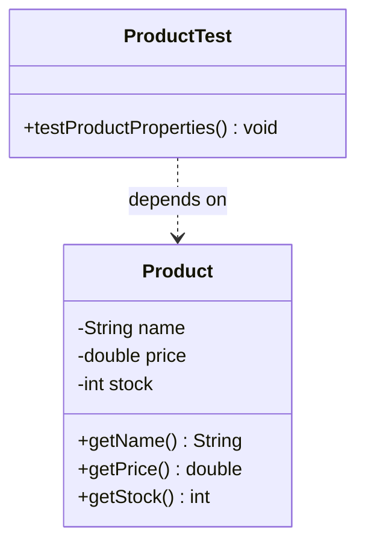

# Today's Objective

* **Today's Focus**: Mastering advanced JUnit 5 assertions (grouped assertions `assertAll`, array/iterable assertions), the execution ordering lifecycle, and mapping test dependencies using static UML class diagrams.
* **Why Today's Work Matters**: Senior engineers write focused, highly readable test assertions. You will learn how to verify multiple related conditions together using `assertAll` (grouped assertions) so that if one check fails, subsequent checks are still executed and reported, giving you complete diagnostic feedback.
* **How it Connects to Previous Lessons**: Yesterday, you wrote basic assertions and verified exception invariants. Today, you will write more comprehensive test cases that assert multiple properties of class states simultaneously.
* **How it Prepares You for Future Lessons**: Grouped assertions are essential when testing complex domain entities and value objects (Phase 1, Phase 2) where multiple state fields must be verified together.
* **Estimated Study Duration**: 3 hours (out of 4 hours available).

---

# Warm-up (10–15 minutes)

Let's review the JUnit 5 test lifecycle and exception assertions from Day 1 of this lesson.

### Quick Recall Questions
1. Why does JUnit instantiate a fresh object of your test class for every single `@Test` method?
2. What annotation is used to run setup code before each test method starts executing?
3. What is the difference in parameters order between `assertEquals` in JUnit and a standard Java `assert` statement?
4. How do you verify that a constructor throws a specific exception class using `assertThrows`?
5. Why are unit tests considered "executable specifications"?

### Warm-up Coding Exercise
Write a JUnit test template containing a `@BeforeEach` method that instantiates a helper class, and a `@Test` method verifying that the instance is not null using `assertNotNull`.

---

# Step 1 — Video Lectures

To understand advanced assertions and grouped assertions in JUnit 5, watch this concise tutorial:

* **Title**: JUnit 5 Assertions - Advanced Unit Testing in Java
* **Instructor**: Baeldung Course Staff / Java Tech Educators
* **Platform**: YouTube
* **URL**: [https://www.youtube.com/watch?v=vZm0lHciFsQ](https://www.youtube.com/watch?v=9V49Y1Ew8qE) (Focus on advanced assertion API)
* **Duration**: 8 minutes
* **Recommended Playback Speed**: 1.0x
* **Focus Areas**:
  * Focus on **`assertAll`** (grouped assertions) and why it is superior to writing sequential `assertEquals` lines.
* **Notes to Take**:
  * Write down the syntax of `assertAll("heading", ...executableLambdas)`.
  * Note how `assertAll` reports *all* failures instead of halting on the first failure.

---

# Step 2 — Reading

### Blog / Documentation Track
* **Title**: *JUnit 5 Assertions Guide*
* **Publisher**: Baeldung (High-quality Java guides)
* **URL**: [https://www.baeldung.com/junit-5-assertions](https://www.baeldung.com/junit-5-assertions)
* **Reading Objective**: Comprehend the full suite of assertions available in Jupiter, focusing on `assertAll`, `assertTimeout`, and `assertIterableEquals`.
* **Estimated Reading Time**: 30 minutes

---

# Step 3 — Coding Practice

### Exercise 1: Reimplementing User Boundary Tests (Medium)
* **Objective**: Reimplement yesterday's User constructor validation exception tests from memory.
* **Difficulty**: Medium
* **Expected Outcome**: Create the class `User` and its test suite `UserTest` from memory using JUnit 5 assertions. Run the tests.
* **Hints**: Do not reference yesterday's files. Focus on the signature of `assertThrows`.
* **Common Mistakes**: Forgetting to use the lambda syntax `() ->` when calling the constructor under test inside `assertThrows`.

### Exercise 2: Grouped Assertions with assertAll (Medium)
* **Objective**: Assert multiple object state values simultaneously without halting on first failure.
* **Difficulty**: Medium
* **Expected Outcome**: Create a class `Product.java` with private fields `String name`, `double price`, and `int stock`. Expose a constructor and getters.
  Create a test class `ProductTest.java`. In a single test method, instantiate a product (e.g. name="Laptop", price=999.99, stock=50). Use `assertAll` to assert that:
  1. The name is exactly "Laptop".
  2. The price is exactly 999.99.
  3. The stock is exactly 50.
  Run the test. Intentionally change the expected values in the test to fail multiple conditions, run it, and observe how JUnit reports all failures at once.
* **Hints**: Use the import `import static org.junit.jupiter.api.Assertions.assertAll;` and `import static org.junit.jupiter.api.Assertions.assertEquals;`.
* **Common Mistakes**: Writing three sequential `assertEquals` calls. If the first fails, the next two never run, hiding other potential bugs.

---

# Step 4 — Hands-on Lab

No lab is scheduled today. (The hands-on lab for this lesson is scheduled for Day 3).

---

# Step 5 — Project Work

No project milestone is scheduled today. (The project connection is completed at the end of the module).

---

# Step 6 — UML / Design Exercise

### UML Exercise: Test Class Relationship Diagram
Draw a static UML class diagram mapping the compile-time relationship between your test class and the target class.
* **Why it matters**: In automated testing, test classes are clients of the production codebase. Mapping this relationship visually shows that the test class depends on the production class, but the production class has **zero knowledge** of the test class. This maintains the clean decoupling of test packages from production code.
* **What should appear in the diagram**:
  1. A class box for `Product` (with fields and getters).
  2. A class box for `ProductTest` (with test methods, e.g. `+ testProductProperties() : void`).
  3. A dotted dependency arrow pointing from `ProductTest` to `Product`.
* **Common Mistakes**:
  * Drawing an association (solid line) or inheritance arrow. The test class simply depends on (uses) the target class compile-time contract.

*You can write this diagram in Markdown using Mermaid syntax:*


---

# Step 7 — Engineering Insight

### Grouped Assertions and Test Diagnostics
When writing unit tests, developers often write multiple assertions back-to-back:
```java
// Bad Practice
assertEquals("Laptop", product.getName());
assertEquals(999.99, product.getPrice()); // If name fails, this is never checked!
```
If the product name is incorrect, execution halts instantly. You have no idea if the price was also calculated incorrectly or if it passed. 

**Senior Strategy**: Use grouped assertions:
```java
// Good Practice: assertAll
assertAll("verify product properties",
    () -> assertEquals("Laptop", product.getName()),
    () -> assertEquals(999.99, product.getPrice()),
    () -> assertEquals(50, product.getStock())
);
```
`assertAll` executes all assertions passed to it, even if some throw assertion failures. It aggregates the failures and prints a unified report. This saves significant debugging time by revealing all state bugs in a single run.

---

# Step 8 — Open Source Connection

In the **Spring Framework** test suites:
* Complex configuration states and bean properties are verified using `assertAll` inside JUnit test cases.
* When testing servlet request contexts, Spring asserts header states, status codes, and body contents together, ensuring the execution engine logs all failures in the test report rather than masking them.

---

# Step 9 — End-of-Day Reflection

1. How does `assertAll` differ from sequential `assertEquals` statements in its execution flow?
2. If an assertion inside an `assertAll` throws a `NullPointerException` (not an `AssertionFailedError`), does `assertAll` still run subsequent assertions?
3. Why is it important that production classes have no compile-time dependency on test classes?
4. In UML class diagrams, how do package visibility rules map between `src/main` and `src/test` directories?
5. Why are timeout assertions (`assertTimeout`) useful when testing loops or networking calls?

---

# Step 10 — Notes Template

Append this template to `notes/P00.M02.L03.md`:

```markdown
# Notes: P00.M02.L03 - JUnit basics and executable examples

## Key Concepts

## Important Definitions

## Things That Clicked Today

## Things I Still Don't Understand

## Mistakes I Made

## Real-world Connections

## Questions To Revisit
```

---

# Step 11 — Journal Template

Save a copy of this template to `journal/2026-07-24.md`:

```markdown
# Daily Journal: 2026-07-24

## What I accomplished today

## Biggest insight

## Biggest challenge

## Questions I still have

## Time spent

## Confidence (1–10)

## Plan for tomorrow
```

---

# Final Checklist

- [ ] Warm-up complete
- [ ] Grouped Assertions video tutorial watched
- [ ] Baeldung JUnit 5 Assertions guide read
- [ ] Coding Exercise 1 (User constructor validation recall) completed
- [ ] Coding Exercise 2 (ProductTest grouped assertions) completed
- [ ] UML Test relationship class diagram drawn (Mermaid or Paper)
- [ ] Reflection questions answered
- [ ] Notes file (`notes/P00.M02.L03.md`) updated
- [ ] Journal file (`journal/2026-07-24.md`) created from template
- [ ] Git commit completed with the designated message

---

### Recommended Git Commit Command:
```bash
git add .
git commit -m "study(P00.M02.L03): complete day 2"
```
