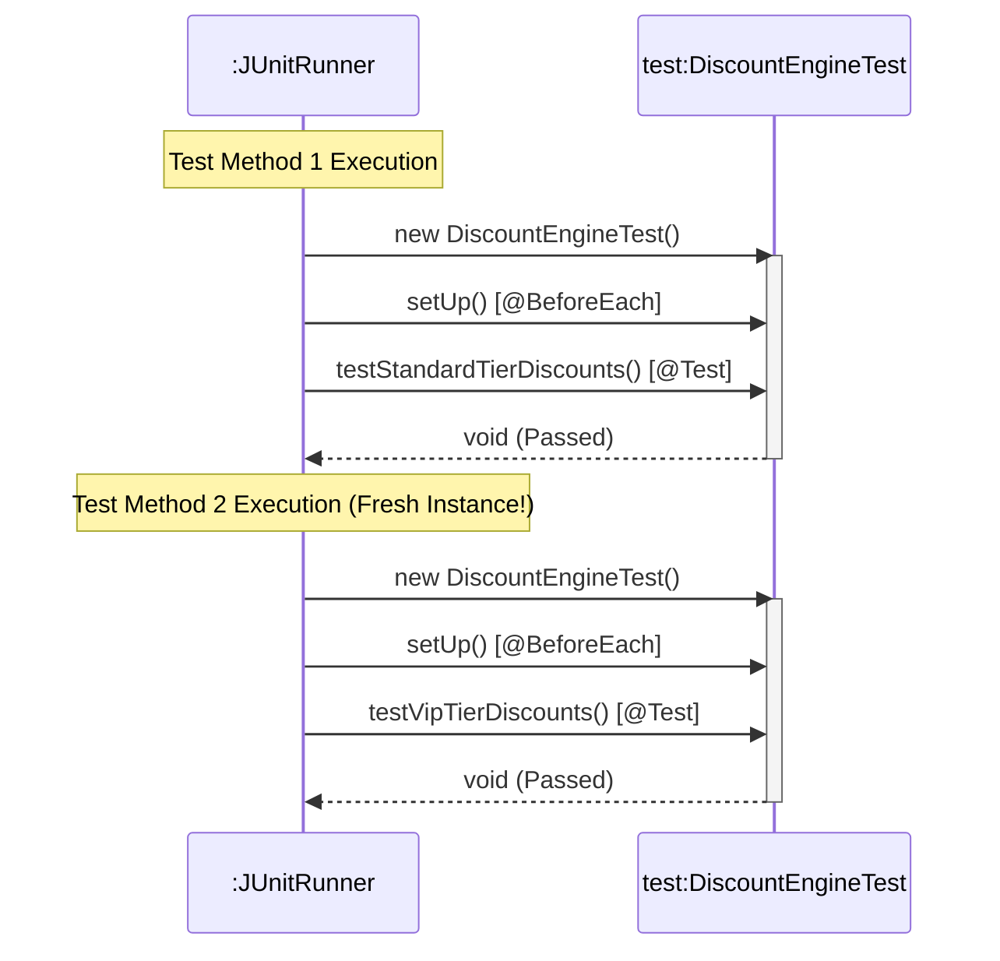

# Today's Objective

* **Today's Focus**: Implementing the Lesson 6 Lab (the **Discount Engine & Order Pricing Test Suite**), debugging test state leakage bugs, mastering JUnit 5 lifecycle annotations (`@BeforeEach`, `@AfterEach`), and drawing UML sequence diagrams capturing framework test execution hooks.
* **Why Today's Work Matters**: Writing unit tests is only half the battle; ensuring that tests are completely independent and isolated is what makes test suites reliable. You will learn how JUnit manages test class instantiations per test method to prevent shared-state test pollution.
* **How it Connects to Previous Lessons**: Yesterday, you wrote grouped assertions (`assertAll`). Today, you will combine lifecycle hooks, boundary exception verifications, and grouped assertions into a production-grade test suite.
* **How it Prepares You for Future Lessons**: Mastering JUnit 5 completes your core testing foundation in Phase 0, preparing you directly for building the integrated **Module 00.02 Project** and applying Test-Driven Development (TDD) in Phase 1.
* **Estimated Study Duration**: 3 hours (out of 4 hours available).

---

# Warm-up (10–15 minutes)

Let's review grouped assertions and test class compile-time dependencies from Day 2.

### Quick Recall Questions
1. Why is `assertAll` preferred over writing multiple sequential `assertEquals` statements?
2. In a UML class diagram, what relationship type exists between a JUnit test class and the target production class?
3. If a test class depends on a production class, does the production class have any compile-time dependency on the test class?
4. How do you import `assertAll` and `assertEquals` statically in Java?
5. What happens if the first assertion in a sequential list of `assertEquals` fails?

### Warm-up Coding Exercise
Write a static import statement for JUnit 5 assertions and a test method checking that a list is not empty using `assertFalse(list.isEmpty())`.

---

# Step 1 — Video Lectures

To understand how JUnit manages test execution lifecycles and hooks under the hood, watch this tutorial:

* **Title**: JUnit 5 Test Lifecycle - @BeforeEach, @AfterEach, @BeforeAll, @AfterAll
* **Instructor**: Coding with John
* **Platform**: YouTube
* **URL**: [https://www.youtube.com/watch?v=vZm0lHciFsQ](https://www.youtube.com/watch?v=vZm0lHciFsQ) (Focus on lifecycle execution)
* **Duration**: 10 minutes
* **Recommended Playback Speed**: 1.0x
* **Focus Areas**:
  * Focus on why `@BeforeEach` runs before *every* `@Test` method, creating a clean fixture setup.
* **Notes to Take**:
  * Write down the difference between `@BeforeEach` (instance level) and `@BeforeAll` (static class level).

---

# Step 2 — Reading

### Blog Track
* **Title**: *JUnit 5 Test Lifecycle*
* **Publisher**: Baeldung (High-quality Java guides)
* **URL**: [https://www.baeldung.com/junit-5-test-lifecycle](https://www.baeldung.com/junit-5-test-lifecycle)
* **Reading Objective**: Comprehend why JUnit instantiates a new instance of the test class for each test method by default (`PER_METHOD` lifecycle) to guarantee test isolation.
* **Estimated Reading Time**: 20 minutes

---

# Step 3 — Coding Practice

### Exercise: State Leakage Debugging (Medium)
* **Objective**: Identify and fix test failures caused by shared static state.
* **Difficulty**: Medium
* **Expected Outcome**: Create a test class `StateLeakageDemoTest.java`. Declare a `private static List<String> items = new ArrayList<>();`.
  * Write `testOne()`: adds "Item A" and asserts size is 1.
  * Write `testTwo()`: adds "Item B" and asserts size is 1.
  Run the tests together. Observe how one of the tests fails because `items` is static and retains state across tests. Fix the bug by changing `items` to an instance variable and initializing it inside a `@BeforeEach` method.
* **Hints**: Avoid static mutable fields in test classes!
* **Common Mistakes**: Expecting instance variables in test classes to persist across `@Test` methods. Remember: JUnit creates a new test class object for each `@Test` method execution.

---

# Step 4 — Hands-on Lab

### Lab: Discount Engine & Order Pricing Test Suite

#### Problem Statement
Design an order pricing component `DiscountEngine` and a comprehensive JUnit 5 test suite `DiscountEngineTest` under the package `handbook.phase00.p00m02l03`. The discount engine calculates percentage discounts based on order totals and customer tier levels (STANDARD, VIP).

#### Requirements
1. **Packages**: Organize your source code under the package `handbook.phase00.p00m02l03`.
2. **DiscountEngine Class**:
   * `double calculateDiscount(double orderTotal, String tier)`:
     * Standard Tier: 0% discount if order total < $100; 5% discount if order total >= $100.
     * VIP Tier: 10% discount if order total < $100; 20% discount if order total >= $100.
     * Boundary validation: If `orderTotal` < 0 or `tier` is null/unknown, throw `IllegalArgumentException`.
3. **DiscountEngineTest Class**:
   * Uses `@BeforeEach` to instantiate `DiscountEngine engine`.
   * Uses `@Test` methods for Standard and VIP tier happy paths.
   * Uses `assertThrows` to verify negative totals and invalid tiers.
   * Uses `assertAll` to verify multiple tier calculations in a single test block.

#### Starter Folder Structure
```text
src/main/java/handbook/phase00/p00m02l03/DiscountEngine.java
src/test/java/handbook/phase00/p00m02l03/DiscountEngineTest.java
docs/P00.M02.L03-diagram.md
```

#### Code Implementation Guidelines

##### DiscountEngine.java
```java
package handbook.phase00.p00m02l03;

public class DiscountEngine {

    public double calculateDiscount(double orderTotal, String tier) {
        if (orderTotal < 0) {
            throw new IllegalArgumentException("Order total cannot be negative.");
        }
        if (tier == null || tier.trim().isEmpty()) {
            throw new IllegalArgumentException("Customer tier is required.");
        }

        String normalizedTier = tier.trim().toUpperCase();
        if (normalizedTier.equals("STANDARD")) {
            return orderTotal >= 100.0 ? orderTotal * 0.05 : 0.0;
        } else if (normalizedTier.equals("VIP")) {
            return orderTotal >= 100.0 ? orderTotal * 0.20 : orderTotal * 0.10;
        } else {
            throw new IllegalArgumentException("Unknown customer tier: " + tier);
        }
    }
}
```

##### DiscountEngineTest.java
```java
package handbook.phase00.p00m02l03;

import org.junit.jupiter.api.BeforeEach;
import org.junit.jupiter.api.Test;
import static org.junit.jupiter.api.Assertions.*;

public class DiscountEngineTest {

    private DiscountEngine engine;

    @BeforeEach
    void setUp() {
        // Fixture Setup: Fresh engine instance before every test
        engine = new DiscountEngine();
    }

    @Test
    void testStandardTierDiscounts() {
        assertAll("Standard Tier Verification",
            () -> assertEquals(0.0, engine.calculateDiscount(50.0, "STANDARD")),
            () -> assertEquals(10.0, engine.calculateDiscount(200.0, "STANDARD"))
        );
    }

    @Test
    void testVipTierDiscounts() {
        assertAll("VIP Tier Verification",
            () -> assertEquals(5.0, engine.calculateDiscount(50.0, "VIP")),
            () -> assertEquals(40.0, engine.calculateDiscount(200.0, "VIP"))
        );
    }

    @Test
    void testInvalidOrderTotalThrowsException() {
        assertThrows(IllegalArgumentException.class, () -> engine.calculateDiscount(-10.0, "STANDARD"));
    }

    @Test
    void testInvalidTierThrowsException() {
        assertThrows(IllegalArgumentException.class, () -> engine.calculateDiscount(100.0, "UNKNOWN"));
    }
}
```

---

# Step 5 — Project Work

No project milestone is scheduled today. (The project connection is completed at the end of the module).

---

# Step 6 — UML / Design Exercise

### UML Sequence Diagram
Draw a sequence diagram visualizing how the **JUnit Framework Runner** executes your test class hooks.
* **Why it matters**: Understanding framework lifecycle execution reveals how annotations drive runtime behavior.
* **What should appear in the diagram**:
  1. Lifelines: `:JUnitRunner` and `test:DiscountEngineTest`.
  2. `:JUnitRunner` instantiating a new `DiscountEngineTest` object instance (`new DiscountEngineTest()`).
  3. `:JUnitRunner` calling the `@BeforeEach setUp()` method.
  4. `:JUnitRunner` calling the `@Test testVipTierDiscounts()` method.
  5. The return execution flow.
* **Common Mistakes**:
  * Reusing the same test instance for multiple `@Test` methods in the diagram. JUnit creates a *new* instance lifeline per test call.

*You can write this diagram in Markdown using Mermaid syntax:*


---

# Step 7 — Engineering Insight

### Test Isolation & The Per-Method Lifecycle
In JUnit 5, why does the framework create a new instance of your test class for every single `@Test` method?
* **Test Independence**: If Test A modifies an instance variable on the test class, Test B will not see that change because Test B runs on a completely separate object instance on the heap.
* **Execution Order Neutrality**: Tests must be able to run in any order (or in parallel) without affecting each other. If tests depend on execution order, your test suite becomes fragile ("flaky tests").
* **Senior Rule**: Keep test methods 100% independent. Use `@BeforeEach` to initialize clean test fixtures, and avoid static mutable fields.

---

# Step 8 — Open Source Connection

In the **JUnit 5 Core Engine (`JupiterTestEngine`)**:
* The engine builds a hierarchical tree of test descriptors during class scanning.
* During execution, it uses reflection to dynamically invoke lifecycle methods (`@BeforeAll` $\rightarrow$ constructor $\rightarrow$ `@BeforeEach` $\rightarrow$ `@Test` $\rightarrow$ `@AfterEach` $\rightarrow$ `@AfterAll`).
* This automated execution pipeline ensures uniform behavior across millions of Java projects worldwide.

---

# Step 9 — End-of-Day Reflection

1. What is the difference between `@BeforeEach` and `@BeforeAll`? Why must `@BeforeAll` methods be `static` in standard lifecycle mode?
2. Why does JUnit instantiate a new test class object for each test method execution?
3. How does `@BeforeEach` help eliminate duplicate setup code across test methods?
4. In UML sequence diagrams, how do you represent the framework instantiating a fresh test class instance per method?
5. Why are flaky tests (tests that pass or fail randomly depending on execution order) dangerous in production CI/CD pipelines?

---

# Step 10 — Notes Template

Append this template to `notes/P00.M02.L03.md`:

```markdown
# Notes: P00.M02.L03 - JUnit basics and executable examples

## Key Concepts

## Important Definitions

## Things That Clicked Today

## Things I Still Don't Understand

## Mistakes I Made

## Real-world Connections

## Questions To Revisit
```

---

# Step 11 — Journal Template

Save a copy of this template to `journal/2026-07-25.md`:

```markdown
# Daily Journal: 2026-07-25

## What I accomplished today

## Biggest insight

## Biggest challenge

## Questions I still have

## Time spent

## Confidence (1–10)

## Plan for tomorrow
```

---

# Final Checklist

- [ ] Warm-up complete
- [ ] JUnit 5 Lifecycle video tutorial watched
- [ ] Baeldung JUnit 5 Lifecycle guide read
- [ ] Coding Exercise (StateLeakageDemoTest debugging) completed
- [ ] Lab: Discount Engine & Order Pricing Test Suite implemented
- [ ] DiscountEngineTest executed successfully
- [ ] UML Framework Lifecycle Sequence diagram drawn (Mermaid or Paper)
- [ ] Reflection questions answered
- [ ] Notes file (`notes/P00.M02.L03.md`) updated and finalized
- [ ] Journal file (`journal/2026-07-25.md`) created from template
- [ ] Git commit completed with the designated message

---

### Recommended Git Commit Command:
```bash
git add .
git commit -m "study(P00.M02.L03): complete day 3"
```
