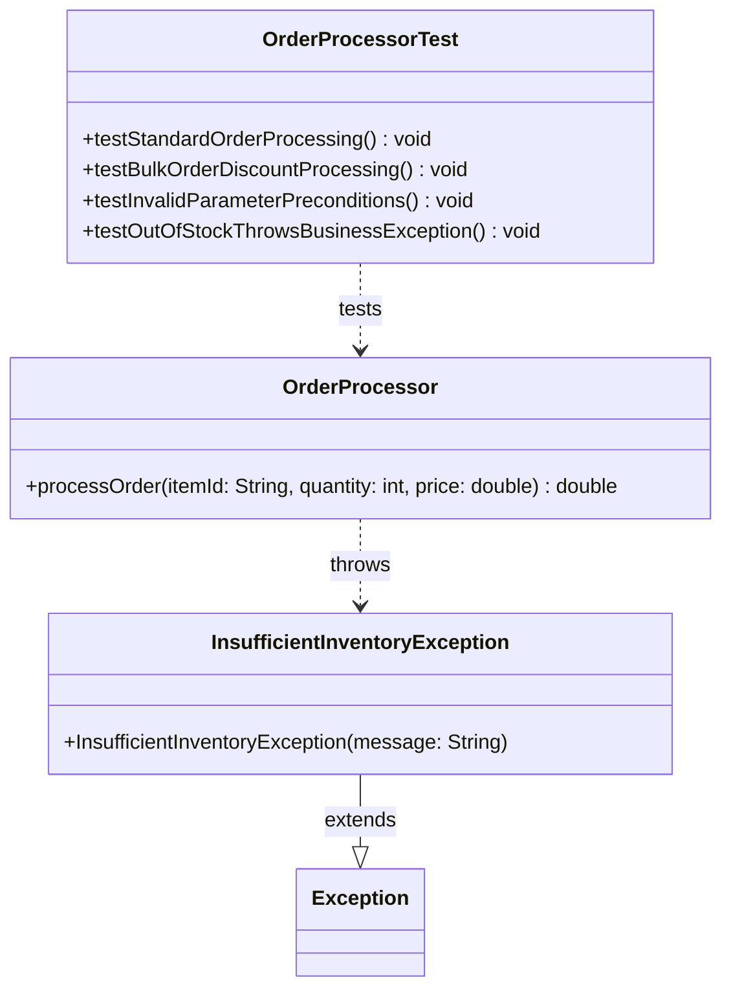

# Today's Objective

* **Today's Focus**: Implementing the **Module 00.02 Project (Resilient Order Validation & Processing Subsystem)**. You will integrate the three core lessons of Module 2: Methods/Scopes/Parameters (L01), Exceptions/Guards/Defensive checks (L02), and JUnit 5 Automated Unit Testing (L03) into a single functional, tested, and documented subsystem.
* **Why Today's Work Matters**: Combining method parameters, custom exception contracts, and automated JUnit test suites simulates building an enterprise-grade service layer. Today's project proves your ability to write self-testing, fault-tolerant Java code.
* **How it Connects to Previous Lessons**: This project takes your method signatures (L01), exception handlers (L02), and JUnit test suites (L03) and integrates them into a complete subsystem.
* **How it Prepares You for Future Lessons**: Successfully delivering this module project completes your core Java mechanics (Part A of Phase 0), preparing you directly for Git workflows, Maven/Gradle project layouts, and package visibility in Part B (P00.M03).
* **Estimated Study Duration**: 4 hours (entire available session).

---

# Warm-up (15–20 minutes)

Let's review the entire Module 2 lifecycle (P00.M02.L01 to P00.M02.L03).

### Quick Recall Questions
1. How does the JVM stack handle parameters and local variables during nested method calls?
2. What is the key compilation difference between a Checked Exception (`Exception`) and an Unchecked Exception (`RuntimeException`)?
3. Why is exception chaining (`new CustomException(message, cause)`) critical for root cause diagnostics?
4. How does JUnit 5's `@BeforeEach` annotation guarantee test instance isolation?
5. Why are grouped assertions (`assertAll`) preferred over sequential `assertEquals` statements?

### Warm-up Coding Exercise
Write a JUnit 5 test method asserting that passing `0` to a method `void setQuantity(int q)` throws an `IllegalArgumentException` using `assertThrows`.

---

# Step 1 — Video Lectures

To guide your approach to unit test architecture and project layering, watch this tutorial:

* **Title**: JUnit 5 Best Practices - Writing Maintainable Test Suites
* **Instructor**: Baeldung Course Staff / Java Tech Educators
* **Platform**: YouTube
* **URL**: [https://www.youtube.com/watch?v=vZm0lHciFsQ](https://www.youtube.com/watch?v=vZm0lHciFsQ) (Focus on Test Suite Organization)
* **Duration**: 10 minutes
* **Recommended Playback Speed**: 1.0x
* **Focus Areas**:
  * Focus on naming conventions (`*Test.java`), separating unit test suites from production source code, and arranging tests according to the **Given-When-Then** (or Arrange-Act-Assert) pattern.

---

# Step 2 — Reading

### Blog Track
* **Title**: *The Given-When-Then Pattern for Unit Tests*
* **Author**: Martin Fowler
* **URL**: [https://martinfowler.com/bliki/GivenWhenThen.html](https://martinfowler.com/bliki/GivenWhenThen.html)
* **Reading Objective**: Learn how to structure test methods clearly into three distinct blocks: Given (setup fixture), When (invoking the method), and Then (asserting the outcome).
* **Estimated Reading Time**: 15 minutes

---

# Step 3 — Coding Practice

### Exercise: Order Precondition Checker (Easy)
* **Objective**: Write an order precondition checker method.
* **Difficulty**: Easy
* **Expected Outcome**: Create a class `OrderValidator.java`. Write a static method `void validateOrder(String itemId, int qty, double price)` that throws `IllegalArgumentException` if `itemId` is null/empty, `qty <= 0`, or `price <= 0`. Write a JUnit test verifying all three guard failures.
* **Hints**: Check each parameter individually to supply descriptive exception messages.

---

# Step 4 — Hands-on Lab

Today is a project day. The project itself functions as today's extended lab. (See Step 5 for details).

---

# Step 5 — Project Work

### Project Milestone: Resilient Order Validation & Processing Subsystem

#### Problem Statement
Build an enterprise order processing subsystem `Resilient Order Validation & Processing Subsystem`. The system accepts order requests, validates preconditions using guard clauses, calculates bulk volume discounts (5% for $\ge 10$ items), handles custom inventory errors (`InsufficientInventoryException`), and exposes a complete JUnit 5 test suite covering all happy and failure paths.

#### Suggested Folder Structure
Create this layout inside your workspace:
```text
projects/module-02-project/
  README.md
  docs/
    architecture.md
    adr/0001-design-error-handling.md
    diagrams/
  src/
    main/java/handbook/phase00/project02/
      OrderProcessor.java
      InsufficientInventoryException.java
    test/java/handbook/phase00/project02/
      OrderProcessorTest.java
```

#### 1. File: `projects/module-02-project/docs/adr/0001-design-error-handling.md`
Write an Architecture Decision Record detailing your error handling contracts:
```markdown
# ADR 0001: Exception Contracts in Order Processing Subsystem

## Context
We need to handle parameter validation errors (developer bugs) and inventory missing errors (business rule failures) distinctly.

## Decision
We use unchecked `IllegalArgumentException` for parameter guard violations, and a custom checked `InsufficientInventoryException` for recoverable business inventory failures.

## Consequence
Callers are forced by the compiler to handle inventory stockouts, while invalid method parameters fail fast immediately.
```

#### 2. File: `projects/module-02-project/src/main/java/handbook/phase00/project02/InsufficientInventoryException.java`
```java
package handbook.phase00.project02;

public class InsufficientInventoryException extends Exception {
    public InsufficientInventoryException(String message) {
        super(message);
    }
}
```

#### 3. File: `projects/module-02-project/src/main/java/handbook/phase00/project02/OrderProcessor.java`
```java
package handbook.phase00.project02;

public class OrderProcessor {

    public double processOrder(String itemId, int quantity, double price) throws InsufficientInventoryException {
        // Precondition Guards (Unchecked)
        if (itemId == null || itemId.trim().isEmpty()) {
            throw new IllegalArgumentException("Item ID is required.");
        }
        if (quantity <= 0) {
            throw new IllegalArgumentException("Quantity must be greater than zero.");
        }
        if (price <= 0.0) {
            throw new IllegalArgumentException("Price must be positive.");
        }

        // Business Rule Exception (Checked)
        if (itemId.trim().equalsIgnoreCase("OUT_OF_STOCK")) {
            throw new InsufficientInventoryException("Item " + itemId + " is out of stock.");
        }

        // Calculation with 5% bulk discount for 10 or more items
        double subtotal = quantity * price;
        if (quantity >= 10) {
            return subtotal * 0.95;
        }
        return subtotal;
    }
}
```

#### 4. File: `projects/module-02-project/src/test/java/handbook/phase00/project02/OrderProcessorTest.java`
```java
package handbook.phase00.project02;

import org.junit.jupiter.api.BeforeEach;
import org.junit.jupiter.api.Test;
import static org.junit.jupiter.api.Assertions.*;

public class OrderProcessorTest {

    private OrderProcessor processor;

    @BeforeEach
    void setUp() {
        // Fresh setup per test method
        processor = new OrderProcessor();
    }

    @Test
    void testStandardOrderProcessing() throws InsufficientInventoryException {
        // Given: Standard quantity (5 items @ $10.0)
        double total = processor.processOrder("ITEM-101", 5, 10.0);
        // Then: Subtotal should be $50.0 without discount
        assertEquals(50.0, total, 0.001);
    }

    @Test
    void testBulkOrderDiscountProcessing() throws InsufficientInventoryException {
        // Given: Bulk quantity (10 items @ $10.0 -> $100 subtotal)
        double total = processor.processOrder("ITEM-101", 10, 10.0);
        // Then: 5% discount applied -> $95.0
        assertEquals(95.0, total, 0.001);
    }

    @Test
    void testInvalidParameterPreconditions() {
        assertAll("Precondition Guards",
            () -> assertThrows(IllegalArgumentException.class, () -> processor.processOrder(null, 5, 10.0)),
            () -> assertThrows(IllegalArgumentException.class, () -> processor.processOrder("ITEM-101", 0, 10.0)),
            () -> assertThrows(IllegalArgumentException.class, () -> processor.processOrder("ITEM-101", 5, -5.0))
        );
    }

    @Test
    void testOutOfStockThrowsBusinessException() {
        assertThrows(InsufficientInventoryException.class, () -> processor.processOrder("OUT_OF_STOCK", 5, 10.0));
    }
}
```

---

# Step 6 — UML / Design Exercise

### UML Class Diagram
Draw a static UML class diagram mapping the Order Processing Subsystem.
* **Why it matters**: It establishes the contracts between the processor, exceptions, and the test suite.
* **What should appear in the diagram**:
  1. A class box for `OrderProcessor` (showing `+ processOrder(...)`).
  2. A class box for `InsufficientInventoryException` (extending `Exception`).
  3. A class box for `OrderProcessorTest`.
  4. Dependency arrows pointing from `OrderProcessorTest` to `OrderProcessor`, and `OrderProcessor` to `InsufficientInventoryException`.

*You can write this diagram in Markdown using Mermaid syntax:*


---

# Step 7 — Engineering Insight

### The Given-When-Then Test Structure
Writing clean unit tests requires clear structure. The **Given-When-Then** pattern structures your test method into three mental phases:
1. **Given**: Set up the initial state and inputs (e.g. instantiating parameters).
2. **When**: Execute the action under test (e.g. calling `processor.processOrder(...)`).
3. **Then**: Assert the expected outcome (e.g. `assertEquals(95.0, result)`).

Following this pattern keeps test methods short, readable, and self-documenting.

---

# Step 8 — Open Source Connection

In **Spring MVC Web Framework**:
* Service methods process orders and throw custom domain exceptions like `InsufficientInventoryException`.
* Spring's `@ExceptionHandler` controllers intercept these domain exceptions globally and convert them into HTTP status codes (e.g. converting `InsufficientInventoryException` to an `HTTP 409 Conflict` response).

---

# Step 9 — End-of-Day Reflection

1. How does separating parameter preconditions (unchecked) from business exceptions (checked) improve API usability?
2. What are the three phases of the Given-When-Then unit test pattern?
3. Why is delta tolerance (e.g. `0.001`) required when comparing floating-point numbers in `assertEquals(expected, actual, delta)`?
4. How does `OrderProcessorTest` ensure that bulk discount logic cannot be broken silently by future edits?
5. What is the purpose of documenting design decisions inside an ADR file?

---

# Step 10 — Notes Template

Save a copy of this template to `projects/module-02-project/docs/architecture.md`:

```markdown
# Architecture Notes: Module 00.02 Project

## Subsystem Vision

## Exception Contracts

## Test Suite Design

## Future Improvements
```

---

# Step 11 — Journal Template

Save a copy of this template to `journal/2026-07-26.md`:

```markdown
# Daily Journal: 2026-07-26

## What I accomplished today

## Biggest insight

## Biggest challenge

## Questions I still have

## Time spent

## Confidence (1–10)

## Plan for tomorrow
```

---

# Final Checklist

- [ ] Warm-up complete
- [ ] JUnit 5 Best Practices video tutorial watched
- [ ] Fowler's Given-When-Then article read
- [ ] Helper Exercise (OrderValidator) completed
- [ ] Project directory structure created
- [ ] Design record (`docs/adr/0001-design-error-handling.md`) written
- [ ] Classes (`OrderProcessor`, `InsufficientInventoryException`) implemented
- [ ] JUnit 5 Test Suite (`OrderProcessorTest`) executed successfully
- [ ] UML class relationship diagram drawn
- [ ] Architecture notes template saved
- [ ] Daily journal written
- [ ] Git commit completed with designated message

---

### Recommended Git Commit Command:
```bash
git add .
git commit -m "project(P00.M02): complete module 0.2 project"
```
