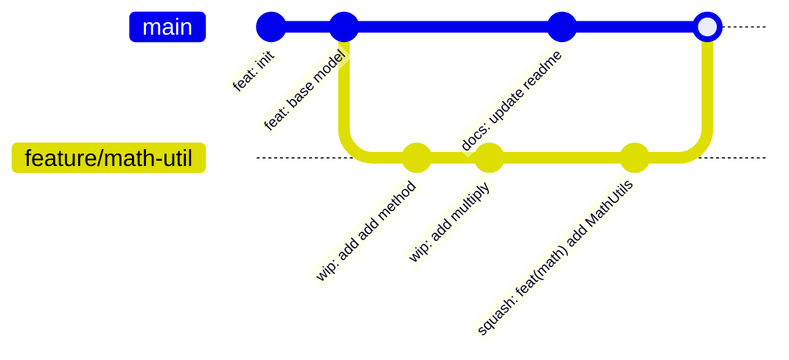

# Today's Objective

* **Today's Focus**: Rebase vs. Merge workflows, Git interactive rebase (`git rebase -i`), commit history squashing/refactoring, and modeling Git Directed Acyclic Graphs (DAG) using structural state diagrams.
* **Why Today's Work Matters**: Clean code history is as important as clean code architecture. A senior engineer knows when to merge (preserving true historical timeline branches) and when to rebase/squash (creating a clean, linear history for code reviews). You will learn how to rewrite local commit history before pushing to shared upstream branches.
* **How it Connects to Previous Lessons**: Yesterday, you learned Git DAG basics, snapshots, and basic merge conflict resolution. Today, you take full control of the Git commit graph using rebasing and squashing techniques.
* **How it Prepares You for Future Lessons**: This sets the foundation for collaborative engineering practices, pull request reviews, and tracking build configurations in Maven/Gradle (P00.M03.L02).
* **Estimated Study Duration**: 3 hours (out of 4 hours available).

---

# Warm-up (10–15 minutes)

Let's review Git DAG fundamentals, snapshots, and conflict markers from Day 1 of this lesson.

### Quick Recall Questions
1. How does Git's internal data model store file content compared to traditional delta-based version control systems?
2. What is the role of the `HEAD` pointer in a Git repository?
3. What are the three markers Git inserts into a file when a merge conflict occurs?
4. What is a Git branch in terms of memory and pointer references?
5. Why are small, atomic commits preferred over massive monolithic commits?

### Warm-up Coding Exercise
Write a Git command to show the commit log formatted cleanly as a single line per commit with a visual ASCII DAG branch graph (`git log`).

---

# Step 1 — Video Lectures

To understand Git rebase mechanics and history rewriting safely, watch this concise tutorial:

* **Title**: Git Merge vs. Git Rebase - What's the Difference?
* **Instructor**: Fireship / Coding with John
* **Platform**: YouTube
* **URL**: [https://www.youtube.com/watch?v=zOnwgx3Bq4E](https://www.youtube.com/watch?v=CRlGDDprdOQ)
* **Duration**: ~8 minutes
* **Recommended Playback Speed**: 1.0x
* **Focus Areas**:
  * Focus on how `git rebase` replays commits from one branch onto the tip of another branch, changing commit hashes.
  * Understand the "Golden Rule of Rebasing": Never rebase public shared branches!
* **Notes to Take**:
  * Define *Fast-forward Merge* vs. *3-way Merge* vs. *Rebase*.
  * State the Golden Rule of Rebasing.

---

# Step 2 — Reading

### Book Track
* **Title**: *Pro Git Book*
* **Author**: Scott Chacon and Ben Straub
* **URL**: [https://git-scm.com/book/en/v2](https://git-scm.com/book/en/v2)
* **Sections**:
  * Chapter 3: Section 3.6 ("Rebasing")
  * Chapter 7: Section 7.6 ("Git Tools - Rewriting History")
* **Reading Objective**: Comprehend how interactive rebasing (`git rebase -i`) works, how to squash multiple WIP (work-in-progress) commits into a single conventional commit, and why rebasing rewrites commit hashes.
* **Estimated Reading Time**: 30 minutes

---

# Step 3 — Coding Practice

### Exercise 1: Reimplementing Conflict Resolution (Medium)
* **Objective**: Reimplement yesterday's branching and merge conflict resolution from memory.
* **Difficulty**: Medium
* **Expected Outcome**: In `scratch/git-demo`, create a new branch `feature/logger`, make conflicting edits on a Java file against `main`, trigger a merge conflict, locate markers, resolve, compile with `javac`, and complete the merge commit entirely from memory.
* **Hints**: Do not look at yesterday's daily plan. Rely on manual conflict editing.
* **Common Mistakes**: Forgetting to compile the Java code *before* running `git commit` to verify the syntax of the resolved file.

### Exercise 2: Interactive Rebase & Commit Squashing (Medium)
* **Objective**: Refactor messy local commit history into a single clean conventional commit before merging.
* **Difficulty**: Medium
* **Expected Outcome**:
  1. In `scratch/git-demo`, create a branch `feature/math-util`: `git checkout -b feature/math-util`.
  2. Create `MathUtils.java`. Make three separate tiny commits:
     * Commit 1: `wip: create file`
     * Commit 2: `wip: add add method`
     * Commit 3: `wip: add multiply method`
  3. Run `git log --oneline` to see the 3 messy WIP commits.
  4. Perform an interactive rebase for the last 3 commits: `git rebase -i HEAD~3`.
  5. In the interactive rebase editor, keep `pick` for the first commit, and change `pick` to `squash` (or `s`) for the 2nd and 3rd commits. Save.
  6. Write a clean final commit message: `feat(math): add MathUtils with add and multiply operations`.
  7. Run `git log --oneline` to verify that the 3 WIP commits were combined into 1 clean conventional commit!
* **Hints**: `squash` combines a commit into the previous commit.
* **Common Mistakes**: Trying to rebase commits that have already been pushed to a remote shared repository.

---

# Step 4 — Hands-on Lab

No lab is scheduled today. (The hands-on lab for this lesson is scheduled for Day 3).

---

# Step 5 — Project Work

No project milestone is scheduled today. (The project connection is completed at the end of the module).

---

# Step 6 — UML / Design Exercise

### UML / Diagram Exercise: Git DAG Commit Graph
Draw a Mermaid gitGraph diagram visualizing a feature branch divergence, rebasing, and fast-forward merging.
* **Why it matters**: Visualizing commit graphs helps engineers understand where HEAD pointers, branch tags, and rebased commits exist in project history.
* **What should appear in the diagram**:
  1. Main branch with initial commits.
  2. Feature branch branching off main.
  3. Commits added to feature branch.
  4. The rebase/merge result combining feature back into main.

*You can write this diagram in Markdown using Mermaid syntax:*


---

# Step 7 — Engineering Insight

### The Rebase vs. Merge Trade-off
Why do senior engineering teams debate **Git Merge** vs. **Git Rebase**?
* **Git Merge**:
  * *Pros*: Preserves the true, complete chronological history of what happened and when. Leaves non-destructive branch histories intact.
  * *Cons*: Can create a messy "spider-web" DAG log with dozens of unnecessary merge commits (`Merge branch 'main' into...`).
* **Git Rebase**:
  * *Pros*: Creates a perfectly linear history graph (`main` looks like a straight line). Easy to read, bisect, and cherry-pick.
  * *Cons*: Rewrites commit SHA hashes. If executed on shared remote branches, it causes severe sync issues for teammates.

**Senior Rule**: Rebase local feature branches to keep history clean before opening a Pull Request; use Merge (or Squash & Merge) at the Pull Request boundary on shared branches.

---

# Step 8 — Open Source Connection

In **JUnit 5 & Spring Framework Repositories**:
* Contributors working on pull requests are asked to squash their local WIP commits using `git rebase -i` into a single logical commit before merging into `main`.
* This ensures that `git blame` on a line of code points to a single descriptive commit explaining *why* the change was made, rather than pointing to a commit named "fix typo" or "wip".

---

# Step 9 — End-of-Day Reflection

1. What is the main difference between `git merge` and `git rebase` in terms of commit history?
2. What is the Golden Rule of Git Rebasing?
3. How does `git rebase -i` allow you to clean up local WIP commits before submitting code for review?
4. What does the `squash` command do inside an interactive rebase buffer?
5. Why does running `git rebase` change the commit SHA-1/SHA-256 hashes of rebased commits?

---

# Step 10 — Notes Template

Append this template to `notes/P00.M03.L01.md`:

```markdown
# Notes: P00.M03.L01 - Git workflow and code history

## Key Concepts

## Important Definitions

## Things That Clicked Today

## Things I Still Don't Understand

## Mistakes I Made

## Real-world Connections

## Questions To Revisit
```

---

# Step 11 — Journal Template

Save a copy of this template to `journal/2026-07-28.md`:

```markdown
# Daily Journal: 2026-07-28

## What I accomplished today

## Biggest insight

## Biggest challenge

## Questions I still have

## Time spent

## Confidence (1–10)

## Plan for tomorrow
```

---

# Final Checklist

- [ ] Warm-up complete
- [ ] Git Merge vs Rebase video tutorial watched
- [ ] Pro Git Book reading completed (Section 3.6 & 7.6)
- [ ] Coding Exercise 1 (Conflict resolution recall from memory) completed
- [ ] Coding Exercise 2 (Interactive rebase and commit squashing) completed
- [ ] Mermaid gitGraph DAG diagram drawn
- [ ] Reflection questions answered
- [ ] Notes file (`notes/P00.M03.L01.md`) updated
- [ ] Journal file (`journal/2026-07-28.md`) created from template
- [ ] Git commit completed with designated message

---

### Recommended Git Commit Command:
```bash
git add .
git commit -m "study(P00.M03.L01): complete day 2"
```
