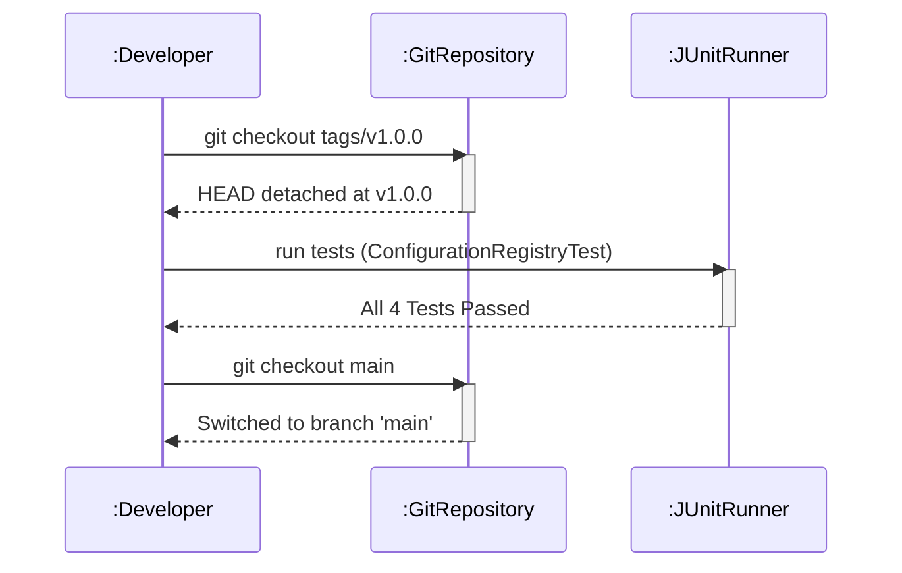

# Today's Objective

* **Today's Focus**: Implementing the Lesson 7 Lab (the **Versioned Configuration Registry & Tagged Release Lab**), debugging Detached HEAD states, creating annotated Git release tags (`git tag -a`), and modeling version control workflows with sequence diagrams.
* **Why Today's Work Matters**: Production software releases are tied to specific immutable points in Git history. You will build a Java configuration registry, write JUnit 5 tests, practice branch rebasing/merging, and tag your release with semantic versioning (`v1.0.0`), completing your version control mastery.
* **How it Connects to Previous Lessons**: Yesterday, you practiced interactive rebasing and commit squashing. Today, you will apply the full Git workflow—branching, atomic commits, rebasing, merging, and tagging—to a complete Java component.
* **How it Prepares You for Future Lessons**: This directly prepares you for Maven and Gradle build management (P00.M03.L02), where build tools use Git release tags to publish compiled artifacts.
* **Estimated Study Duration**: 3 hours (out of 4 hours available).

---

# Warm-up (10–15 minutes)

Let's review Git rebasing, squashing, and commit graphs from Day 2.

### Quick Recall Questions
1. What is the difference between `git merge` and `git rebase` in terms of commit history?
2. What is the "Golden Rule of Rebasing"?
3. What command do you use to start an interactive rebase for the last 3 commits?
4. In an interactive rebase buffer, what does the `squash` command do?
5. Why does rebasing rewrite commit hashes?

### Warm-up Coding Exercise
Write a Git command to list all tags in a repository, and a command to create an annotated tag named `v1.0.0` with the message `"Release version 1.0.0"`.

---

# Step 1 — Video Lectures

To understand Git tags, releases, and detached HEAD states, watch this tutorial:

* **Title**: Git Tags, Releases, and Detached HEAD State Explained
* **Instructor**: Coding with John / DevOps Directive
* **Platform**: YouTube
* **URL**: [https://www.youtube.com/watch?v=2sjqTHE0zok](https://www.youtube.com/watch?v=2sjqTHE0zok) (Focus on Tags and Detached HEAD)
* **Duration**: ~10 minutes
* **Recommended Playback Speed**: 1.0x
* **Focus Areas**:
  * Understand what happens when you check out a specific commit hash (`git checkout <hash>`), placing `HEAD` in a detached state.
  * Learn how annotated tags (`git tag -a`) create permanent release markers.
* **Notes to Take**:
  * Define *Detached HEAD State* and how to recover from it using `git checkout -b <new-branch>`.
  * Note the syntax for annotated tagging: `git tag -a v1.0 -m "release notes"`.

---

# Step 2 — Reading

### Book Track
* **Title**: *Pro Git Book*
* **Author**: Scott Chacon and Ben Straub
* **URL**: [https://git-scm.com/book/en/v2/Git-Basics-Tagging](https://git-scm.com/book/en/v2/Git-Basics-Tagging)
* **Section**: Chapter 2: Section 2.6 ("Git Basics - Tagging")
* **Reading Objective**: Learn the difference between lightweight tags (just a pointer to a commit) and annotated tags (full Git objects containing tagger name, email, date, message, and optional GPG signature).
* **Estimated Reading Time**: 20 minutes

---

# Step 3 — Coding Practice

### Exercise: Detached HEAD State Recovery (Medium)
* **Objective**: Intentionally enter a detached HEAD state, make a commit, and recover it cleanly to a new branch.
* **Difficulty**: Medium
* **Expected Outcome**:
  1. In `scratch/git-demo`, run `git log --oneline` and copy an older commit hash.
  2. Checkout that hash: `git checkout <hash>`. Read the "detached HEAD" warning message.
  3. Modify `VersionedEntity.java` to add a comment: `// Historical patch`.
  4. Commit it: `git commit -am "fix(historical): add historical patch"`. Observe that HEAD points to a new commit hash not attached to any branch.
  5. Recover the commit by creating a new branch at this position: `git checkout -b fix/historical-patch`.
  6. Switch back to `main` and merge the patch: `git checkout main` $\rightarrow$ `git merge fix/historical-patch`.
* **Hints**: Running `git checkout -b <branch>` inside a detached HEAD state captures the current commit into a new branch.
* **Common Mistakes**: Switching away from a detached HEAD state without creating a branch first, causing the detached commit to be orphaned and eventually garbage collected by `git gc`.

---

# Step 4 — Hands-on Lab

### Lab: Versioned Configuration Registry & Tagged Release

#### Problem Statement
Design a Java configuration registry `ConfigurationRegistry` under the package `handbook.phase00.p00m03l01`. The registry manages application setting key-value pairs (e.g. `timeout`, `max_connections`), providing input validation. Build a JUnit 5 test suite `ConfigurationRegistryTest`.

#### Mandatory Git Workflow Instructions for this Lab:
1. Create a feature branch: `git checkout -b feature/config-registry`.
2. Implement the Java class and commit: `git commit -m "feat(config): add ConfigurationRegistry core"`.
3. Implement the JUnit 5 test suite and commit: `git commit -m "test(config): add ConfigurationRegistryTest suite"`.
4. Rebase onto `main`, merge cleanly, and create an annotated release tag:
   ```bash
   git checkout main
   git merge feature/config-registry
   git tag -a v1.0.0-p00m03l01 -m "Release version 1.0.0 of Configuration Registry"
   ```

#### Starter Folder Structure
```text
src/main/java/handbook/phase00/p00m03l01/ConfigurationRegistry.java
src/test/java/handbook/phase00/p00m03l01/ConfigurationRegistryTest.java
docs/P00.M03.L01-diagram.md
```

#### Code Implementation Guidelines

##### ConfigurationRegistry.java
```java
package handbook.phase00.p00m03l01;
import java.util.HashMap;
import java.util.Map;

public class ConfigurationRegistry {
    private final Map<String, String> settings = new HashMap<>();

    public void set(String key, String value) {
        if (key == null || key.trim().isEmpty()) {
            throw new IllegalArgumentException("Configuration key cannot be null or empty.");
        }
        if (value == null) {
            throw new IllegalArgumentException("Configuration value cannot be null.");
        }
        settings.put(key.trim().toLowerCase(), value.trim());
    }

    public String get(String key) {
        if (key == null || key.trim().isEmpty()) {
            throw new IllegalArgumentException("Configuration key cannot be null or empty.");
        }
        return settings.get(key.trim().toLowerCase());
    }

    public boolean containsKey(String key) {
        if (key == null || key.trim().isEmpty()) return false;
        return settings.containsKey(key.trim().toLowerCase());
    }

    public int size() {
        return settings.size();
    }
}
```

##### ConfigurationRegistryTest.java
```java
package handbook.phase00.p00m03l01;

import org.junit.jupiter.api.BeforeEach;
import org.junit.jupiter.api.Test;
import static org.junit.jupiter.api.Assertions.*;

public class ConfigurationRegistryTest {

    private ConfigurationRegistry registry;

    @BeforeEach
    void setUp() {
        registry = new ConfigurationRegistry();
    }

    @Test
    void testSetAndGetConfiguration() {
        registry.set("timeout", "3000");
        assertEquals("3000", registry.get("timeout"));
    }

    @Test
    void testCaseInsensitiveKeys() {
        registry.set("MAX_CONNECTIONS", "50");
        assertEquals("50", registry.get("max_connections"));
    }

    @Test
    void testInvalidKeyThrowsException() {
        assertThrows(IllegalArgumentException.class, () -> registry.set("  ", "value"));
    }

    @Test
    void testNullValueThrowsException() {
        assertThrows(IllegalArgumentException.class, () -> registry.set("key", null));
    }
}
```

---

# Step 5 — Project Work

No project milestone is scheduled today. (The project connection is completed at the end of the module).

---

# Step 6 — UML / Design Exercise

### UML Sequence Diagram
Draw a sequence diagram depicting a developer checking out a tagged release, running tests against that tag, and releasing.
* **Why it matters**: Visualizing version control workflows clarifies how developers interact with Git tags during release cycles.
* **What should appear in the diagram**:
  1. Lifelines: `:Developer`, `:GitRepository`, and `:JUnitRunner`.
  2. Developer issuing `git checkout tags/v1.0.0`.
  3. `:GitRepository` setting `HEAD` to the tagged commit.
  4. Developer invoking `:JUnitRunner` to execute test suites.
  5. The test suite returning clean status.

*You can write this diagram in Markdown using Mermaid syntax:*


---

# Step 7 — Engineering Insight

### Semantic Versioning & Release Tagging
Professional software releases follow **Semantic Versioning** (`MAJOR.MINOR.PATCH`):
* **MAJOR** (e.g. `2.0.0`): Incompatible API breaking changes.
* **MINOR** (e.g. `1.1.0`): Backward-compatible new features.
* **PATCH** (e.g. `1.0.1`): Backward-compatible bug fixes.

Annotated Git tags (`git tag -a v1.0.0 -m "Release message"`) store this release metadata directly in the repository object database. Automated CI/CD pipelines listen for tag creation pushes (`git push origin --tags`) to compile, package, and deploy artifacts automatically to maven repositories or cloud clusters.

---

# Step 8 — Open Source Connection

In **JUnit 5 Repository (`junit-team/junit5`)**:
* Every official release (e.g. `r5.9.0`) is backed by an annotated Git release tag.
* When a tag is pushed, GitHub Actions triggers the Gradle release task, generating release JARs, publishing documentation to the website, and notifying the developer community.

---

# Step 9 — End-of-Day Reflection

1. What is a "Detached HEAD" state in Git? How do you safely create a branch from it?
2. What is the difference between a lightweight Git tag and an annotated Git tag?
3. What do the three numbers in Semantic Versioning (`MAJOR.MINOR.PATCH`) represent?
4. How do CI/CD systems use Git release tags to automate build deployments?
5. Why is it important to run your unit test suite before creating a Git release tag?

---

# Step 10 — Notes Template

Append this template to `notes/P00.M03.L01.md`:

```markdown
# Notes: P00.M03.L01 - Git workflow and code history

## Key Concepts

## Important Definitions

## Things That Clicked Today

## Things I Still Don't Understand

## Mistakes I Made

## Real-world Connections

## Questions To Revisit
```

---

# Step 11 — Journal Template

Save a copy of this template to `journal/2026-07-29.md`:

```markdown
# Daily Journal: 2026-07-29

## What I accomplished today

## Biggest insight

## Biggest challenge

## Questions I still have

## Time spent

## Confidence (1–10)

## Plan for tomorrow
```

---

# Final Checklist

- [ ] Warm-up complete
- [ ] Git Tags and Detached HEAD video tutorial watched
- [ ] Pro Git Book reading completed (Section 2.6 Tagging)
- [ ] Coding Exercise (Detached HEAD state recovery) completed
- [ ] Lab: Versioned Configuration Registry implemented
- [ ] Feature branch merged into main and annotated tag `v1.0.0-p00m03l01` created
- [ ] ConfigurationRegistryTest executed successfully
- [ ] UML Tag Execution Sequence diagram drawn (Mermaid or Paper)
- [ ] Reflection questions answered
- [ ] Notes file (`notes/P00.M03.L01.md`) updated and finalized
- [ ] Journal file (`journal/2026-07-29.md`) created from template
- [ ] Git commit completed with designated message

---

### Recommended Git Commit Command:
```bash
git add .
git commit -m "study(P00.M03.L01): complete day 3"
```
