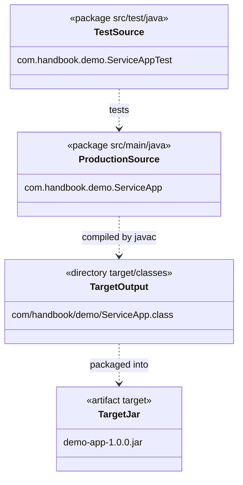

# Today's Objective

* **Today's Focus**: Maven build lifecycles (`clean`, `compile`, `test`, `package`, `install`), build plugin configurations (Compiler Plugin, Surefire Test Plugin), target output artifacts (`target/classes`, `target/test-classes`, `.jar`), and modeling project package structures using UML package diagrams.
* **Why Today's Work Matters**: Build tools do not just resolve libraries; they execute structured build lifecycles. A senior engineer understands how Maven compiles source files into `target/classes`, executes unit tests via the Surefire plugin, and packages classes into executable JAR files for deployment.
* **How it Connects to Previous Lessons**: Yesterday, you constructed the Standard Directory Layout and POM dependency scopes. Today, you will explore the execution phases that turn source code into compiled deployment packages.
* **How it Prepares You for Future Lessons**: This prepares you directly for package visibility and module boundaries (P00.M03.L03) and reading multi-module project structures in enterprise codebases (P00.M04).
* **Estimated Study Duration**: 3 hours (out of 4 hours available).

---

# Warm-up (10–15 minutes)

Let's review the Maven Standard Directory Layout and dependency scopes from Day 1 of this lesson.

### Quick Recall Questions
1. What are the four main directory roots in the Maven Standard Directory Layout?
2. What do the three POM GAV coordinates (`groupId`, `artifactId`, `version`) represent?
3. What is the difference between `<scope>compile</scope>` and `<scope>test</scope>` in Maven dependency configuration?
4. Why does Maven use "Convention over Configuration"?
5. What is a transitive dependency?

### Warm-up Coding Exercise
Write the XML `<dependency>` block for JUnit Jupiter API version `5.9.2` in `test` scope.

---

# Step 1 — Video Lectures

To understand Maven build lifecycles and plugin execution phases, watch this tutorial:

* **Title**: Maven Build Lifecycle & Plugins Explained - Compile, Test, Package
* **Instructor**: Amigoscode / Coding with John
* **Platform**: YouTube
* **URL**: [https://www.youtube.com/watch?v=vZm0lHciFsQ](https://www.youtube.com/watch?v=r062f6b4lq4) (Focus on Lifecycle & Plugins)
* **Duration**: ~12 minutes
* **Recommended Playback Speed**: 1.0x
* **Focus Areas**:
  * Focus on the **Default Build Lifecycle**: `validate` $\rightarrow$ `compile` $\rightarrow$ `test` $\rightarrow$ `package` $\rightarrow$ `verify` $\rightarrow$ `install` $\rightarrow$ `deploy`.
  * Understand the role of Maven plugins: `maven-compiler-plugin` and `maven-surefire-plugin` (test runner).
* **Notes to Take**:
  * List the sequential phases of the default Maven lifecycle.
  * Note which directory Maven uses to output compiled bytecode (`target/`).

---

# Step 2 — Reading

### Documentation Track
* **Title**: *Apache Maven - Introduction to the Build Lifecycle*
* **Publisher**: Apache Software Foundation (Official Documentation)
* **URL**: [https://maven.apache.org/guides/introduction/introduction-to-the-lifecycle.html](https://maven.apache.org/guides/introduction/introduction-to-the-lifecycle.html)
* **Reading Objective**: Comprehend the three built-in lifecycles (`default`, `clean`, `site`), how invoking a phase (e.g. `mvn package`) automatically runs all preceding phases, and how plugins bind to phases.
* **Estimated Reading Time**: 30 minutes

---

# Step 3 — Coding Practice

### Exercise 1: Reimplementing POM & Layout from Memory (Medium)
* **Objective**: Reconstruct the standard directory structure and POM configuration from memory.
* **Difficulty**: Medium
* **Expected Outcome**: In `scratch/maven-demo`, delete the `.xml` and folder contents. Recreate the directories (`src/main/java`, `src/test/java`, `src/main/resources`) and write the `pom.xml` with GAV coordinates and a JUnit dependency from memory.
* **Hints**: Do not look at yesterday's files. Focus on getting XML tags exact.
* **Common Mistakes**: Misspelling `<modelVersion>4.0.0</modelVersion>` or forgetting `<scope>test</scope>`.

### Exercise 2: Simulating Compiler & Packaging Plugin Behavior (Medium)
* **Objective**: Understand how build tools output artifacts into target directory trees.
* **Difficulty**: Medium
* **Expected Outcome**:
  1. Under `scratch/maven-demo/src/main/java/com/handbook/demo/`, create `ServiceApp.java`:
     ```java
     package com.handbook.demo;
     public class ServiceApp {
         public String getStatus() { return "OPERATIONAL"; }
     }
     ```
  2. Under `scratch/maven-demo/src/test/java/com/handbook/demo/`, create `ServiceAppTest.java`:
     ```java
     package com.handbook.demo;
     import org.junit.jupiter.api.Test;
     import static org.junit.jupiter.api.Assertions.*;
     public class ServiceAppTest {
         @Test void testStatus() {
             assertEquals("OPERATIONAL", new ServiceApp().getStatus());
         }
     }
     ```
  3. Simulate the Maven build lifecycle output manually by compiling production classes to `target/classes` and test classes to `target/test-classes`:
     ```bash
     mkdir -p scratch/maven-demo/target/classes scratch/maven-demo/target/test-classes
     javac -d scratch/maven-demo/target/classes scratch/maven-demo/src/main/java/com/handbook/demo/*.java
     ```
  4. Verify that `ServiceApp.class` exists under `target/classes/com/handbook/demo/`.
* **Hints**: The `-d` flag in `javac` specifies the target output directory, mirroring Maven's `compile` phase.
* **Common Mistakes**: Mixing compiled `.class` files back into `src/main/java` source directories instead of isolating them under `target/`.

---

# Step 4 — Hands-on Lab

No lab is scheduled today. (The hands-on lab for this lesson is scheduled for Day 3).

---

# Step 5 — Project Work

No project milestone is scheduled today. (The project connection is completed at the end of the module).

---

# Step 6 — UML / Design Exercise

### UML Package & Directory Structure Diagram
Draw a static UML package diagram modeling the Maven build output separation.
* **Why it matters**: A package diagram shows how source code directories map to output target directories and compiled artifacts.
* **What should appear in the diagram**:
  1. Package `src/main/java` containing `com.handbook.demo`.
  2. Package `src/test/java` containing test classes.
  3. Target build artifact output `target/classes` and `target/demo-app.jar`.
  4. Dependency arrows showing `src/test/java` depends on `src/main/java`, and build phases compiling sources into target outputs.

*You can write this diagram in Markdown using Mermaid syntax:*


---

# Step 7 — Engineering Insight

### The Default Build Lifecycle Phasing
Why is Maven's build lifecycle sequential?
* **Phase Sequentiality**: When you execute `mvn package`, Maven does not just package files. It executes all preceding phases in order:
  1. `validate`: Checks if project structure is correct.
  2. `compile`: Compiles `src/main/java` source code into `target/classes`.
  3. `test-compile`: Compiles `src/test/java` test code into `target/test-classes`.
  4. `test`: Runs unit tests using Surefire. **If any test fails, the build halts immediately!**
  5. `package`: Takes compiled classes and packages them into a `.jar` or `.war` under `target/`.
* **Protection Guarantee**: This build pipeline guarantees that broken code failing unit tests can **never** be packaged into a production release artifact.

---

# Step 8 — Open Source Connection

In **JUnit 5 & Spring Boot Repositories**:
* The builds are bound to strict Maven/Gradle plugins like `maven-surefire-plugin` (for unit tests), `maven-failsafe-plugin` (for integration tests), and `jacoco-maven-plugin` (for test coverage analysis).
* If test coverage drops below required thresholds during the `verify` phase, the build plugin breaks the build, enforcing quality standards automatically.

---

# Step 9 — End-of-Day Reflection

1. What happens when you run `mvn package`? Does it execute the `test` phase first?
2. What directory does Maven use for compiled bytecode output? Why is this directory excluded in `.gitignore`?
3. What is the role of the `maven-surefire-plugin` in a Maven build?
4. How does Maven prevent broken code from being packaged into a production JAR?
5. Why are package diagrams useful for visualizing project source and target output boundaries?

---

# Step 10 — Notes Template

Append this template to `notes/P00.M03.L02.md`:

```markdown
# Notes: P00.M03.L02 - Maven/Gradle project layout

## Key Concepts

## Important Definitions

## Things That Clicked Today

## Things I Still Don't Understand

## Mistakes I Made

## Real-world Connections

## Questions To Revisit
```

---

# Step 11 — Journal Template

Save a copy of this template to `journal/2026-07-31.md`:

```markdown
# Daily Journal: 2026-07-31

## What I accomplished today

## Biggest insight

## Biggest challenge

## Questions I still have

## Time spent

## Confidence (1–10)

## Plan for tomorrow
```

---

# Final Checklist

- [ ] Warm-up complete
- [ ] Maven Build Lifecycle video tutorial watched
- [ ] Apache Maven Build Lifecycle documentation read
- [ ] Coding Exercise 1 (POM and layout recall from memory) completed
- [ ] Coding Exercise 2 (Target output directory compilation simulation) completed
- [ ] Mermaid Package & Target Output diagram drawn
- [ ] Reflection questions answered
- [ ] Notes file (`notes/P00.M03.L02.md`) updated
- [ ] Journal file (`journal/2026-07-31.md`) created from template
- [ ] Git commit completed with designated message

---

### Recommended Git Commit Command:
```bash
git add .
git commit -m "study(P00.M03.L02): complete day 2"
```
