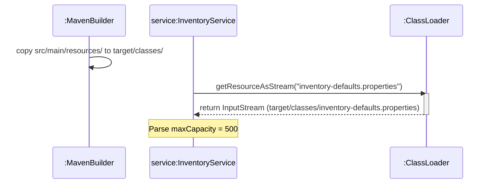

# Today's Objective

* **Today's Focus**: Implementing the Lesson 8 Lab (the **Standard Layout Inventory Component & Build Package Lab**), debugging classpath resource loading errors (`src/main/resources`), reading properties via `ClassLoader.getResourceAsStream()`, and modeling build execution flows with sequence diagrams.
* **Why Today's Work Matters**: Production applications must load configuration files, SQL scripts, and properties deterministically across operating systems. Hardcoding disk file paths breaks when code is packaged into a JAR. You will build an inventory component that loads properties from `src/main/resources` using the Java ClassLoader.
* **How it Connects to Previous Lessons**: Yesterday, you learned how build tools output compiled classes to `target/classes`. Today, you will see how build tools automatically copy `src/main/resources` into `target/classes` so your Java runtime can read them via the ClassLoader stream.
* **How it Prepares You for Future Lessons**: This sets the foundation for Java package boundaries and visibility modifiers (P00.M03.L03) and reading enterprise Spring Boot configuration loaders (P00.M04).
* **Estimated Study Duration**: 3 hours (out of 4 hours available).

---

# Warm-up (10–15 minutes)

Let's review Maven build lifecycles, target output directories, and plugin execution phases from Day 2.

### Quick Recall Questions
1. What happens when you run `mvn package`? List the preceding lifecycle phases that execute automatically.
2. In which output directory does Maven place compiled production `.class` files?
3. What is the role of the `maven-surefire-plugin` during the `test` phase?
4. Why does Maven halt the build if a single unit test fails during the `test` phase?
5. How does a UML package diagram visualize the relationship between source roots and target output artifacts?

### Warm-up Coding Exercise
Write the Java snippet to open an `InputStream` reading a resource file named `config.properties` from the classpath using `ClassLoader`.

---

# Step 1 — Video Lectures

To understand Classpath Resource Loading and how build tools package resource files, watch this tutorial:

* **Title**: Java Classpath Resources & Reading Files in Maven Projects
* **Instructor**: Coding with John / Baeldung
* **Platform**: YouTube
* **URL**: [https://www.youtube.com/watch?v=vZm0lHciFsQ](https://www.youtube.com/watch?v=R6w6xX9s4d4) (Focus on Classloader & Resources)
* **Duration**: ~10 minutes
* **Recommended Playback Speed**: 1.0x
* **Focus Areas**:
  * Understand why `src/main/resources` is copied directly to the root of `target/classes/`.
  * Learn how `getClass().getClassLoader().getResourceAsStream("filename")` reads files inside packaged JARs.
* **Notes to Take**:
  * Write down the difference between file paths (`File`) and classpath resources (`InputStream`).
  * Note why absolute file paths fail inside packaged JAR applications.

---

# Step 2 — Reading

### Blog Track
* **Title**: *Reading a File from the Resources Folder in Java*
* **Publisher**: Baeldung (High-quality Java guides)
* **URL**: [https://www.baeldung.com/reading-file-in-java](https://www.baeldung.com/reading-file-in-java)
* **Reading Objective**: Comprehend how the JVM ClassLoader resolves resource files, why `getResourceAsStream` returns `null` if the resource is missing, and how Maven resource filtering replaces variables during compilation.
* **Estimated Reading Time**: 20 minutes

---

# Step 3 — Coding Practice

### Exercise: Classpath Resource Loading (Medium)
* **Objective**: Load and parse a properties file from `src/main/resources` using ClassLoader.
* **Difficulty**: Medium
* **Expected Outcome**:
  1. Under `scratch/maven-demo/src/main/resources/`, create `app.properties`:
     ```properties
     app.name=InventoryService
     app.max_items=100
     ```
  2. Under `scratch/maven-demo/src/main/java/com/handbook/demo/`, create `AppConfig.java`:
     ```java
     package com.handbook.demo;
     import java.io.InputStream;
     import java.util.Properties;

     public class AppConfig {
         private final Properties props = new Properties();

         public void load() throws Exception {
             try (InputStream is = getClass().getClassLoader().getResourceAsStream("app.properties")) {
                 if (is == null) throw new IllegalStateException("app.properties not found on classpath!");
                 props.load(is);
             }
         }

         public String getAppName() { return props.getProperty("app.name"); }
     }
     ```
  3. Compile and verify that running `AppConfig` successfully loads `app.properties`.
* **Hints**: Always use try-with-resources when opening input streams from the ClassLoader.
* **Common Mistakes**: Hardcoding file system paths like `"C:\\workspace\\src\\main\\resources\\app.properties"`. This fails as soon as the app is packaged into a `.jar` file!

---

# Step 4 — Hands-on Lab

### Lab: Standard Layout Inventory Component & Build Package

#### Problem Statement
Design an inventory management component `InventoryService` and a JUnit 5 test suite `InventoryServiceTest` under the package `handbook.phase00.p00m03l02`. The service reads default stock capacity from a classpath resource file `inventory-defaults.properties` (placed under `src/main/resources`), manages item quantities with validation, and exposes a complete JUnit 5 test suite.

#### Requirements
1. **Directory Structure**:
   * Production Java: `src/main/java/handbook/phase00/p00m03l02/InventoryService.java`
   * Classpath Resource: `src/main/resources/inventory-defaults.properties`
   * Test Suite: `src/test/java/handbook/phase00/p00m03l02/InventoryServiceTest.java`
2. **Resource File Content**: `inventory-defaults.properties`
   ```properties
   default.max_capacity=500
   default.low_stock_threshold=10
   ```
3. **InventoryService Class**:
   * Reads and parses default properties on initialization using `ClassLoader.getResourceAsStream`.
   * `void addItem(String item, int quantity)`: Validates `quantity > 0` and total does not exceed `default.max_capacity`.
   * `int getQuantity(String item)`: Returns stock count.
4. **InventoryServiceTest Class**:
   * Verifies property loading from `src/main/resources`.
   * Verifies stock capacity limit exception throwing using `assertThrows`.

#### Starter Folder Structure
```text
src/main/java/handbook/phase00/p00m03l02/InventoryService.java
src/main/resources/inventory-defaults.properties
src/test/java/handbook/phase00/p00m03l02/InventoryServiceTest.java
docs/P00.M03.L02-diagram.md
```

#### Code Implementation Guidelines

##### inventory-defaults.properties
```properties
default.max_capacity=500
default.low_stock_threshold=10
```

##### InventoryService.java
```java
package handbook.phase00.p00m03l02;

import java.io.InputStream;
import java.util.HashMap;
import java.util.Map;
import java.util.Properties;

public class InventoryService {
    private final Map<String, Integer> stock = new HashMap<>();
    private int maxCapacity = 500; // fallback default

    public InventoryService() {
        loadDefaults();
    }

    private void loadDefaults() {
        try (InputStream is = getClass().getClassLoader().getResourceAsStream("inventory-defaults.properties")) {
            if (is != null) {
                Properties props = new Properties();
                props.load(is);
                this.maxCapacity = Integer.parseInt(props.getProperty("default.max_capacity", "500"));
            }
        } catch (Exception e) {
            System.err.println("Warning: Failed to load inventory-defaults.properties, using fallback limit.");
        }
    }

    public void addItem(String item, int quantity) {
        if (item == null || item.trim().isEmpty()) {
            throw new IllegalArgumentException("Item name required.");
        }
        if (quantity <= 0) {
            throw new IllegalArgumentException("Quantity must be positive.");
        }
        int currentTotal = stock.values().stream().mapToInt(Integer::intValue).sum();
        if (currentTotal + quantity > maxCapacity) {
            throw new IllegalArgumentException("Adding item exceeds maximum warehouse capacity of " + maxCapacity);
        }
        stock.put(item.trim().toLowerCase(), stock.getOrDefault(item.trim().toLowerCase(), 0) + quantity);
    }

    public int getQuantity(String item) {
        if (item == null) return 0;
        return stock.getOrDefault(item.trim().toLowerCase(), 0);
    }

    public int getMaxCapacity() {
        return maxCapacity;
    }
}
```

##### InventoryServiceTest.java
```java
package handbook.phase00.p00m03l02;

import org.junit.jupiter.api.BeforeEach;
import org.junit.jupiter.api.Test;
import static org.junit.jupiter.api.Assertions.*;

public class InventoryServiceTest {

    private InventoryService service;

    @BeforeEach
    void setUp() {
        service = new InventoryService();
    }

    @Test
    void testResourcePropertiesLoadedCorrectly() {
        // Verifies properties were loaded from src/main/resources/inventory-defaults.properties
        assertEquals(500, service.getMaxCapacity());
    }

    @Test
    void testAddAndGetItemQuantity() {
        service.addItem("Widget", 50);
        assertEquals(50, service.getQuantity("Widget"));
    }

    @Test
    void testExceedingCapacityThrowsException() {
        assertThrows(IllegalArgumentException.class, () -> service.addItem("HeavyBox", 600));
    }
}
```

---

# Step 5 — Project Work

No project milestone is scheduled today. (The project connection is completed at the end of the module).

---

# Step 6 — UML / Design Exercise

### UML Sequence Diagram
Draw a sequence diagram depicting Maven copying resources during build and Java ClassLoader reading them at runtime.
* **Why it matters**: A sequence diagram models how resource files travel from source directory to compiled target output and into runtime memory streams.
* **What should appear in the diagram**:
  1. Lifelines: `:MavenBuilder`, `:InventoryService`, and `:ClassLoader`.
  2. `:MavenBuilder` copying `src/main/resources/inventory-defaults.properties` to `target/classes/`.
  3. `:InventoryService` calling `getResourceAsStream("inventory-defaults.properties")` on `:ClassLoader`.
  4. `:ClassLoader` returning `InputStream` from `target/classes/`.
  5. `:InventoryService` parsing `maxCapacity = 500`.

*You can write this diagram in Markdown using Mermaid syntax:*


---

# Step 7 — Engineering Insight

### Classpath Resource Streams vs Filesystem Paths
Why must production Java code avoid using `java.io.File` with raw relative paths like `"src/main/resources/config.properties"`?
* **Development vs. Production**: During local development in an IDE, `src/main/resources` exists as a regular folder on your OS disk. But when you build your project using `mvn package`, Maven bundles all compiled `.class` files and resource files into a single compressed **JAR file** (`.jar`).
* **JAR File Reality**: Inside a ZIP/JAR file, individual files are no longer OS filesystem paths! Calling `new File("...")` will throw a `FileNotFoundException` in production.
* **Senior Solution**: Always use `ClassLoader.getResourceAsStream("...")`. The ClassLoader abstracts whether the resource lives inside an IDE folder or inside a compressed deployment JAR stream.

---

# Step 8 — Open Source Connection

In **Spring Boot Framework**:
* Spring's `ResourceLoader` interface and `@PropertySource` annotations use Java ClassLoader streams to load `application.properties` from `src/main/resources`.
* This allows Spring applications to read configuration seamlessly whether running in an IDE, inside a Docker container, or executed from an executable Uber-JAR.

---

# Step 9 — End-of-Day Reflection

1. Why does reading resources using `new File("src/main/resources/config.properties")` fail when the application is run from a packaged JAR file?
2. Where does Maven copy files from `src/main/resources` during the `compile` lifecycle phase?
3. How does `ClassLoader.getResourceAsStream("filename")` locate resource files at runtime?
4. What happens if `getResourceAsStream` cannot find the requested file on the classpath?
5. How does the UML sequence diagram model the transfer of resource files from build time to runtime memory?

---

# Step 10 — Notes Template

Append this template to `notes/P00.M03.L02.md`:

```markdown
# Notes: P00.M03.L02 - Maven/Gradle project layout

## Key Concepts

## Important Definitions

## Things That Clicked Today

## Things I Still Don't Understand

## Mistakes I Made

## Real-world Connections

## Questions To Revisit
```

---

# Step 11 — Journal Template

Save a copy of this template to `journal/2026-08-01.md`:

```markdown
# Daily Journal: 2026-08-01

## What I accomplished today

## Biggest insight

## Biggest challenge

## Questions I still have

## Time spent

## Confidence (1–10)

## Plan for tomorrow
```

---

# Final Checklist

- [ ] Warm-up complete
- [ ] Classpath Resource Loading video tutorial watched
- [ ] Baeldung Reading a File from Resources guide read
- [ ] Coding Exercise (AppConfig properties loading from ClassLoader) completed
- [ ] Lab: Standard Layout Inventory Component implemented
- [ ] Resource properties file created under `src/main/resources/inventory-defaults.properties`
- [ ] InventoryServiceTest executed successfully
- [ ] UML Resource Loading Sequence diagram drawn (Mermaid or Paper)
- [ ] Reflection questions answered
- [ ] Notes file (`notes/P00.M03.L02.md`) updated and finalized
- [ ] Journal file (`journal/2026-08-01.md`) created from template
- [ ] Git commit completed with designated message

---

### Recommended Git Commit Command:
```bash
git add .
git commit -m "study(P00.M03.L02): complete day 3"
```
