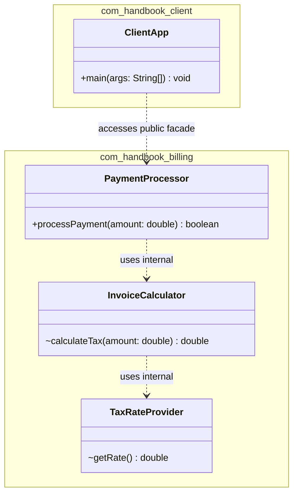

# Today's Objective

* **Today's Focus**: Package organization strategies (**Package-by-Feature** vs. **Package-by-Layer**), enforcing public vs. package-private boundaries in multi-package architectures, Java Naming Conventions, and modeling package encapsulates using UML package diagrams.
* **Why Today's Work Matters**: Software architecture is reflected in your package structure. A senior engineer structures packages around domain features rather than technical layers, keeping implementation details package-private so that feature teams can modify internal code without breaking external callers.
* **How it Connects to Previous Lessons**: Yesterday, you learned the 4 Java access modifiers (`public`, `protected`, package-private, `private`). Today, you apply those access levels to structure clean package boundaries.
* **How it Prepares You for Future Lessons**: This sets the foundation for high cohesion and low coupling in SOLID design principles (Phase 1) and microservice package modularity (Phase 15).
* **Estimated Study Duration**: 3 hours (out of 4 hours available).

---

# Warm-up (10–15 minutes)

Let's review Java access modifiers, package-private default scope, and public facades from Day 1 of this lesson.

### Quick Recall Questions
1. What is the default access modifier level in Java when no visibility keyword is written?
2. Which classes can access a package-private member or class?
3. Why is making every class `public` considered a major architectural flaw?
4. How does a Facade pattern use package-private visibility to protect internal subsystem classes?
5. Why are package names written in all-lowercase reverse domain names (e.g. `com.company.feature`)?

### Warm-up Coding Exercise
Write the class declaration for a package-private helper class `InternalCalculator` inside package `com.handbook.math`.

---

# Step 1 — Video Lectures

To understand Package-by-Feature vs. Package-by-Layer architectural organization, watch this tutorial:

* **Title**: Package Structure in Java - Package by Layer vs Package by Feature
* **Instructor**: Amigoscode / Coding with John
* **Platform**: YouTube
* **URL**: [https://www.youtube.com/watch?v=vZm0lHciFsQ](https://www.youtube.com/watch?v=1oW_W9O67pU)
* **Duration**: ~10 minutes
* **Recommended Playback Speed**: 1.0x
* **Focus Areas**:
  * Understand **Package by Layer** (`com.app.controllers`, `com.app.services`, `com.app.repositories`). Note why this forces classes to be `public`.
  * Understand **Package by Feature** (`com.app.order`, `com.app.payment`, `com.app.user`). Note how this enables package-private encapsulation within each feature!
* **Notes to Take**:
  * Diagram Package-by-Layer vs. Package-by-Feature trees.
  * Explain why Package-by-Feature maximizes package-private visibility.

---

# Step 2 — Reading

### Blog Track
* **Title**: *Package by Feature, Not by Layer*
* **Author**: Martin Fowler / Baeldung Architecture Guides
* **URL**: [https://www.baeldung.com/java-package-by-layer-v-by-feature](https://www.baeldung.com/java-package-by-layer-v-by-feature)
* **Reading Objective**: Comprehend why grouping related classes into feature packages allows internal helper services and repositories to remain package-private, preventing illegal cross-feature coupling.
* **Estimated Reading Time**: 30 minutes

---

# Step 3 — Coding Practice

### Exercise 1: Reimplementing Package-Private Facade from Memory (Medium)
* **Objective**: Reconstruct the SecurityService facade and package-private PasswordEncryptor from memory.
* **Difficulty**: Medium
* **Expected Outcome**: In `scratch/maven-demo`, recreate `com.handbook.security` containing public `SecurityService` and package-private `PasswordEncryptor`. Write a test in `com.handbook.client` verifying that calling `SecurityService` works, but instantiating `PasswordEncryptor` causes a compile error.
* **Hints**: Omit `public` from `PasswordEncryptor`.
* **Common Mistakes**: Accidentally adding `public` to `PasswordEncryptor`.

### Exercise 2: Refactoring Package-by-Layer to Package-by-Feature (Medium)
* **Objective**: Refactor an over-exposed layered package layout into an encapsulated feature package.
* **Difficulty**: Medium
* **Expected Outcome**:
  1. Create package `com.handbook.billing`.
  2. Move `PaymentProcessor` (public facade), `InvoiceCalculator` (package-private helper), and `TaxRateProvider` (package-private helper) into `com.handbook.billing`.
  3. Ensure `InvoiceCalculator` and `TaxRateProvider` have no `public` keyword.
  4. Write `PaymentProcessorTest` in `src/test/java/com/handbook/billing/PaymentProcessorTest.java`. Note that tests inside the *same* package can access package-private helpers directly for testing!
* **Hints**: Tests located in the same package name (`com.handbook.billing`) can access package-private methods.
* **Common Mistakes**: Putting unit tests in a different package name, which prevents them from inspecting package-private classes.

---

# Step 4 — Hands-on Lab

No lab is scheduled today. (The hands-on lab for this lesson is scheduled for Day 3).

---

# Step 5 — Project Work

No project milestone is scheduled today. (The project connection is completed at the end of the module).

---

# Step 6 — UML / Design Exercise

### UML Package Architecture Diagram
Draw a static UML package diagram comparing public facades vs. hidden package-private classes.
* **Why it matters**: A package diagram shows access boundaries and external dependency arrows.
* **What should appear in the diagram**:
  1. Package `com.handbook.billing` enclosing:
     * `+ PaymentProcessor` (public, marked with `+`).
     * `~ InvoiceCalculator` (package-private, marked with `~`).
     * `~ TaxRateProvider` (package-private, marked with `~`).
  2. Package `com.handbook.client` enclosing `+ ClientApp`.
  3. A dependency arrow pointing from `ClientApp` ONLY to `PaymentProcessor`.

*You can write this diagram in Markdown using Mermaid syntax:*


---

# Step 7 — Engineering Insight

### Package-by-Feature Enables Package-Private Encapsulation
Why do senior architects advocate for **Package-by-Feature**?
* **In Package-by-Layer**:
  `com.app.controllers.OrderController` must talk to `com.app.services.OrderService`, which must talk to `com.app.repositories.OrderRepository`. Because each class lives in a *different* package, `OrderService` and `OrderRepository` **MUST BE PUBLIC**! Anyone in the codebase can bypass `OrderService` and call `OrderRepository` directly.
* **In Package-by-Feature**:
  All order-related classes live inside `com.app.order`. `OrderFacade` is `public`, while `OrderService` and `OrderRepository` are **package-private (`~`)**. No other part of the application can touch the repository directly. Encapsulation is enforced by the Java compiler!

---

# Step 8 — Open Source Connection

In **JUnit 5 Jupiter Engine**:
* Packages like `org.junit.jupiter.engine.execution` group test execution logic by feature.
* Classes like `ExecutableInvoker` and `InvocationInterceptorChain` are package-private, preventing external extensions from coupling to JUnit's internal execution loops.

---

# Step 9 — End-of-Day Reflection

1. What is the difference between Package-by-Layer and Package-by-Feature project organization?
2. Why does Package-by-Layer force almost all classes to be declared `public`?
3. How does Package-by-Feature allow services and repositories to remain package-private?
4. In UML class/package diagrams, what symbols represent `public` (`+`), `private` (`-`), and `package-private` (`~`) visibility?
5. Why are unit tests placed in the same package name under `src/test/java` able to access package-private helper methods?

---

# Step 10 — Notes Template

Append this template to `notes/P00.M03.L03.md`:

```markdown
# Notes: P00.M03.L03 - Packages, modules, visibility, and naming

## Key Concepts

## Important Definitions

## Things That Clicked Today

## Things I Still Don't Understand

## Mistakes I Made

## Real-world Connections

## Questions To Revisit
```

---

# Step 11 — Journal Template

Save a copy of this template to `journal/2026-08-03.md`:

```markdown
# Daily Journal: 2026-08-03

## What I accomplished today

## Biggest insight

## Biggest challenge

## Questions I still have

## Time spent

## Confidence (1–10)

## Plan for tomorrow
```

---

# Final Checklist

- [ ] Warm-up complete
- [ ] Package by Layer vs Feature video tutorial watched
- [ ] Baeldung Package Architecture article read
- [ ] Coding Exercise 1 (SecurityService facade recall from memory) completed
- [ ] Coding Exercise 2 (Refactoring to Package-by-Feature) completed
- [ ] Mermaid Package Architecture diagram drawn
- [ ] Reflection questions answered
- [ ] Notes file (`notes/P00.M03.L03.md`) updated
- [ ] Journal file (`journal/2026-08-03.md`) created from template
- [ ] Git commit completed with designated message

---

### Recommended Git Commit Command:
```bash
git add .
git commit -m "study(P00.M03.L03): complete day 2"
```
