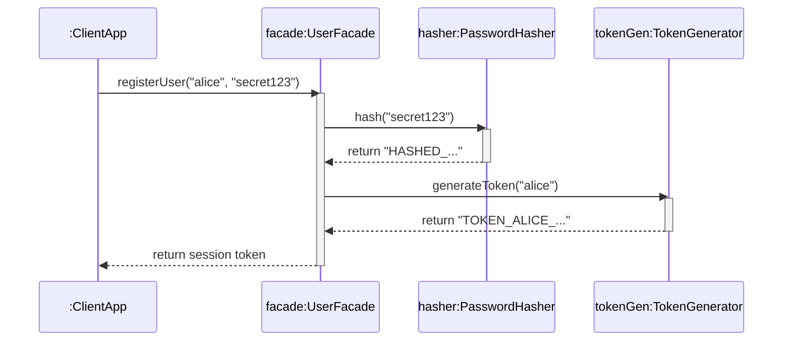

# Today's Objective

* **Today's Focus**: Implementing the Lesson 9 Lab (the **Encapsulated User Management Subsystem Lab**), debugging illegal package access compiler errors, minimizing public API surface area, and modeling package facades with UML sequence diagrams.
* **Why Today's Work Matters**: Software security and maintainability depend on strict visibility controls. You will build a user management subsystem that hides password hashing and token generation behind a clean public API facade, proving that package-private visibility prevents illegal cross-package access.
* **How it Connects to Previous Lessons**: Yesterday, you learned Package-by-Feature design. Today, you put that into practice by building a complete, encapsulated feature subsystem where internal collaborators are strictly package-private.
* **How it Prepares You for Future Lessons**: Completing this lesson finishes Lesson 9, preparing you directly for the upcoming **Module 00.03 Project** and Object-Oriented Principles in Phase 1.
* **Estimated Study Duration**: 3 hours (out of 4 hours available).

---

# Warm-up (10–15 minutes)

Let's review Package-by-Feature design, package-private default scope, and public facades from Day 2.

### Quick Recall Questions
1. Why does Package-by-Feature allow helper classes to remain package-private compared to Package-by-Layer?
2. What symbol represents package-private visibility in UML diagrams?
3. How do you declare a class as package-private in Java?
4. Why can unit tests in `src/test/java` access package-private classes if they share the same package name?
5. What is the role of a Facade pattern in package design?

### Warm-up Coding Exercise
Write the method header for a package-private method `String generateToken(String username)` inside package `com.handbook.auth`.

---

# Step 1 — Video Lectures

To understand Encapsulation and the Facade Pattern in Java package design, watch this tutorial:

* **Title**: Java Encapsulation & Facade Design Pattern Explained
* **Instructor**: Coding with John / Baeldung
* **Platform**: YouTube
* **URL**: [https://www.youtube.com/watch?v=vZm0lHciFsQ](https://www.youtube.com/watch?v=K4FkHVO5iac)
* **Duration**: ~10 minutes
* **Recommended Playback Speed**: 1.0x
* **Focus Areas**:
  * Focus on how a `public` Facade class delegates internal operations to package-private helper classes.
  * Learn why hiding internal complexity improves maintainability and API security.
* **Notes to Take**:
  * Define *Facade Pattern* and state how access modifiers enforce it.
  * Note Joshua Bloch's rule: *"Minimize the accessibility of classes and members."*

---

# Step 2 — Reading

### Blog Track
* **Title**: *Guide to the Facade Pattern in Java*
* **Publisher**: Baeldung (High-quality Java guides)
* **URL**: [https://www.baeldung.com/java-facade-pattern](https://www.baeldung.com/java-facade-pattern)
* **Reading Objective**: Comprehend how to design clean public facades that delegate work to package-private internal classes, minimizing public API surface area.
* **Estimated Reading Time**: 20 minutes

---

# Step 3 — Coding Practice

### Exercise: Debugging Illegal Access Compilation Errors (Medium)
* **Objective**: Fix an illegal access compiler error by wrapping internal classes inside a public facade.
* **Difficulty**: Medium
* **Expected Outcome**:
  1. Create package `com.handbook.internal` containing package-private `SecretKey.java`:
     ```java
     package com.handbook.internal;
     class SecretKey {
         String getKey() { return "SECRET-12345"; }
     }
     ```
  2. Create package `com.handbook.external` containing `AppClient.java`. Attempting to access `SecretKey` directly causes a compile error.
  3. Fix the design by creating `public class KeyProviderFacade` in `com.handbook.internal`:
     ```java
     package com.handbook.internal;
     public class KeyProviderFacade {
         private final SecretKey secretKey = new SecretKey();
         public String fetchToken() { return secretKey.getKey(); }
     }
     ```
  4. Verify that `AppClient` can now call `KeyProviderFacade.fetchToken()` cleanly.
* **Hints**: Never make `SecretKey` public to fix the error! Use the facade wrapper instead.
* **Common Mistakes**: Solving visibility compiler errors by blindly adding `public` to every class header.

---

# Step 4 — Hands-on Lab

### Lab: Encapsulated User Management Subsystem

#### Problem Statement
Design an encapsulated user registration subsystem under the package `handbook.phase00.p00m03l03`.
* Expose a single `public class UserFacade`.
* Create a package-private helper class `PasswordHasher` (no `public` modifier) that computes a simulated hash.
* Create a package-private helper class `TokenGenerator` (no `public` modifier) that generates a session token.
* Expose a JUnit 5 test suite `UserFacadeTest` under `src/test/java/handbook/phase00/p00m03l03/`.

#### Structural Requirements
1. `UserFacade` is `public` and exposes `String registerUser(String username, String password)`.
2. `PasswordHasher` (`~`) and `TokenGenerator` (`~`) are package-private.
3. `UserFacadeTest` verifies that `registerUser` succeeds and returns a valid session token.

#### Starter Folder Structure
```text
src/main/java/handbook/phase00/p00m03l03/UserFacade.java
src/main/java/handbook/phase00/p00m03l03/PasswordHasher.java
src/main/java/handbook/phase00/p00m03l03/TokenGenerator.java
src/test/java/handbook/phase00/p00m03l03/UserFacadeTest.java
docs/P00.M03.L03-diagram.md
```

#### Code Implementation Guidelines

##### PasswordHasher.java (Package-Private)
```java
package handbook.phase00.p00m03l03;

class PasswordHasher { // Package-Private Visibility!
    String hash(String rawPassword) {
        if (rawPassword == null || rawPassword.trim().isEmpty()) {
            throw new IllegalArgumentException("Password required.");
        }
        return "HASHED_" + Integer.toHexString(rawPassword.hashCode());
    }
}
```

##### TokenGenerator.java (Package-Private)
```java
package handbook.phase00.p00m03l03;

class TokenGenerator { // Package-Private Visibility!
    String generateToken(String username) {
        if (username == null || username.trim().isEmpty()) {
            throw new IllegalArgumentException("Username required.");
        }
        return "TOKEN_" + username.trim().toUpperCase() + "_" + System.currentTimeMillis();
    }
}
```

##### UserFacade.java (Public Facade)
```java
package handbook.phase00.p00m03l03;

public class UserFacade {
    private final PasswordHasher hasher = new PasswordHasher();
    private final TokenGenerator tokenGen = new TokenGenerator();

    public String registerUser(String username, String password) {
        if (username == null || username.trim().length() < 3) {
            throw new IllegalArgumentException("Username must be at least 3 characters.");
        }
        String hashedPassword = hasher.hash(password);
        System.out.println("User registered with hash: " + hashedPassword);
        return tokenGen.generateToken(username);
    }
}
```

##### UserFacadeTest.java
```java
package handbook.phase00.p00m03l03;

import org.junit.jupiter.api.BeforeEach;
import org.junit.jupiter.api.Test;
import static org.junit.jupiter.api.Assertions.*;

public class UserFacadeTest {

    private UserFacade facade;

    @BeforeEach
    void setUp() {
        facade = new UserFacade();
    }

    @Test
    void testUserRegistrationReturnsToken() {
        String token = facade.registerUser("alice", "secret123");
        assertNotNull(token);
        assertTrue(token.startsWith("TOKEN_ALICE_"));
    }

    @Test
    void testInvalidUsernameThrowsException() {
        assertThrows(IllegalArgumentException.class, () -> facade.registerUser("ab", "secret123"));
    }
}
```

---

# Step 5 — Project Work

No project milestone is scheduled today. (The project connection is completed at the end of the module).

---

# Step 6 — UML / Design Exercise

### UML Sequence Diagram
Draw a sequence diagram visualizing how `UserFacade` delegates internal operations to package-private helpers.
* **Why it matters**: A sequence diagram models internal delegation while showing that external clients interact only with the facade.
* **What should appear in the diagram**:
  1. Lifelines: `:ClientApp`, `facade:UserFacade`, `hasher:PasswordHasher`, and `tokenGen:TokenGenerator`.
  2. `:ClientApp` calling `registerUser("alice", "secret123")` on `facade`.
  3. `facade` delegating internally to `hasher.hash("secret123")`.
  4. `facade` delegating internally to `tokenGen.generateToken("alice")`.
  5. `facade` returning session token back to `:ClientApp`.

*You can write this diagram in Markdown using Mermaid syntax:*


---

# Step 7 — Engineering Insight

### Minimizing Public API Surface Area
Joshua Bloch's *Effective Java* Item 15 states: **"Minimize the accessibility of classes and members."**

* **Why?** Every `public` class or method you expose becomes part of your public API contract. Downstream clients will depend on it. If you want to change, refactor, or delete a public class later, it is a breaking change!
* **The Solution**: Make every class and member package-private (`~`) by default. Only promote a class to `public` (`+`) if it is explicitly intended as a public facade or entry point for external packages.

---

# Step 8 — Open Source Connection

In **Java Networking (`java.net.URL`)**:
* When you call `new URL("https://example.com").openStream()`, `URL` is the public facade.
* The actual protocol stream handler (`sun.net.www.protocol.https.HttpsURLConnectionImpl`) is internal and hidden, preventing external code from coupling to specific socket implementation details.

---

# Step 9 — End-of-Day Reflection

1. What is Joshua Bloch's rule regarding class accessibility in Java?
2. How does the Facade pattern help minimize public API surface area?
3. What happens if an external class in another package attempts to instantiate a package-private class?
4. How do sequence diagrams visualize internal delegation to package-private helper classes?
5. Why is it easier to refactor package-private classes than public classes over time?

---

# Step 10 — Notes Template

Append this template to `notes/P00.M03.L03.md`:

```markdown
# Notes: P00.M03.L03 - Packages, modules, visibility, and naming

## Key Concepts

## Important Definitions

## Things That Clicked Today

## Things I Still Don't Understand

## Mistakes I Made

## Real-world Connections

## Questions To Revisit
```

---

# Step 11 — Journal Template

Save a copy of this template to `journal/2026-08-04.md`:

```markdown
# Daily Journal: 2026-08-04

## What I accomplished today

## Biggest insight

## Biggest challenge

## Questions I still have

## Time spent

## Confidence (1–10)

## Plan for tomorrow
```

---

# Final Checklist

- [ ] Warm-up complete
- [ ] Facade Pattern & Encapsulation video tutorial watched
- [ ] Baeldung Facade Pattern guide read
- [ ] Coding Exercise (Debugging Illegal Access compiler errors) completed
- [ ] Lab: Encapsulated User Management Subsystem implemented
- [ ] `UserFacadeTest` executed successfully
- [ ] UML Facade Sequence diagram drawn (Mermaid or Paper)
- [ ] Reflection questions answered
- [ ] Notes file (`notes/P00.M03.L03.md`) updated and finalized
- [ ] Journal file (`journal/2026-08-04.md`) created from template
- [ ] Git commit completed with designated message

---

### Recommended Git Commit Command:
```bash
git add .
git commit -m "study(P00.M03.L03): complete day 3"
```
