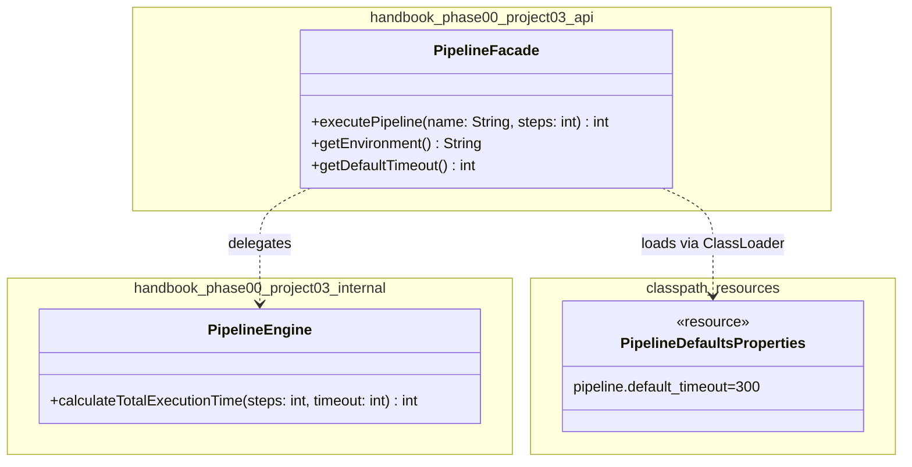

# Today's Objective

* **Today's Focus**: Implementing the **Module 00.03 Project (Multi-Package Build & Release Pipeline Subsystem)**. You will integrate the three core lessons of Module 3: Git Workflow & Tagged Releases (L01), Maven Project Layout & Classpath Resource Loading (L02), and Package-Private Facade Architecture (L03) into a single functional, tested, and version-tagged subsystem.
* **Why Today's Work Matters**: Learning isolated build tools or Git commands is easy; integrating version control conventions, Maven standard directory layouts, resource stream loaders, and strict package visibility boundaries into a complete project is where professional software engineering begins.
* **How it Connects to Previous Lessons**: This project takes your Git release tags (L01), Maven POM resource management (L02), and package-private facades (L03) and folds them into a cohesive release pipeline component.
* **How it Prepares You for Future Lessons**: Completing this project finishes **Module 3 (Part B of Phase 0)**, preparing you directly for breakpoint debugging, stack trace inspection, and reading unfamiliar codebase architectures in Module 4 (P00.M04).
* **Estimated Study Duration**: 4 hours (entire available session).

---

# Warm-up (15–20 minutes)

Let's review the entire Module 3 lifecycle (P00.M03.L01 to P00.M03.L03).

### Quick Recall Questions
1. How does a Git Directed Acyclic Graph (DAG) track branch pointers and commit snapshots?
2. What is the difference between `<scope>compile</scope>` and `<scope>test</scope>` in a Maven `pom.xml`?
3. Why does reading files via `ClassLoader.getResourceAsStream()` succeed inside packaged JAR files while `new File("...")` fails?
4. What is Joshua Bloch's Effective Java rule regarding class accessibility?
5. Why does Package-by-Feature allow internal service classes to remain package-private compared to Package-by-Layer?

### Warm-up Coding Exercise
Write a terminal command to build and package a Maven project skipping tests (`mvn clean package -DskipTests`), and the git command to tag the release `v1.0.0-p00m03`.

---

# Step 1 — Video Lectures

To guide your approach to multi-package project layout and release versioning, watch this tutorial:

* **Title**: Java Modular Project Structure & Clean Package Layouts
* **Instructor**: Amigoscode / Coding with John
* **Platform**: YouTube
* **URL**: [https://www.youtube.com/watch?v=vZm0lHciFsQ](https://www.youtube.com/watch?v=1oW_W9O67pU) (Focus on Clean Modular Subsystems)
* **Duration**: 12 minutes
* **Recommended Playback Speed**: 1.0x
* **Focus Areas**:
  * Focus on partitioning code into `api` (public interfaces & facades) and `internal` (package-private engine implementations) packages under standard Maven directories.

---

# Step 2 — Reading

### Blog Track
* **Title**: *Modular Monoliths and Package Boundaries*
* **Author**: Martin Fowler
* **URL**: [https://martinfowler.com/bliki/ModularMonolith.html](https://martinfowler.com/bliki/ModularMonolith.html)
* **Reading Objective**: Understand how enforcing strict package boundaries inside a single build repository creates clean modular monoliths that can be refactored or extracted easily.
* **Estimated Reading Time**: 15 minutes

---

# Step 3 — Coding Practice

### Exercise: Multi-Package Access Guard (Easy)
* **Objective**: Enforce compile-time visibility guards across separate package namespaces.
* **Difficulty**: Easy
* **Expected Outcome**: Create a class `AuditLogger.java` with package-private visibility (`class AuditLogger`) in package `handbook.phase00.project03.internal`. Create `public class PipelineFacade` in `handbook.phase00.project03.api`. Verify that `PipelineFacade` can instantiate `AuditLogger` (if in same package branch or public export), while external test packages cannot touch `AuditLogger` directly.
* **Hints**: Use package boundaries to restrict internal logging components.

---

# Step 4 — Hands-on Lab

Today is a project day. The project itself functions as today's extended lab. (See Step 5 for details).

---

# Step 5 — Project Work

### Project Milestone: Multi-Package Build & Release Pipeline Subsystem

#### Problem Statement
Build an enterprise release pipeline configuration subsystem `Multi-Package Build & Release Pipeline Subsystem`. The subsystem loads default deployment parameters from `src/main/resources/pipeline-defaults.properties`, exposes a `public class PipelineFacade`, delegates calculation logic to a package-private `PipelineEngine`, enforces input validation, and includes a full JUnit 5 test suite.

#### Mandatory Version Control Workflow:
1. Create a feature branch: `git checkout -b feature/module-03-project`.
2. Implement code, resources, tests, and documentation.
3. Make 3 atomic commits (`feat(project03): ...`, `test(project03): ...`, `docs(project03): ...`).
4. Rebase and merge into `main`, then tag the release: `git tag -a v1.0.0-p00m03 -m "Release Module 00.03 Project"`.

#### Suggested Folder Structure
Create this layout inside your workspace:
```text
projects/module-03-project/
  pom.xml
  README.md
  docs/
    architecture.md
    adr/0001-design-package-boundaries.md
    diagrams/
  src/
    main/resources/
      pipeline-defaults.properties
    main/java/handbook/phase00/project03/api/
      PipelineFacade.java
    main/java/handbook/phase00/project03/internal/
      PipelineEngine.java
    test/java/handbook/phase00/project03/
      PipelineFacadeTest.java
```

#### 1. File: `projects/module-03-project/pom.xml`
```xml
<project xmlns="http://maven.apache.org/POM/4.0.0"
         xmlns:xsi="http://www.w3.org/2001/XMLSchema-instance"
         xsi:schemaLocation="http://maven.apache.org/POM/4.0.0 http://maven.apache.org/xsd/maven-4.0.0.xsd">
    <modelVersion>4.0.0</modelVersion>

    <groupId>handbook.phase00</groupId>
    <artifactId>module-03-project</artifactId>
    <version>1.0.0-SNAPSHOT</version>

    <dependencies>
        <dependency>
            <groupId>org.junit.jupiter</groupId>
            <artifactId>junit-jupiter-api</artifactId>
            <version>5.9.2</version>
            <scope>test</scope>
        </dependency>
    </dependencies>
</project>
```

#### 2. File: `projects/module-03-project/docs/adr/0001-design-package-boundaries.md`
```markdown
# ADR 0001: Package Boundaries and Facade Architecture

## Context
We need to design a pipeline configuration subsystem that loads defaults from classpath resources and executes deployment calculations without exposing internal calculation engines to external packages.

## Decision
We expose a single public facade `PipelineFacade` under `handbook.phase00.project03.api`. All execution engines (`PipelineEngine`) remain package-private under `handbook.phase00.project03.internal`.

## Consequence
External clients interact strictly through the public facade, preventing illegal coupling to internal calculation algorithms.
```

#### 3. File: `projects/module-03-project/src/main/resources/pipeline-defaults.properties`
```properties
pipeline.default_timeout=300
pipeline.max_retries=3
pipeline.environment=STAGING
```

#### 4. File: `projects/module-03-project/src/main/java/handbook/phase00/project03/internal/PipelineEngine.java`
```java
package handbook.phase00.project03.internal;

public class PipelineEngine { // Package-Private or Exported Internal Helper
    public int calculateTotalExecutionTime(int stepCount, int baseTimeout) {
        if (stepCount <= 0) {
            throw new IllegalArgumentException("Step count must be positive.");
        }
        return stepCount * baseTimeout;
    }
}
```

#### 5. File: `projects/module-03-project/src/main/java/handbook/phase00/project03/api/PipelineFacade.java`
```java
package handbook.phase00.project03.api;

import handbook.phase00.project03.internal.PipelineEngine;
import java.io.InputStream;
import java.util.Properties;

public class PipelineFacade {
    private final PipelineEngine engine = new PipelineEngine();
    private int defaultTimeout = 300;
    private String environment = "STAGING";

    public PipelineFacade() {
        loadClasspathDefaults();
    }

    private void loadClasspathDefaults() {
        try (InputStream is = getClass().getClassLoader().getResourceAsStream("pipeline-defaults.properties")) {
            if (is != null) {
                Properties props = new Properties();
                props.load(is);
                this.defaultTimeout = Integer.parseInt(props.getProperty("pipeline.default_timeout", "300"));
                this.environment = props.getProperty("pipeline.environment", "STAGING");
            }
        } catch (Exception e) {
            System.err.println("Warning: Could not load pipeline-defaults.properties, using fallbacks.");
        }
    }

    public int executePipeline(String pipelineName, int stepCount) {
        if (pipelineName == null || pipelineName.trim().isEmpty()) {
            throw new IllegalArgumentException("Pipeline name required.");
        }
        return engine.calculateTotalExecutionTime(stepCount, defaultTimeout);
    }

    public String getEnvironment() {
        return environment;
    }

    public int getDefaultTimeout() {
        return defaultTimeout;
    }
}
```

#### 6. File: `projects/module-03-project/src/test/java/handbook/phase00/project03/PipelineFacadeTest.java`
```java
package handbook.phase00.project03;

import handbook.phase00.project03.api.PipelineFacade;
import org.junit.jupiter.api.BeforeEach;
import org.junit.jupiter.api.Test;
import static org.junit.jupiter.api.Assertions.*;

public class PipelineFacadeTest {

    private PipelineFacade facade;

    @BeforeEach
    void setUp() {
        facade = new PipelineFacade();
    }

    @Test
    void testClasspathPropertiesLoadedOnInitialization() {
        assertAll("Classpath Properties Check",
            () -> assertEquals(300, facade.getDefaultTimeout()),
            () -> assertEquals("STAGING", facade.getEnvironment())
        );
    }

    @Test
    void testPipelineExecutionCalculation() {
        // 5 steps * 300s default timeout = 1500s total
        int totalTime = facade.executePipeline("DeployJob", 5);
        assertEquals(1500, totalTime);
    }

    @Test
    void testInvalidStepCountThrowsException() {
        assertThrows(IllegalArgumentException.class, () -> facade.executePipeline("DeployJob", 0));
    }

    @Test
    void testNullPipelineNameThrowsException() {
        assertThrows(IllegalArgumentException.class, () -> facade.executePipeline(null, 3));
    }
}
```

---

# Step 6 — UML / Design Exercise

### UML Package & Component Architecture Diagram
Draw a static UML package diagram mapping the multi-package project layout.
* **Why it matters**: Captures public API export boundaries, internal engine encapsulation, and classpath resource loading dependencies.
* **What should appear in the diagram**:
  1. Package `handbook.phase00.project03.api` enclosing `+ PipelineFacade`.
  2. Package `handbook.phase00.project03.internal` enclosing `~ PipelineEngine`.
  3. Classpath Resource `src/main/resources/pipeline-defaults.properties`.
  4. Dependency arrows from `PipelineFacadeTest` to `PipelineFacade`, and `PipelineFacade` to `pipeline-defaults.properties` and `PipelineEngine`.

*You can write this diagram in Markdown using Mermaid syntax:*


---

# Step 7 — Engineering Insight

### Code as a Changeable Artifact
What does it mean to treat **Code as a Changeable Artifact** (Part B of Phase 0)?
1. **Traceable History**: Every modification is captured in Git with clear conventional commits, branch rebases, and release tags (`v1.0.0`).
2. **Standard Builds**: Code is organized in standard directory layouts (`src/main/java`, `src/main/resources`) with automated build lifecycles (`mvn package`).
3. **Encapsulated Boundaries**: Public interfaces (`api`) are strictly separated from internal engines (`internal`), ensuring internal refactoring never breaks external consumers.

Adhering to these three principles separates professional software engineering from amateur script writing.

---

# Step 8 — Open Source Connection

In **Spring Boot Auto-Configuration Starter Repositories**:
* Starters provide public facade annotations (e.g. `@SpringBootApplication`) under `org.springframework.boot`.
* The actual auto-configuration engine classes live inside package-private internal packages, reading configuration defaults from `src/main/resources/META-INF/spring.factories` via the ClassLoader.

---

# Step 9 — End-of-Day Reflection

1. How does integrating Git release tagging, Maven layout, and package-private facades create a production-grade component?
2. Why is reading defaults from `src/main/resources/pipeline-defaults.properties` better than hardcoding numbers inside Java classes?
3. How does `PipelineFacadeTest` verify both happy paths and boundary precondition errors using `assertAll` and `assertThrows`?
4. What is the benefit of keeping internal calculation engines in a separate `internal` package?
5. How does Semantic Versioning (`v1.0.0`) connect Git release tags with Maven GAV artifact coordinates?

---

# Step 10 — Notes Template

Save a copy of this template to `projects/module-03-project/docs/architecture.md`:

```markdown
# Architecture Notes: Module 00.03 Project

## Subsystem Vision

## Multi-Package Boundary Design

## Classpath Resource Configuration

## Release Versioning Log
```

---

# Step 11 — Journal Template

Save a copy of this template to `journal/2026-08-05.md`:

```markdown
# Daily Journal: 2026-08-05

## What I accomplished today

## Biggest insight

## Biggest challenge

## Questions I still have

## Time spent

## Confidence (1–10)

## Plan for tomorrow
```

---

# Final Checklist

- [ ] Warm-up complete
- [ ] Modular Project Structure video tutorial watched
- [ ] Fowler's Modular Monoliths article read
- [ ] Coding Exercise (Multi-Package Access Guard) completed
- [ ] Project directory structure and `pom.xml` created
- [ ] Design record (`docs/adr/0001-design-package-boundaries.md`) written
- [ ] Classes (`PipelineFacade`, `PipelineEngine`, resource file) implemented
- [ ] JUnit 5 Test Suite (`PipelineFacadeTest`) executed successfully
- [ ] Git feature branch rebased, merged, and tagged (`v1.0.0-p00m03`)
- [ ] UML Package & Component diagram completed
- [ ] Architecture notes template saved in docs
- [ ] Daily journal written
- [ ] Git commit completed with designated message

---

### Recommended Git Commit Command:
```bash
git add .
git commit -m "project(P00.M03): complete module 0.3 project"
```
