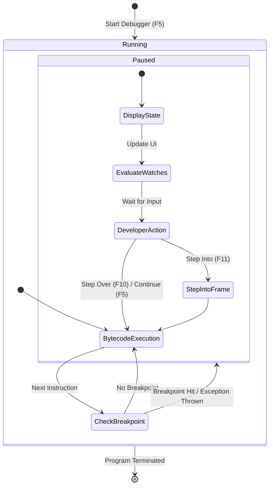

# Today's Objective

* **Today's Focus**: Advanced Debugging Techniques: **Exception Breakpoints** (pause on uncaught exceptions), **Field Watchpoints** (pause when a field is mutated), **Hit Count Breakpoints**, navigating Call Stack frames, and modeling debugger execution state machines using UML Activity Diagrams.
* **Why Today's Work Matters**: Bugs often manifest deep inside nested method calls or state mutations. A senior engineer uses Exception Breakpoints to halt execution automatically at the exact line where an exception is thrown, and Field Watchpoints to catch sneaky state mutations across complex object graphs.
* **How it Connects to Previous Lessons**: Yesterday, you learned basic line breakpoints, stepping (`F10`/`F11`), and conditional breakpoints. Today, you master advanced watchpoints and call stack navigation.
* **How it Prepares You for Future Lessons**: Prepares you directly for reading unfamiliar Java codebases (P00.M04.L02) and debugging complex design katas (P00.M04.L03).
* **Estimated Study Duration**: 3 hours (out of 4 hours available).

---

# Warm-up (10–15 minutes)

Let's review stepping controls, conditional breakpoints, and watch expressions from Day 1 of this lesson.

### Quick Recall Questions
1. What is the difference between Step Over (`F10`) and Step Into (`F11`)?
2. How does a Conditional Breakpoint differ from a standard Line Breakpoint?
3. Why are Watch Expressions useful during a live debugging session?
4. What information is displayed in the IDE's CALL STACK panel when execution pauses?
5. Why is interactive debugging preferred over adding `System.out.println()` statements?

### Warm-up Coding Exercise
Write the condition expression for a conditional breakpoint that pauses execution only when an object `User user` has `user.getRole().equals("ADMIN")`.

---

# Step 1 — Video Lectures

To understand advanced debugging tools like Exception Breakpoints and Field Watchpoints, watch this tutorial:

* **Title**: Advanced Java Debugging - Exception Breakpoints & Field Watchpoints
* **Instructor**: IntelliJ IDEA / Coding with John
* **Platform**: YouTube
* **URL**: [https://www.youtube.com/watch?v=vZm0lHciFsQ](https://www.youtube.com/watch?v=1oW_W9O67pU) (Focus on Exception Breakpoints & Watchpoints)
* **Duration**: ~12 minutes
* **Recommended Playback Speed**: 1.0x
* **Focus Areas**:
  * Understand **Exception Breakpoints**: Configure the debugger to automatically break whenever a `NullPointerException` or `IllegalArgumentException` is thrown anywhere in the JVM.
  * Understand **Field Watchpoints**: Set a watchpoint on a class field to pause execution whenever that variable is read or modified.
* **Notes to Take**:
  * Define *Exception Breakpoint* and state when to use uncaught vs. caught exceptions.
  * Define *Field Watchpoint* and explain how it tracks variable mutations.

---

# Step 2 — Reading

### Documentation Track
* **Title**: *Baeldung - Advanced Java Debugging Tips & Tricks*
* **Publisher**: Baeldung (High-quality Java guides)
* **URL**: [https://www.baeldung.com/java-debugging-tips](https://www.baeldung.com/java-debugging-tips)
* **Reading Objective**: Learn how to use Exception Breakpoints, Hit Count Breakpoints (pause on the 100th execution), and inspect frame variables at higher levels in the call stack.
* **Estimated Reading Time**: 30 minutes

---

# Step 3 — Coding Practice

### Exercise 1: Reimplementing Conditional Breakpoints from Memory (Medium)
* **Objective**: Reimplement yesterday's transaction conditional breakpoint and watch expression setup from memory.
* **Difficulty**: Medium
* **Expected Outcome**: In `scratch/`, recreate `TransactionDebugger.java` with 7 transaction values. Set a conditional breakpoint for `tx > 500.0` and a watch for `balance + tx`. Run debugger (`F5`) and verify execution pauses twice.
* **Hints**: Do not look at yesterday's daily plan. Focus on setting breakpoint expressions in your IDE.
* **Common Mistakes**: Forgetting to type the condition in the breakpoint settings menu.

### Exercise 2: Catching Hidden Field Mutations with Watchpoints (Medium)
* **Objective**: Use Field Watchpoints to identify which method mutated a class field unexpectedly.
* **Difficulty**: Medium
* **Expected Outcome**:
  1. Create `OrderStateDebug.java`:
     ```java
     public class OrderStateDebug {
         private String status = "PENDING";

         public void step1() { /* internal logic */ }
         public void step2() { status = "CORRUPTED"; } // Sneaky mutation!
         public void step3() { /* internal logic */ }

         public static void main(String[] args) {
             OrderStateDebug order = new OrderStateDebug();
             order.step1();
             order.step2();
             order.step3();
             System.out.println("Final Status: " + order.status);
         }
     }
     ```
  2. Set a **Field Watchpoint** on `private String status` by clicking the breakpoint gutter next to the field declaration.
  3. Configure the watchpoint to trigger on **Modification**.
  4. Run Debugger (`F5`). Observe how execution automatically pauses inside `step2()` the exact instant `status` is reassigned!
* **Hints**: Field watchpoints monitor field access/modification across all methods in a class.
* **Common Mistakes**: Putting a line breakpoint inside `step1()` instead of setting a field watchpoint directly on the field.

---

# Step 4 — Hands-on Lab

No lab is scheduled today. (The hands-on lab for this lesson is scheduled for Day 3).

---

# Step 5 — Project Work

No project milestone is scheduled today. (The project connection is completed at the end of the module).

---

# Step 6 — UML / Design Exercise

### UML Activity Diagram: Debugger Execution State Machine
Draw a static UML Activity Diagram modeling the lifecycle of a debugging session.
* **Why it matters**: An activity diagram captures the decision nodes, breakpoint checks, and stepping choices made by the JVM and developer during debugging.
* **What should appear in the diagram**:
  1. Initial state $\rightarrow$ Start Debugging (`F5`).
  2. Action: Execute JVM Bytecode.
  3. Decision Node: Hit Breakpoint / Exception / Watchpoint?
     * If Yes: Pause Execution $\rightarrow$ Display Variables & Call Stack $\rightarrow$ Developer Action (Step Over / Step Into / Continue).
     * If No: Continue Execution.
  4. Final state $\rightarrow$ Program Completion.

*You can write this diagram in Markdown using Mermaid syntax:*


---

# Step 7 — Engineering Insight

### Field Watchpoints & Exception Breakpoints
Why are Exception Breakpoints and Field Watchpoints essential for large codebases?

1. **Field Watchpoints**: In complex domain entities with 20+ methods, finding which method modified a private field to an invalid state by setting line breakpoints everywhere is tedious. A Field Watchpoint targets the memory location directly, pausing the JVM the millisecond any method mutates that field.
2. **Exception Breakpoints**: When an unexpected `NullPointerException` or `ClassCastException` is thrown deep inside a third-party library, setting a line breakpoint is impossible (no source code access). An Exception Breakpoint tells the JVM: *"Pause execution immediately whenever this exception type is instantiated anywhere."* This brings you directly to the offending stack frame.

---

# Step 8 — Open Source Connection

In **JUnit 5 Engine & Spring Framework Development**:
* Framework developers set Exception Breakpoints for `AssertionError` or `BeanCreationException` when testing framework startup loops.
* This allows developers to inspect the exact bean initialization call stack without needing line breakpoints across hundreds of framework classes.

---

# Step 9 — End-of-Day Reflection

1. How does a Field Watchpoint help locate unexpected field mutations across multiple methods?
2. What is an Exception Breakpoint, and why is it useful when debugging third-party libraries without source code?
3. What happens to the CALL STACK panel when you select a higher frame (e.g. caller method) while paused at a breakpoint?
4. How does a Hit Count Breakpoint differ from a standard Line Breakpoint?
5. How does the UML Activity Diagram model the debugger's decision loop between bytecode execution and paused states?

---

# Step 10 — Notes Template

Append this template to `notes/P00.M04.L01.md`:

```markdown
# Notes: P00.M04.L01 - Debugging with breakpoints and watches

## Key Concepts

## Important Definitions

## Things That Clicked Today

## Things I Still Don't Understand

## Mistakes I Made

## Real-world Connections

## Questions To Revisit
```

---

# Step 11 — Journal Template

Save a copy of this template to `journal/2026-08-07.md`:

```markdown
# Daily Journal: 2026-08-07

## What I accomplished today

## Biggest insight

## Biggest challenge

## Questions I still have

## Time spent

## Confidence (1–10)

## Plan for tomorrow
```

---

# Final Checklist

- [ ] Warm-up complete
- [ ] Advanced Java Debugging video tutorial watched
- [ ] Baeldung Advanced Java Debugging Tips guide read
- [ ] Coding Exercise 1 (Conditional Breakpoint recall from memory) completed
- [ ] Coding Exercise 2 (OrderStateDebug field watchpoint mutation tracking) completed
- [ ] Mermaid Debugger State Machine diagram drawn
- [ ] Reflection questions answered
- [ ] Notes file (`notes/P00.M04.L01.md`) updated
- [ ] Journal file (`journal/2026-08-07.md`) created from template
- [ ] Git commit completed with designated message

---

### Recommended Git Commit Command:
```bash
git add .
git commit -m "study(P00.M04.L01): complete day 2"
```
