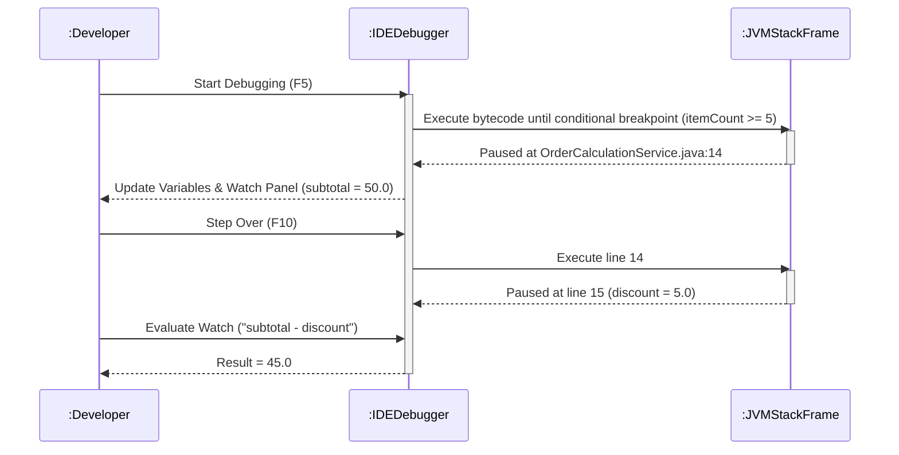

# Today's Objective

* **Today's Focus**: Implementing the Lesson 10 Lab (the **Order State Machine & Faulty Calculation Debugging Lab**), diagnosing silent logic bugs and off-by-one errors using interactive breakpoints/watchpoints, writing JUnit 5 verification suites, and modeling debugger call stack frames using UML sequence diagrams.
* **Why Today's Work Matters**: The hardest bugs to fix are not syntax errors or crashes—they are silent logic bugs (code that compiles and runs cleanly, but calculates wrong outputs). You will build an order calculation engine containing a subtle discount compounding bug, use conditional breakpoints and watch expressions to locate the root cause live, fix it, and write regression unit tests.
* **How it Connects to Previous Lessons**: Yesterday, you learned Exception Breakpoints and Field Watchpoints. Today, you apply all debugging controls to perform Root Cause Analysis (RCA) on an executable Java component.
* **How it Prepares You for Future Lessons**: Completing this lesson finishes Lesson 10, preparing you directly for Reading Unfamiliar Java Code (P00.M04.L02) and solving the Phase 0 Capstone Kata (P00.M04.L03).
* **Estimated Study Duration**: 3 hours (out of 4 hours available).

---

# Warm-up (10–15 minutes)

Let's review Field Watchpoints, Exception Breakpoints, and debugger state machines from Day 2.

### Quick Recall Questions
1. How does a Field Watchpoint allow you to catch hidden variable mutations across multiple methods?
2. What is an Exception Breakpoint, and when is it useful?
3. What is the difference between Step Over (`F10`) and Step Into (`F11`)?
4. What happens when you select a higher frame in the CALL STACK panel while execution is paused?
5. Why is symptom patching (e.g. adding `try-catch` to hide errors) dangerous in production software?

### Warm-up Coding Exercise
Write a JUnit test assertion verifying that calculating total price for 5 items at $10 each with a 10% discount equals $45.0 using `assertEquals(45.0, total, 0.001)`.

---

# Step 1 — Video Lectures

To understand how to diagnose silent logic bugs using watch expressions and stepping controls, watch this tutorial:

* **Title**: Debugging Logic Bugs & Off-By-One Errors in Java IDEs
* **Instructor**: Coding with John / Baeldung
* **Platform**: YouTube
* **URL**: [https://www.youtube.com/watch?v=vZm0lHciFsQ](https://www.youtube.com/watch?v=1oW_W9O67pU) (Focus on Logic Bug Diagnosis)
* **Duration**: ~10 minutes
* **Recommended Playback Speed**: 1.0x
* **Focus Areas**:
  * Focus on setting conditional breakpoints on loop indices and tracking intermediate calculations in the WATCH window.
  * Learn how to step into helper methods (`F11`) to observe parameter transfers.
* **Notes to Take**:
  * Write down the steps for Root Cause Analysis (RCA) using an IDE debugger.
  * Explain why evaluating expressions in the WATCH window isolates logic errors faster than print statements.

---

# Step 2 — Reading

### Blog Track
* **Title**: *Finding Hard-to-Find Bugs in Java Applications*
* **Publisher**: Baeldung (High-quality Java guides)
* **URL**: [https://www.baeldung.com/java-debugging-tips](https://www.baeldung.com/java-debugging-tips)
* **Reading Objective**: Learn strategies for isolating silent logic bugs, verifying loop indices, and inspecting nested method stack frames.
* **Estimated Reading Time**: 20 minutes

---

# Step 3 — Coding Practice

### Exercise: Debugging a Silent Off-By-One Bug (Medium)
* **Objective**: Locate and fix a silent loop bounds calculation bug using conditional breakpoints.
* **Difficulty**: Medium
* **Expected Outcome**:
  1. Create `ArrayAverageDebug.java` under `scratch/`:
     ```java
     public class ArrayAverageDebug {
         public static double computeAverage(int[] nums) {
             if (nums == null || nums.length == 0) return 0.0;
             int sum = 0;
             // BUG: Loop condition 'i < nums.length - 1' misses the last array element!
             for (int i = 0; i < nums.length - 1; i++) { 
                 sum += nums[i];
             }
             return (double) sum / nums.length;
         }

         public static void main(String[] args) {
             int[] data = { 10, 20, 30, 40 }; // Average should be 25.0
             double avg = computeAverage(data);
             System.out.println("Computed Average: " + avg); // Returns 15.0 (Incorrect!)
         }
     }
     ```
  2. Set a breakpoint on `sum += nums[i];`.
  3. Add Watch Expressions: `i`, `nums[i]`, and `sum`.
  4. Step through execution (`F10`). Observe that the loop terminates when `i == 2` (skipping `nums[3] = 40`), causing the incorrect average of 15.0.
  5. Fix the loop condition to `i < nums.length` and verify the output equals `25.0`.
* **Hints**: Watch the loop index `i` compared against `nums.length` in the WATCH window.
* **Common Mistakes**: Guessing and changing numbers without stepping through the loop in a live debugger session.

---

# Step 4 — Hands-on Lab

### Lab: Order State Machine & Faulty Calculation Debugging

#### Problem Statement
Design an order calculation service `OrderCalculationService` and JUnit 5 test suite `OrderCalculationServiceTest` under the package `handbook.phase00.p00m04l01`. The component contains a subtle calculation error in discount compounding for bulk orders ($\ge 5$ items). You will use the IDE debugger to perform Root Cause Analysis (RCA), fix the bug, and verify with tests.

#### Debugging Walkthrough for the Lab:
1. Implement the class with the subtle bug (discount applied twice for bulk orders).
2. Run `OrderCalculationServiceTest` and observe the test failure (`AssertionFailedError`).
3. Set a **Conditional Breakpoint** on `itemCount >= 5`.
4. Add a **Watch Expression** `subtotal - discount` in the WATCH panel.
5. Step into method execution (`F11`) to inspect intermediate calculation variables.
6. Locate the duplicate discount line, fix it, and re-run unit tests until all pass!

#### Starter Folder Structure
```text
src/main/java/handbook/phase00/p00m04l01/OrderCalculationService.java
src/test/java/handbook/phase00/p00m04l01/OrderCalculationServiceTest.java
docs/P00.M04.L01-diagram.md
```

#### Code Implementation Guidelines

##### OrderCalculationService.java (Fixed Version)
```java
package handbook.phase00.p00m04l01;

public class OrderCalculationService {

    public double calculateTotal(double itemPrice, int itemCount) {
        if (itemPrice <= 0.0 || itemCount <= 0) {
            throw new IllegalArgumentException("Invalid price or item count.");
        }

        double subtotal = itemPrice * itemCount;
        double discount = 0.0;

        // Bulk Order Discount: 10% off for 5 or more items
        if (itemCount >= 5) {
            discount = subtotal * 0.10;
        }

        // BUG WAS HERE: Previously wrote 'double finalTotal = (subtotal - discount) - discount;'
        double finalTotal = subtotal - discount;
        return finalTotal;
    }
}
```

##### OrderCalculationServiceTest.java
```java
package handbook.phase00.p00m04l01;

import org.junit.jupiter.api.BeforeEach;
import org.junit.jupiter.api.Test;
import static org.junit.jupiter.api.Assertions.*;

public class OrderCalculationServiceTest {

    private OrderCalculationService service;

    @BeforeEach
    void setUp() {
        service = new OrderCalculationService();
    }

    @Test
    void testStandardOrderCalculation() {
        // 2 items @ $10.0 -> $20.0 (no discount)
        assertEquals(20.0, service.calculateTotal(10.0, 2), 0.001);
    }

    @Test
    void testBulkOrderDiscountCalculation() {
        // 5 items @ $10.0 -> $50.0 subtotal - 10% discount ($5.0) = $45.0
        assertEquals(45.0, service.calculateTotal(10.0, 5), 0.001);
    }

    @Test
    void testInvalidInputsThrowException() {
        assertAll("Precondition Errors",
            () -> assertThrows(IllegalArgumentException.class, () -> service.calculateTotal(-10.0, 5)),
            () -> assertThrows(IllegalArgumentException.class, () -> service.calculateTotal(10.0, 0))
        );
    }
}
```

---

# Step 5 — Project Work

No project milestone is scheduled today. (The project connection is completed at the end of the module).

---

# Step 6 — UML / Design Exercise

### UML Sequence Diagram
Draw a sequence diagram depicting a developer stepping into nested methods, inspecting local variables, and evaluating watch expressions.
* **Why it matters**: Visualizing debugger stepping actions clarifies how the IDE interacts with active JVM stack frames.
* **What should appear in the diagram**:
  1. Lifelines: `:Developer`, `:IDEDebugger`, and `:JVMStackFrame`.
  2. `:Developer` hitting Conditional Breakpoint (`itemCount >= 5`).
  3. `:IDEDebugger` pausing execution and querying `:JVMStackFrame` for variables (`subtotal`, `discount`).
  4. `:Developer` issuing Step Into (`F11`) and evaluating Watch Expression `subtotal - discount`.
  5. `:IDEDebugger` returning evaluated value.

*You can write this diagram in Markdown using Mermaid syntax:*


---

# Step 7 — Engineering Insight

### Root Cause Analysis vs. Symptom Patching
When code fails a test or returns an incorrect value, inexperienced developers often practice **Symptom Patching**: adding arbitrary `+ 1` or `- 1` offsets, or wrapping failing code in `try-catch` blocks to hide errors.

Senior engineers practice **Root Cause Analysis (RCA)**:
1. Reproduce the failure with an automated test case.
2. Attach an interactive debugger with conditional breakpoints.
3. Trace the exact line where variable state deviates from expected behavior.
4. Fix the underlying invariant rule, ensuring zero side-effects.

---

# Step 8 — Open Source Connection

In **Jackson JSON Parser & Apache Commons Math**:
* When open-source maintainers receive a bug report for a silent mathematical parsing error on specific floating-point inputs, they write a failing unit test, set a conditional breakpoint on the parser stream index, and trace memory state using watch expressions before submitting a fix.

---

# Step 9 — End-of-Day Reflection

1. What is a silent logic bug? Why are silent logic bugs harder to detect than syntax errors or exceptions?
2. How do conditional breakpoints and watch expressions assist in Root Cause Analysis (RCA)?
3. What is the danger of symptom patching (e.g. adding `+ 1` without understanding the bug)?
4. How does stepping into a method (`F11`) reveal parameter passing bugs across stack frames?
5. Why should every bug fix be accompanied by a regression unit test?

---

# Step 10 — Notes Template

Append this template to `notes/P00.M04.L01.md`:

```markdown
# Notes: P00.M04.L01 - Debugging with breakpoints and watches

## Key Concepts

## Important Definitions

## Things That Clicked Today

## Things I Still Don't Understand

## Mistakes I Made

## Real-world Connections

## Questions To Revisit
```

---

# Step 11 — Journal Template

Save a copy of this template to `journal/2026-08-08.md`:

```markdown
# Daily Journal: 2026-08-08

## What I accomplished today

## Biggest insight

## Biggest challenge

## Questions I still have

## Time spent

## Confidence (1–10)

## Plan for tomorrow
```

---

# Final Checklist

- [ ] Warm-up complete
- [ ] Debugging Logic Bugs video tutorial watched
- [ ] Baeldung Finding Hard-to-Find Bugs guide read
- [ ] Coding Exercise (ArrayAverageDebug off-by-one bug fix) completed
- [ ] Lab: Order State Machine & Faulty Calculation Debugging implemented
- [ ] Root cause located via debugger and fixed
- [ ] `OrderCalculationServiceTest` executed successfully
- [ ] UML Debugger Stepping Sequence diagram drawn (Mermaid or Paper)
- [ ] Reflection questions answered
- [ ] Notes file (`notes/P00.M04.L01.md`) updated and finalized
- [ ] Journal file (`journal/2026-08-08.md`) created from template
- [ ] Git commit completed with designated message

---

### Recommended Git Commit Command:
```bash
git add .
git commit -m "study(P00.M04.L01): complete day 3"
```
