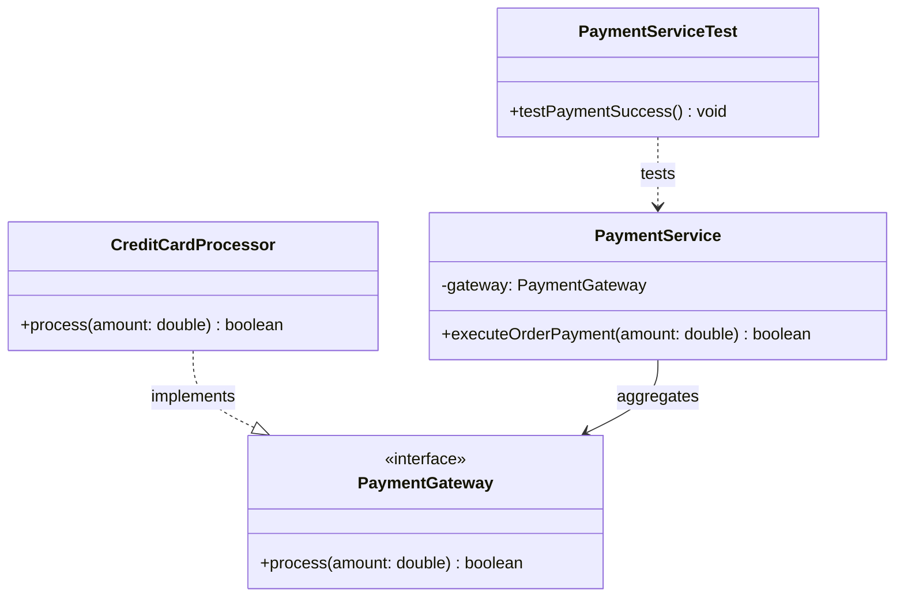

# Today's Objective

* **Today's Focus**: Reverse-Engineering Unfamiliar Codebases, mapping object collaboration graphs, extracting class relationships from bytecode/source without documentation, and modeling static structures using UML Class Diagrams.
* **Why Today's Work Matters**: In industry projects, documentation is often outdated or non-existent. A senior engineer can open an unfamiliar Java package, reverse-engineer its public contracts and hidden dependencies, and draw an accurate UML class diagram to communicate its architecture to the team.
* **How it Connects to Previous Lessons**: Yesterday, you practiced IDE navigation shortcuts (`F12`, `Shift+F12`) and audited JDK `ArrayList`. Today, you take raw unfamiliar Java files and reverse-engineer their static class architecture.
* **How it Prepares You for Future Lessons**: Prepares you directly for the Phase 0 Capstone Kata (P00.M04.L03) and reviewing open-source framework architectures in Phase 1 (P01).
* **Estimated Study Duration**: 3 hours (out of 4 hours available).

---

# Warm-up (10–15 minutes)

Let's review code reading strategies, entry point discovery, and JDK `ArrayList` growth from Day 1 of this lesson.

### Quick Recall Questions
1. What is the difference between Top-Down and Bottom-Up code reading?
2. What IDE shortcut keys do you use for Go to Definition (`F12`), Find All References (`Shift+F12`), and Navigate Back (`Alt+Left`)?
3. Why are automated unit test suites (`*Test.java`) often the best documentation when auditing an unfamiliar repository?
4. How does JDK `ArrayList` compute its array capacity expansion when full?
5. How does Cognitive Load Theory explain why developers feel overwhelmed when reading large un-nested classes?

### Warm-up Coding Exercise
Write the Java bit-shift expression used by JDK `ArrayList` to increase capacity by 50% (`oldCapacity + ...`).

---

# Step 1 — Video Lectures

To understand how to reverse-engineer software architectures from code, watch this tutorial:

* **Title**: How to Reverse Engineer & Diagram Unfamiliar Codebases
* **Instructor**: Coding with John / Software Architecture Tutorials
* **Platform**: YouTube
* **URL**: [https://www.youtube.com/watch?v=vZm0lHciFsQ](https://www.youtube.com/watch?v=1oW_W9O67pU) (Focus on Reverse Engineering Architecture)
* **Duration**: ~12 minutes
* **Recommended Playback Speed**: 1.0x
* **Focus Areas**:
  * Learn how to identify **Core Entities**, **Service Facades**, and **Utility Helpers** in an un-documented repository.
  * Learn how to map class associations (`-->`), generalizations (`--|>`), and dependencies (`..>`) into clean UML class diagrams.
* **Notes to Take**:
  * List 3 steps to reverse-engineer a UML class diagram from raw source files.
  * Explain how to distinguish between a Class Association (holds a field reference) and a Dependency (uses as method parameter).

---

# Step 2 — Reading

### Documentation Track
* **Title**: *Reverse Engineering Software Architecture from Source Code*
* **Publisher**: Baeldung / ThoughtWorks Technology Radar
* **URL**: [https://www.baeldung.com/uml-class-diagrams](https://www.baeldung.com/uml-class-diagrams)
* **Reading Objective**: Learn how to read raw Java class signatures and fields, convert them into UML class boxes, and identify architectural patterns without reading every line of implementation logic.
* **Estimated Reading Time**: 30 minutes

---

# Step 3 — Coding Practice

### Exercise 1: Reimplementing ArrayList Growth Audit from Memory (Medium)
* **Objective**: Reimplement JDK `ArrayList` growth calculation and call graph traversal from memory.
* **Difficulty**: Medium
* **Expected Outcome**: In `scratch/`, create `ArrayListGrowthSim.java`. Write a method `int computeNextCapacity(int current)` using the bit-shift formula `current + (current >> 1)`. Write assertions verifying that a capacity of 10 grows to 15, 15 grows to 22, and 22 grows to 33.
* **Hints**: Do not look at yesterday's daily plan. Focus on getting the bit-shift operator `>> 1` exact.
* **Common Mistakes**: Using division `/ 2` instead of bit-shift `>> 1`.

### Exercise 2: Auditing & Reverse-Engineering an Unfamiliar Subsystem (Medium)
* **Objective**: Audit an un-documented 3-class payment processing subsystem and reverse-engineer its API contract.
* **Difficulty**: Medium
* **Expected Outcome**:
  1. Create package `scratch.unfamiliar.payment`:
     * `PaymentGateway.java` (interface with `boolean process(double amount)`)
     * `CreditCardProcessor.java` (implements `PaymentGateway`)
     * `PaymentService.java` (facade accepting `PaymentGateway` via constructor)
  2. Audit the code as if you have never seen it before:
     * Use `F12` to jump from `PaymentService` to `PaymentGateway`.
     * Use `Ctrl + F12` (Go to Implementation) to locate `CreditCardProcessor`.
  3. Write a JUnit 5 test `PaymentServiceTest.java` verifying that `PaymentService` processes payments correctly through `CreditCardProcessor`.
* **Hints**: `Ctrl + F12` in VS Code / IntelliJ jumps directly from an interface to its concrete implementing classes!
* **Common Mistakes**: Trying to read method body implementations before understanding the interface type contracts.

---

# Step 4 — Hands-on Lab

No lab is scheduled today. (The hands-on lab for this lesson is scheduled for Day 3).

---

# Step 5 — Project Work

No project milestone is scheduled today. (The project connection is completed at the end of the module).

---

# Step 6 — UML / Design Exercise

### UML Exercise: Reverse-Engineered Class Diagram
Draw a static UML Class Diagram reverse-engineered from the unfamiliar `scratch.unfamiliar.payment` subsystem.
* **Why it matters**: Diagramming unfamiliar code forces you to distill raw source lines into high-level architecture.
* **What should appear in the diagram**:
  1. Interface box `<<interface>> PaymentGateway` (showing `+ process(amount: double) boolean`).
  2. Class box `CreditCardProcessor` implementing `PaymentGateway` (`..|>`).
  3. Class box `PaymentService` holding a field `gateway: PaymentGateway` (association `-->`).
  4. Class box `PaymentServiceTest` depending on `PaymentService` (`..>`).

*You can write this diagram in Markdown using Mermaid syntax:*


---

# Step 7 — Engineering Insight

### Reverse-Engineering Code to Diagrams
Why do senior developers draw UML diagrams when reading unfamiliar code?
* **Mental Model Externalization**: Working memory can only hold 4–7 concepts at once. Trying to remember how 15 classes interact in your head leads to cognitive overload.
* **Separating Interface from Implementation**: Drawing class boxes forces you to focus on **Public Method Signatures** and **Field Types** while ignoring private helper loops.
* **Identifying Architecture Smells**: Once mapped onto a diagram, architectural flaws (e.g. circular dependencies or bloated god classes) become instantly visible.

---

# Step 8 — Open Source Connection

In **JUnit 5 Jupiter API (`org.junit.jupiter.api`)**:
* Reverse-engineer the `Extension` interface hierarchy:
  * `Extension` (base marker interface)
  * `BeforeEachCallback` (extends `Extension`)
  * `AfterEachCallback` (extends `Extension`)
  * `ParameterResolver` (extends `Extension`)
* Notice how JUnit uses interface hierarchy trees to allow custom test plugins to hook into specific lifecycle execution phases without modifying the core test engine.

---

# Step 9 — End-of-Day Reflection

1. What steps do you follow to reverse-engineer a UML class diagram from un-documented Java source code?
2. What is the difference between Go to Definition (`F12`) and Go to Implementation (`Ctrl+F12`)?
3. How does drawing a class diagram reduce cognitive load when auditing a complex repository?
4. In UML class diagrams, how do you distinguish between Interface Implementation (`..|>`) and Field Association (`-->`)?
5. Why are interface contracts more important to read initially than private method implementation details?

---

# Step 10 — Notes Template

Append this template to `notes/P00.M04.L02.md`:

```markdown
# Notes: P00.M04.L02 - Reading unfamiliar Java code

## Key Concepts

## Important Definitions

## Things That Clicked Today

## Things I Still Don't Understand

## Mistakes I Made

## Real-world Connections

## Questions To Revisit
```

---

# Step 11 — Journal Template

Save a copy of this template to `journal/2026-08-10.md`:

```markdown
# Daily Journal: 2026-08-10

## What I accomplished today

## Biggest insight

## Biggest challenge

## Questions I still have

## Time spent

## Confidence (1–10)

## Plan for tomorrow
```

---

# Final Checklist

- [ ] Warm-up complete
- [ ] Reverse Engineer Unfamiliar Codebases video tutorial watched
- [ ] Reverse Engineering Software Architecture guide read
- [ ] Coding Exercise 1 (ArrayList growth recall from memory) completed
- [ ] Coding Exercise 2 (Auditing & testing PaymentService subsystem) completed
- [ ] Mermaid Reverse-Engineered Class Diagram drawn
- [ ] Reflection questions answered
- [ ] Notes file (`notes/P00.M04.L02.md`) updated
- [ ] Journal file (`journal/2026-08-10.md`) created from template
- [ ] Git commit completed with designated message

---

### Recommended Git Commit Command:
```bash
git add .
git commit -m "study(P00.M04.L02): complete day 2"
```
