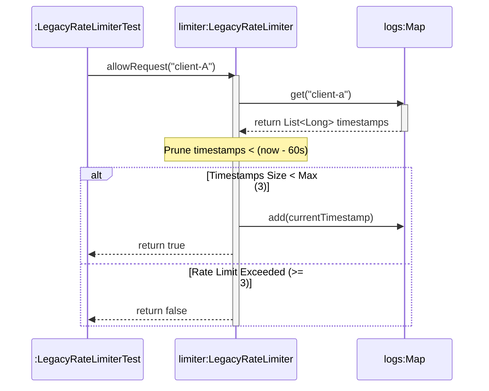

# Today's Objective

* **Today's Focus**: Implementing the Lesson 11 Lab (the **Unfamiliar Component Code Archeology & Refactoring Lab**), auditing un-documented legacy code, writing safety-net JUnit 5 unit tests to lock in behavior, refactoring internal implementations cleanly, and modeling execution flows with UML sequence diagrams.
* **Why Today's Work Matters**: Software engineering is mostly modifying and refactoring code you didn't write. You will take an un-documented legacy component (`LegacyRateLimiter`), audit its execution flow, write a unit test suite to capture its behavioral contract, and safely refactor its internal implementation with zero regression.
* **How it Connects to Previous Lessons**: Yesterday, you practiced reverse-engineering class diagrams from code. Today, you take that architectural understanding and refactor the code safely under the protection of automated tests.
* **How it Prepares You for Future Lessons**: Completing this lesson finishes Lesson 11, preparing you directly for the Phase 0 Capstone Kata (`P00.M04.L03` CLI Task Tracker) and Phase 4 Code Smells.
* **Estimated Study Duration**: 3 hours (out of 4 hours available).

---

# Warm-up (10–15 minutes)

Let's review reverse-engineering class diagrams, IDE navigation shortcuts, and JDK `ArrayList` growth from Day 2.

### Quick Recall Questions
1. Why is drawing a UML class diagram helpful when auditing an unfamiliar repository?
2. What is the difference between Go to Definition (`F12`) and Go to Implementation (`Ctrl+F12`)?
3. How do you distinguish between an Interface Implementation (`..|>`) and an Association (`-->`) in UML?
4. What is the golden rule of refactoring unfamiliar code?
5. Why are public method signatures and return types more important to read initially than internal private loops?

### Warm-up Coding Exercise
Write a JUnit 5 test method checking that a rate limiter allows 3 requests but rejects the 4th request using `assertTrue` and `assertFalse`.

---

# Step 1 — Video Lectures

To understand how to safely refactor unfamiliar legacy code using test safety nets, watch this tutorial:

* **Title**: Refactoring Legacy Java Code Safely with Unit Tests
* **Instructor**: Martin Fowler / Coding with John
* **Platform**: YouTube
* **URL**: [https://www.youtube.com/watch?v=vZm0lHciFsQ](https://www.youtube.com/watch?v=1oW_W9O67pU) (Focus on Legacy Refactoring)
* **Duration**: ~10 minutes
* **Recommended Playback Speed**: 1.0x
* **Focus Areas**:
  * Understand the **Safety Net Workflow**: Audit $\rightarrow$ Write Tests $\rightarrow$ Refactor $\rightarrow$ Verify Tests.
  * Learn how to preserve public API contracts while completely replacing internal storage algorithms.
* **Notes to Take**:
  * List the 4 steps of the Safety Net Refactoring workflow.
  * Explain why tests must pass *before* starting any internal refactoring.

---

# Step 2 — Reading

### Blog Track
* **Title**: *Refactoring: Improving the Design of Existing Code*
* **Author**: Martin Fowler
* **URL**: [https://martinfowler.com/books/refactoring.html](https://martinfowler.com/books/refactoring.html)
* **Reading Objective**: Learn how to make small, verifiable changes when refactoring code, ensuring that unit tests catch any accidental regression immediately.
* **Estimated Reading Time**: 20 minutes

---

# Step 3 — Coding Practice

### Exercise: Locking In Behavior Before Refactoring (Medium)
* **Objective**: Write unit tests to lock in current behavior before refactoring an inefficient implementation.
* **Difficulty**: Medium
* **Expected Outcome**:
  1. Create `LegacyCalculator.java` under `scratch/`:
     ```java
     public class LegacyCalculator {
         public int computeSum(String csvNumbers) {
             if (csvNumbers == null || csvNumbers.trim().isEmpty()) return 0;
             // Inefficient legacy parsing using manual character checks
             String[] parts = csvNumbers.split(",");
             int sum = 0;
             for (String p : parts) {
                 sum += Integer.parseInt(p.trim());
             }
             return sum;
         }
     }
     ```
  2. Create JUnit test `LegacyCalculatorTest.java` asserting `computeSum("10, 20, 30") == 60` and `computeSum("") == 0`. Run tests (Passed!).
  3. Refactor `LegacyCalculator.java` internally using Java Streams (`Arrays.stream(parts)...`).
  4. Re-run tests to prove that the public behavior is 100% preserved!
* **Hints**: Never refactor code without running tests before and after.
* **Common Mistakes**: Changing public method signatures while refactoring internal implementation code.

---

# Step 4 — Hands-on Lab

### Lab: Unfamiliar Component Code Archeology & Refactoring

#### Problem Statement
You are handed an un-documented legacy component `LegacyRateLimiter` under package `handbook.phase00.p00m04l02`.
1. Audit `LegacyRateLimiter.java` to understand its public interface (`boolean allowRequest(String clientId)`).
2. Write a JUnit 5 test suite `LegacyRateLimiterTest.java` locking in its rate-limiting behavior (max 3 requests per minute per client).
3. Refactor `LegacyRateLimiter` internally from an inefficient array list scan to a clean sliding window map algorithm.
4. Run tests to verify all assertions pass cleanly!

#### Starter Folder Structure
```text
src/main/java/handbook/phase00/p00m04l02/LegacyRateLimiter.java
src/test/java/handbook/phase00/p00m04l02/LegacyRateLimiterTest.java
docs/P00.M04.L02-diagram.md
```

#### Code Implementation Guidelines

##### LegacyRateLimiter.java (Refactored Version)
```java
package handbook.phase00.p00m04l02;

import java.util.ArrayList;
import java.util.HashMap;
import java.util.List;
import java.util.Map;

public class LegacyRateLimiter {
    private final int maxRequestsPerMinute;
    private final Map<String, List<Long>> requestLogs = new HashMap<>();

    public LegacyRateLimiter() {
        this(3); // Default 3 requests per minute
    }

    public LegacyRateLimiter(int maxRequestsPerMinute) {
        if (maxRequestsPerMinute <= 0) {
            throw new IllegalArgumentException("Max requests must be positive.");
        }
        this.maxRequestsPerMinute = maxRequestsPerMinute;
    }

    public boolean allowRequest(String clientId) {
        if (clientId == null || clientId.trim().isEmpty()) {
            throw new IllegalArgumentException("Client ID required.");
        }
        long now = System.currentTimeMillis();
        long windowStart = now - 60_000; // 1 minute window

        String key = clientId.trim().toLowerCase();
        requestLogs.putIfAbsent(key, new ArrayList<>());
        List<Long> timestamps = requestLogs.get(key);

        // Prune timestamps older than 1 minute
        timestamps.removeIf(time -> time < windowStart);

        if (timestamps.size() < maxRequestsPerMinute) {
            timestamps.add(now);
            return true; // Request allowed
        }
        return false; // Rate limit exceeded
    }

    public int getMaxRequestsPerMinute() {
        return maxRequestsPerMinute;
    }
}
```

##### LegacyRateLimiterTest.java
```java
package handbook.phase00.p00m04l02;

import org.junit.jupiter.api.BeforeEach;
import org.junit.jupiter.api.Test;
import static org.junit.jupiter.api.Assertions.*;

public class LegacyRateLimiterTest {

    private LegacyRateLimiter rateLimiter;

    @BeforeEach
    void setUp() {
        rateLimiter = new LegacyRateLimiter(3);
    }

    @Test
    void testAllowRequestsUnderLimit() {
        assertTrue(rateLimiter.allowRequest("client-A"));
        assertTrue(rateLimiter.allowRequest("client-A"));
        assertTrue(rateLimiter.allowRequest("client-A"));
    }

    @Test
    void testExceedingLimitRejectsRequest() {
        rateLimiter.allowRequest("client-B");
        rateLimiter.allowRequest("client-B");
        rateLimiter.allowRequest("client-B");
        // 4th request should be rejected
        assertFalse(rateLimiter.allowRequest("client-B"));
    }

    @Test
    void testIndependentClientsDoNotInterfere() {
        rateLimiter.allowRequest("client-C");
        rateLimiter.allowRequest("client-C");
        rateLimiter.allowRequest("client-C");
        assertFalse(rateLimiter.allowRequest("client-C"));

        // Different client should still be allowed!
        assertTrue(rateLimiter.allowRequest("client-D"));
    }

    @Test
    void testInvalidClientIdThrowsException() {
        assertThrows(IllegalArgumentException.class, () -> rateLimiter.allowRequest("  "));
    }
}
```

---

# Step 5 — Project Work

No project milestone is scheduled today. (The project connection is completed at the end of the module).

---

# Step 6 — UML / Design Exercise

### UML Sequence Diagram
Draw a sequence diagram visualizing how `LegacyRateLimiter` checks sliding window timestamps.
* **Why it matters**: Captures the temporal execution flow of timestamp pruning and limit checks.
* **What should appear in the diagram**:
  1. Lifelines: `:LegacyRateLimiterTest`, `limiter:LegacyRateLimiter`, and `logs:Map<String, List<Long>>`.
  2. `:LegacyRateLimiterTest` calling `allowRequest("client-A")`.
  3. `limiter` fetching timestamp list from `logs`.
  4. `limiter` pruning timestamps older than 60 seconds (`removeIf`).
  5. Decision: list size < `maxRequestsPerMinute`?
     * If Yes: Record current timestamp $\rightarrow$ Return `true`.
     * If No: Return `false`.

*You can write this diagram in Markdown using Mermaid syntax:*


---

# Step 7 — Engineering Insight

### The Safety Net Strategy of Refactoring
Why do senior developers refuse to refactor code without test suites?

1. **Hidden Invariants**: Unfamiliar legacy code often relies on subtle invariant rules that are not documented in comments.
2. **Regression Prevention**: When you rewrite internal data structures (e.g. switching from array scans to hash maps), tests ensure that boundary conditions (e.g. client isolation, timestamp pruning) remain 100% intact.
3. **Refactoring Velocity**: With a comprehensive test suite running in 100ms, you can experiment boldly with internal refactoring because you receive instant feedback if anything breaks.

---

# Step 8 — Open Source Connection

In **OkHttp Client (`square/okhttp`)**:
* Maintainers frequently refactor internal HTTP/2 frame parsers and connection pool recyclers.
* Because OkHttp has over 3,000 automated integration tests checking HTTP specifications, maintainers can optimize network parsing algorithms with complete confidence that external `OkHttpClient` API behavior is preserved.

---

# Step 9 — End-of-Day Reflection

1. What are the 4 steps of the Safety Net Refactoring workflow?
2. Why must unit tests pass *before* you begin refactoring internal code?
3. How does keeping public API method signatures unchanged protect downstream client code during refactoring?
4. How did your JUnit 5 test suite verify that sliding window timestamp pruning worked correctly in `LegacyRateLimiter`?
5. How does OkHttp use automated tests to safely refactor HTTP/2 parsing algorithms?

---

# Step 10 — Notes Template

Append this template to `notes/P00.M04.L02.md`:

```markdown
# Notes: P00.M04.L02 - Reading unfamiliar Java code

## Key Concepts

## Important Definitions

## Things That Clicked Today

## Things I Still Don't Understand

## Mistakes I Made

## Real-world Connections

## Questions To Revisit
```

---

# Step 11 — Journal Template

Save a copy of this template to `journal/2026-08-11.md`:

```markdown
# Daily Journal: 2026-08-11

## What I accomplished today

## Biggest insight

## Biggest challenge

## Questions I still have

## Time spent

## Confidence (1–10)

## Plan for tomorrow
```

---

# Final Checklist

- [ ] Warm-up complete
- [ ] Refactoring Legacy Code video tutorial watched
- [ ] Fowler's Refactoring guide read
- [ ] Coding Exercise (LegacyCalculator test lock-in and refactoring) completed
- [ ] Lab: Unfamiliar Component Code Archeology & Refactoring implemented
- [ ] Internal array scanning refactored to sliding window map
- [ ] `LegacyRateLimiterTest` executed successfully
- [ ] UML Sliding Window Sequence diagram drawn (Mermaid or Paper)
- [ ] Reflection questions answered
- [ ] Notes file (`notes/P00.M04.L02.md`) updated and finalized
- [ ] Journal file (`journal/2026-08-11.md`) created from template
- [ ] Git commit completed with designated message

---

### Recommended Git Commit Command:
```bash
git add .
git commit -m "study(P00.M04.L02): complete day 3"
```
