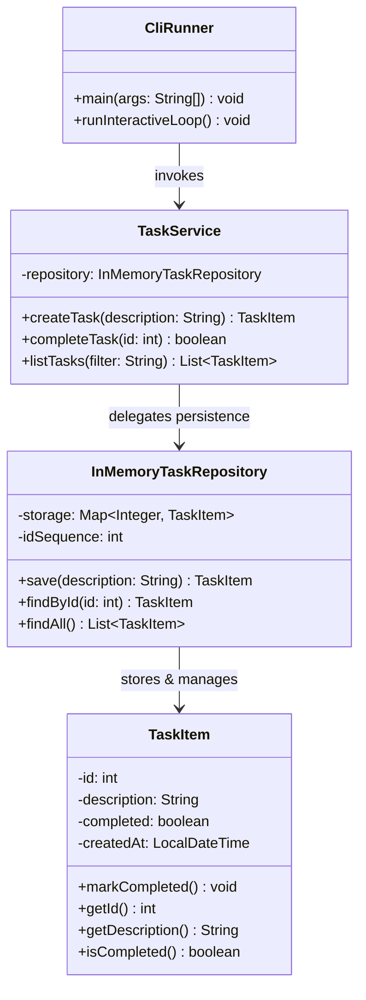

# Today's Objective

* **Today's Focus**: Designing the **In-Memory Task Repository Pattern**, structuring service layer contracts (`TaskService`), implementing task query filters (PENDING, COMPLETED), and modeling the static architecture of the CLI Task Tracker using UML Class Diagrams.
* **Why Today's Work Matters**: Clean architecture separates data storage from business services. You will design a `TaskRepository` that manages task persistence in memory using defensive copies, and a `TaskService` that enforces business rules (e.g. unique task descriptions, status filtering) before mapping commands to storage.
* **How it Connects to Previous Lessons**: Yesterday, you designed command argument dispatchers and the `TaskItem` domain entity. Today, you build the repository storage and service layer that ties the domain objects together.
* **How it Prepares You for Future Lessons**: Prepares you directly for the Phase 0 Capstone Project (**Module 00.04 Project**) and Repository Pattern implementations in Phase 1 (P01.M01) and Phase 10 (ORM/Database Layer).
* **Estimated Study Duration**: 3 hours (out of 4 hours available).

---

# Warm-up (10–15 minutes)

Let's review CLI command dispatching, domain entity design, and console I/O isolation from Day 1 of this lesson.

### Quick Recall Questions
1. Why should console I/O (`System.in` / `System.out`) be isolated from domain business classes?
2. What is the benefit of keeping entity fields `private` and exposing explicit state mutators (`markCompleted()`) instead of public setters?
3. How does the Command Dispatcher pattern simplify parsing string array inputs (`ADD`, `LIST`, `COMPLETE`)?
4. What chapter in Clean Code covers writing small single-responsibility functions for argument parsing?
5. How do Git and Maven CLI tools decouple flag parsing from core execution engines?

### Warm-up Coding Exercise
Write the interface declaration for a `TaskRepository` exposing `void save(TaskItem task)`, `TaskItem findById(int id)`, and `List<TaskItem> findAll()`.

---

# Step 1 — Video Lectures

To understand the Repository Pattern and Service Layer separation in Java, watch this tutorial:

* **Title**: The Repository Pattern & Service Layer Explained in Java
* **Instructor**: Coding with John / Amigoscode
* **Platform**: YouTube
* **URL**: [https://www.youtube.com/watch?v=vZm0lHciFsQ](https://www.youtube.com/watch?v=1oW_W9O67pU) (Focus on Repository Pattern)
* **Duration**: ~12 minutes
* **Recommended Playback Speed**: 1.0x
* **Focus Areas**:
  * Understand the **Repository Pattern**: Abstracts data collection storage (`Map` / `List`) behind a clean persistence interface.
  * Learn why the **Service Layer** sits between the presentation layer (CLI) and the storage layer (Repository) to hold business rules.
* **Notes to Take**:
  * Diagram the 3-tier architecture: Presentation (CLI) $\rightarrow$ Service $\rightarrow$ Repository $\rightarrow$ Domain Entity.
  * Explain why defensive copying is used when returning list collections from a Repository.

---

# Step 2 — Reading

### Blog Track
* **Title**: *The Repository Pattern in Java*
* **Publisher**: Baeldung (High-quality Java guides)
* **URL**: [https://www.baeldung.com/java-repository-pattern](https://www.baeldung.com/java-repository-pattern)
* **Reading Objective**: Comprehend how the Repository pattern acts as an in-memory collection facade, hiding storage implementation details from domain services.
* **Estimated Reading Time**: 30 minutes

---

# Step 3 — Coding Practice

### Exercise 1: Reimplementing TaskItem & Dispatcher from Memory (Medium)
* **Objective**: Reconstruct the `TaskItem` entity and command dispatcher from memory.
* **Difficulty**: Medium
* **Expected Outcome**: In `scratch/`, recreate `TaskItem.java` with validation and `markCompleted()`. Write a test verifying that creating a task with an empty description throws `IllegalArgumentException`.
* **Hints**: Do not look at yesterday's daily plan. Focus on writing clean preconditions.
* **Common Mistakes**: Forgetting to trim the description string during null/empty checks.

### Exercise 2: Implementing InMemory Task Repository (Medium)
* **Objective**: Build an in-memory task repository with defensive copies and auto-incrementing IDs.
* **Difficulty**: Medium
* **Expected Outcome**:
  1. Create `InMemoryTaskRepository.java` under `scratch/`:
     * Fields: `private final Map<Integer, TaskItem> storage = new HashMap<>();`, `private int idSequence = 1;`
     * Methods:
       * `TaskItem save(String description)`: Assigns `idSequence++`, creates `TaskItem`, stores it in map, returns created task.
       * `TaskItem findById(int id)`: Returns task or `null`.
       * `List<TaskItem> findAll()`: Returns a defensive copy (`new ArrayList<>(storage.values())`).
  2. Write a JUnit 5 test `InMemoryTaskRepositoryTest.java` verifying auto-incrementing IDs, task retrieval, and defensive copy immutability (verifying clearing returned list does not corrupt `storage`).
* **Hints**: Return `new ArrayList<>(storage.values())` to prevent encapsulation leaks.
* **Common Mistakes**: Returning `storage.values()` directly without creating a new list copy.

---

# Step 4 — Hands-on Lab

No lab is scheduled today. (The hands-on lab for this lesson is scheduled for Day 3).

---

# Step 5 — Project Work

No project milestone is scheduled today. (The project connection is completed at the end of the module).

---

# Step 6 — UML / Design Exercise

### UML Exercise: CLI Task Tracker Static Class Diagram
Draw a static UML Class Diagram mapping the entire CLI Task Tracker architecture.
* **Why it matters**: A class diagram establishes the static design contracts between presentation, service, repository, and domain entities before writing the final application code.
* **What should appear in the diagram**:
  1. Class box `CliRunner` (handles console input/output).
  2. Class box `TaskService` (business logic facade).
  3. Class box `InMemoryTaskRepository` (storage facade).
  4. Class box `TaskItem` (domain value object).
  5. Relationship arrows: `CliRunner` uses `TaskService` (`-->`), `TaskService` uses `InMemoryTaskRepository` (`-->`), `InMemoryTaskRepository` manages `TaskItem` (`-->`).

*You can write this diagram in Markdown using Mermaid syntax:*


---

# Step 7 — Engineering Insight

### The 3-Tier Layered Architecture Pattern
Why do professional Java applications separate code into **Presentation**, **Service**, and **Repository** layers?

1. **Presentation Layer (`CliRunner`)**: Responsible strictly for user interaction (parsing CLI arguments, reading `System.in`, printing formatted text to `System.out`). Contains zero business rules.
2. **Service Layer (`TaskService`)**: Responsible for enforcing domain rules (e.g. validating descriptions, handling status filtering logic). Knows nothing about console I/O or database queries.
3. **Repository Layer (`InMemoryTaskRepository`)**: Responsible strictly for data persistence (`Map` storage, ID generation, queries). Knows nothing about CLI commands or UI formatting.

This separation of concerns ensures each layer can be tested, refactored, or replaced independently!

---

# Step 8 — Open Source Connection

In **Spring Data Repositories & Hibernate**:
* Spring Data's `CrudRepository<T, ID>` interface exposes `save()`, `findById()`, and `findAll()` methods.
* Spring implements these in-memory or against SQL databases transparently, allowing service layers to execute business calculations without knowing whether data is stored in memory, PostgreSQL, or MongoDB.

---

# Step 9 — End-of-Day Reflection

1. What is the primary responsibility of the Repository Pattern?
2. Why should `InMemoryTaskRepository` return a defensive copy of its internal task collection?
3. How does the 3-Tier Layered Architecture (`Cli` $\rightarrow$ `Service` $\rightarrow$ `Repository`) improve code testability?
4. How does `TaskService` enforce business rules before delegating to `InMemoryTaskRepository`?
5. How does Spring Data use the Repository Pattern to abstract database storage from service classes?

---

# Step 10 — Notes Template

Append this template to `notes/P00.M04.L03.md`:

```markdown
# Notes: P00.M04.L03 - Small design kata: CLI task tracker

## Key Concepts

## Important Definitions

## Things That Clicked Today

## Things I Still Don't Understand

## Mistakes I Made

## Real-world Connections

## Questions To Revisit
```

---

# Step 11 — Journal Template

Save a copy of this template to `journal/2026-08-13.md`:

```markdown
# Daily Journal: 2026-08-13

## What I accomplished today

## Biggest insight

## Biggest challenge

## Questions I still have

## Time spent

## Confidence (1–10)

## Plan for tomorrow
```

---

# Final Checklist

- [ ] Warm-up complete
- [ ] Repository Pattern & Service Layer video tutorial watched
- [ ] Baeldung Repository Pattern guide read
- [ ] Coding Exercise 1 (TaskItem entity & dispatcher recall from memory) completed
- [ ] Coding Exercise 2 (InMemoryTaskRepository with defensive copies) completed
- [ ] Mermaid 3-Tier Architecture Class Diagram drawn
- [ ] Reflection questions answered
- [ ] Notes file (`notes/P00.M04.L03.md`) updated
- [ ] Journal file (`journal/2026-08-13.md`) created from template
- [ ] Git commit completed with designated message

---

### Recommended Git Commit Command:
```bash
git add .
git commit -m "study(P00.M04.L03): complete day 2"
```
