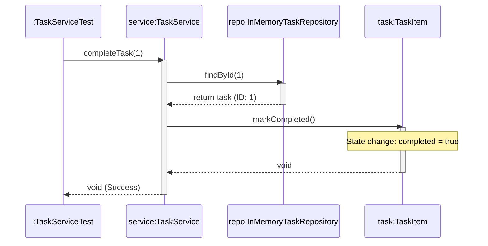

# Today's Objective

* **Today's Focus**: Implementing the Lesson 12 Lab (the **CLI Task Tracker Engine & Command Dispatcher Lab**), wiring `TaskService` to `InMemoryTaskRepository`, implementing complete CRUD task workflows (`ADD`, `LIST`, `COMPLETE`, `DELETE`), writing a comprehensive JUnit 5 test suite (`TaskServiceTest`), and modeling end-to-end command execution using UML sequence diagrams.
* **Why Today's Work Matters**: Today you complete your final lesson lab in Phase 0! You will build a fully functional, self-contained CLI Task Tracker engine where input parsing, domain rules, storage, and automated unit tests work together seamlessly.
* **How it Connects to Previous Lessons**: Yesterday, you designed the 3-Tier Layered Architecture and Repository pattern. Today, you implement the complete executable component and test suite.
* **How it Prepares You for Future Lessons**: Completing this lesson finishes Lesson 12, setting the stage for the **Module 00.04 Project** (the Phase 0 Capstone Project).
* **Estimated Study Duration**: 3 hours (out of 4 hours available).

---

# Warm-up (10–15 minutes)

Let's review 3-Tier Layered Architecture, defensive copy list queries, and repository storage from Day 2.

### Quick Recall Questions
1. What are the three layers in a standard 3-Tier Layered Architecture?
2. Why must `InMemoryTaskRepository` return defensive copies (`new ArrayList<>(...)`) when returning task lists?
3. How does `TaskService` decouple presentation code from storage details?
4. What exception should be thrown if a user attempts to complete a task ID that does not exist?
5. How does Spring Data `CrudRepository` implement the Repository Pattern?

### Warm-up Coding Exercise
Write a Java method `TaskItem findById(List<TaskItem> tasks, int id)` that searches a list using a stream or loop and returns matching task or `null`.

---

# Step 1 — Video Lectures

To understand how to wire service and repository layers for clean testing, watch this tutorial:

* **Title**: Wiring Java Layers & Writing Integration Unit Tests
* **Instructor**: Coding with John / Baeldung
* **Platform**: YouTube
* **URL**: [https://www.youtube.com/watch?v=vZm0lHciFsQ](https://www.youtube.com/watch?v=1oW_W9O67pU) (Focus on Layer Wiring)
* **Duration**: ~10 minutes
* **Recommended Playback Speed**: 1.0x
* **Focus Areas**:
  * Learn how to instantiate `TaskRepository` and pass it into `TaskService` (Constructor Dependency Injection).
  * See how testing `TaskService` verifies both business rules and underlying repository operations.
* **Notes to Take**:
  * Define *Constructor Dependency Injection* in raw Java.
  * Explain why passing dependencies into constructors improves testability.

---

# Step 2 — Reading

### Blog Track
* **Title**: *Clean Layered Architecture in Java*
* **Publisher**: Baeldung (High-quality Java guides)
* **URL**: [https://www.baeldung.com/java-clean-architecture](https://www.baeldung.com/java-clean-architecture)
* **Reading Objective**: Understand how clean boundaries allow you to test domain services in isolation without needing console input streams or database connections.
* **Estimated Reading Time**: 20 minutes

---

# Step 3 — Coding Practice

### Exercise: Debugging Invalid Task Status Transitions (Medium)
* **Objective**: Enforce state transition rules and verify exception boundaries.
* **Difficulty**: Medium
* **Expected Outcome**:
  1. Create `TaskServiceDebug.java` under `scratch/`:
     ```java
     public class TaskServiceDebug {
         // Method completeTask(TaskItem task)
         public void completeTask(TaskItem task) {
             if (task == null) {
                 throw new IllegalArgumentException("Task cannot be null.");
             }
             if (task.isCompleted()) {
                 throw new IllegalStateException("Task is already completed.");
             }
             task.markCompleted();
         }
     }
     ```
  2. Write JUnit 5 test `TaskServiceDebugTest.java` verifying that completing an active task succeeds, completing `null` throws `IllegalArgumentException`, and completing an already-completed task throws `IllegalStateException`.

---

# Step 4 — Hands-on Lab

### Lab: CLI Task Tracker Engine & Command Dispatcher

#### Problem Statement
Design a complete CLI Task Tracker component under `handbook.phase00.p00m04l03`.
1. `TaskItem.java`: Value object representing a task (`id`, `description`, `completed`, `createdAt`).
2. `InMemoryTaskRepository.java`: Storage layer with auto-incrementing IDs and defensive copy queries.
3. `TaskService.java`: Service layer providing `createTask`, `completeTask`, `deleteTask`, and `getTasks`. Enforces rules (description non-empty, unique task descriptions).
4. `TaskServiceTest.java`: JUnit 5 test suite verifying all facade operations and exception boundaries.

#### Starter Folder Structure
```text
src/main/java/handbook/phase00/p00m04l03/TaskItem.java
src/main/java/handbook/phase00/p00m04l03/InMemoryTaskRepository.java
src/main/java/handbook/phase00/p00m04l03/TaskService.java
src/test/java/handbook/phase00/p00m04l03/TaskServiceTest.java
docs/P00.M04.L03-diagram.md
```

#### Code Implementation Guidelines

##### TaskItem.java
```java
package handbook.phase00.p00m04l03;
import java.time.LocalDateTime;

public class TaskItem {
    private final int id;
    private String description;
    private boolean completed;
    private final LocalDateTime createdAt;

    public TaskItem(int id, String description) {
        if (id <= 0) throw new IllegalArgumentException("Task ID must be positive.");
        if (description == null || description.trim().isEmpty()) {
            throw new IllegalArgumentException("Task description cannot be null or empty.");
        }
        this.id = id;
        this.description = description.trim();
        this.completed = false;
        this.createdAt = LocalDateTime.now();
    }

    public void markCompleted() {
        if (this.completed) throw new IllegalStateException("Task is already completed.");
        this.completed = true;
    }

    public int getId() { return id; }
    public String getDescription() { return description; }
    public boolean isCompleted() { return completed; }
    public LocalDateTime getCreatedAt() { return createdAt; }
}
```

##### InMemoryTaskRepository.java
```java
package handbook.phase00.p00m04l03;
import java.util.*;

public class InMemoryTaskRepository {
    private final Map<Integer, TaskItem> storage = new HashMap<>();
    private int idSequence = 1;

    public TaskItem save(String description) {
        TaskItem task = new TaskItem(idSequence++, description);
        storage.put(task.getId(), task);
        return task;
    }

    public TaskItem findById(int id) {
        return storage.get(id);
    }

    public boolean delete(int id) {
        return storage.remove(id) != null;
    }

    public List<TaskItem> findAll() {
        return new ArrayList<>(storage.values()); // Defensive copy
    }
}
```

##### TaskService.java
```java
package handbook.phase00.p00m04l03;
import java.util.List;
import java.util.stream.Collectors;

public class TaskService {
    private final InMemoryTaskRepository repository;

    public TaskService(InMemoryTaskRepository repository) {
        if (repository == null) throw new IllegalArgumentException("Repository required.");
        this.repository = repository;
    }

    public TaskItem createTask(String description) {
        if (description == null || description.trim().isEmpty()) {
            throw new IllegalArgumentException("Description required.");
        }
        // Enforce uniqueness
        for (TaskItem t : repository.findAll()) {
            if (t.getDescription().equalsIgnoreCase(description.trim())) {
                throw new IllegalArgumentException("Task with description already exists.");
            }
        }
        return repository.save(description);
    }

    public void completeTask(int id) {
        TaskItem task = repository.findById(id);
        if (task == null) {
            throw new IllegalArgumentException("Task ID " + id + " not found.");
        }
        task.markCompleted();
    }

    public boolean deleteTask(int id) {
        return repository.delete(id);
    }

    public List<TaskItem> getTasks(boolean onlyPending) {
        List<TaskItem> all = repository.findAll();
        if (onlyPending) {
            return all.stream().filter(t -> !t.isCompleted()).collect(Collectors.toList());
        }
        return all;
    }
}
```

##### TaskServiceTest.java
```java
package handbook.phase00.p00m04l03;

import org.junit.jupiter.api.BeforeEach;
import org.junit.jupiter.api.Test;
import static org.junit.jupiter.api.Assertions.*;

public class TaskServiceTest {

    private TaskService service;

    @BeforeEach
    void setUp() {
        service = new TaskService(new InMemoryTaskRepository());
    }

    @Test
    void testCreateTaskSuccess() {
        TaskItem task = service.createTask("Buy Milk");
        assertNotNull(task);
        assertEquals(1, task.getId());
        assertEquals("Buy Milk", task.getDescription());
        assertFalse(task.isCompleted());
    }

    @Test
    void testCompleteTaskSuccess() {
        TaskItem task = service.createTask("Write Code");
        service.completeTask(task.getId());
        assertTrue(service.getTasks(false).get(0).isCompleted());
    }

    @Test
    void testDuplicateTaskThrowsException() {
        service.createTask("Study Java");
        assertThrows(IllegalArgumentException.class, () -> service.createTask("STUDY JAVA"));
    }

    @Test
    void testCompleteNonExistentTaskThrowsException() {
        assertThrows(IllegalArgumentException.class, () -> service.completeTask(99));
    }
}
```

---

# Step 5 — Project Work

No project milestone is scheduled today. (The project connection is completed at the end of the module).

---

# Step 6 — UML / Design Exercise

### UML Sequence Diagram
Draw a sequence diagram depicting end-to-end task completion.
* **Why it matters**: Captures dynamic interaction between `TaskService`, `InMemoryTaskRepository`, and state mutation on `TaskItem`.
* **What should appear in the diagram**:
  1. Lifelines: `:TaskServiceTest`, `service:TaskService`, `repo:InMemoryTaskRepository`, and `task:TaskItem`.
  2. `:TaskServiceTest` calling `completeTask(1)`.
  3. `service` querying `repo.findById(1)`.
  4. `repo` returning `task`.
  5. `service` invoking `task.markCompleted()`.
  6. `task` mutating `completed = true`.

*You can write this diagram in Markdown using Mermaid syntax:*


---

# Step 7 — Engineering Insight

### Completing Phase 0 Mechanics
Congratulations on completing the final lesson lab of **Phase 0 (Programming Prerequisites)**!

Look back at what you have built across Phase 0:
* **Syntax & Arrays**: Variables, primitive vs. heap reference scopes, dynamic arrays, bit-shifts.
* **Methods & Exceptions**: Stack frame execution lifecycles, signature overloading, checked vs. unchecked error hierarchies, exception chaining.
* **Testing & Tools**: JUnit 5 test suites (`assertAll`, `assertThrows`), Git DAG rebasing/tagging, Maven POM layouts, ClassLoader resource streams.
* **Architecture**: Access modifiers (`package-private`), Facade pattern, 3-Tier Layered Architecture, IDE debugging, and code reading strategies.

You are now 100% prepared for the **Module 00.04 Capstone Project** and moving into **Phase 1: Object-Oriented Design (OOD)**!

---

# Step 8 — Open Source Connection

In **GitHub CLI (`gh issue close 42`)**:
* When a developer closes an issue from terminal, `gh` dispatches command ID `42` through a `Service` layer to find issue `#42` in local cache/repository.
* It invokes state mutator `.markClosed()`, syncing the update to GitHub's remote API.

---

# Step 9 — End-of-Day Reflection

1. How does Constructor Dependency Injection (`new TaskService(new InMemoryTaskRepository())`) simplify unit testing?
2. What exception is thrown when attempting to complete a task ID that does not exist?
3. How does `TaskServiceTest` verify both creation, completion, and duplicate description invariants?
4. How does the UML sequence diagram model the state change inside `TaskItem.markCompleted()`?
5. Looking back over Phase 0, how has your perspective on writing self-testing, modular Java code evolved?

---

# Step 10 — Notes Template

Append this template to `notes/P00.M04.L03.md`:

```markdown
# Notes: P00.M04.L03 - Small design kata: CLI task tracker

## Key Concepts

## Important Definitions

## Things That Clicked Today

## Things I Still Don't Understand

## Mistakes I Made

## Real-world Connections

## Questions To Revisit
```

---

# Step 11 — Journal Template

Save a copy of this template to `journal/2026-08-14.md`:

```markdown
# Daily Journal: 2026-08-14

## What I accomplished today

## Biggest insight

## Biggest challenge

## Questions I still have

## Time spent

## Confidence (1–10)

## Plan for tomorrow
```

---

# Final Checklist

- [ ] Warm-up complete
- [ ] Layer Wiring video tutorial watched
- [ ] Baeldung Clean Layered Architecture guide read
- [ ] Coding Exercise (TaskServiceDebug exception boundaries) completed
- [ ] Lab: CLI Task Tracker Engine & Command Dispatcher implemented
- [ ] `TaskItem`, `InMemoryTaskRepository`, `TaskService`, and `TaskServiceTest` written
- [ ] `TaskServiceTest` executed successfully with zero failures
- [ ] UML Task Completion Sequence diagram drawn (Mermaid or Paper)
- [ ] Reflection questions answered
- [ ] Notes file (`notes/P00.M04.L03.md`) updated and finalized
- [ ] Journal file (`journal/2026-08-14.md`) created from template
- [ ] Git commit completed with designated message

---

### Recommended Git Commit Command:
```bash
git add .
git commit -m "study(P00.M04.L03): complete day 3"
```
