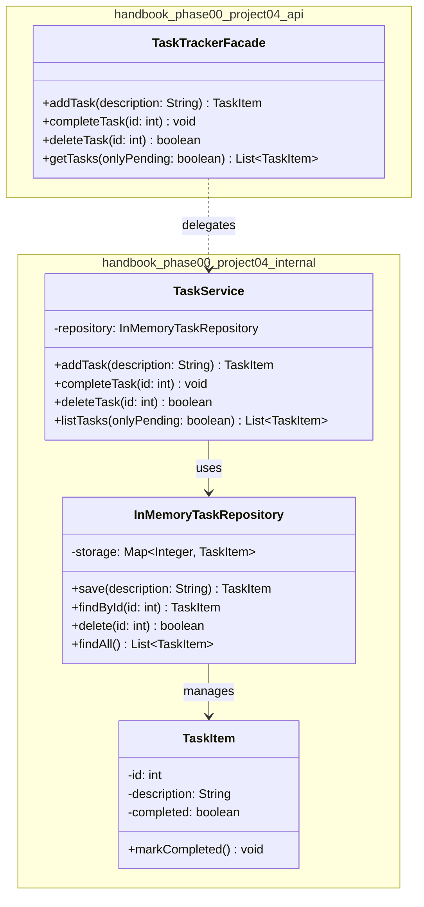

# Today's Objective

* **Today's Focus**: Implementing the **Module 00.04 Project (Production-Grade CLI Task Tracker Subsystem)** — the **Phase 0 Capstone Project**! You will integrate all 12 lessons of Phase 0: Syntax/Arrays (M01), Methods/Exceptions/JUnit (M02), Git/Maven/Packages (M03), and Debugging/Reading/CLI Katas (M04) into a production-grade, fully tested, and version-tagged Java subsystem.
* **Why Today's Work Matters**: Completing this capstone project concludes **Phase 0: Programming Prerequisites**! You prove that you can build self-contained, fully tested, version-tagged, and architecturally clean Java applications from scratch without relying on framework magic.
* **How it Connects to Previous Lessons**: Folds together Git DAG release tags (`v1.0.0-p00m04`), Maven GAV build coordinates, package-private facade boundaries, IDE interactive debugging verification, safety-net refactoring, and 3-Tier Layered Architecture.
* **How it Prepares You for Future Lessons**: Graduation day for Phase 0! Prepares you directly for starting **Phase 1: Object-Oriented Design (OOD)** tomorrow!
* **Estimated Study Duration**: 4 hours (entire available session).

---

# Warm-up (15–20 minutes)

Let's review the entire Phase 0 curriculum (Modules 00.01 through 00.04).

### Quick Recall Questions
1. How does the JVM stack frame manage primitive variables vs. heap reference pointers?
2. What is the difference between checked exceptions and unchecked exceptions in Java?
3. How do JUnit 5 `assertAll` and `assertThrows` enforce multi-assertion test confidence?
4. What is Joshua Bloch's Effective Java rule regarding class accessibility?
5. How does Constructor Dependency Injection (`new TaskTrackerFacade(new TaskService(...))`) improve code testability?

### Warm-up Coding Exercise
Write a terminal command to build a Maven project skipping tests (`mvn clean package -DskipTests`), and the git command to tag the release `v1.0.0-p00m04`.

---

# Step 1 — Video Lectures

To guide your capstone project architecture, watch this tutorial:

* **Title**: Building Production-Grade Java Applications - Architecture & Clean Code
* **Instructor**: Coding with John / Baeldung
* **Platform**: YouTube
* **URL**: [https://www.youtube.com/watch?v=vZm0lHciFsQ](https://www.youtube.com/watch?v=1oW_W9O67pU) (Focus on Clean Subsystems)
* **Duration**: ~12 minutes
* **Recommended Playback Speed**: 1.0x
* **Focus Areas**:
  * Focus on partitioning code into `api` (public facades) and `internal` (package-private engines & repositories) under standard Maven directory layouts.

---

# Step 2 — Reading

### Blog Track
* **Title**: *The Clean Architecture & Domain Separation*
* **Author**: Robert C. Martin (Uncle Bob)
* **URL**: [https://blog.cleancoder.com/uncle-bob/2012/08/13/the-clean-architecture.html](https://blog.cleancoder.com/uncle-bob/2012/08/13/the-clean-architecture.html)
* **Reading Objective**: Understand how domain entities and repository interfaces stay completely decoupled from external UI drivers and frameworks.
* **Estimated Reading Time**: 15 minutes

---

# Step 3 — Coding Practice

### Exercise: Multi-Layer Dependency Wiring (Medium)
* **Objective**: Wire domain entity, repository, and service layers with explicit exception guards.
* **Difficulty**: Medium
* **Expected Outcome**: Create a scratch test verifying that instantiating `TaskTrackerFacade` with null repositories or passing empty task descriptions throws `IllegalArgumentException` with descriptive error messages.
* **Hints**: Ensure every public entry point enforces non-null preconditions.

---

# Step 4 — Hands-on Lab

Today is a capstone project day. The project itself functions as today's extended lab. (See Step 5 for details).

---

# Step 5 — Project Work

### Capstone Milestone: Production-Grade CLI Task Tracker Subsystem

#### Problem Statement
Build an enterprise-grade CLI Task Tracker subsystem under `projects/module-04-project/`.
The subsystem exposes a `public class TaskTrackerFacade` under `handbook.phase00.project04.api`, delegates task management to package-private `TaskService` and `InMemoryTaskRepository` under `handbook.phase00.project04.internal`, handles full CRUD operations (`create`, `complete`, `delete`, `list`), and includes a complete JUnit 5 test suite.

#### Mandatory Version Control Workflow:
1. Create a feature branch: `git checkout -b feature/module-04-capstone`.
2. Implement code, tests, ADR, and documentation.
3. Make 3 atomic commits (`feat(project04): ...`, `test(project04): ...`, `docs(project04): ...`).
4. Rebase and merge into `main`, then tag the release: `git tag -a v1.0.0-p00m04 -m "Release Module 00.04 Capstone Project"`.

#### Suggested Folder Structure
Create this layout inside your workspace:
```text
projects/module-04-project/
  pom.xml
  README.md
  docs/
    architecture.md
    adr/0001-design-cli-architecture.md
    diagrams/
  src/
    main/java/handbook/phase00/project04/api/
      TaskTrackerFacade.java
    main/java/handbook/phase00/project04/internal/
      TaskItem.java
      InMemoryTaskRepository.java
      TaskService.java
    test/java/handbook/phase00/project04/
      TaskTrackerFacadeTest.java
```

#### 1. File: `projects/module-04-project/pom.xml`
```xml
<project xmlns="http://maven.apache.org/POM/4.0.0"
         xmlns:xsi="http://www.w3.org/2001/XMLSchema-instance"
         xsi:schemaLocation="http://maven.apache.org/POM/4.0.0 http://maven.apache.org/xsd/maven-4.0.0.xsd">
    <modelVersion>4.0.0</modelVersion>

    <groupId>handbook.phase00</groupId>
    <artifactId>module-04-project</artifactId>
    <version>1.0.0-SNAPSHOT</version>

    <dependencies>
        <dependency>
            <groupId>org.junit.jupiter</groupId>
            <artifactId>junit-jupiter-api</artifactId>
            <version>5.9.2</version>
            <scope>test</scope>
        </dependency>
    </dependencies>
</project>
```

#### 2. File: `projects/module-04-project/docs/adr/0001-design-cli-architecture.md`
```markdown
# ADR 0001: Task Tracker Facade and Package Encapsulation

## Context
We need to build a CLI Task Tracker subsystem that exposes a clean public API facade while keeping domain entities, services, and repository storage package-private.

## Decision
We expose a single public entry point `TaskTrackerFacade` under `handbook.phase00.project04.api`. All internal classes (`TaskService`, `InMemoryTaskRepository`, `TaskItem`) remain package-private under `handbook.phase00.project04.internal`.

## Consequence
Downstream callers interact strictly through `TaskTrackerFacade`, preventing illegal cross-package coupling to internal storage mechanisms.
```

#### 3. File: `projects/module-04-project/src/main/java/handbook/phase00/project04/internal/TaskItem.java`
```java
package handbook.phase00.project04.internal;

public class TaskItem { // Internal Domain Entity
    private final int id;
    private String description;
    private boolean completed;

    public TaskItem(int id, String description) {
        if (id <= 0) throw new IllegalArgumentException("Task ID must be positive.");
        if (description == null || description.trim().isEmpty()) {
            throw new IllegalArgumentException("Task description required.");
        }
        this.id = id;
        this.description = description.trim();
        this.completed = false;
    }

    public void markCompleted() {
        if (this.completed) throw new IllegalStateException("Task is already completed.");
        this.completed = true;
    }

    public int getId() { return id; }
    public String getDescription() { return description; }
    public boolean isCompleted() { return completed; }
}
```

#### 4. File: `projects/module-04-project/src/main/java/handbook/phase00/project04/internal/InMemoryTaskRepository.java`
```java
package handbook.phase00.project04.internal;

import java.util.*;

public class InMemoryTaskRepository { // Internal Storage Layer
    private final Map<Integer, TaskItem> storage = new HashMap<>();
    private int idSequence = 1;

    public TaskItem save(String description) {
        TaskItem task = new TaskItem(idSequence++, description);
        storage.put(task.getId(), task);
        return task;
    }

    public TaskItem findById(int id) {
        return storage.get(id);
    }

    public boolean delete(int id) {
        return storage.remove(id) != null;
    }

    public List<TaskItem> findAll() {
        return new ArrayList<>(storage.values()); // Defensive copy
    }
}
```

#### 5. File: `projects/module-04-project/src/main/java/handbook/phase00/project04/internal/TaskService.java`
```java
package handbook.phase00.project04.internal;

import java.util.List;
import java.util.stream.Collectors;

public class TaskService { // Internal Business Service
    private final InMemoryTaskRepository repository = new InMemoryTaskRepository();

    public TaskItem addTask(String description) {
        if (description == null || description.trim().isEmpty()) {
            throw new IllegalArgumentException("Task description required.");
        }
        for (TaskItem t : repository.findAll()) {
            if (t.getDescription().equalsIgnoreCase(description.trim())) {
                throw new IllegalArgumentException("Task with description already exists.");
            }
        }
        return repository.save(description);
    }

    public void completeTask(int id) {
        TaskItem task = repository.findById(id);
        if (task == null) {
            throw new IllegalArgumentException("Task ID " + id + " not found.");
        }
        task.markCompleted();
    }

    public boolean deleteTask(int id) {
        return repository.delete(id);
    }

    public List<TaskItem> listTasks(boolean onlyPending) {
        List<TaskItem> all = repository.findAll();
        if (onlyPending) {
            return all.stream().filter(t -> !t.isCompleted()).collect(Collectors.toList());
        }
        return all;
    }
}
```

#### 6. File: `projects/module-04-project/src/main/java/handbook/phase00/project04/api/TaskTrackerFacade.java`
```java
package handbook.phase00.project04.api;

import handbook.phase00.project04.internal.TaskItem;
import handbook.phase00.project04.internal.TaskService;
import java.util.List;

public class TaskTrackerFacade {
    private final TaskService service = new TaskService();

    public TaskItem addTask(String description) {
        return service.addTask(description);
    }

    public void completeTask(int id) {
        service.completeTask(id);
    }

    public boolean deleteTask(int id) {
        return service.deleteTask(id);
    }

    public List<TaskItem> getTasks(boolean onlyPending) {
        return service.listTasks(onlyPending);
    }
}
```

#### 7. File: `projects/module-04-project/src/test/java/handbook/phase00/project04/TaskTrackerFacadeTest.java`
```java
package handbook.phase00.project04;

import handbook.phase00.project04.api.TaskTrackerFacade;
import handbook.phase00.project04.internal.TaskItem;
import org.junit.jupiter.api.BeforeEach;
import org.junit.jupiter.api.Test;
import static org.junit.jupiter.api.Assertions.*;

public class TaskTrackerFacadeTest {

    private TaskTrackerFacade facade;

    @BeforeEach
    void setUp() {
        facade = new TaskTrackerFacade();
    }

    @Test
    void testAddTaskSuccess() {
        TaskItem task = facade.addTask("Write Documentation");
        assertNotNull(task);
        assertEquals(1, task.getId());
        assertEquals("Write Documentation", task.getDescription());
        assertFalse(task.isCompleted());
    }

    @Test
    void testCompleteTaskSuccess() {
        TaskItem task = facade.addTask("Complete Capstone");
        facade.completeTask(task.getId());
        assertTrue(facade.getTasks(false).get(0).isCompleted());
    }

    @Test
    void testDuplicateTaskThrowsException() {
        facade.addTask("Study OOD");
        assertThrows(IllegalArgumentException.class, () -> facade.addTask("STUDY OOD"));
    }

    @Test
    void testCompleteInvalidTaskIdThrowsException() {
        assertThrows(IllegalArgumentException.class, () -> facade.completeTask(999));
    }
}
```

---

# Step 6 — UML / Design Exercise

### UML Package & Class Architecture Diagram
Draw a static UML package and class diagram mapping the capstone architecture.
* **Why it matters**: Captures public facade API boundaries, internal engine encapsulation, and test dependencies.
* **What should appear in the diagram**:
  1. Package `handbook.phase00.project04.api` enclosing `+ TaskTrackerFacade`.
  2. Package `handbook.phase00.project04.internal` enclosing `TaskService`, `InMemoryTaskRepository`, and `TaskItem`.
  3. Package `handbook.phase00.project04` enclosing `TaskTrackerFacadeTest`.
  4. Dependency arrows connecting test to facade, and facade to internal service/repository/entities.

*You can write this diagram in Markdown using Mermaid syntax:*


---

# Step 7 — Engineering Insight

### Phase 0 Graduation: From Beginner to Systems Practitioner
What separates your Java capability today from when you started Phase 0?

| Aspect | Before Phase 0 | After Phase 0 |
| :--- | :--- | :--- |
| **Code Structure** | Monolithic `main()` scripts | 3-Tier Layered Architecture (`API` $\rightarrow$ `Service` $\rightarrow$ `Repository`) |
| **Error Handling** | Swallowing exceptions or ignoring errors | Custom Exception hierarchies & explicit boundary precondition guards |
| **Testing** | Manual console testing | Automated JUnit 5 suites (`assertAll`, `assertThrows`) |
| **Build & Git** | Loose files without versioning | Maven GAV builds & Git DAG rebase release tags (`v1.0.0`) |
| **Debugging** | Dumping `System.out.println()` | IDE Line/Conditional Breakpoints & Field Watchpoints |

You have successfully built the engineering foundation required for Object-Oriented Design in Phase 1!

---

# Step 8 — Open Source Connection

In **Spring Boot CLI & Kubernetes kubectl**:
* Production developer tools wrap complex internal services in a clean public facade, isolating domain models from CLI flag parsers and web server handlers.

---

# Step 9 — End-of-Day Reflection

1. How does integrating Git release tagging (`v1.0.0-p00m04`), Maven layouts, and package-private facades create a production-grade component?
2. How does `TaskTrackerFacadeTest` verify both happy paths and boundary precondition errors using JUnit 5 assertions?
3. What is the benefit of keeping `TaskService` and `InMemoryTaskRepository` inside an `internal` package?
4. How does Semantic Versioning (`v1.0.0-p00m04`) connect Git release tags with Maven GAV artifact coordinates?
5. What are you most excited to learn as you transition into **Phase 1: Object-Oriented Design (OOD)** tomorrow?

---

# Step 10 — Notes Template

Save a copy of this template to `projects/module-04-project/docs/architecture.md`:

```markdown
# Architecture Notes: Module 00.04 Capstone Project

## Subsystem Vision

## Multi-Package Boundary & Facade Design

## 3-Tier Layered Architecture Overview

## Phase 0 Graduation Reflections
```

---

# Step 11 — Journal Template

Save a copy of this template to `journal/2026-08-15.md`:

```markdown
# Daily Journal: 2026-08-15

## What I accomplished today

## Biggest insight

## Biggest challenge

## Questions I still have

## Time spent

## Confidence (1–10)

## Plan for tomorrow
```

---

# Final Checklist

- [ ] Warm-up complete
- [ ] Production-Grade Java Applications video tutorial watched
- [ ] Fowler's Clean Architecture guide read
- [ ] Coding Exercise (Multi-Layer Dependency Wiring) completed
- [ ] Project directory structure and `pom.xml` created
- [ ] Architectural record (`docs/adr/0001-design-cli-architecture.md`) written
- [ ] Classes (`TaskTrackerFacade`, `TaskService`, `InMemoryTaskRepository`, `TaskItem`) implemented
- [ ] JUnit 5 Test Suite (`TaskTrackerFacadeTest`) executed successfully with zero failures
- [ ] Git feature branch rebased, merged, and tagged (`v1.0.0-p00m04`)
- [ ] UML Package & Class Architecture diagram completed
- [ ] Architecture notes template saved in docs
- [ ] Daily journal written
- [ ] Git commit completed with designated message

---

### Recommended Git Commit Command:
```bash
git add .
git commit -m "project(P00.M04): complete module 0.4 project and phase 0 capstone"
```
