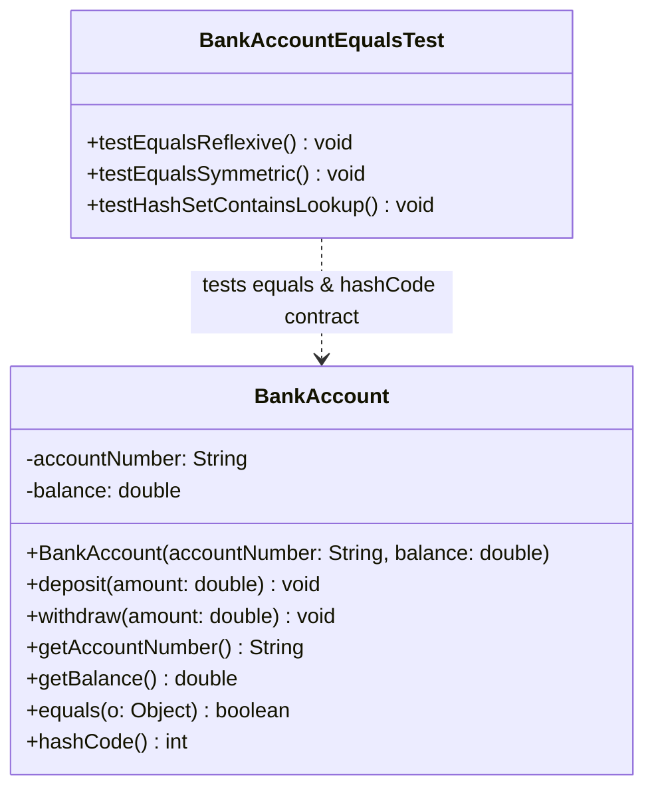

# Today's Objective

* **Today's Focus**: Overriding `equals()` and `hashCode()` contracts, preserving state invariants, understanding value equality vs. identity equality, and modeling domain objects with UML Class Diagrams.
* **Why Today's Work Matters**: In Java, hash-based collections (`HashMap`, `HashSet`) rely on the mathematical contract between `equals()` and `hashCode()`. If two objects are equal according to `equals()`, they MUST produce the same `hashCode()`. A senior engineer implements this contract carefully so domain objects can be stored and queried safely in collections.
* **How it Connects to Previous Lessons**: Yesterday, you learned Object Identity (`==`) vs. State Equality (`.equals()`). Today, you implement the complete `equals()` and `hashCode()` contract to make your domain objects collection-ready.
* **How it Prepares You for Future Lessons**: Prepares you directly for Encapsulation & Invariants (P01.M01.L02), Value Objects vs. Entities (P01.M01.L03), and ORM entity mappings in Phase 10.
* **Estimated Study Duration**: 3 hours (out of 4 hours available).

---

# Warm-up (10–15 minutes)

Let's review Object Identity (`==`), Object State (`.equals()`), and Rich Domain Models from Day 1 of this lesson.

### Quick Recall Questions
1. What is the fundamental difference between Object Identity (`==`) and Object State (`.equals()`)?
2. What is an Anemic Domain Model, and why is it considered an anti-pattern?
3. How do behavioral methods (`deposit()`, `withdraw()`) protect domain state invariants compared to raw setters?
4. What happens if two distinct object instances have identical field values but `.equals()` is not overridden?
5. Why are immutable domain objects easier to reason about in multithreaded systems?

### Warm-up Coding Exercise
Write the Java method signature for overriding `.equals(Object obj)` and `.hashCode()`.

---

# Step 1 — Video Lectures

To understand the `equals()` and `hashCode()` contract and collection lookup mechanics, watch this tutorial:

* **Title**: Java equals() and hashCode() Contract Explained Visually
* **Instructor**: Coding with John / Baeldung
* **Platform**: YouTube
* **URL**: [https://www.youtube.com/watch?v=vZm0lHciFsQ](https://www.youtube.com/watch?v=1oW_W9O67pU) (Focus on equals & hashCode)
* **Duration**: ~12 minutes
* **Recommended Playback Speed**: 1.0x
* **Focus Areas**:
  * Understand the 5 rules of `equals()`: **Reflexive**, **Symmetric**, **Transitive**, **Consistent**, and **NonNull**.
  * Understand the **hashCode() contract**: If `a.equals(b)` is true, then `a.hashCode() == b.hashCode()` MUST be true!
* **Notes to Take**:
  * State the 5 mathematical properties of `equals()`.
  * Explain why failing to override `hashCode()` breaks `HashSet` and `HashMap` lookups.

---

# Step 2 — Reading

### Book Track
* **Title**: *Effective Java* (3rd ed.) by Joshua Bloch
* **Chapter**: Item 10 ("Obey the General Contract When Overriding equals") & Item 11 ("Always Override hashCode When You Override equals")
* **Reading Objective**: Learn Joshua Bloch's recipe for overriding `equals()` (check `this == o`, `o instanceof Class`, cast, compare significant fields) and computing `Objects.hash()`.
* **Estimated Reading Time**: 45 minutes

---

# Step 3 — Coding Practice

### Exercise 1: Reimplementing BankAccount State Encapsulation from Memory (Medium)
* **Objective**: Reconstruct the `BankAccount` rich domain model and JUnit test suite from memory.
* **Difficulty**: Medium
* **Expected Outcome**: In `scratch/`, recreate `BankAccount.java` with private `accountNumber` and `balance`, behavioral `deposit()` and `withdraw()` methods, and invariant guards. Write a JUnit 5 test verifying overdraw protection.
* **Hints**: Do not look at yesterday's daily plan. Focus on writing clean precondition checks.
* **Common Mistakes**: Forgetting to check `amount <= 0` in `deposit()`.

### Exercise 2: Implementing the equals() and hashCode() Contract (Medium)
* **Objective**: Implement and test the `equals()` and `hashCode()` contract on a domain entity.
* **Difficulty**: Medium
* **Expected Outcome**:
  1. Open `BankAccount.java` under `scratch/`.
  2. Implement `equals(Object o)` according to Effective Java Item 10:
     ```java
     @Override
     public boolean equals(Object o) {
         if (this == o) return true;
         if (!(o instanceof BankAccount)) return false;
         BankAccount that = (BankAccount) o;
         return Double.compare(that.balance, balance) == 0 &&
                Objects.equals(accountNumber, that.accountNumber);
     }

     @Override
     public int hashCode() {
         return Objects.hash(accountNumber, balance);
     }
     ```
  3. Write JUnit 5 test `BankAccountEqualsTest.java` storing `BankAccount` instances inside a `HashSet`. Verify that `set.contains(new BankAccount("ACC-1001", 500.0))` returns `true`!
* **Hints**: Test `HashSet.contains()` to prove `hashCode()` works as expected.
* **Common Mistakes**: Overriding `equals()` with parameter `equals(BankAccount o)` instead of `equals(Object o)` (this overloads instead of overriding!).

---

# Step 4 — Hands-on Lab

No lab is scheduled today. (The hands-on lab for this lesson is scheduled for Day 3).

---

# Step 5 — Project Work

No project milestone is scheduled today. (The project connection is completed at the end of the module).

---

# Step 6 — UML / Design Exercise

### UML Exercise: Domain Entity Class Diagram
Draw a static UML Class Diagram modeling the `BankAccount` domain entity and its test suite.
* **Why it matters**: A class diagram captures field access levels (`-` for private), method signatures (`+` for public), overridden object contracts, and test dependencies.
* **What should appear in the diagram**:
  1. Class box `BankAccount` (fields: `- accountNumber: String`, `- balance: double`; methods: `+ deposit(amount: double) void`, `+ withdraw(amount: double) void`, `+ equals(o: Object) boolean`, `+ hashCode() int`).
  2. Class box `BankAccountEqualsTest` (methods: `+ testHashSetLookup() void`).
  3. Dependency arrow (`..>`) from `BankAccountEqualsTest` to `BankAccount`.

*You can write this diagram in Markdown using Mermaid syntax:*


---

# Step 7 — Engineering Insight

### The HashMap Lookup Mechanics
Why does breaking the `hashCode()` contract corrupt `HashMap` lookups?

1. **Bucket Calculation**: When you call `map.get(key)`, the `HashMap` first computes `int hash = key.hashCode()`. It uses this integer to find the array bucket index (`hash & (table.length - 1)`).
2. **Bucket Traversal**: If `hashCode()` is not overridden, two equal objects will produce different hash codes and jump to **different array buckets**. The map will return `null` even if an equal object exists!
3. **Equals Check**: Once inside the correct bucket, the `HashMap` uses `a.equals(b)` to find the exact matching key.

**Golden Rule**: Always override `hashCode()` whenever you override `equals()`!

---

# Step 8 — Open Source Connection

In **Hibernate ORM & JPA Entities**:
* JPA entity models override `equals()` and `hashCode()` based on primary key IDs (`id`).
* This ensures that when entities are attached, detached, or stored in persistent sets across database transactions, Hibernate correctly identifies entity instances without duplicating database records.

---

# Step 9 — End-of-Day Reflection

1. What are the 5 mathematical properties required by the `equals()` contract?
2. What is the fundamental rule linking `equals()` and `hashCode()`?
3. Why does overriding `equals(BankAccount o)` instead of `equals(Object o)` fail to override Java's `Object.equals()`?
4. How does `HashMap` use `hashCode()` and `equals()` during a `.get(key)` operation?
5. How do JPA and Hibernate use `equals()` and `hashCode()` to maintain entity identity across database sessions?

---

# Step 10 — Notes Template

Append this template to `notes/P01.M01.L01.md`:

```markdown
# Notes: P01.M01.L01 - Classes, objects, identity, and state

## Key Concepts

## Important Definitions

## Things That Clicked Today

## Things I Still Don't Understand

## Mistakes I Made

## Real-world Connections

## Questions To Revisit
```

---

# Step 11 — Journal Template

Save a copy of this template to `journal/2026-08-17.md`:

```markdown
# Daily Journal: 2026-08-17

## What I accomplished today

## Biggest insight

## Biggest challenge

## Questions I still have

## Time spent

## Confidence (1–10)

## Plan for tomorrow
```

---

# Final Checklist

- [ ] Warm-up complete
- [ ] Java equals() and hashCode() video tutorial watched
- [ ] Effective Java Item 10 & 11 read
- [ ] Coding Exercise 1 (BankAccount rich domain model recall from memory) completed
- [ ] Coding Exercise 2 (equals and hashCode override with HashSet lookup test) completed
- [ ] Mermaid Domain Entity Class Diagram drawn
- [ ] Reflection questions answered
- [ ] Notes file (`notes/P01.M01.L01.md`) updated
- [ ] Journal file (`journal/2026-08-17.md`) created from template
- [ ] Git commit completed with designated message

---

### Recommended Git Commit Command:
```bash
git add .
git commit -m "study(P01.M01.L01): complete day 2"
```
