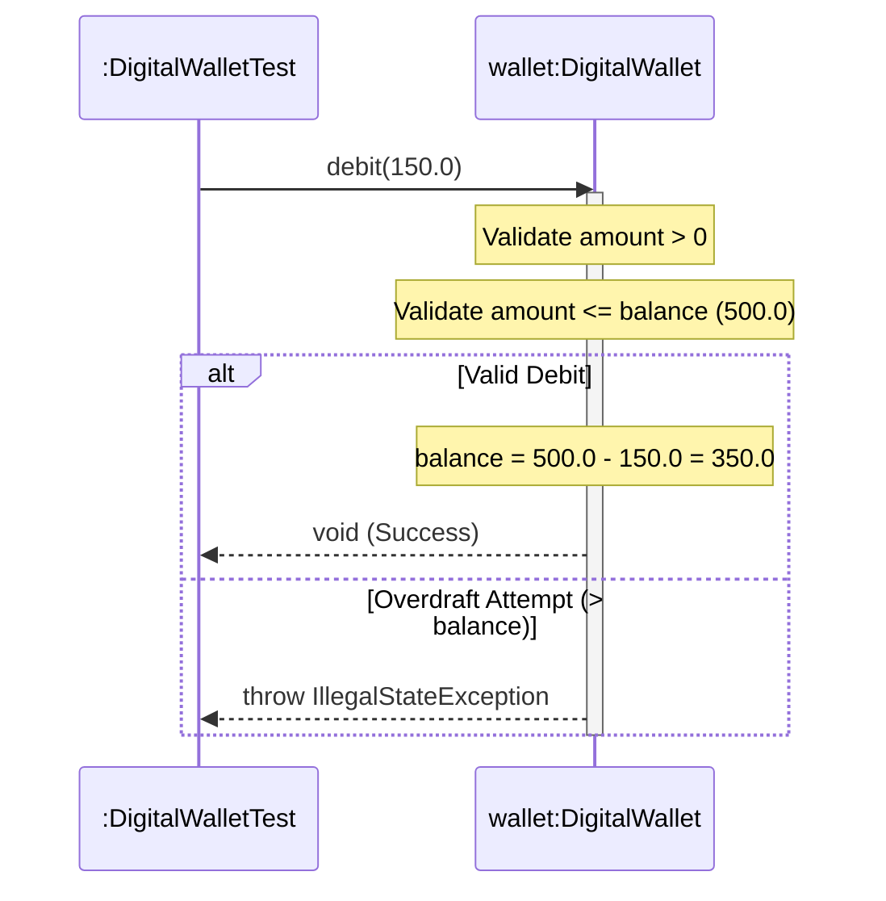

# Today's Objective

* **Today's Focus**: Implementing the Lesson 13 Lab (the **Domain Entity State & Identity Management Lab**), building a `DigitalWallet` domain entity that encapsulates mutable financial state, enforcing invariant validation rules, overriding `equals()` and `hashCode()` based on immutable identity keys, writing JUnit 5 verification suites, and modeling state transitions using UML sequence diagrams.
* **Why Today's Work Matters**: Domain entities form the core of enterprise software architecture. You will design a `DigitalWallet` entity where state mutations (credit/debit) are protected by explicit business rules, and where entity equality is strictly tied to immutable identity IDs rather than mutable balance fields.
* **How it Connects to Previous Lessons**: Yesterday, you learned the `equals()` and `hashCode()` contracts. Today, you apply those contracts to build an executable, tested domain entity.
* **How it Prepares You for Future Lessons**: Completing this lesson finishes Lesson 13, preparing you directly for Encapsulation & Invariants (`P01.M01.L02`) and Value Objects vs. Entities (`P01.M01.L03`).
* **Estimated Study Duration**: 3 hours (out of 4 hours available).

---

# Warm-up (10–15 minutes)

Let's review the 5 rules of `equals()`, `hashCode()` bucket lookups, and rich domain models from Day 2.

### Quick Recall Questions
1. Why must `equals()` and `hashCode()` be overridden together?
2. What happens to a `HashSet` lookup if an object's `hashCode()` changes after it has been added to the set?
3. What is the difference between an Entity's Identity (e.g. `walletId`) and its State (e.g. `balance`)?
4. Why should an Entity's `equals()` contract depend on immutable identity fields rather than mutable state fields?
5. How do behavioral methods (`credit()`, `debit()`) enforce invariants compared to raw setters?

### Warm-up Coding Exercise
Write a Java `Objects.hash()` implementation for a class with an immutable `String walletId` field.

---

# Step 1 — Video Lectures

To understand how Domain-Driven Design models entities and state invariants, watch this tutorial:

* **Title**: Domain-Driven Design - Modeling Entities, State, and Invariants
* **Instructor**: Martin Fowler / Coding with John
* **Platform**: YouTube
* **URL**: [https://www.youtube.com/watch?v=vZm0lHciFsQ](https://www.youtube.com/watch?v=1oW_W9O67pU) (Focus on Entities & Invariants)
* **Duration**: ~10 minutes
* **Recommended Playback Speed**: 1.0x
* **Focus Areas**:
  * Learn why an Entity's identity (`walletId`) remains constant throughout its lifecycle even as its state (`balance`) changes.
  * Understand how invariant validation rules prevent invalid state transitions.
* **Notes to Take**:
  * Define *Entity Identity* vs. *Entity State*.
  * Explain why basing `hashCode()` on mutable fields breaks hash collections.

---

# Step 2 — Reading

### Book Track
* **Title**: *Domain-Driven Design: Tackling Complexity in the Heart of Software*
* **Author**: Eric Evans / Joshua Bloch's *Effective Java Item 17*
* **Reading Objective**: Comprehend how entity identity differs from value object state, ensuring that entity equality is anchored to unique immutable IDs.
* **Estimated Reading Time**: 20 minutes

---

# Step 3 — Coding Practice

### Exercise: Debugging Equals Contract Violation (Medium)
* **Objective**: Fix a broken `equals()` implementation that depends on mutable state fields.
* **Difficulty**: Medium
* **Expected Outcome**:
  1. Create `FaultyEntityDebug.java` under `scratch/`:
     ```java
     public class FaultyEntityDebug {
         private final String walletId;
         private double balance;

         public FaultyEntityDebug(String walletId, double balance) {
             this.walletId = walletId;
             this.balance = balance;
         }

         public void setBalance(double balance) { this.balance = balance; }

         // BUG: equals() depends on mutable 'balance'!
         @Override
         public boolean equals(Object o) {
             if (this == o) return true;
             if (!(o instanceof FaultyEntityDebug)) return false;
             FaultyEntityDebug that = (FaultyEntityDebug) o;
             return Double.compare(that.balance, balance) == 0 && Objects.equals(walletId, that.walletId);
         }

         @Override
         public int hashCode() {
             return Objects.hash(walletId, balance); // BROKEN!
         }
     }
     ```
  2. Write a main method adding `FaultyEntityDebug` to a `HashSet`. Mutate `setBalance(999.0)`.
  3. Call `set.contains(entity)`. Observe that it returns `false` (corrupted hash bucket!).
  4. Fix `equals()` and `hashCode()` to depend strictly on immutable `walletId`. Verify `set.contains(entity)` now returns `true` even after balance changes!

---

# Step 4 — Hands-on Lab

### Lab: Domain Entity State & Identity Management

#### Problem Statement
Design a financial `DigitalWallet` domain entity under package `handbook.phase01.p01m01l01`.
1. `DigitalWallet.java`: Domain entity with immutable `walletId`, mutable `balance`, and `currency`.
2. Invariants: balance cannot drop below zero (`OVERDRAFT_PROTECTION`), credit/debit amounts must be positive, currency must match.
3. Identity: `equals()` and `hashCode()` strictly based on immutable `walletId`.
4. Tests: `DigitalWalletTest.java` verifying credit, debit, overdraw exception boundaries, and set lookup integrity across state mutations.

#### Starter Folder Structure
```text
src/main/java/handbook/phase01/p01m01l01/DigitalWallet.java
src/test/java/handbook/phase01/p01m01l01/DigitalWalletTest.java
docs/P01.M01.L01-diagram.md
```

#### Code Implementation Guidelines

##### DigitalWallet.java
```java
package handbook.phase01.p01m01l01;

import java.util.Objects;

public class DigitalWallet {
    private final String walletId;
    private final String currency;
    private double balance;

    public DigitalWallet(String walletId, String currency, double initialBalance) {
        if (walletId == null || walletId.trim().isEmpty()) {
            throw new IllegalArgumentException("Wallet ID required.");
        }
        if (currency == null || currency.trim().isEmpty()) {
            throw new IllegalArgumentException("Currency required.");
        }
        if (initialBalance < 0.0) {
            throw new IllegalArgumentException("Initial balance cannot be negative.");
        }
        this.walletId = walletId.trim();
        this.currency = currency.trim().toUpperCase();
        this.balance = initialBalance;
    }

    public void credit(double amount) {
        if (amount <= 0.0) {
            throw new IllegalArgumentException("Credit amount must be positive.");
        }
        this.balance += amount;
    }

    public void debit(double amount) {
        if (amount <= 0.0) {
            throw new IllegalArgumentException("Debit amount must be positive.");
        }
        if (amount > this.balance) {
            throw new IllegalStateException("Insufficient funds: Overdraft prevented.");
        }
        this.balance -= amount;
    }

    public String getWalletId() { return walletId; }
    public String getCurrency() { return currency; }
    public double getBalance() { return balance; }

    @Override
    public boolean equals(Object o) {
        if (this == o) return true;
        if (!(o instanceof DigitalWallet)) return false;
        DigitalWallet that = (DigitalWallet) o;
        return Objects.equals(walletId, that.walletId); // Identity-based equality!
    }

    @Override
    public int hashCode() {
        return Objects.hash(walletId); // Identity-based hash code!
    }
}
```

##### DigitalWalletTest.java
```java
package handbook.phase01.p01m01l01;

import org.junit.jupiter.api.BeforeEach;
import org.junit.jupiter.api.Test;
import java.util.HashSet;
import java.util.Set;
import static org.junit.jupiter.api.Assertions.*;

public class DigitalWalletTest {

    private DigitalWallet wallet;

    @BeforeEach
    void setUp() {
        wallet = new DigitalWallet("W-1001", "USD", 500.0);
    }

    @Test
    void testCreditIncreasesBalance() {
        wallet.credit(200.0);
        assertEquals(700.0, wallet.getBalance(), 0.001);
    }

    @Test
    void testDebitDecreasesBalance() {
        wallet.debit(150.0);
        assertEquals(350.0, wallet.getBalance(), 0.001);
    }

    @Test
    void testOverdraftThrowsIllegalStateException() {
        assertThrows(IllegalStateException.class, () -> wallet.debit(1000.0));
    }

    @Test
    void testInvalidCreditAmountThrowsException() {
        assertThrows(IllegalArgumentException.class, () -> wallet.credit(-50.0));
    }

    @Test
    void testHashSetIdentityIntegrityAfterStateMutation() {
        Set<DigitalWallet> set = new HashSet<>();
        set.add(wallet);

        // Mutate state!
        wallet.credit(500.0);
        wallet.debit(100.0);

        // Set lookup MUST still succeed because equality is identity-based!
        assertTrue(set.contains(wallet));
        assertTrue(set.contains(new DigitalWallet("W-1001", "USD", 0.0)));
    }
}
```

---

# Step 5 — Project Work

No project milestone is scheduled today. (The project connection is completed at the end of the module).

---

# Step 6 — UML / Design Exercise

### UML Sequence Diagram
Draw a sequence diagram visualizing state mutation and invariant checks during a debit operation.
* **Why it matters**: Captures temporal behavior and exception decision points during object state mutation.
* **What should appear in the diagram**:
  1. Lifelines: `:DigitalWalletTest` and `wallet:DigitalWallet`.
  2. `:DigitalWalletTest` calling `wallet.debit(150.0)`.
  3. `wallet` validating precondition `amount > 0` and `amount <= balance`.
  4. `wallet` mutating `balance = balance - amount`.
  5. `wallet` returning `void`.

*You can write this diagram in Markdown using Mermaid syntax:*


---

# Step 7 — Engineering Insight

### Entity Identity vs. Mutable State
Why must an Entity's `equals()` and `hashCode()` depend strictly on immutable identity keys?

* **Mutable State Violation**: If `equals()` depends on `balance`, mutating the balance changes `hashCode()`. If the object is stored inside a `HashSet` or `HashMap`, changing its balance makes it invisible to `.contains()`, corrupting collection memory!
* **Identity-Based Equality**: By anchoring `equals()` and `hashCode()` to an immutable `walletId` / `UUID`, the object can mutate its internal state millions of times while retaining 100% integrity inside collections.

---

# Step 8 — Open Source Connection

In **Spring Data JPA & Hibernate Entities**:
* JPA entities (`@Entity`) base `equals()` and `hashCode()` on primary key IDs (`@Id private Long id;`) or business key UUIDs.
* This allows Hibernate to track entity modifications across database transactions without losing entity identity in persistent sets.

---

# Step 9 — End-of-Day Reflection

1. Why should an Entity's `equals()` contract be based on immutable identity keys (`walletId`) rather than mutable state (`balance`)?
2. What happened in the coding exercise when `hashCode()` depended on a mutable field that was modified inside a `HashSet`?
3. How do behavioral methods (`credit()`, `debit()`) enforce invariants compared to raw setters?
4. How does `DigitalWalletTest` verify both happy path credits, overdraft exceptions, and set lookup integrity?
5. How do JPA and Hibernate use identity-based `equals()` to track entity modifications across transactions?

---

# Step 10 — Notes Template

Append this template to `notes/P01.M01.L01.md`:

```markdown
# Notes: P01.M01.L01 - Classes, objects, identity, and state

## Key Concepts

## Important Definitions

## Things That Clicked Today

## Things I Still Don't Understand

## Mistakes I Made

## Real-world Connections

## Questions To Revisit
```

---

# Step 11 — Journal Template

Save a copy of this template to `journal/2026-08-18.md`:

```markdown
# Daily Journal: 2026-08-18

## What I accomplished today

## Biggest insight

## Biggest challenge

## Questions I still have

## Time spent

## Confidence (1–10)

## Plan for tomorrow
```

---

# Final Checklist

- [ ] Warm-up complete
- [ ] Modeling Entities & Invariants video tutorial watched
- [ ] Evans' DDD & Effective Java Item 17 read
- [ ] Coding Exercise (FaultyEntityDebug mutable hashCode fix) completed
- [ ] Lab: Domain Entity State & Identity Management implemented
- [ ] `DigitalWallet.java` and `DigitalWalletTest.java` written under `handbook.phase01.p01m01l01`
- [ ] `DigitalWalletTest` executed successfully with zero failures
- [ ] UML Debit Sequence diagram drawn (Mermaid or Paper)
- [ ] Reflection questions answered
- [ ] Notes file (`notes/P01.M01.L01.md`) updated and finalized
- [ ] Journal file (`journal/2026-08-18.md`) created from template
- [ ] Git commit completed with designated message

---

### Recommended Git Commit Command:
```bash
git add .
git commit -m "study(P01.M01.L01): complete day 3"
```
