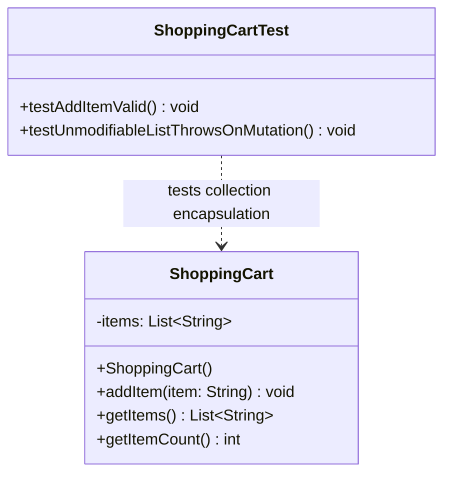

# Today's Objective

* **Today's Focus**: Defensive Copying for Mutable Collections (`List.copyOf()`, `Collections.unmodifiableList()`), enforcing collection encapsulation, applying Access Control modifiers (`private` vs. `package-private`), and modeling encapsulated classes using UML Class Diagrams.
* **Why Today's Work Matters**: Returning an internal `List<T>` field directly from a getter allows external code to call `.add()`, `.remove()`, or `.clear()`, bypassing all validation logic and corrupting your object's internal collection invariants. You will learn how to wrap collection getters with defensive copies or unmodifiable wrappers.
* **How it Connects to Previous Lessons**: Yesterday, you learned defensive copying for mutable Date objects. Today, you apply defensive copying to Java Collection objects (`List`, `Map`, `Set`).
* **How it Prepares You for Future Lessons**: Prepares you directly for Value Objects, Entities, and Records (P01.M01.L03) and domain aggregate modeling in Phase 2.
* **Estimated Study Duration**: 3 hours (out of 4 hours available).

---

# Warm-up (10–15 minutes)

Let's review Domain Invariants, Reference Leaks, and Defensive Copying for Date objects from Day 1 of this lesson.

### Quick Recall Questions
1. What is a Reference Leak, and how does it allow external code to bypass class validation logic?
2. What is a Domain Invariant? Give an example from software modeling.
3. Why should defensive copies be made BEFORE validating invariants in constructors?
4. How do modern Java types like `java.time.Instant` eliminate the need for defensive copying compared to legacy `java.util.Date`?
5. What is the difference between making a field `private` and achieving true encapsulation?

### Warm-up Coding Exercise
Write a Java method returning an unmodifiable copy of a `List<String> items` field using `List.copyOf()` or `Collections.unmodifiableList()`.

---

# Step 1 — Video Lectures

To understand Collection Encapsulation and Unmodifiable Wrappers, watch this tutorial:

* **Title**: Java Encapsulation & Unmodifiable Collections Explained
* **Instructor**: Coding with John / Baeldung
* **Platform**: YouTube
* **URL**: [https://www.youtube.com/watch?v=vZm0lHciFsQ](https://www.youtube.com/watch?v=1oW_W9O67pU) (Focus on Unmodifiable Collections)
* **Duration**: ~12 minutes
* **Recommended Playback Speed**: 1.0x
* **Focus Areas**:
  * Understand **Collection Leaks**: Why returning internal `ArrayList` references breaks class invariants.
  * Compare **`List.copyOf()`** (unmodifiable shallow copy) vs. **`Collections.unmodifiableList()`** (unmodifiable view wrapper).
* **Notes to Take**:
  * Explain the difference between an Unmodifiable View wrapper and an Unmodifiable Copy.
  * Write down what happens when downstream code attempts to call `.add()` on `List.copyOf()`.

---

# Step 2 — Reading

### Book Track
* **Title**: *Effective Java* (3rd ed.) by Joshua Bloch
* **Chapter**: Item 15 ("Minimize the accessibility of classes and members") & Item 50 ("Make defensive copies when needed")
* **Reading Objective**: Learn why returning mutable arrays or lists breaks encapsulation, and how Joshua Bloch recommends protecting collection fields.
* **Estimated Reading Time**: 45 minutes

---

# Step 3 — Coding Practice

### Exercise 1: Reimplementing SecurePeriod from Memory (Medium)
* **Objective**: Reconstruct the `SecurePeriod` defensive copying class and test suite from memory.
* **Difficulty**: Medium
* **Expected Outcome**: In `scratch/`, recreate `SecurePeriod.java` making defensive copies in constructor and getters. Write a JUnit 5 test verifying that mutating the returned Date object does not alter internal state.
* **Hints**: Do not look at yesterday's daily plan. Focus on making defensive copies BEFORE validating invariants.
* **Common Mistakes**: Validating parameters before copying them.

### Exercise 2: Encapsulating Collection Fields (Medium)
* **Objective**: Protect internal `List` fields against external mutation using defensive copies and unmodifiable lists.
* **Difficulty**: Medium
* **Expected Outcome**:
  1. Create `ShoppingCart.java` under `scratch/`:
     * Private field: `private final List<String> items = new ArrayList<>();`
     * Methods: `void addItem(String item)` (validates item is not empty), `List<String> getItems()`.
     * Fix collection leak: In `getItems()`, return `List.copyOf(items)` or `Collections.unmodifiableList(items)`.
  2. Write a JUnit 5 test `ShoppingCartTest.java` verifying that:
     * Calling `addItem("Laptop")` works.
     * Attempting to call `cart.getItems().add("Free TV")` throws `UnsupportedOperationException`!
     * Attempting to call `cart.getItems().clear()` throws `UnsupportedOperationException`!
* **Hints**: `List.copyOf()` throws `UnsupportedOperationException` if downstream code attempts to mutate the returned list.
* **Common Mistakes**: Returning `this.items` directly from `getItems()`.

---

# Step 4 — Hands-on Lab

No lab is scheduled today. (The hands-on lab for this lesson is scheduled for Day 3).

---

# Step 5 — Project Work

No project milestone is scheduled today. (The project connection is completed at the end of the module).

---

# Step 6 — UML / Design Exercise

### UML Exercise: Encapsulated Collection Class Diagram
Draw a static UML Class Diagram modeling `ShoppingCart` and its collection encapsulation test suite.
* **Why it matters**: A class diagram shows how collection fields (`- items: List<String>`) are protected by public access methods (`+ getItems(): List<String>`).
* **What should appear in the diagram**:
  1. Class box `ShoppingCart` (fields: `- items: List<String>`; methods: `+ addItem(item: String) void`, `+ getItems() List<String>`).
  2. Class box `ShoppingCartTest` (methods: `+ testAddItemValid() void`, `+ testUnmodifiableListProtection() void`).
  3. Dependency arrow (`..>`) from `ShoppingCartTest` to `ShoppingCart`.

*You can write this diagram in Markdown using Mermaid syntax:*


---

# Step 7 — Engineering Insight

### Unmodifiable View vs. Defensive Copy
What is the difference between `Collections.unmodifiableList(list)` and `List.copyOf(list)`?

| Property | `Collections.unmodifiableList(list)` | `List.copyOf(list)` |
| :--- | :--- | :--- |
| **Mechanism** | Wraps original list in an unmodifiable view | Creates a brand-new independent snapshot |
| **Mutation via Original** | If internal code mutates `list`, the view updates! | Completely immune to future internal list mutations |
| **Null Tolerance** | Permits null elements | Throws `NullPointerException` on null elements |
| **Recommended Use** | Quick view where original list won't change | Returning snapshots from public getters (Defensive Copy) |

**Senior Rule**: Use `List.copyOf()` or return defensive copies when returning collection snapshots from domain entities!

---

# Step 8 — Open Source Connection

In **Google Guava (`ImmutableList`) & JDK 10+ (`List.copyOf`)**:
* Open-source libraries enforce collection immutability at the API boundary.
* When you pass collections to Guava's `ImmutableList.copyOf(items)`, Guava creates a thread-safe, immutable snapshot that guarantees no caller can mutate the list contents.

---

# Step 9 — End-of-Day Reflection

1. Why does returning an internal `ArrayList` reference directly from a getter break collection encapsulation?
2. What exception is thrown when downstream code attempts to call `.add()` on `List.copyOf()`?
3. What is the difference between `Collections.unmodifiableList()` (a view) and `List.copyOf()` (a snapshot copy)?
4. Why should input item validation occur inside domain methods (`addItem()`) rather than allowing raw list access?
5. How does Google Guava's `ImmutableList` enforce collection immutability across multi-layered systems?

---

# Step 10 — Notes Template

Append this template to `notes/P01.M01.L02.md`:

```markdown
# Notes: P01.M01.L02 - Encapsulation, invariants, and access control

## Key Concepts

## Important Definitions

## Things That Clicked Today

## Things I Still Don't Understand

## Mistakes I Made

## Real-world Connections

## Questions To Revisit
```

---

# Step 11 — Journal Template

Save a copy of this template to `journal/2026-08-20.md`:

```markdown
# Daily Journal: 2026-08-20

## What I accomplished today

## Biggest insight

## Biggest challenge

## Questions I still have

## Time spent

## Confidence (1–10)

## Plan for tomorrow
```

---

# Final Checklist

- [ ] Warm-up complete
- [ ] Unmodifiable Collections video tutorial watched
- [ ] Effective Java Item 15 & 50 read
- [ ] Coding Exercise 1 (SecurePeriod recall from memory) completed
- [ ] Coding Exercise 2 (ShoppingCart collection encapsulation with List.copyOf) completed
- [ ] Mermaid Encapsulated Collection Class Diagram drawn
- [ ] Reflection questions answered
- [ ] Notes file (`notes/P01.M01.L02.md`) updated
- [ ] Journal file (`journal/2026-08-20.md`) created from template
- [ ] Git commit completed with designated message

---

### Recommended Git Commit Command:
```bash
git add .
git commit -m "study(P01.M01.L02): complete day 2"
```
