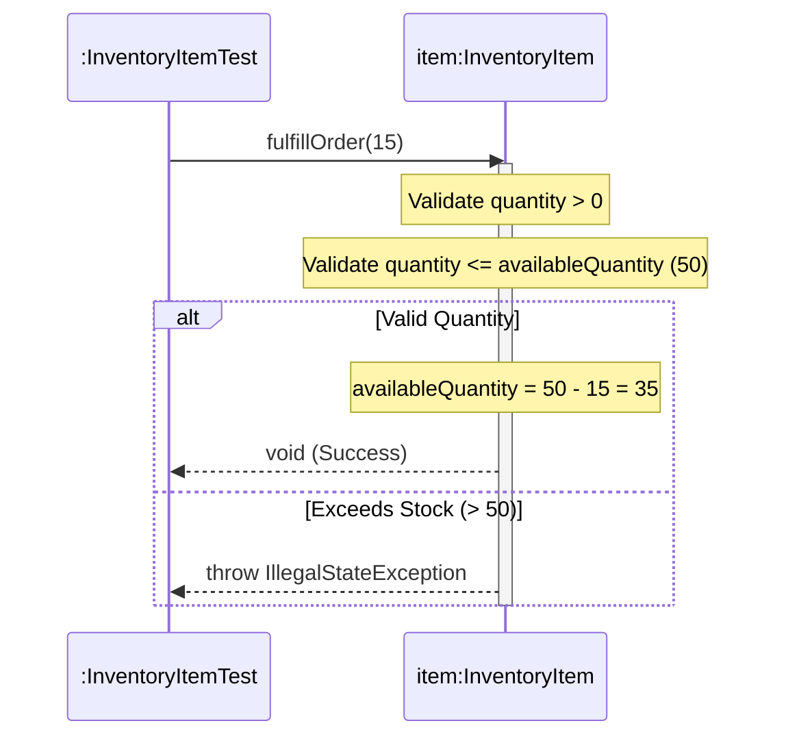

# Today's Objective

* **Today's Focus**: Implementing the Lesson 14 Lab (the **Encapsulated Inventory & Stock Control Subsystem Lab**), enforcing multi-field domain invariants (`availableQuantity >= 0`, `reservedQuantity <= totalQuantity`), protecting collection fields via defensive copying (`List.copyOf()`), writing JUnit 5 verification suites, and modeling invariant validation flows using UML sequence diagrams.
* **Why Today's Work Matters**: Encapsulation is your primary defense against state corruption. You will build an inventory management component under `handbook.phase01.p01m01l02` that protects stock level invariants, validates reorder thresholds, and prevents downstream code from mutating internal stock lists.
* **How it Connects to Previous Lessons**: Yesterday, you learned defensive copying for collections (`List.copyOf()`). Today, you combine object and collection encapsulation to build an executable, tested domain component.
* **How it Prepares You for Future Lessons**: Completing this lesson finishes Lesson 14, preparing you directly for Value Objects, Entities, and Records (`P01.M01.L03`).
* **Estimated Study Duration**: 3 hours (out of 4 hours available).

---

# Warm-up (10–15 minutes)

Let's review defensive copying for collections, unmodifiable views, and reference leaks from Day 2.

### Quick Recall Questions
1. Why does returning an internal `ArrayList` reference directly from a getter break collection encapsulation?
2. What exception is thrown when downstream code attempts to call `.add()` on `List.copyOf()`?
3. What is the difference between `Collections.unmodifiableList()` (a view) and `List.copyOf()` (a snapshot copy)?
4. Why should defensive copies be made BEFORE validating invariants in constructors?
5. What is a Domain Invariant? Give an example involving two fields.

### Warm-up Coding Exercise
Write a Java method `void validateQuantity(int requested, int available)` that throws `IllegalStateException` if `requested > available`.

---

# Step 1 — Video Lectures

To understand how to model invariant-safe domain objects in Java, watch this tutorial:

* **Title**: Designing Invariant-Safe Domain Models in Java
* **Instructor**: Martin Fowler / Coding with John
* **Platform**: YouTube
* **URL**: [https://www.youtube.com/watch?v=vZm0lHciFsQ](https://www.youtube.com/watch?v=1oW_W9O67pU) (Focus on Domain Invariants)
* **Duration**: ~10 minutes
* **Recommended Playback Speed**: 1.0x
* **Focus Areas**:
  * Learn how to encapsulate interdependent fields (e.g. `totalQuantity` and `reservedQuantity`) inside single business methods.
  * Understand why raw setters break multi-field invariants.
* **Notes to Take**:
  * Define *Interdependent Invariants*.
  * Explain why multi-field updates must occur inside atomic domain methods.

---

# Step 2 — Reading

### Book Track
* **Title**: *Effective Java Item 15 & 50* / *Domain-Driven Design (Invariants Chapter)*
* **Reading Objective**: Comprehend how to encapsulate multi-field state invariants and prevent collection leaks in enterprise software.
* **Estimated Reading Time**: 20 minutes

---

# Step 3 — Coding Practice

### Exercise: Debugging Interdependent Invariant Violations (Medium)
* **Objective**: Fix a class where separate setters allowed invalid multi-field states.
* **Difficulty**: Medium
* **Expected Outcome**:
  1. Create `StockItemDebug.java` under `scratch/`:
     ```java
     public class StockItemDebug {
         private int totalQuantity;
         private int reservedQuantity;

         public StockItemDebug(int totalQuantity) {
             if (totalQuantity < 0) throw new IllegalArgumentException("Total quantity cannot be negative.");
             this.totalQuantity = totalQuantity;
             this.reservedQuantity = 0;
         }

         // Atomic Domain Method: Enforces interdependent invariant!
         public void reserveStock(int amount) {
             if (amount <= 0) throw new IllegalArgumentException("Reservation amount must be positive.");
             if (this.reservedQuantity + amount > this.totalQuantity) {
                 throw new IllegalStateException("Cannot reserve more than total available stock.");
             }
             this.reservedQuantity += amount;
         }

         public int getAvailableStock() { return totalQuantity - reservedQuantity; }
         public int getTotalQuantity() { return totalQuantity; }
         public int getReservedQuantity() { return reservedQuantity; }
     }
     ```
  2. Write JUnit 5 test `StockItemDebugTest.java` verifying that reserving valid stock succeeds while over-reserving throws `IllegalStateException`.

---

# Step 4 — Hands-on Lab

### Lab: Encapsulated Inventory & Stock Control Subsystem

#### Problem Statement
Design an encapsulated inventory management component under package `handbook.phase01.p01m01l02`.
1. `InventoryItem.java`: Encapsulated domain entity storing `sku`, `name`, `availableQuantity`, `reorderThreshold`, and `supplierTags`.
2. Invariants: `availableQuantity >= 0`, `reorderThreshold > 0`, `supplierTags` must return an unmodifiable defensive copy (`List.copyOf()`).
3. Behavior: `restock(int qty)`, `fulfillOrder(int qty)`, `isReorderNeeded()`.
4. Tests: `InventoryItemTest.java` verifying restocking, fulfillment boundaries, overdraft exceptions, and collection encapsulation.

#### Starter Folder Structure
```text
src/main/java/handbook/phase01/p01m01l02/InventoryItem.java
src/test/java/handbook/phase01/p01m01l02/InventoryItemTest.java
docs/P01.M01.L02-diagram.md
```

#### Code Implementation Guidelines

##### InventoryItem.java
```java
package handbook.phase01.p01m01l02;

import java.util.ArrayList;
import java.util.List;

public class InventoryItem {
    private final String sku;
    private final String name;
    private final int reorderThreshold;
    private int availableQuantity;
    private final List<String> supplierTags;

    public InventoryItem(String sku, String name, int initialQuantity, int reorderThreshold, List<String> supplierTags) {
        if (sku == null || sku.trim().isEmpty()) throw new IllegalArgumentException("SKU required.");
        if (name == null || name.trim().isEmpty()) throw new IllegalArgumentException("Item name required.");
        if (initialQuantity < 0) throw new IllegalArgumentException("Initial quantity cannot be negative.");
        if (reorderThreshold <= 0) throw new IllegalArgumentException("Reorder threshold must be positive.");

        this.sku = sku.trim().toUpperCase();
        this.name = name.trim();
        this.availableQuantity = initialQuantity;
        this.reorderThreshold = reorderThreshold;
        // Defensive Copy of Input Collection!
        this.supplierTags = supplierTags != null ? List.copyOf(supplierTags) : List.of();
    }

    public void restock(int quantity) {
        if (quantity <= 0) {
            throw new IllegalArgumentException("Restock quantity must be positive.");
        }
        this.availableQuantity += quantity;
    }

    public void fulfillOrder(int quantity) {
        if (quantity <= 0) {
            throw new IllegalArgumentException("Order quantity must be positive.");
        }
        if (quantity > this.availableQuantity) {
            throw new IllegalStateException("Insufficient stock: Order fulfillment prevented.");
        }
        this.availableQuantity -= quantity;
    }

    public boolean isReorderNeeded() {
        return this.availableQuantity <= this.reorderThreshold;
    }

    public String getSku() { return sku; }
    public String getName() { return name; }
    public int getAvailableQuantity() { return availableQuantity; }
    public int getReorderThreshold() { return reorderThreshold; }

    // Defensive Copy of Output Collection!
    public List<String> getSupplierTags() {
        return List.copyOf(supplierTags);
    }
}
```

##### InventoryItemTest.java
```java
package handbook.phase01.p01m01l02;

import org.junit.jupiter.api.BeforeEach;
import org.junit.jupiter.api.Test;
import java.util.List;
import static org.junit.jupiter.api.Assertions.*;

public class InventoryItemTest {

    private InventoryItem item;

    @BeforeEach
    void setUp() {
        item = new InventoryItem("SKU-9901", "Gaming Mouse", 50, 10, List.of("PERIPHERALS", "LOGITECH"));
    }

    @Test
    void testRestockIncreasesQuantity() {
        item.restock(20);
        assertEquals(70, item.getAvailableQuantity());
    }

    @Test
    void testFulfillOrderDecreasesQuantity() {
        item.fulfillOrder(15);
        assertEquals(35, item.getAvailableQuantity());
    }

    @Test
    void testFulfillOrderBeyondStockThrowsIllegalStateException() {
        assertThrows(IllegalStateException.class, () -> item.fulfillOrder(100));
    }

    @Test
    void testReorderNeededFlag() {
        assertFalse(item.isReorderNeeded()); // 50 > 10
        item.fulfillOrder(42); // 50 - 42 = 8 (<= 10)
        assertTrue(item.isReorderNeeded());
    }

    @Test
    void testSupplierTagsCollectionEncapsulation() {
        List<String> tags = item.getSupplierTags();
        assertEquals(2, tags.size());
        // Downstream code MUST NOT be able to mutate the internal collection!
        assertThrows(UnsupportedOperationException.class, () -> tags.add("CHEAP"));
    }
}
```

---

# Step 5 — Project Work

No project milestone is scheduled today. (The project connection is completed at the end of the module).

---

# Step 6 — UML / Design Exercise

### UML Sequence Diagram
Draw a sequence diagram depicting order fulfillment, stock checks, and threshold validation.
* **Why it matters**: Captures temporal execution flow and exception decision nodes during stock fulfillment.
* **What should appear in the diagram**:
  1. Lifelines: `:InventoryItemTest` and `item:InventoryItem`.
  2. `:InventoryItemTest` calling `item.fulfillOrder(15)`.
  3. `item` validating `quantity > 0` and `quantity <= availableQuantity`.
  4. `item` mutating `availableQuantity = 50 - 15 = 35`.
  5. `item` returning `void`.

*You can write this diagram in Markdown using Mermaid syntax:*


---

# Step 7 — Engineering Insight

### Interdependent Field Invariants
Simple invariants involve a single field (`quantity >= 0`). Interdependent invariants involve relationships across multiple fields (`reservedQuantity <= totalQuantity` or `reorderThreshold < totalCapacity`).

When state transitions involve multiple fields, mutating them via individual setters is extremely dangerous because an external caller can update field A without updating field B, leaving the object in a corrupt state. Encapsulating the change inside a single domain method guarantees all fields update atomically!

---

# Step 8 — Open Source Connection

In **Apache Commons Collections & Google Guava**:
* Data structures validate multi-field invariants during buffer reads and collection merges, throwing `IllegalStateException` if internal pointers cross.

---

# Step 9 — End-of-Day Reflection

1. What is an Interdependent Field Invariant? Give an example involving two fields.
2. Why are raw setters dangerous when maintaining interdependent invariants?
3. How does `InventoryItemTest` verify both order fulfillment happy paths, overdraft exceptions, and collection encapsulation?
4. What is the difference between making a field `private` and achieving true domain encapsulation?
5. How does Google Guava validate multi-field invariants during buffer operations?

---

# Step 10 — Notes Template

Append this template to `notes/P01.M01.L02.md`:

```markdown
# Notes: P01.M01.L02 - Encapsulation, invariants, and access control

## Key Concepts

## Important Definitions

## Things That Clicked Today

## Things I Still Don't Understand

## Mistakes I Made

## Real-world Connections

## Questions To Revisit
```

---

# Step 11 — Journal Template

Save a copy of this template to `journal/2026-08-21.md`:

```markdown
# Daily Journal: 2026-08-21

## What I accomplished today

## Biggest insight

## Biggest challenge

## Questions I still have

## Time spent

## Confidence (1–10)

## Plan for tomorrow
```

---

# Final Checklist

- [ ] Warm-up complete
- [ ] Invariant-Safe Domain Models video tutorial watched
- [ ] Effective Java Item 15 & 50 read
- [ ] Coding Exercise (StockItemDebug interdependent invariant fix) completed
- [ ] Lab: Encapsulated Inventory & Stock Control Subsystem implemented
- [ ] `InventoryItem.java` and `InventoryItemTest.java` written under `handbook.phase01.p01m01l02`
- [ ] `InventoryItemTest` executed successfully with zero failures
- [ ] UML Fulfillment Sequence diagram drawn (Mermaid or Paper)
- [ ] Reflection questions answered
- [ ] Notes file (`notes/P01.M01.L02.md`) updated and finalized
- [ ] Journal file (`journal/2026-08-21.md`) created from template
- [ ] Git commit completed with designated message

---

### Recommended Git Commit Command:
```bash
git add .
git commit -m "study(P01.M01.L02): complete day 3"
```
