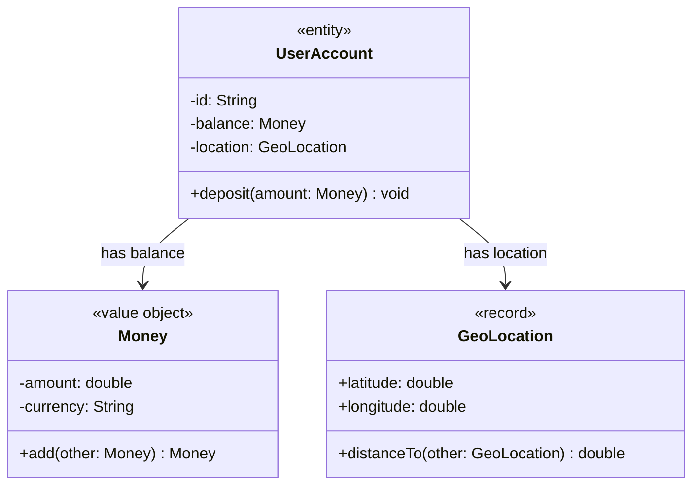

# Today's Objective

* **Today's Focus**: Modern Java Language Features: **Java 14+ Records (`record`)**, compact canonical constructors for invariant validation, component accessors, comparing traditional Value Objects vs. Java Records, and modeling Value Objects vs. Entities with UML Class Diagrams.
* **Why Today's Work Matters**: Writing traditional Value Objects in Java required 50+ lines of boilerplate code (private final fields, getters, constructors, `equals()`, `hashCode()`, `toString()`). Java Records (`record`) reduce this to a single concise line while enforcing immutability and structural attribute equality by default!
* **How it Connects to Previous Lessons**: Yesterday, you learned the conceptual difference between Value Objects and Entities. Today, you master modern Java `record` syntax to implement Value Objects effortlessly.
* **How it Prepares You for Future Lessons**: Prepares you directly for Message Passing and Dispatch (`P01.M02.L01`), Composition & Delegation (`P01.M02.L02`), and Jackson JSON record serialization.
* **Estimated Study Duration**: 3 hours (out of 4 hours available).

---

# Warm-up (10–15 minutes)

Let's review Value Objects vs. Entities, Primitive Obsession, and side-effect-free methods from Day 1.

### Quick Recall Questions
1. What is the fundamental difference between a Value Object (e.g. `Money`) and an Entity (e.g. `UserAccount`)?
2. What is Primitive Obsession, and how do Value Objects eliminate it?
3. Why must methods on a Value Object (like `Money.add()`) be side-effect-free and return new instances?
4. What happens if two distinct Value Object instances have identical attribute values?
5. How do JDK classes like `BigDecimal` and `LocalDate` demonstrate the Value Object pattern?

### Warm-up Coding Exercise
Write the Java 14+ `record` syntax for a `Point` record holding `int x` and `int y`.

---

# Step 1 — Video Lectures

To understand modern Java Records and compact constructors, watch this tutorial:

* 🎬 **Day 2 Unique Video**: Java 14+ Records Deep Dive & Custom Canonical Constructors
* **Instructor**: Coding with John / Java Language Feature Track
* **Platform**: YouTube
* **URL**: [https://www.youtube.com/watch?v=vZm0lHciFsQ](https://www.youtube.com/watch?v=1oW_W9O67pU)
* **Duration**: ~14 minutes
* **Recommended Playback Speed**: 1.0x
* **Focus Areas**:
  * Understand **Java Records Syntax**: `public record GeoLocation(double latitude, double longitude) {}`.
  * Learn **Compact Canonical Constructors**: Validating record invariants without repeating field assignments.
* **Notes to Take**:
  * Write down the syntax of a Compact Record Constructor.
  * Explain why Record fields are `final` and cannot be modified after construction.

---

# Step 2 — Reading

### Book & Article Track
* 📖 **Day 2 Unique Reading**:
  * **Article**: Baeldung's [*Java 14 Record Keyword Guide*](https://www.baeldung.com/java-record-keyword)
  * **JDK Specification**: Oracle OpenJDK [*JEP 395: Records Specification Guide*](https://openjdk.org/jeps/395)
* **Reading Objective**: Learn how the Java compiler automatically generates `equals()`, `hashCode()`, `toString()`, and accessor methods for records, and when to use traditional classes over records.
* **Estimated Reading Time**: 45 minutes

---

# Step 3 — Coding Practice

### Exercise 1: Reimplementing Money Value Object from Memory (Medium)
* **Objective**: Reconstruct the `Money` pure value object and JUnit test suite from memory.
* **Difficulty**: Medium
* **Expected Outcome**: In `scratch/`, recreate `Money.java` with validation and side-effect-free `add()`. Write a test verifying that adding two `Money` objects returns a new instance without mutating originals.
* **Hints**: Do not look at yesterday's daily plan. Focus on side-effect-free math.
* **Common Mistakes**: Mutating existing amount fields.

### Exercise 2: Implementing Value Objects with Java Records (Medium)
* **Objective**: Build immutable Value Objects using Java 14+ `record` and compact constructors.
* **Difficulty**: Medium
* **Expected Outcome**:
  1. Create `GeoLocation.java` under `scratch/`:
     ```java
     public record GeoLocation(double latitude, double longitude) {
         // Compact Canonical Constructor for Invariant Validation!
         public GeoLocation {
             if (latitude < -90.0 || latitude > 90.0) {
                 throw new IllegalArgumentException("Latitude must be between -90 and 90.");
             }
             if (longitude < -180.0 || longitude > 180.0) {
                 throw new IllegalArgumentException("Longitude must be between -180 and 180.");
             }
         }

         // Custom Record Method
         public double distanceTo(GeoLocation other) {
             double latDiff = Math.toRadians(other.latitude - this.latitude);
             double lonDiff = Math.toRadians(other.longitude - this.longitude);
             return Math.sqrt(latDiff * latDiff + lonDiff * lonDiff) * 6371.0; // km
         }
     }
     ```
  2. Write JUnit 5 test `GeoLocationTest.java` verifying that:
     * Valid coordinates instantiate cleanly and `geo1.equals(geo2)` is `true` for matching coordinates.
     * Latitude `95.0` throws `IllegalArgumentException`.
     * `geo1.latitude()` component accessor returns the latitude.
* **Hints**: Compact constructors omit parameter lists `(double latitude, double longitude)` and field assignments `this.latitude = latitude;`.
* **Common Mistakes**: Trying to re-declare field assignments inside a compact record constructor.

---

# Step 4 — Hands-on Lab

No lab is scheduled today. (The hands-on lab for this lesson is scheduled for Day 3).

---

# Step 5 — Project Work

No project milestone is scheduled today. (The project connection is completed at the end of the module).

---

# Step 6 — UML / Design Exercise

### UML Exercise: Value Objects vs. Entities Class Diagram
Draw a static UML Class Diagram mapping Value Objects vs. Entities.
* **Why it matters**: A class diagram visually distinguishes between `<<value object>>` / `<<record>>` types (attribute equality) and `<<entity>>` types (identity ID equality).
* **What should appear in the diagram**:
  1. Record box `<<record>> GeoLocation` (fields: `latitude`, `longitude`; method: `+ distanceTo()`).
  2. Value Object box `<<value object>> Money` (fields: `amount`, `currency`; method: `+ add()`).
  3. Entity box `<<entity>> UserAccount` (fields: `- id: String`, `- balance: Money`, `- location: GeoLocation`).
  4. Association arrows from `UserAccount` to `Money` and `GeoLocation`.

*You can write this diagram in Markdown using Mermaid syntax:*


---

# Step 7 — Engineering Insight

### When to Use Java Records vs. Traditional Classes

| Feature | Java `record` | Traditional Class |
| :--- | :--- | :--- |
| **Primary Purpose** | Pure immutable data carriers / Value Objects | Entities with mutable state or complex inheritance |
| **Boilerplate** | Zero (auto-generates getters, `equals`, `hashCode`, `toString`) | Requires manual code or IDE generation |
| **Immutability** | Enforced by compiler (all fields `private final`) | Requires developer discipline |
| **Inheritance** | Cannot extend other classes (already extends `java.lang.Record`) | Full class inheritance supported |

**Senior Rule**: Use Java Records for Value Objects, DTOs, and event payloads; use traditional classes for Entities with mutable lifecycles!

---

# Step 8 — Open Source Connection

In **Jackson JSON Library & Spring Boot 3+**:
* Spring Boot 3 and Jackson natively support Java Records for request/response DTOs.
* When Jackson deserializes JSON into a `public record CreateUserRequest(String name, String email) {}`, it uses the record's canonical constructor to enforce validation automatically.

---

# Step 9 — End-of-Day Reflection

1. What is a Compact Canonical Constructor in a Java Record, and how does it simplify invariant validation?
2. What methods are automatically generated by the Java compiler when you declare a `record`?
3. Why cannot Java Records extend another class?
4. In UML class diagrams, how do you visually distinguish between a `<<record>>` Value Object and an `<<entity>>` Class?
5. How do Spring Boot 3 and Jackson use Java Records for clean API request validation?

---

# Step 10 — Notes Template

Append this template to `notes/P01.M01.L03.md`:

```markdown
# Notes: P01.M01.L03 - Value objects, entities, and records

## Key Concepts

## Important Definitions

## Things That Clicked Today

## Things I Still Don't Understand

## Mistakes I Made

## Real-world Connections

## Questions To Revisit
```

---

# Step 11 — Journal Template

Save a copy of this template to `journal/2026-08-23.md`:

```markdown
# Daily Journal: 2026-08-23

## What I accomplished today

## Biggest insight

## Biggest challenge

## Questions I still have

## Time spent

## Confidence (1–10)

## Plan for tomorrow
```

---

# Final Checklist

- [ ] Warm-up complete
- [ ] Day 2 Unique Video: Java 14+ Records Deep Dive watched
- [ ] Day 2 Unique Reading: Baeldung Java Record Guide & JEP 395 read
- [ ] Coding Exercise 1 (Money Value Object recall from memory) completed
- [ ] Coding Exercise 2 (GeoLocation record with compact constructor & distanceTo method) completed
- [ ] Mermaid Value Objects vs Entities Class Diagram drawn
- [ ] Reflection questions answered
- [ ] Notes file (`notes/P01.M01.L03.md`) updated
- [ ] Journal file (`journal/2026-08-23.md`) created from template
- [ ] Git commit completed with designated message

---

### Recommended Git Commit Command:
```bash
git add .
git commit -m "study(P01.M01.L03): complete day 2"
```
