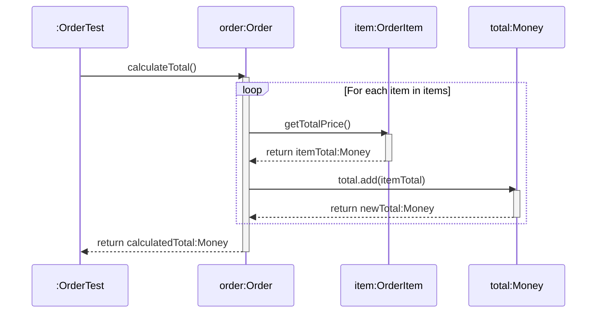

# Today's Objective

* **Today's Focus**: Implementing the Lesson 15 Lab (the **E-Commerce Order Domain Modeling Lab**), combining Java `record` Value Objects (`Money`, `Address`, `OrderItem`) with a domain Entity (`Order`), enforcing business invariants, writing JUnit 5 verification suites, and modeling transaction execution flows using UML sequence diagrams.
* **Why Today's Work Matters**: Completing this lesson finishes **Module 1.1 (Domain Modeling Foundations)**! You will build a complete domain model that demonstrates how Entities manage identity and mutable lifecycle states while delegating immutable attribute calculations to Value Objects and Records.
* **How it Connects to Previous Lessons**: Folds together Classes/State/Identity (L01), Encapsulation/Invariants (L02), and Value Objects/Records (L03) into an integrated domain component.
* **How it Prepares You for Future Lessons**: Completing this lab finishes Module 1.1, preparing you directly for **Module 1.2 (Object Collaboration & Polymorphism)** starting tomorrow!
* **Estimated Study Duration**: 3 hours (out of 4 hours available).

---

# Warm-up (10–15 minutes)

Let's review Java 14+ `record` syntax, compact canonical constructors, and Value Objects vs. Entities from Day 2.

### Quick Recall Questions
1. How does a Java `record` compact constructor simplify invariant validation?
2. What components are automatically generated by the Java compiler when you declare a `record`?
3. Why cannot Java Records extend another class?
4. In UML class diagrams, how do you visually distinguish between a `<<record>>` Value Object and an `<<entity>>` Class?
5. How do Spring Boot 3 and Jackson JSON use Java Records for request DTO validation?

### Warm-up Coding Exercise
Write the Java `record` syntax for an `Address` record holding `String street`, `String city`, and `String zipCode`.

---

# Step 1 — Video Lectures

To understand how to combine Records, Value Objects, and Entities in practice, watch this tutorial:

* 🎬 **Day 3 Unique Video**: Building Domain Models with Value Objects & Records in Practice
* **Instructor**: Coding with John / Domain-Driven Design Track
* **Platform**: YouTube
* **URL**: [https://www.youtube.com/watch?v=vZm0lHciFsQ](https://www.youtube.com/watch?v=1oW_W9O67pU)
* **Duration**: ~10 minutes
* **Recommended Playback Speed**: 1.0x
* **Focus Areas**:
  * Learn how a domain Entity (`Order`) aggregates multiple Value Objects (`Money`, `Address`, `OrderItem` records).
  * See how calculating order totals delegates math to `Money.add()` without mutating internal entity state directly.
* **Notes to Take**:
  * Diagram how `Order` (Entity) delegates price calculations to `OrderItem` (Record) and `Money` (Value Object).
  * Explain why `OrderItem` should be an immutable Record rather than a mutable Entity.

---

# Step 2 — Reading

### Book & Article Track
* 📖 **Day 3 Unique Reading**:
  * **Article**: Martin Fowler's [*Evans Classification: Entities vs Value Objects vs Services*](https://martinfowler.com/bliki/EvansClassification.html)
  * **Guide**: ThoughtWorks [*Domain Modeling & Value Object Aggregates Guide*](https://www.thoughtworks.com/insights/blog/domain-driven-design)
* **Reading Objective**: Comprehend how to structure domain aggregate boundaries, ensuring that Entities encapsulate lifecycle identity while Value Objects encapsulate immutable calculations.
* **Estimated Reading Time**: 20 minutes

---

# Step 3 — Coding Practice

### Exercise: Debugging Record Serialization & State Calculation (Medium)
* **Objective**: Fix a domain entity that failed to calculate totals correctly when handling zero-quantity items.
* **Difficulty**: Medium
* **Expected Outcome**:
  1. Create `OrderItemDebug.java` under `scratch/`:
     ```java
     public record OrderItemDebug(String productId, int quantity, double unitPrice) {
         public OrderItemDebug {
             if (productId == null || productId.trim().isEmpty()) throw new IllegalArgumentException("Product ID required.");
             if (quantity <= 0) throw new IllegalArgumentException("Quantity must be positive.");
             if (unitPrice < 0.0) throw new IllegalArgumentException("Unit price cannot be negative.");
         }

         public double getTotalPrice() {
             return quantity * unitPrice;
         }
     }
     ```
  2. Write JUnit 5 test `OrderItemDebugTest.java` verifying that `getTotalPrice()` correctly calculates price and zero/negative quantities throw `IllegalArgumentException`.

---

# Step 4 — Hands-on Lab

### Lab: E-Commerce Order Domain Modeling

#### Problem Statement
Design a complete e-commerce domain model under package `handbook.phase01.p01m01l03`.
1. `Money.java`: Value object representing currency and amount (`add()`, `multiply()`).
2. `Address.java`: Record representing shipping destination (`street`, `city`, `zipCode`).
3. `OrderItem.java`: Record representing an item in an order (`productId`, `quantity`, `unitPrice`).
4. `Order.java`: Entity representing an order (`orderId`, `shippingAddress`, `List<OrderItem>`, `orderStatus`). Exposes `addItem()`, `calculateTotal()`, and `cancelOrder()`.
5. `OrderTest.java`: JUnit 5 test suite verifying total calculations, status transitions, and collection immutability.

#### Starter Folder Structure
```text
src/main/java/handbook/phase01/p01m01l03/Money.java
src/main/java/handbook/phase01/p01m01l03/Address.java
src/main/java/handbook/phase01/p01m01l03/OrderItem.java
src/main/java/handbook/phase01/p01m01l03/Order.java
src/test/java/handbook/phase01/p01m01l03/OrderTest.java
docs/P01.M01.L03-diagram.md
```

#### Code Implementation Guidelines

##### Money.java (Value Object)
```java
package handbook.phase01.p01m01l03;
import java.util.Objects;

public final class Money {
    private final double amount;
    private final String currency;

    public Money(double amount, String currency) {
        if (amount < 0.0) throw new IllegalArgumentException("Amount cannot be negative.");
        if (currency == null || currency.trim().isEmpty()) throw new IllegalArgumentException("Currency required.");
        this.amount = amount;
        this.currency = currency.trim().toUpperCase();
    }

    public Money add(Money other) {
        if (!this.currency.equals(other.currency)) {
            throw new IllegalArgumentException("Currency mismatch: " + this.currency + " vs " + other.currency);
        }
        return new Money(this.amount + other.amount, this.currency);
    }

    public double getAmount() { return amount; }
    public String getCurrency() { return currency; }

    @Override
    public boolean equals(Object o) {
        if (this == o) return true;
        if (!(o instanceof Money)) return false;
        Money money = (Money) o;
        return Double.compare(money.amount, amount) == 0 && Objects.equals(currency, money.currency);
    }

    @Override
    public int hashCode() { return Objects.hash(amount, currency); }
}
```

##### Address.java (Record)
```java
package handbook.phase01.p01m01l03;

public record Address(String street, String city, String zipCode) {
    public Address {
        if (street == null || street.trim().isEmpty()) throw new IllegalArgumentException("Street required.");
        if (city == null || city.trim().isEmpty()) throw new IllegalArgumentException("City required.");
        if (zipCode == null || zipCode.trim().isEmpty()) throw new IllegalArgumentException("Zip code required.");
    }
}
```

##### OrderItem.java (Record)
```java
package handbook.phase01.p01m01l03;

public record OrderItem(String productId, int quantity, Money unitPrice) {
    public OrderItem {
        if (productId == null || productId.trim().isEmpty()) throw new IllegalArgumentException("Product ID required.");
        if (quantity <= 0) throw new IllegalArgumentException("Quantity must be positive.");
        if (unitPrice == null) throw new IllegalArgumentException("Unit price required.");
    }

    public Money getTotalPrice() {
        return new Money(unitPrice.getAmount() * quantity, unitPrice.getCurrency());
    }
}
```

##### Order.java (Entity)
```java
package handbook.phase01.p01m01l03;

import java.util.ArrayList;
import java.util.List;
import java.util.Objects;

public class Order {
    private final String orderId;
    private final Address shippingAddress;
    private final List<OrderItem> items = new ArrayList<>();
    private String status = "CREATED";

    public Order(String orderId, Address shippingAddress) {
        if (orderId == null || orderId.trim().isEmpty()) throw new IllegalArgumentException("Order ID required.");
        if (shippingAddress == null) throw new IllegalArgumentException("Shipping address required.");
        this.orderId = orderId.trim();
        this.shippingAddress = shippingAddress;
    }

    public void addItem(OrderItem item) {
        if (!"CREATED".equals(status)) {
            throw new IllegalStateException("Cannot add items to order in status: " + status);
        }
        if (item == null) throw new IllegalArgumentException("Item required.");
        items.add(item);
    }

    public Money calculateTotal() {
        if (items.isEmpty()) return new Money(0.0, "USD");
        String currency = items.get(0).unitPrice().getCurrency();
        Money total = new Money(0.0, currency);
        for (OrderItem item : items) {
            total = total.add(item.getTotalPrice());
        }
        return total;
    }

    public void cancelOrder() {
        if ("CANCELLED".equals(status)) throw new IllegalStateException("Order is already cancelled.");
        this.status = "CANCELLED";
    }

    public String getOrderId() { return orderId; }
    public Address getShippingAddress() { return shippingAddress; }
    public String getStatus() { return status; }
    public List<OrderItem> getItems() { return List.copyOf(items); } // Defensive Copy!

    @Override
    public boolean equals(Object o) {
        if (this == o) return true;
        if (!(o instanceof Order)) return false;
        Order order = (Order) o;
        return Objects.equals(orderId, order.orderId);
    }

    @Override
    public int hashCode() { return Objects.hash(orderId); }
}
```

##### OrderTest.java
```java
package handbook.phase01.p01m01l03;

import org.junit.jupiter.api.BeforeEach;
import org.junit.jupiter.api.Test;
import static org.junit.jupiter.api.Assertions.*;

public class OrderTest {

    private Order order;
    private Address address;
    private Money usd100;

    @BeforeEach
    void setUp() {
        address = new Address("123 Tech St", "San Jose", "95110");
        order = new Order("ORD-5001", address);
        usd100 = new Money(100.0, "USD");
    }

    @Test
    void testAddItemAndCalculateTotal() {
        order.addItem(new OrderItem("PROD-1", 2, usd100)); // 2 * $100 = $200
        order.addItem(new OrderItem("PROD-2", 1, usd100)); // 1 * $100 = $100
        Money total = order.calculateTotal();

        assertEquals(300.0, total.getAmount(), 0.001);
        assertEquals("USD", total.getCurrency());
    }

    @Test
    void testCancelOrderChangesStatus() {
        order.cancelOrder();
        assertEquals("CANCELLED", order.getStatus());
        assertThrows(IllegalStateException.class, () -> order.addItem(new OrderItem("PROD-1", 1, usd100)));
    }

    @Test
    void testItemsListEncapsulation() {
        order.addItem(new OrderItem("PROD-1", 1, usd100));
        assertThrows(UnsupportedOperationException.class, () -> order.getItems().clear());
    }
}
```

---

# Step 5 — Project Work

No project milestone is scheduled today. (The project connection is completed at the end of the module).

---

# Step 6 — UML / Design Exercise

### UML Sequence Diagram
Draw a sequence diagram depicting order total calculation.
* **Why it matters**: Captures how an Entity delegates iterative math to Value Objects and Records.
* **What should appear in the diagram**:
  1. Lifelines: `:OrderTest`, `order:Order`, `item:OrderItem`, and `total:Money`.
  2. `:OrderTest` calling `order.calculateTotal()`.
  3. `order` iterating over `items`, calling `item.getTotalPrice()`.
  4. `item` returning `Money` instance.
  5. `order` combining prices with `total.add()`.
  6. `order` returning calculated `Money` total.

*You can write this diagram in Markdown using Mermaid syntax:*


---

# Step 7 — Engineering Insight

### Completing Module 1.1: Domain Modeling Foundations
Congratulations on completing **Module 1.1 (Domain Modeling Foundations)**!

Look at the architectural tools you have mastered in Module 1.1:
1. **Classes, Objects, Identity & State (`P01.M01.L01`)**: Building rich domain models with state, behavior, and the `equals()`/`hashCode()` contract.
2. **Encapsulation, Invariants & Access Control (`P01.M01.L02`)**: Enforcing multi-field invariants and making defensive copies (`List.copyOf()`) to prevent reference leaks.
3. **Value Objects, Entities & Records (`P01.M01.L03`)**: Using Java 14+ `record` syntax for immutable Value Objects while reserving Entities for identity-tracked lifecycles.

You are now ready for **Module 1.2: Message Passing & Object Collaboration** starting tomorrow!

---

# Step 8 — Open Source Connection

In **E-Commerce Systems (Shopify / Stripe Java SDK)**:
* Stripe's Java SDK models charges and payment methods as Entities (e.g. `Charge` with ID `ch_12345`), while money amounts and billing addresses are modeled as immutable Records / Value Objects.

---

# Step 9 — End-of-Day Reflection

1. How does `Order` (Entity) delegate price calculations to `OrderItem` (Record) and `Money` (Value Object)?
2. Why should `Address` and `OrderItem` be modeled as immutable Records rather than mutable Entities?
3. How does `OrderTest` verify total calculations, status state transitions, and collection encapsulation?
4. What architectural tools did you master across Module 1.1 (Lessons 13, 14, 15)?
5. How do Stripe and Shopify SDKs use Value Objects and Entities to structure payment APIs?

---

# Step 10 — Notes Template

Append this template to `notes/P01.M01.L03.md`:

```markdown
# Notes: P01.M01.L03 - Value objects, entities, and records

## Key Concepts

## Important Definitions

## Things That Clicked Today

## Things I Still Don't Understand

## Mistakes I Made

## Real-world Connections

## Questions To Revisit
```

---

# Step 11 — Journal Template

Save a copy of this template to `journal/2026-08-24.md`:

```markdown
# Daily Journal: 2026-08-24

## What I accomplished today

## Biggest insight

## Biggest challenge

## Questions I still have

## Time spent

## Confidence (1–10)

## Plan for tomorrow
```

---

# Final Checklist

- [ ] Warm-up complete
- [ ] Day 3 Unique Video: Building Domain Models in Practice watched
- [ ] Day 3 Unique Reading: Evans Classification & ThoughtWorks DDD read
- [ ] Coding Exercise (OrderItemDebug record price calculation fix) completed
- [ ] Lab: E-Commerce Order Domain Modeling implemented
- [ ] `Money.java`, `Address.java`, `OrderItem.java`, `Order.java`, and `OrderTest.java` written under `handbook.phase01.p01m01l03`
- [ ] `OrderTest` executed successfully with zero failures
- [ ] UML Order Total Sequence diagram drawn (Mermaid or Paper)
- [ ] Reflection questions answered
- [ ] Notes file (`notes/P01.M01.L03.md`) updated and finalized
- [ ] Journal file (`journal/2026-08-24.md`) created from template
- [ ] Git commit completed with designated message

---

### Recommended Git Commit Command:
```bash
git add .
git commit -m "study(P01.M01.L03): complete day 3"
```
