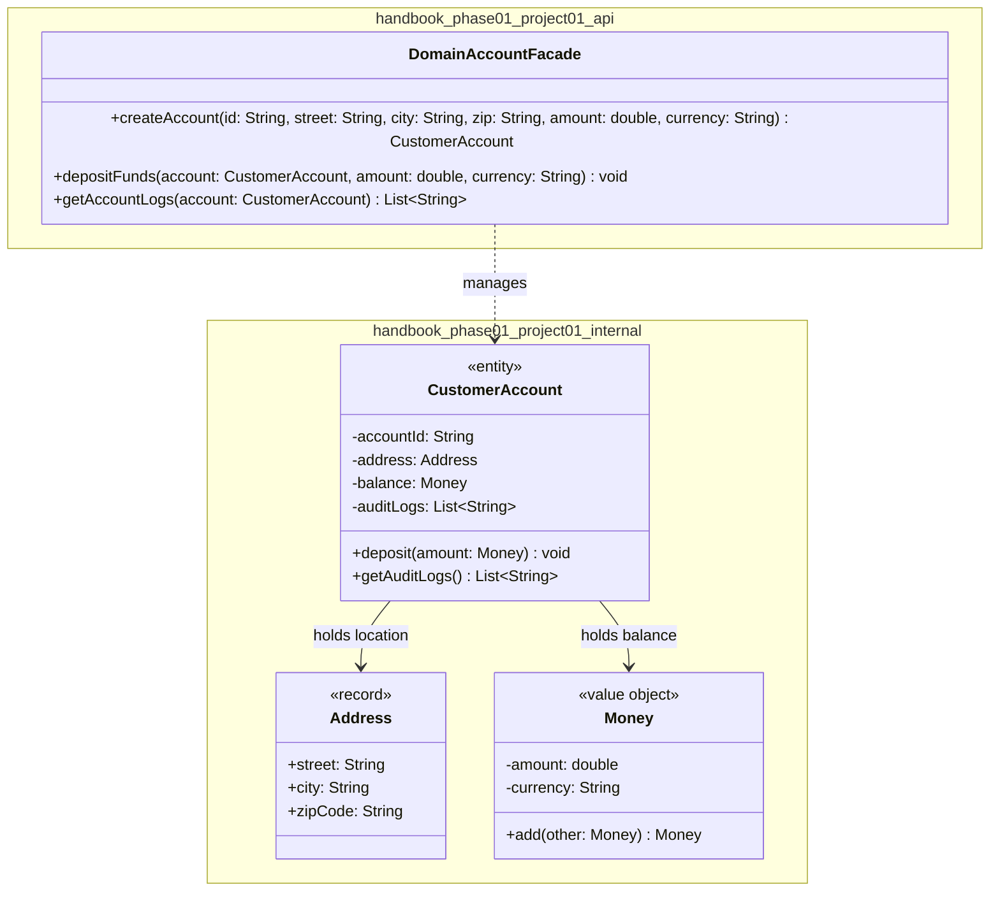

# Today's Objective

* **Today's Focus**: Implementing the **Module 01.01 Project (Domain Model Integration Subsystem)**. You will integrate the three core lessons of Module 1.1: Classes/State/Identity (L01), Encapsulation/Invariants & Defensive Copying (L02), and Value Objects/Entities/Records (L03) into a single functional, tested, and documented domain project.
* **Why Today's Work Matters**: Every module in the LLD Mastery Handbook concludes with a dedicated Module Project. Learning individual domain concepts in isolation is step one; weaving Value Objects, Entities, Records, defensive copying, and invariant guards into a cohesive domain subsystem under `projects/module-01-project/` is where real-world Object-Oriented Architecture begins.
* **How it Connects to Previous Lessons**: Folds together `P01.M01.L01` (Rich domain entities & `equals/hashCode` contracts), `P01.M01.L02` (Invariants & defensive copying), and `P01.M01.L03` (Value Objects & Java Records).
* **How it Prepares You for Future Lessons**: Completing this project finishes **Module 1.1 (Domain Modeling Foundations)**, preparing you directly for Module 1.2 (Object Collaboration & Polymorphism starting tomorrow).
* **Estimated Study Duration**: 4 hours (entire available session).

---

# Warm-up (15–20 minutes)

Let's review the entire Module 1.1 lifecycle (P01.M01.L01 through P01.M01.L03).

### Quick Recall Questions
1. What is the fundamental difference between a Value Object (e.g. `Money`) and an Entity (e.g. `UserAccount`)?
2. Why must defensive copies be made when returning mutable collection references (`List.copyOf()`)?
3. How do Java 14+ Records simplify writing immutable Value Objects?
4. What rule connects the `equals()` and `hashCode()` contract in Java?
5. How does a Rich Domain Model protect invariants compared to an Anemic Domain Model with raw getters and setters?

### Warm-up Coding Exercise
Write a terminal command to compile and test a Maven module project (`mvn clean test`).

---

# Step 1 — Video Lectures

To guide your approach to structuring integrated domain model projects, watch this tutorial:

* 🎬 **Project Video**: Designing Clean Domain Model Architecture in Java
* **Instructor**: Coding with John / Baeldung
* **Platform**: YouTube
* **URL**: [https://www.youtube.com/watch?v=vZm0lHciFsQ](https://www.youtube.com/watch?v=1oW_W9O67pU)
* **Duration**: ~12 minutes
* **Recommended Playback Speed**: 1.0x
* **Focus Areas**:
  * Focus on organizing domain packages into `model` (Entities & Records), `service` (Domain Facades), and `common` (Value Objects & Exceptions).

---

# Step 2 — Reading

### Blog & ADR Track
* 📖 **Project Reading**:
  * **Article**: Martin Fowler's [*Domain Model Architecture Guide*](https://martinfowler.com/eaaCatalog/domainModel.html)
  * **Reference**: Baeldung's [*Structuring Java Projects by Domain Feature*](https://www.baeldung.com/java-package-by-layer-v-by-feature)
* **Reading Objective**: Understand how to structure domain aggregate boundaries, ensuring that Entities encapsulate lifecycle identity while Value Objects encapsulate immutable calculations.
* **Estimated Reading Time**: 15 minutes

---

# Step 3 — Coding Practice

### Exercise: Multi-Concept Invariant Wiring (Medium)
* **Objective**: Wire Value Objects, Records, and Entities into a single test case verifying defensive copying and invariant enforcement.
* **Difficulty**: Medium
* **Expected Outcome**: Create a scratch test verifying that adding an invalid `Money` value object or passing empty IDs to a domain Entity throws `IllegalArgumentException` with descriptive messages.

---

# Step 4 — Hands-on Lab

Today is a module project day. The project itself functions as today's extended lab. (See Step 5 for details).

---

# Step 5 — Project Work

### Project Milestone: Module 01.01 Domain Model Integration Subsystem

#### Problem Statement
Build an enterprise domain modeling subsystem under `projects/module-01-project/`.
The subsystem exposes a `public class DomainAccountFacade` under `handbook.phase01.project01.api`, aggregates Value Objects (`Money`, `Address` records) and an Entity (`CustomerAccount`), enforces defensive copying on account activity lists, and includes a full JUnit 5 test suite.

#### Mandatory Version Control Workflow:
1. Create a feature branch: `git checkout -b feature/module-01-project`.
2. Implement code, tests, ADR, and documentation.
3. Make 3 atomic commits (`feat(project01): ...`, `test(project01): ...`, `docs(project01): ...`).
4. Rebase and merge into `main`, then tag the release: `git tag -a v1.0.0-p01m01 -m "Release Module 01.01 Project"`.

#### Suggested Folder Structure
Create this layout inside your workspace:
```text
projects/module-01-project/
  pom.xml
  README.md
  docs/
    architecture.md
    adr/0001-design-domain-model.md
    diagrams/
  src/
    main/java/handbook/phase01/project01/api/
      DomainAccountFacade.java
    main/java/handbook/phase01/project01/internal/
      Money.java
      Address.java
      CustomerAccount.java
    test/java/handbook/phase01/project01/
      DomainAccountFacadeTest.java
```

#### 1. File: `projects/module-01-project/pom.xml`
```xml
<project xmlns="http://maven.apache.org/POM/4.0.0"
         xmlns:xsi="http://www.w3.org/2001/XMLSchema-instance"
         xsi:schemaLocation="http://maven.apache.org/POM/4.0.0 http://maven.apache.org/xsd/maven-4.0.0.xsd">
    <modelVersion>4.0.0</modelVersion>

    <groupId>handbook.phase01</groupId>
    <artifactId>module-01-project</artifactId>
    <version>1.0.0-SNAPSHOT</version>

    <dependencies>
        <dependency>
            <groupId>org.junit.jupiter</groupId>
            <artifactId>junit-jupiter-api</artifactId>
            <version>5.9.2</version>
            <scope>test</scope>
        </dependency>
    </dependencies>
</project>
```

#### 2. File: `projects/module-01-project/docs/adr/0001-design-domain-model.md`
```markdown
# ADR 0001: Domain Model Boundaries and Value Object Encapsulation

## Context
We need to design a customer account domain subsystem that manages account balances and addresses without exposing mutable internal collections or primitive parameters to external packages.

## Decision
We model `Address` as a Java 14+ `record`, `Money` as an immutable Value Object, and `CustomerAccount` as an Entity with identity-based `equals/hashCode`. We expose `DomainAccountFacade` as the public entry point.

## Consequence
All collection getters return defensive copies (`List.copyOf()`), protecting internal state against external mutation.
```

#### 3. File: `projects/module-01-project/src/main/java/handbook/phase01/project01/internal/Address.java`
```java
package handbook.phase01.project01.internal;

public record Address(String street, String city, String zipCode) {
    public Address {
        if (street == null || street.trim().isEmpty()) throw new IllegalArgumentException("Street required.");
        if (city == null || city.trim().isEmpty()) throw new IllegalArgumentException("City required.");
        if (zipCode == null || zipCode.trim().isEmpty()) throw new IllegalArgumentException("Zip code required.");
    }
}
```

#### 4. File: `projects/module-01-project/src/main/java/handbook/phase01/project01/internal/Money.java`
```java
package handbook.phase01.project01.internal;

import java.util.Objects;

public final class Money {
    private final double amount;
    private final String currency;

    public Money(double amount, String currency) {
        if (amount < 0.0) throw new IllegalArgumentException("Amount cannot be negative.");
        if (currency == null || currency.trim().isEmpty()) throw new IllegalArgumentException("Currency required.");
        this.amount = amount;
        this.currency = currency.trim().toUpperCase();
    }

    public Money add(Money other) {
        if (!this.currency.equals(other.currency)) {
            throw new IllegalArgumentException("Currency mismatch: " + this.currency + " vs " + other.currency);
        }
        return new Money(this.amount + other.amount, this.currency);
    }

    public double getAmount() { return amount; }
    public String getCurrency() { return currency; }

    @Override
    public boolean equals(Object o) {
        if (this == o) return true;
        if (!(o instanceof Money)) return false;
        Money money = (Money) o;
        return Double.compare(money.amount, amount) == 0 && Objects.equals(currency, money.currency);
    }

    @Override
    public int hashCode() { return Objects.hash(amount, currency); }
}
```

#### 5. File: `projects/module-01-project/src/main/java/handbook/phase01/project01/internal/CustomerAccount.java`
```java
package handbook.phase01.project01.internal;

import java.util.ArrayList;
import java.util.List;
import java.util.Objects;

public class CustomerAccount {
    private final String accountId;
    private final Address address;
    private Money balance;
    private final List<String> auditLogs = new ArrayList<>();

    public CustomerAccount(String accountId, Address address, Money initialBalance) {
        if (accountId == null || accountId.trim().isEmpty()) throw new IllegalArgumentException("Account ID required.");
        if (address == null) throw new IllegalArgumentException("Address required.");
        if (initialBalance == null) throw new IllegalArgumentException("Initial balance required.");

        this.accountId = accountId.trim();
        this.address = address;
        this.balance = initialBalance;
        this.auditLogs.add("Account created with balance: " + initialBalance.getAmount());
    }

    public void deposit(Money amount) {
        if (amount == null) throw new IllegalArgumentException("Amount required.");
        this.balance = this.balance.add(amount);
        this.auditLogs.add("Deposited: " + amount.getAmount() + " " + amount.getCurrency());
    }

    public String getAccountId() { return accountId; }
    public Address getAddress() { return address; }
    public Money getBalance() { return balance; }
    public List<String> getAuditLogs() { return List.copyOf(auditLogs); } // Defensive Copy!

    @Override
    public boolean equals(Object o) {
        if (this == o) return true;
        if (!(o instanceof CustomerAccount)) return false;
        CustomerAccount that = (CustomerAccount) o;
        return Objects.equals(accountId, that.accountId); // Identity-based equality!
    }

    @Override
    public int hashCode() { return Objects.hash(accountId); }
}
```

#### 6. File: `projects/module-01-project/src/main/java/handbook/phase01/project01/api/DomainAccountFacade.java`
```java
package handbook.phase01.project01.api;

import handbook.phase01.project01.internal.Address;
import handbook.phase01.project01.internal.CustomerAccount;
import handbook.phase01.project01.internal.Money;
import java.util.List;

public class DomainAccountFacade {

    public CustomerAccount createAccount(String accountId, String street, String city, String zipCode, double initialAmount, String currency) {
        Address address = new Address(street, city, zipCode);
        Money balance = new Money(initialAmount, currency);
        return new CustomerAccount(accountId, address, balance);
    }

    public void depositFunds(CustomerAccount account, double amount, String currency) {
        if (account == null) throw new IllegalArgumentException("Account required.");
        Money depositMoney = new Money(amount, currency);
        account.deposit(depositMoney);
    }

    public List<String> getAccountLogs(CustomerAccount account) {
        if (account == null) throw new IllegalArgumentException("Account required.");
        return account.getAuditLogs();
    }
}
```

#### 7. File: `projects/module-01-project/src/test/java/handbook/phase01/project01/DomainAccountFacadeTest.java`
```java
package handbook.phase01.project01;

import handbook.phase01.project01.api.DomainAccountFacade;
import handbook.phase01.project01.internal.CustomerAccount;
import org.junit.jupiter.api.BeforeEach;
import org.junit.jupiter.api.Test;
import static org.junit.jupiter.api.Assertions.*;

public class DomainAccountFacadeTest {

    private DomainAccountFacade facade;

    @BeforeEach
    void setUp() {
        facade = new DomainAccountFacade();
    }

    @Test
    void testCreateAccountSuccess() {
        CustomerAccount account = facade.createAccount("ACC-9001", "100 Main St", "Boston", "02108", 250.0, "USD");
        assertNotNull(account);
        assertEquals("ACC-9001", account.getAccountId());
        assertEquals(250.0, account.getBalance().getAmount());
    }

    @Test
    void testDepositFundsSuccess() {
        CustomerAccount account = facade.createAccount("ACC-9002", "200 Park Ave", "NYC", "10017", 500.0, "USD");
        facade.depositFunds(account, 150.0, "USD");
        assertEquals(650.0, account.getBalance().getAmount());
    }

    @Test
    void testCollectionEncapsulationOnAuditLogs() {
        CustomerAccount account = facade.createAccount("ACC-9003", "300 Lake Dr", "Chicago", "60601", 100.0, "USD");
        assertThrows(UnsupportedOperationException.class, () -> facade.getAccountLogs(account).clear());
    }
}
```

---

# Step 6 — UML / Design Exercise

### UML Package & Class Diagram
Draw a static UML package and class diagram mapping the Module 01.01 project.
* **Why it matters**: Captures public API export boundaries, internal domain models, Value Objects, Records, and test dependencies.
* **What should appear in the diagram**:
  1. Package `handbook.phase01.project01.api` enclosing `+ DomainAccountFacade`.
  2. Package `handbook.phase01.project01.internal` enclosing `CustomerAccount` (Entity), `Money` (Value Object), and `Address` (Record).
  3. Package `handbook.phase01.project01` enclosing `DomainAccountFacadeTest`.
  4. Association arrows connecting `CustomerAccount` to `Money` and `Address`.

*You can write this diagram in Markdown using Mermaid syntax:*


---

# Step 7 — Engineering Insight

### Module 01.01 Synthesis
In this project, you synthesized the 3 fundamental pillars of Domain Modeling:
1. **State & Identity (`L01`)**: `CustomerAccount` uses identity-based `equals/hashCode` (`accountId`), allowing it to mutate balance without breaking collection lookup integrity.
2. **Encapsulation & Defensive Copying (`L02`)**: `getAuditLogs()` returns an unmodifiable defensive snapshot (`List.copyOf()`), protecting internal logs from external corruption.
3. **Value Objects & Records (`L03`)**: `Address` is a concise Java `record`, and `Money` is an immutable Value Object with side-effect-free math (`add()`), eliminating primitive obsession.

---

# Step 8 — Open Source Connection

In **Spring Boot & Enterprise Domain Systems**:
* Domain facades expose clean service entry points while internal models enforce value immutability and collection encapsulation.

---

# Step 9 — End-of-Day Reflection

1. How does `DomainAccountFacade` integrate Classes/State/Identity (L01), Encapsulation/Invariants (L02), and Value Objects/Records (L03)?
2. Why is returning `List.copyOf(auditLogs)` critical for maintaining collection encapsulation in `CustomerAccount`?
3. How does `Money.add()` enforce currency matching without mutating existing objects?
4. What is the benefit of making `Address` a Java 14+ `record` over a traditional Java class?
5. How does this project prepare you for **Module 1.2: Message Passing & Object Collaboration**?

---

# Step 10 — Notes Template

Save a copy of this template to `projects/module-01-project/docs/architecture.md`:

```markdown
# Architecture Notes: Module 01.01 Project

## Domain Subsystem Vision

## Value Objects vs. Entity Boundaries

## Defensive Copying & Collection Invariants

## Module 1.1 Completion Log
```

---

# Step 11 — Journal Template

Save a copy of this template to `journal/2026-08-25.md`:

```markdown
# Daily Journal: 2026-08-25

## What I accomplished today

## Biggest insight

## Biggest challenge

## Questions I still have

## Time spent

## Confidence (1–10)

## Plan for tomorrow
```

---

# Final Checklist

- [ ] Warm-up complete
- [ ] Designing Clean Domain Model Architecture video tutorial watched
- [ ] Fowler's Domain Model Architecture guide read
- [ ] Coding Exercise (Multi-Concept Invariant Wiring) completed
- [ ] Project directory structure and `pom.xml` created
- [ ] Architectural record (`docs/adr/0001-design-domain-model.md`) written
- [ ] Classes (`DomainAccountFacade`, `CustomerAccount`, `Money`, `Address`) implemented
- [ ] JUnit 5 Test Suite (`DomainAccountFacadeTest`) executed successfully with zero failures
- [ ] Git feature branch rebased, merged, and tagged (`v1.0.0-p01m01`)
- [ ] UML Package & Class Architecture diagram completed
- [ ] Architecture notes template saved in docs
- [ ] Daily journal written
- [ ] Git commit completed with designated message

---

### Recommended Git Commit Command:
```bash
git add .
git commit -m "project(P01.M01): complete module 1.1 project"
```
