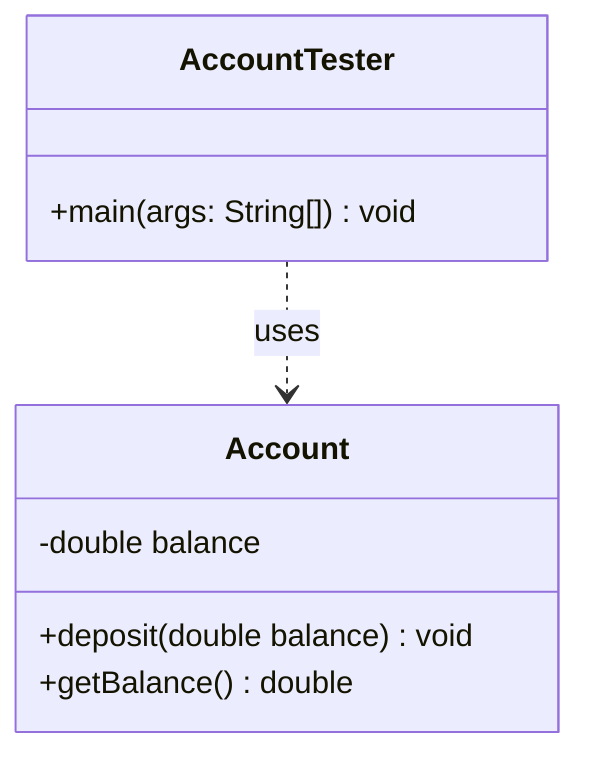

# 📘 P00.M01.L02 — Day 2 Core Object State, Variable Mechanics & Encapsulation

> **Date:** July 5, 2026
> **Focus:** Class state & behavior · variable scoping · encapsulation · static UML mapping

---

## Table of Contents

1. [Memory & Primitives Warm-up](#-memory--primitives-warm-up)
2. [Video Lecture Insights: Encapsulation & Tooling](#-video-lecture-insights-encapsulation--tooling)
3. [Book Notes: *Head First Java* (Ch. 4)](#-book-notes-head-first-java-ch-4)
4. [Coding Practice & Reference Mechanics](#-coding-practice--reference-mechanics)
5. [UML Static Class Diagram](#-uml-static-class-diagram)
6. [Deep-Dive: Architectural Discussions](#-deep-dive-architectural-discussions)
7. [End-of-Day Reflection](#-end-of-day-reflection)

---

## 🧠 Memory & Primitives Warm-up

### Architectural Quick Recall

| Concept | Takeaway |
|---|---|
| **Heap on stack pop** | When a stack frame pops, its heap objects aren't touched directly — but if that frame held the *only* reference, the object becomes unreachable and eligible for GC. |
| **Reference reassignment** | ❌ **False.** Java is strictly *pass-by-value*. A method gets a **copy of the reference**. Reassigning the local copy never affects the caller's original reference. |
| **`double` vs `float`** | `double` → 64 bits (8 bytes) · `float` → 32 bits (4 bytes) |
| **Byte overflow** | A signed 8-bit `byte` at `127`, incremented by `1`, wraps via two's-complement to **`-128`**. |
| **Stack vs. heap defaults** | Local (stack) variables are **not** auto-initialized — zeroing them on every call would add overhead. Instance (heap) fields **are** zero-initialized by the JVM for predictable object state. |

### Guarded Division

Explicit casting forces double-precision evaluation and avoids integer truncation:

```java
public double divide(int a, int b) {
    if (b == 0) {
        throw new ArithmeticException("Division by zero is prohibited.");
    }
    return (double) a / b;
}
```

---

## 📺 Video Lecture Insights: Encapsulation & Tooling

### Core Encapsulation

- **Definition** — Bundle data members inside a class and block direct external mutation by marking fields `private`.
- **Why it matters** — Access flows through public getters/setters, adding a validation layer that keeps object state from being corrupted by bad input.

### Modern Tooling: Project Lombok

| Problem | Lombok's Fix |
|---|---|
| Boilerplate getters/setters/`toString`/`equals`/`hashCode` cost time and invite bugs | Auto-generates the bytecode at compile time via `@Getter`, `@Setter`, `@Data`, etc. |

> **⚠️ LLD Interview Caveat**
> Slapping `@Setter` or `@Data` on every class quietly defeats encapsulation by making every field mutable. **Best practice:** use `@Getter` freely, but restrict `@Setter`. Favor explicit, behavior-driven methods —
> `void deposit(double amount)` rather than a raw `setBalance(...)`.

---

## 📚 Book Notes: *Head First Java* (Ch. 4)

- **State drives behavior** — Every instance of a class shares the same method bytecode, but each object holds its own state on the heap. Since methods read instance fields, unique state produces unique runtime behavior.
- **Parameters vs. Arguments**
  - **Parameter** → the variable declared in the method signature (`double balance`)
  - **Argument** → the actual value passed at call time (`500.0`)
- **Initialization safeguard** — Method parameters are never left uninitialized; the compiler enforces that callers supply valid arguments, or the code simply won't compile.

---

## 🛠️ Coding Practice & Reference Mechanics

### Exercise 1 — `PassVerifier.java` (Reference Isolation)

Confirms that mutating an object's *contents* is visible to the caller, but reassigning the *parameter reference itself* stays local to the method's stack frame.

```java
public class PassVerifier {
    public static void updateValue(StringBuilder builder) {
        if (builder != null) {
            builder.append(" Suffix"); // Modifies the object on the heap
        }
        builder = null; // Severs the local reference only; caller's reference is untouched
    }

    public static void main(String[] args) {
        StringBuilder original = new StringBuilder("Base");
        updateValue(original);

        assert original != null : "Verification Failed: Original reference became null!";
        assert original.toString().equals("Base Suffix") : "Verification Failed: Suffix missing!";

        System.out.println("Exercise 1 Assertions Passed. Value: " + original);
    }
}
```

### Exercise 2 — `Account.java` (Resolving Shadowed Scope)

Uses `this` to disambiguate an instance field from a same-named method parameter.

```java
public class Account {
    private double balance; // Instance field

    public void deposit(double balance) { // Parameter shadows the field
        if (balance > 0) {
            this.balance = this.balance + balance; // 'this.balance' targets the heap instance field
        }
    }

    public double getBalance() {
        return this.balance;
    }
}
```

---

## 📊 UML Static Class Diagram



---

## 🔬 Deep-Dive: Architectural Discussions

### 1. The Mechanics of Variable Shadowing

- When a local variable or parameter shares a name with an instance field, it **shadows** that field within its scope.
- **Nuance:** inside a setter body, `balance = balance;` (without `this`) just reassigns the local parameter to itself — the instance field is never touched, because the bare identifier resolves to the local shadow.
- `this` is an explicit scope override: it steps past the local shadow, reaches the current object on the heap, and assigns into the actual instance field slot.
- **Clean-code boundary:** shadowing is idiomatic in constructors/setters for clean parameter-to-field mapping — but should be avoided in core business logic, where it raises cognitive load and invites accidental mutation of the wrong variable.

### 2. Open-Source Connection: JDK Encapsulation

The JDK itself is a living example of strict encapsulation:

```java
// java.lang.Integer
private final int value;
```

The payload is fully isolated and immutable — accessible only through clean transactional accessors like `intValue()`, `doubleValue()`, and `longValue()`.

---

## 🎯 End-of-Day Reflection

1. **Shadow access** — A local variable sharing a field's name hides that field; recovering access requires the `this` qualifier.
2. **Why `private`** — Hiding internal state behind `private` creates a boundary that prevents external code from corrupting an object arbitrarily.
3. **Default values** — Uninitialized fields resolve to `0` (`int`), `0.0` (`double`), and `null` (object references).
4. **Early exit via `void`** — A `void` method can call a bare `return;` as a guard-clause, exiting the stack frame immediately once a validation fails.

---

*End of notes — P00.M01.L02*