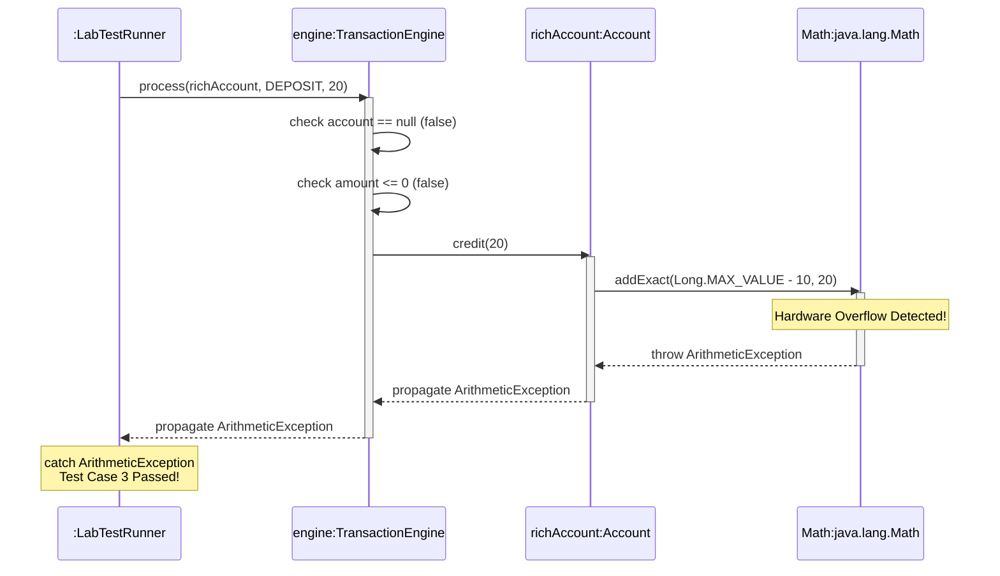

# P00.M01.L02 — Day 3 Variables, Types, Operators & Control Flow

> **Phase 00 · Module 01 · Lesson 02**
> Java fundamentals, hardened for real-world (financial) systems.


---

## 📌 Today's Overview

| | |
|---|---|
| **Focus** | Implementing the Lesson 2 lab, debugging short-circuit evaluation bugs, and mapping runtime transaction flows with a UML sequence diagram |
| **Core Philosophy** | Enterprise-grade applications demand *defensive* control flow — code that guards against numeric overflow, invalid state transitions, and null references before they become production incidents |

---

## 📖 Table of Contents

1. [Core Java Mechanics & `var` Quirks](#-1-core-java-mechanics--var-quirks)
2. [Conditional Logic vs. Bitwise Evaluation](#-2-conditional-logic-vs-bitwise-evaluation)
3. [The Floating-Point Trap (IEEE 754)](#-3-the-floating-point-trap-ieee-754)
4. [BankAccount Transaction Engine](#️-4-bankaccount-transaction-engine-cents-refactor)
5. [UML Sequence Diagram](#-5-uml-sequence-diagram)
6. [Self-Reflection Review](#-6-self-reflection-review)

---

## 🧠 1. Core Java Mechanics & `var` Quirks

### Variable Shadowing & Context
The JVM distinguishes an instance variable from a method parameter of the same name via execution context. To pierce that shadow and explicitly mutate an object's instance state, the `this` keyword is required:

```java
this.quantity = quantity;
```

### Package-Private Access
With no visibility modifier declared, a class member defaults to **package-private** — visible strictly to classes residing in the *exact same package*.

### Encapsulation — "The Object Castle" 🏰
Getters and setters act as guarded gates. They enforce encapsulation, letting us mutate and access data safely while validating incoming parameters (e.g. rejecting negative quantities) to keep the object's internal state always valid.

### Local Variable Type Inference (`var`)
Introduced in Java 10, `var` lets the compiler infer a type from the right-hand side of an initialization — pure compile-time convenience.

| Rule | Detail |
|---|---|
| **Statically typed, always** | `var` is syntactic sugar only; it's fully resolved to a concrete type at compile time — nothing changes in the bytecode. |
| **The initialization trap** | `var balance;` **fails to compile** — there's no expression to infer a type from. `var` *must* be initialized on the same line it's declared. |
| **The interface dynamic** | `var processor = new UpiProcessor();` infers the *concrete* class, not the interface. To honor **"Program to an Interface, not an Implementation,"** declare the interface type explicitly instead of using `var`. |
| **The field restriction** | `var` is local-only — it cannot be used for instance or static fields. |

---

## ⚡ 2. Conditional Logic vs. Bitwise Evaluation

The debugging session this lesson centered on one core distinction: **does the JVM skip evaluation, or not?**

| Operator | Behavior | Risk |
|---|---|---|
| **`&&`** (Conditional AND) | **Short-circuits** — if the left side is `false`, the right side is never evaluated | Safe: `if (name != null && name.length() > 10)` |
| **`&`** (Bitwise AND) | Reuses the bitwise engine — **always** evaluates both sides | Dangerous: if `name` is `null`, `name.length()` throws `NullPointerException` |
| **`\|\|`** (Conditional OR) | **Short-circuits** the moment the left side is `true` | Safe |
| **`\|`** (Bitwise OR) | Forces full evaluation of both sides | Risks crashing on null guards |

> ⚠️ **Takeaway:** In guard clauses that check for `null` before dereferencing, always prefer `&&` / `||` over `&` / `|`.

---

## 🔍 3. The Floating-Point Trap (IEEE 754)

### The Core Mismatch
`float` and `double` use binary scientific notation (IEEE 754). Decimal values like `0.1` and `0.01` become **infinite repeating fractions** in binary. Since a 64-bit `double` truncates its mantissa at 52 bits, tiny round-off errors creep in.

### Real-World Proof

```java
double balance = 1.00;
double charge = 9 * 0.10;
System.out.println(balance - charge); // 0.09999999999999998
System.out.println(0.1 + 0.2);        // 0.30000000000000004
```

Because `0.1 + 0.2` evaluates to `0.30000000000000004`, the expression `(0.1 + 0.2 == 0.3)` evaluates to **`false`**.

### Special IEEE 754 Values
Dividing a `double` by `0.0` does **not** throw `ArithmeticException`. Instead it silently yields `Double.POSITIVE_INFINITY` or `Double.NaN` — values that can propagate downstream and quietly corrupt financial records.

### Architectural Solutions for Money 💰

1. **Avoid epsilon (ε) approximations** — checking whether the difference between two doubles is "small enough" doesn't scale safely between micro-transactions and massive ledgers, and invites exploitation.
2. **The Cents Pattern** — store currency as an integer count of its smallest denomination (e.g. `$1.00` → `100`) in a primitive `long`. This keeps hardware-speed execution, minimal stack overhead, and zero rounding drift.

---

## 🛠️ 4. BankAccount Transaction Engine (Cents Refactor)

**Key insight:** near `Double.MAX_VALUE`, small additions like `+20` get silently swallowed by precision limits. The fix: migrate to `long`-based cents with explicit overflow protection.

### `Account.java`

```java
package handbook.phase00.p00m01l02;

public class Account {
    private long balance; // Represented in cents

    public Account(long initialBalanceCents) {
        if (initialBalanceCents < 0) {
            throw new IllegalArgumentException("Initial balance cannot be negative");
        }
        this.balance = initialBalanceCents;
    }

    public long getBalance() {
        return this.balance;
    }

    public void credit(long amountCents) {
        // Safe primitive addition that throws ArithmeticException on overflow
        this.balance = Math.addExact(this.balance, amountCents);
    }

    public void debit(long amountCents) {
        if (amountCents > this.balance) {
            throw new IllegalArgumentException("Overdraft prevented: Insufficient funds.");
        }
        this.balance -= amountCents;
    }
}
```

### `TransactionEngine.java`

```java
package handbook.phase00.p00m01l02;

public class TransactionEngine {
    public enum TxType { DEPOSIT, WITHDRAW }

    public void process(Account account, TxType type, long amountCents) {
        if (account == null) {
            throw new IllegalArgumentException("Account context cannot be null");
        }
        if (amountCents <= 0) {
            throw new IllegalArgumentException("Transaction amount must be positive");
        }

        if (type == TxType.DEPOSIT) {
            account.credit(amountCents);
        } else if (type == TxType.WITHDRAW) {
            account.debit(amountCents);
        } else {
            throw new UnsupportedOperationException("Unknown transaction type");
        }
    }
}
```

---

## 📊 5. UML Sequence Diagram

Tracks the dynamic interaction loop during a numeric boundary violation — **Test Case 3**:



---

## 📝 6. Self-Reflection Review

<details>
<summary><strong>1. Difference between <code>&</code> and <code>&&</code></strong></summary>

`&&` short-circuits — it skips evaluating the right-hand condition if the left-hand condition is `false`. `&` forces the JVM to evaluate both sides regardless, which can throw a `NullPointerException` if the right side invokes a method on a null reference.
</details>

<details>
<summary><strong>2. Double vs. Integer Division</strong></summary>

Doubles can't map fractional denominators that aren't powers of two cleanly into binary scientific notation, so rounding introduces minor precision drift. Integers, by contrast, perform flat truncation.
</details>

<details>
<summary><strong>3. Dividing Primitives by Zero</strong></summary>

Dividing an `int` by zero throws a fast, predictable `ArithmeticException`. Dividing a `double` by `0.0` produces `Double.POSITIVE_INFINITY` — evading an immediate error while silently corrupting downstream logic.
</details>

<details>
<summary><strong>4. Preventing Silent Numerical Wrap-Around</strong></summary>

Use Java's overflow-safe core methods — `Math.addExact()`, `Math.multiplyExact()`, etc. — which throw an explicit `ArithmeticException` if a result would wrap around the type's boundary.
</details>

<details>
<summary><strong>5. Stack vs. Heap Contexts</strong></summary>

Local variables live on the **Stack**, with lifecycles bound to their executing method — the frame is allocated and cleaned up automatically when the method returns. Objects live on the **Heap** because their lifecycles often outlast a single method call, letting them stay accessible across multiple components of an application.
</details>

---

## ✅ Lab Status

- [x] Implement `Account` with overflow-safe cents-based balance
- [x] Implement `TransactionEngine` with defensive null/amount checks
- [x] Debug `&&` vs `&` short-circuit bug
- [x] Diagram Test Case 3 (overflow) as a UML sequence diagram
- [x] Complete self-reflection review

> *Revision pass on these notes to follow.*