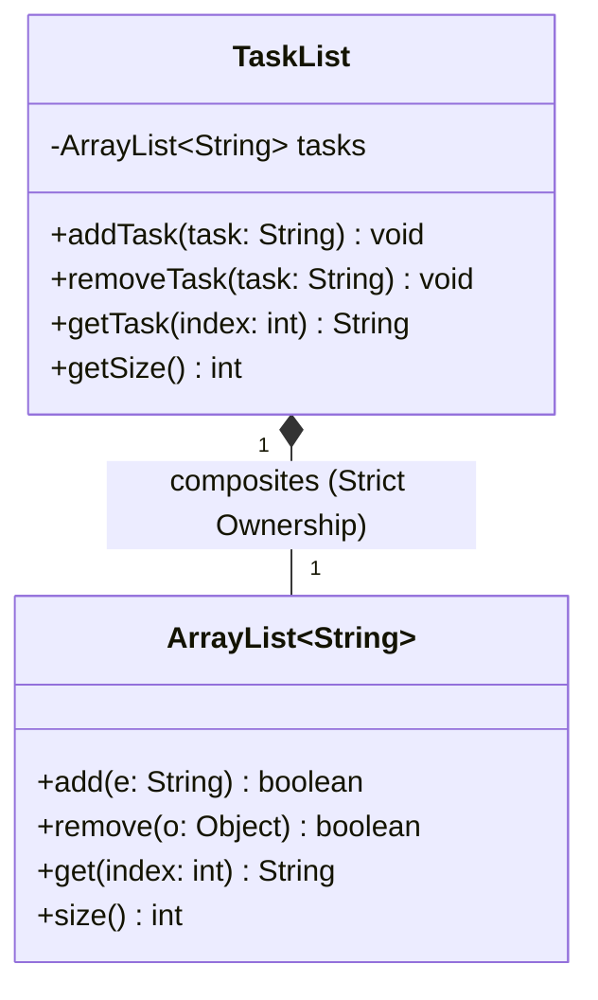

# 📘 P00.M01.L03 — Day 2 Arrays, Strings, Collections & Invariants

**Date:** July 14, 2026
**Topic:** Encapsulation, Composition vs. Inheritance, and Memory Mechanics

> How Java manages memory under the hood — and how to use that knowledge to design safer, more defensible classes.

---

## 📑 Table of Contents

- [🧠 1. Warm-up & Core Memory Mechanics](#-1-warm-up--core-memory-mechanics)
- [📺 2. Object Relationships & UML Diagrams](#-2-object-relationships--uml-diagrams)
- [🛠️ 3. Coding Insights & Benchmarks](#️-3-coding-insights--benchmarks)
- [🏛️ 4. Senior Engineering Principles](#️-4-senior-engineering-principles)
- [🎯 5. Core Architectural Reflections](#-5-core-architectural-reflections)

---

## 🧠 1. Warm-up & Core Memory Mechanics

### String Immutability & The String Pool

- **Loop overhead** — `str += "x"` inside a loop forces the JVM to build a brand-new string object on every iteration, copying over all prior characters. That leaves redundant intermediate objects on the heap and drives up GC load.
- **The String Pool** — a dedicated caching region of heap memory. When you declare a literal (`String s = "hello";`), the JVM checks the pool first and reuses an existing match instead of duplicating it.

### StringBuilder Internals

- Backed by a **mutable `char[]`** that's modified in place.
- Grows dynamically once capacity is exhausted, using:

$$\text{New Capacity} = (2 \times \text{Old Capacity}) + 2$$

- **Efficiency:** amortized **O(1)** per append, **O(n)** overall — with zero intermediate garbage objects.

### Runtime Exceptions: Arrays vs. Lists

| Exception | Thrown By | Trigger |
|---|---|---|
| `ArrayIndexOutOfBoundsException` | The JVM | Invalid index on a primitive/native array (`int[]`, `Object[]`) |
| `IndexOutOfBoundsException` | Java Collections Framework | Logical size-boundary check (e.g. `ArrayList`) |

> **Relationship:** `ArrayIndexOutOfBoundsException` **inherits from** `IndexOutOfBoundsException`. The split separates language-level memory violations from higher-level logical ones.

### Generics & Autoboxing

- **Type Erasure** — generics exist only at compile time; the compiler erases them down to plain `Object` references for backward compatibility.
- **Autoboxing** — primitives (`int`, `double`, `char`) don't extend `Object`, so Java auto-wraps them into `Integer`, `Double`, etc. when placed in a collection, adding minor reference-chasing overhead.

---

## 📺 2. Object Relationships & UML Diagrams

*Based on Derek Banas's UML Class Diagram Architecture*

The golden rule for telling relationships apart: **Lifecycle Dependency / Ownership**.

| Relationship | UML Symbol | Lifetime Rule | Example |
|---|---|---|---|
| **Aggregation** (Weak) | Hollow Diamond `◇` | Child can exist independently of the parent | A `Dog` **has a** `Breed` — deleting the dog leaves the breed intact |
| **Composition** (Strong) | Filled Diamond `◆` | Exclusive ownership — child dies with the parent | A `TaskList` **owns** its `ArrayList` — GC the list, and the array dies with it |

> ⚠️ **Bidirectional Trap:** the inverse of an aggregation is *not* automatically a composition. Deleting a `Breed` doesn't delete the `Dog`s — they just lose their breed reference. True composition requires an absolute **"if I die, you die"** relationship.



---

## 🛠️ 3. Coding Insights & Benchmarks

### Performance Delta: Memory Benchmarking

Across 5,000 append iterations:

| Approach | Result | Why |
|---|---|---|
| `String` concatenation | Noticeably slower | Constant object instantiation + internal copying |
| `StringBuilder.append()` | ~0–1ms (near-instant) | Writes directly to an open internal buffer |

### Defensive Collection Wrapper Class

Using **composition** to enforce invariants — rules that must always hold true for an object's state:

```java
import java.util.ArrayList;

public class TaskList {
    // 1. private encapsulates the data from outer world modification.
    // 2. final anchors the reference so it can never be reassigned.
    private final ArrayList<String> arr;

    public TaskList() {
        this.arr = new ArrayList<>();
    }

    public void addTask(String task) {
        // Invariant Validation: Shield data from pollution
        if (task == null || task.trim().isEmpty()) {
            throw new IllegalArgumentException("Task cannot be null or empty.");
        }
        if (arr.contains(task)) {
            throw new IllegalArgumentException("Duplicate tasks are not allowed: " + task);
        }
        arr.add(task);
    }

    public void removeTask(String task) {
        arr.remove(task);
    }

    public String getTask(int index) {
        return arr.get(index); // IndexOutOfBoundsException naturally flows up if invalid
    }

    public int getSize() {
        return arr.size();
    }
}
```

---

## 🏛️ 4. Senior Engineering Principles

### Composition Over Inheritance in Collections

- **The flaw of inheritance** — `TaskList extends ArrayList<String>` blindly inherits 30+ public methods (`clear()`, `set()`, `addAll()`...). Any caller could bypass your validation rules, insert `null`, or wipe the list entirely.
- **The victory of composition** — wrapping a private internal list lets you expose *only* the methods you choose, keeping data integrity fully intact.

### Open-Source Connection (JDK Internals)

- `java.util.Collections.unmodifiableList(List<T> list)` is a textbook example.
- Under the hood, the JDK uses **composition**: it wraps your mutable list in a private `UnmodifiableList` class, exposing read methods directly while overriding mutators (`add`, `remove`) to throw `UnsupportedOperationException`.

---

## 🎯 5. Core Architectural Reflections

1. **Reference passing mechanics** — Java is strictly **pass-by-value**. Passing an object (like a string into `addTask`) copies the *reference address* pointing to the heap; the method parameter receives that copy.
2. **Generics vs. exceptions** — generic type safety is a **compile-time guardrail**, not a runtime exception source. Type erasure removes generics before execution, so the compiler itself is the barrier, refusing to compile mismatched types.
3. **The role of `private final`:**
   - `private` → restricts visibility so external code can't directly touch the internal array.
   - `final` → restricts mutation of the reference itself, guaranteeing the wrapped list can never be reassigned for the object's entire lifespan.

---

*Notes compiled from lecture material, UML architecture discussions, and hands-on coding exercises.*