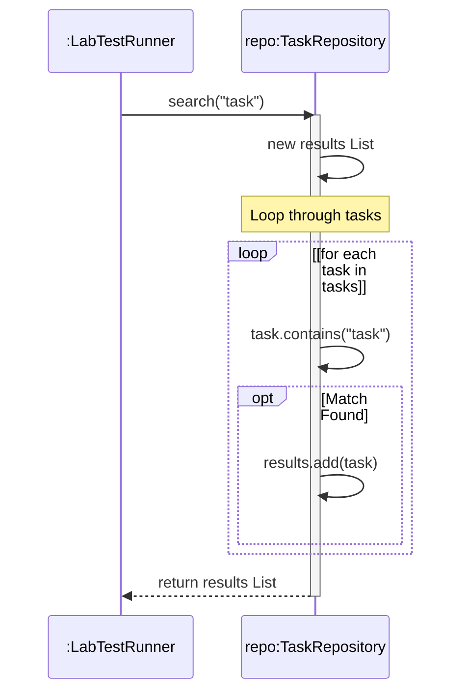

# 📘 P00.M01.L03 — Engineering Notes

> **In-Memory Storage · Traversal-Modification Boundaries · Defensive Copying · Structural Encapsulation**

| | |
|---|---|
| 📅 **Date** | July 15, 2026 |
| 🧩 **Module** | Phase 00, Module 01, Lesson 03 |
| 🏷️ **Package** | `handbook.phase00.p00m01l03` |

---

## 📑 Table of Contents

1. [Warm-up & OOP Foundations](#-1-warm-up--core-object-oriented-foundations)
2. [Warm-up Coding Exercise](#-2-warm-up-coding-exercise)
3. [UML Sequence Diagramming](#-3-uml-sequence-diagramming-loops--iterations)
4. [Core Memory Architecture](#-4-core-memory-architecture-object-copying-deep-dive)
5. [The Copying Toolkit](#-5-chat-debates--resolutions-the-copying-toolkit)
6. [Debugging `ConcurrentModificationException`](#️-6-debugging-concurrentmodificationexception)
7. [Hands-on Lab: In-Memory Storage Engine](#-7-hands-on-lab-in-memory-storage-engine)
8. [Engineering Insight & OSS Architecture](#-8-engineering-insight--open-source-architecture)
9. [End-of-Day Reflections](#-9-end-of-day-reflections)

---

## 🧭 1. Warm-up & Core Object-Oriented Foundations

### Composition vs. Inheritance

When wrapping standard collection classes, **Composition beats Inheritance**.

| Approach | Behavior | Risk |
|---|---|---|
| ❌ **Inheritance** (`class TaskList extends ArrayList<String>`) | Inherits dozens of public methods (`.clear()`, `.remove()`, `.addAll()`) | Breaks encapsulation — parent can't enforce business rules on exposed methods |
| ✅ **Composition** (`private final ArrayList<String>`) | Acts as a strict structural gateway | Selectively exposes intentional APIs with built-in checks (null checks, uniqueness) |

### Lifecycle Boundaries in UML

- **◆ Composition (solid diamond):** the "Part" object's lifecycle is bound to the "Whole." Destroy the container → parts cease to exist.
- **◇ Aggregation (empty diamond):** looser coupling. The "Whole" holds references, but part lifecycles are independent.

### Structural Compilation Safety (Generics)

Java Generics enforce **compile-time** type boundaries. Without them, elements collapse to raw `Object`, requiring explicit downcasting — a real risk of runtime `ClassCastException`. Generics guarantee structural alignment before the code ever runs.

### Physical Packaging & the JVM

Java package declarations mirror the file system (`handbook/phase00/p00m01l03/`). This lets `javac` and the runtime `ClassLoader` uniquely resolve fully qualified class paths, avoiding naming collisions between identically-named classes across modules.

---

## 💻 2. Warm-up Coding Exercise

**Goal:** detect duplicates in `O(n)` time.

```java
import java.util.HashSet;

public boolean hasDuplicates(String[] items) {
    if (items == null || items.length == 0) {
        return false;
    }

    HashSet<String> seenItems = new HashSet<>();
    for (String item : items) {
        // HashSet.add() returns false if the item is already present
        if (!seenItems.add(item)) {
            return true;
        }
    }
    return false;
}
```

---

## 📊 3. UML Sequence Diagramming (Loops & Iterations)

UML sequence diagrams use **Interaction Frames** to model repeated behavior over time.

| Element | Description |
|---|---|
| 🖼️ **Frame** | Bounding rectangle enclosing repeated message exchanges |
| 🔁 **Operator** | Labeled `loop` in the top-left corner |
| 🛡️ **Guard Condition** | Bracketed condition below the operator, e.g. `[for each task in tasks]` |
| ▶️ **Execution Flow** | Every message inside the frame runs sequentially each pass, until the guard fails |



---

## 📚 4. Core Memory Architecture (Object Copying Deep-Dive)

| Copy Type | Container Allocation | Element Allocation | Behavioral Side-Effect |
|---|---|---|---|
| **Reference Copy** | Reuses original memory pointer | Reuses existing items | Mutating the reference instance immediately mutates the source |
| **Shallow Copy** | New list container on the heap | Copies inner object *addresses* | Structural ops (`.clear()`) are safe; shared mutable elements affect both |
| **Deep Copy** | New list container on the heap | New object instances for all elements | Complete decoupling — zero interaction with source |

### 💎 The Power of Immutability

`String`, `Integer`, `Double`, `Boolean` are **immutable** — their values can't change post-creation.

> 🧠 **Key Insight:** A shallow copy of an immutable collection behaves *exactly* like a deep copy. Deep-cloning a list of strings just wastes memory — those references can never be corrupted externally.

---

## 🔍 5. Chat Debates & Resolutions: The Copying Toolkit

### 🔬 Case A — Constructor Copy
```java
List<Integer> copy = new ArrayList<>(list);
```
**Mechanic:** Shallow copy. New array structure, but reuses `Integer` references. Safe *because* `Integer` is immutable.

### 🔬 Case B — `addAll()`
```java
List<Integer> copy = new ArrayList<>();
copy.addAll(list);
```
**Mechanic:** Shallow copy — identical result to Case A. Only difference: an empty list is created first, then references stream in.

### 🔬 Case C — `Collections.copy()`
```java
Collections.copy(dest, source);
```
**Mechanic:** Shallow copy via array overwrite.
> ⚠️ **Critical Trap:** `dest` must be **pre-allocated** and `size(dest) ≥ size(source)`, or it throws `IndexOutOfBoundsException`. It overwrites indices — it does *not* create a new container.

### 🔬 Case D — Stream Collection
```java
List<String> copy = list.stream().collect(Collectors.toList());
```
**Mechanic:** Shallow copy via pipeline aggregation into a new container — with the bonus of inline sorting/filtering.

---

## 🛡️ 6. Debugging `ConcurrentModificationException`

### The Problem

A `for-each` loop injects an implicit `Iterator`. Calling `list.remove()` directly inside that loop bumps the list's `modCount`, but the iterator doesn't know. The next `iterator.next()` call detects the mismatch and throws `ConcurrentModificationException`.

### ⚠️ The Sneaky Edge Case

Removing the **second element** from a **three-element list** doesn't crash. Here's why:

1. Size drops from **3 → 2** the moment element 2 is removed.
2. The iterator's `cursor` has already advanced to **2**.
3. Next check: `hasNext()` → `cursor != size` → `2 != 2` → **`false`**.
4. Loop exits cleanly — `iterator.next()` is never called again, so the mismatch is never caught! 🕵️

> Removing the **first** element instead leaves `cursor = 1`, `size = 2` → the loop takes another pass, hits `iterator.next()`, and **crashes**.

### ✅ The Solutions

**Solution A — Explicit Iterator Removal**
```java
Iterator<String> it = tasks.iterator();
while (it.hasNext()) {
    String task = it.next();
    if (task.contains("bootstrapper")) {
        it.remove(); // Safely updates internal state tracking
    }
}
```

**Solution B — Functional `removeIf`**
```java
tasks.removeIf(task -> task.contains("bootstrapper"));
```

---

## 🏗️ 7. Hands-on Lab: In-Memory Storage Engine

### `TaskRepository.java`

```java
package handbook.phase00.p00m01l03;
import java.util.ArrayList;

public class TaskRepository {
    private final ArrayList<String> tasks = new ArrayList<>();

    public void add(String task) {
        if (task == null || task.trim().isEmpty()) {
            throw new IllegalArgumentException("Task content cannot be empty.");
        }
        for (String t : tasks) {
            if (t.equalsIgnoreCase(task.trim())) {
                throw new IllegalArgumentException("Duplicate task detected: " + task);
            }
        }
        tasks.add(task.trim());
    }

    // Defensive Copy protects the internal data structure from encapsulation leaks
    public ArrayList<String> findAll() {
        return new ArrayList<>(this.tasks);
    }

    public ArrayList<String> search(String query) {
        ArrayList<String> results = new ArrayList<>();
        if (query == null || query.trim().isEmpty()) {
            return results;
        }

        String lowerQuery = query.toLowerCase().trim();
        for (String task : tasks) {
            if (task.toLowerCase().contains(lowerQuery)) {
                results.add(task);
            }
        }
        return results;
    }
}
```

### `LabTestRunner.java`

```java
package handbook.phase00.p00m01l03;
import java.util.ArrayList;

public class LabTestRunner {
    public static void main(String[] args) {
        System.out.println("Running Task Engine Lab Tests...");

        TaskRepository repo = new TaskRepository();
        repo.add("Review LLD handbook");
        repo.add("Compile task bootstrapper");
        repo.add("Draw UML sequence diagrams");

        // Test 1: Query Search
        ArrayList<String> results = repo.search("task");
        assert results.size() == 1 : "Search failed to filter matching tasks!";
        System.out.println("Test Case 1 Passed.");

        // Test 2: Encapsulation Boundary Security
        ArrayList<String> allTasks = repo.findAll();
        allTasks.clear(); // Attempting external corruption

        assert repo.findAll().size() == 3 : "Security leak: External modification affected internal database!";
        System.out.println("Test Case 2 Passed: Defensive copying secure.");
    }
}
```

---

## 🔬 8. Engineering Insight & Open Source Architecture

### 🚨 Encapsulation Leaks

Protecting internal class structures matters on **both reads and writes**. A public getter that exposes a direct reference to an internal collection breaks encapsulation entirely — external clients can `.clear()` or corrupt data without ever touching validation logic. A **defensive copy** creates true structural separation on the heap.

### 🌱 Open Source Connection: Spring Framework

Enterprise frameworks lean on defensive copying constantly. When querying internal core registries (registered beans, configuration mappings), Spring wraps the data with `Collections.unmodifiableList` or a shallow copy — preventing external plugins from corrupting the core application context lifecycle.

---

## 🏁 9. End-of-Day Reflections

- ✅ **Getter Modification** — Exposing raw references lets external clients invoke mutation APIs (`.clear()`) directly on internal state, bypassing all domain validation.
- ✅ **Concurrent Modifications** — Triggered when a collection's structural state changes outside an active iterator; caught during `iterator.next()` validation.
- ✅ **Immutability Optimization** — A shallow copy of immutable elements (`String`, `Integer`) is just as secure as a deep copy, without the performance cost.
- ✅ **UML Loop Modeling** — Bounded sequence frames tagged `loop` represent repetitive behavioral flows.
- ✅ **Case-Insensitive Constraints** — Enforcing case-insensitivity on inserts *and* lookups guards against duplicate variants and keeps the query interface reliable.

---

<p align="center"><i>Compiled from Phase 00 · Module 01 · Lesson 03 lab notes</i></p>