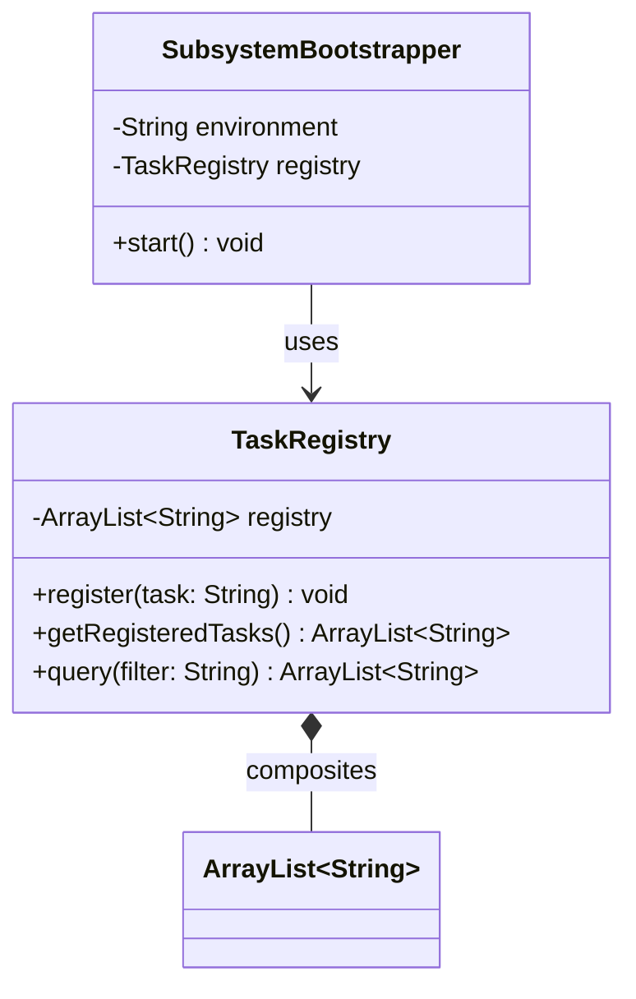

# 📚 Project Day - Java Architecture & Design — Study Notes

> **Date:** July 16, 2026
> **Module:** 00.01 — InMemory Task Registry Core
> **Goal:** Tie together compilation, JVM execution, variables/types, collections, control flow, and defensive copying into one modular, self-testing Java project.

---

## 🧭 Table of Contents

1. [Warm-up Concepts](#1--warm-up-concepts)
2. [Packaging & Namespace Conventions](#2--packaging--namespace-conventions)
3. [Reading: Write Self-Testing Code](#3--reading-write-self-testing-code)
4. [Coding Exercise: EntryValidator](#4--coding-exercise-entryvalidator)
5. [Project: InMemory Task Registry Core](#5--project-inmemory-task-registry-core)
6. [UML Class Diagram](#6--uml-class-diagram)
7. [Engineering Insights](#7--engineering-insights)
8. [End-of-Day Reflection](#8--end-of-day-reflection)
9. [Quick-Recall Cheat Sheet](#9--quick-recall-cheat-sheet)

---

## 1. 🎯 Warm-up Concepts

### 🔹 Dynamic Classloading
- The JVM loads `.class` bytecode **lazily**, not all at once.
- Classes load only when first referenced — via `new`, a static access, or reflection.
- Loading goes through a hierarchy: **Bootstrap → Extension/Platform → Application/System** ClassLoader.
- **Why it matters:** saves memory and speeds up startup vs. loading everything eagerly.

### 🔹 Stack vs. Heap

| Aspect | Stack | Heap |
|---|---|---|
| Scope | Thread-specific | Global (shared) |
| Stores | Primitives, params, reference *addresses* | Actual object instances |
| Lifetime | Strict LIFO (frame-based) | Managed by Garbage Collector |
| Speed | Fast | Slower (GC overhead) |

### 🔹 IEEE 754 Floating-Point Quirks (`double`)

```java
Double.MAX_VALUE + 10 == Double.MAX_VALUE          // true  — 10 is lost below precision
Double.MAX_VALUE + Double.MAX_VALUE == Infinity    // true  — exponent overflow
```

- **Why `+10` disappears:** 64-bit doubles give only 52 bits to the mantissa. At `1.79 × 10³⁰⁸`, the gap between representable numbers is far bigger than 10, so it rounds right back down.
- **Why doubling overflows:** the exponent field maxes out at `1023`. Doubling the value pushes past that limit → `Positive Infinity`.

> 🧠 **Recall trick:** *"Adding is invisible, doubling is infinite."*

### 🔹 Defensive Copying & Encapsulation Leaks
- **The leak:** returning a direct reference to an internal `List`/`Map` lets callers call `.clear()`, `.remove()`, etc. — bypassing your validation entirely.
- **The fix — two options:**
  1. Return a **defensive copy**: `new ArrayList<>(this.registry)`
  2. Return an **unmodifiable wrapper**: `Collections.unmodifiableList(...)`

### 🔹 UML Sequence Diagram Fragments

| Fragment | Symbol | Meaning |
|---|---|---|
| `loop` | Single guard `[i < length]` | Repeats while condition is true |
| `alt` / `opt` | Dashed-line operand boxes | Conditional branching (if/else) |

---

## 2. 🎥 Packaging & Namespace Conventions

- Java package names **map directly to folder structure**: `com.company.project.module` → `com/company/project/module/`.
- Packages exist to **prevent naming collisions** and enforce boundaries between components.
- Compilation must mirror the nested package path:

```bash
javac src/main/java/handbook/phase00/project01/*.java -d bin
```

---

## 3. 📖 Reading: *Write Self-Testing Code* (Martin Fowler)

| Idea | Takeaway |
|---|---|
| **Self-testing code** | Build automated tests alongside features so correctness is one command away |
| **The "Bug Detector"** | Frequent test runs catch bugs the moment they're introduced — easy to trace |
| **Refactoring courage** | A test safety net lets you restructure code / kill tech debt without fear |
| **Defect handling ritual** | 1️⃣ Write a *failing* test that reproduces the bug → 2️⃣ Fix code until it passes |

> 🧠 **Recall trick:** *"Red test first, green code second."*

---

## 4. 🛠️ Coding Exercise: `EntryValidator`

```java
public class EntryValidator {

    public static boolean isValidEntry(String entry) {
        if (entry == null) {
            return false;
        }
        String cleaned = entry.trim();
        return cleaned.length() >= 3 && cleaned.length() <= 50;
    }

    public static void main(String[] args) {
        assert !isValidEntry(null)              : "FAILED: null entry should be invalid!";
        assert !isValidEntry("   ")             : "FAILED: whitespace-only entry should be invalid!";
        assert !isValidEntry("ab")               : "FAILED: entry under 3 chars should be invalid!";
        assert !isValidEntry("a".repeat(51))     : "FAILED: entry over 50 chars should be invalid!";
        assert isValidEntry("abcd")              : "FAILED: valid entry 'abcd' was rejected!";

        System.out.println("All EntryValidator assertions passed!");
    }
}
```

**Validation rule:** entry must be non-null, and its trimmed length must be **3–50 characters**.

> ⚠️ **Assertion Rules**
> 1. Syntax: `assert <condition_expected_TRUE> : "message if FALSE";`
> 2. Assertions are **disabled by default** in the JVM — you must enable them:
>    ```bash
>    java -ea EntryValidator
>    ```

---

## 5. 🏗️ Project: InMemory Task Registry Core

### 5.1 Architecture Decision Record — `docs/adr/0001-design-registry.md`

| Field | Content |
|---|---|
| **Context** | Need a task storage engine safe from external state corruption |
| **Decision** | Composition over Inheritance — wrap `ArrayList` inside `TaskRegistry`; enforce defensive copies on every getter/query |
| **Consequence** | Full encapsulation; callers cannot mutate internal engine state |

### 5.2 `TaskRegistry.java` — the core engine

```java
package handbook.phase00.project01;
import java.util.ArrayList;

public class TaskRegistry {
    private final ArrayList<String> registry = new ArrayList<>();

    public void register(String task) {
        if (task == null || task.trim().isEmpty()) {
            throw new IllegalArgumentException("Task cannot be null or empty.");
        }
        String cleaned = task.trim();
        if (cleaned.length() < 3 || cleaned.length() > 50) {
            throw new IllegalArgumentException("Task must be between 3 and 50 characters.");
        }
        for (String t : registry) {
            if (t.equalsIgnoreCase(cleaned)) {
                throw new IllegalArgumentException("Task already registered: " + cleaned);
            }
        }
        registry.add(cleaned);
    }

    public ArrayList<String> getRegisteredTasks() {
        return new ArrayList<>(this.registry); // Defensive Copy
    }

    public ArrayList<String> query(String filter) {
        ArrayList<String> matches = new ArrayList<>();
        if (filter == null || filter.trim().isEmpty()) {
            return matches;
        }
        String lowerFilter = filter.toLowerCase().trim();
        for (String t : registry) {
            if (t.toLowerCase().contains(lowerFilter)) {
                matches.add(t);
            }
        }
        return matches;
    }
}
```

**What to remember about each method:**
- `register(task)` → validates (non-empty, 3–50 chars, no case-insensitive duplicates) then adds.
- `getRegisteredTasks()` → **never** returns the live list; always a fresh copy.
- `query(filter)` → case-insensitive substring search, returns a *new* matches list (already safe).

### 5.3 `SubsystemBootstrapper.java` — startup wrapper

```java
package handbook.phase00.project01;

public class SubsystemBootstrapper {
    private final TaskRegistry registry;
    private final String environment;

    public SubsystemBootstrapper(TaskRegistry registry, String environment) {
        if (environment == null || environment.trim().isEmpty()) {
            throw new IllegalArgumentException("Environment boot parameter required.");
        }
        this.registry = registry;
        this.environment = environment.trim();
    }

    public void start() {
        System.out.println("Booting Task Registry Subsystem in [" + environment + "]...");
        System.out.println("Subsystem initial registry count: " + registry.getRegisteredTasks().size());
    }
}
```

- Requires an explicit environment tag (e.g. `"DEV"`, `"TESTING"`, `"PROD"`) at construction — **fails fast** if missing.
- `start()` just reports status; no hidden side effects on the registry itself.

### 5.4 `ProjectTestRunner.java` — integration tests

```java
package handbook.phase00.project01;
import java.util.ArrayList;

public class ProjectTestRunner {
    public static void main(String[] args) {
        System.out.println("Starting Project Integration Tests...");

        TaskRegistry registry = new TaskRegistry();
        SubsystemBootstrapper bootstrapper = new SubsystemBootstrapper(registry, "TESTING");

        bootstrapper.start();

        // Check Exception Throwing Logic for Invalid Input
        boolean caughtEmpty = false;
        try {
            registry.register("   ");
        } catch (IllegalArgumentException e) {
            caughtEmpty = true;
        }
        assert caughtEmpty : "Empty task registration did not throw error!";

        // Test Encapsulation Safety
        registry.register("Write system test");
        ArrayList<String> escapeList = registry.getRegisteredTasks();
        escapeList.clear(); // Attempt external modification
        assert registry.getRegisteredTasks().size() == 1 : "Encapsulation breach: internal database corrupted.";

        System.out.println("All Project Integration Tests Passed Cleanly!");
    }
}
```

**The key test pattern here:**
1. Try an invalid action inside `try {}`.
2. Catch the expected exception and flip a boolean flag.
3. `assert` that the flag is `true` — proving the guard actually fired.
4. Separately: grab a copy, mutate the copy, then confirm the *original* is untouched — proving the defensive copy worked.

---

## 6. 📐 UML Class Diagram



**Reading this diagram:**
- `SubsystemBootstrapper` **uses** `TaskRegistry` (association) — it holds a reference and calls its methods.
- `TaskRegistry` **composites** `ArrayList<String>` (filled diamond) — the list cannot exist independently of the registry; it's a strict has-a with full ownership.

---

## 7. 💡 Engineering Insights

### Clean Subsystem Checklist
A well-designed subsystem should be:
- ✅ **Self-contained** — hides its internal data structures behind a facade
- ✅ **Defensive** — validates every input, protects every output
- ✅ **Bootstrappable** — accepts explicit configuration at startup (no hidden globals)

### Real-World Parallel — Apache Tomcat
- Tomcat boots via a `Bootstrap` entry point that initializes internal registries (`StandardServer`, `StandardService`).
- These hold internal connector collections but only expose them via **defensive copies** or **unmodifiable views** — same pattern as `TaskRegistry`, just at production scale.

### Why ADRs Live in Source Control
- ADRs record *why* a decision was made — trade-offs, constraints, boundaries — not just *what* was built.
- Storing them in `docs/adr/` keeps architectural reasoning **version-controlled alongside the code**, so future team members (including future-you) understand the "why," not just the "what."

---

## 8. 📝 End-of-Day Reflection

1. **`TaskRegistry.query()`** is a small but complete example of composing fundamentals: collection iteration + local scoping (`lowerFilter`) + string transformation (`.toLowerCase()`) + conditional logic (`.contains()`) + defensive encapsulation — all in one method.
2. **Environment parameters** (`DEV`/`STAGING`/`PROD`) let a bootstrapper resolve config, logging, and feature flags *without* polluting core domain logic with environment checks.
3. **Testing defensive behavior** always follows the same shape: `try/catch` to trigger the guard, then `assert` that the failure flag came back `true` — proving the safeguard is actually live, not just present in the code.

---

## 9. 🧠 Quick-Recall Cheat Sheet

| Topic | One-liner to remember |
|---|---|
| Classloading | Lazy — loads only when a class is first touched |
| Stack vs Heap | Stack = frames & primitives (fast, LIFO); Heap = objects (GC-managed) |
| `MAX_VALUE + 10` | `true` — 10 vanishes below precision |
| `MAX_VALUE + MAX_VALUE` | `Infinity` — exponent overflow |
| Defensive copying | Never return the live collection — copy it or wrap it unmodifiable |
| Package = folder | `com.a.b` must live at `com/a/b/` |
| Self-testing code | Write the failing test *first*, then fix until green |
| Assertions | Off by default — run with `-ea` |
| `TaskRegistry` rule | 3–50 chars, no case-insensitive duplicates |
| ADRs | Context → Decision → Consequence, versioned with the code |