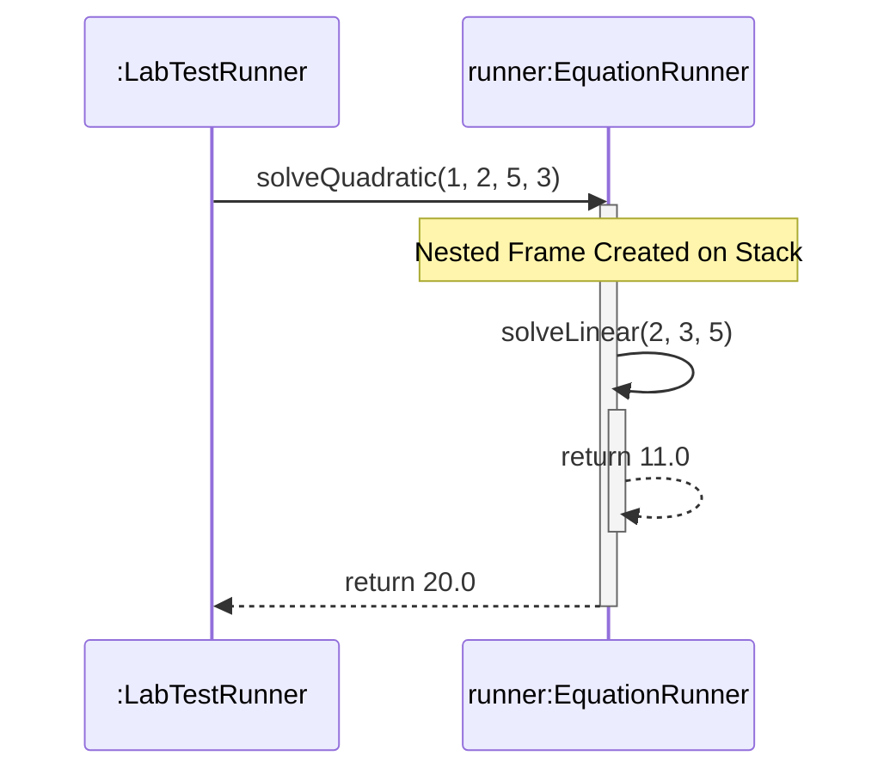

# 📘 P00.M02.L01 — Day 3 Methods, Parameters, Return Values & Scope

> **Author:** Burhanuddin फहीम  
> **Date:** July 19, 2026  
> **Module:** Phase 00 · Module 02 · Lesson 01  
> **Status:** ✅ Complete & Verified

A deep-dive study log covering Java method mechanics — from signatures and binding to pass-by-value semantics, defensive copying, and JUnit's isolation model.

---

## 📑 Table of Contents

1. [Warm-up & Core Fundamentals](#1-warm-up--core-fundamentals)
2. [Sequence Diagrams & The Call Stack](#2-sequence-diagrams--the-call-stack)
3. [Java Pass-by-Value Realities](#3-java-pass-by-value-realities)
4. [Coding & Architecture Labs](#4-coding--architecture-labs)
5. [Advanced Architectural Patterns](#5-advanced-architectural-patterns)
6. [End-of-Day Core Reflections](#6-end-of-day-core-reflections)
7. [Verification Summary](#-verification-summary)

---

## 1. Warm-up & Core Fundamentals

### 🔑 Method Signatures & Constraints

| Concept | Detail |
|---|---|
| **Components** | A method signature = **method name** + **parameter list** (type, number, order) |
| **Return Type** | ❌ Not part of the signature — two methods differing only by return type cause a duplicate method compiler error |
| **Why** | Java allows calling a method without using its return value (`calculateSomething();`), so the compiler has no way to disambiguate by return type alone |

### ⚙️ Binding Mechanics

- **Static Binding (Compile-Time)** — Applies to `static`, `private`, and `final` methods since they can't be overridden. The compiler links the call directly to bytecode; the JVM just executes it.
- **Dynamic Binding (Runtime)** — The JVM resolves the call using a **Virtual Method Table (vtable)**, inspecting the actual heap object's type at execution time.

### ❓ Resolving Null Ambiguity

- Passing `null` to overloaded methods triggers the **Most Specific Type Rule** — Java binds to the lowest subclass in the hierarchy.
- Unrelated overloads (e.g. `print(String)` vs `print(Integer)`) create ambiguity → **compilation failure**.
  - **Fix:** explicit cast → `print((String) null);`

### 🧰 Practical Abstraction — `java.util.Arrays.sort()`

Uses method overloading to expose a single clean API (`Arrays.sort()`) across primitive arrays and object types, instead of forcing separate method names like `sortIntArray()` or `sortDoubleArray()`.

---

## 2. Sequence Diagrams & The Call Stack

- **Lifelines & Instances** — All operations on the *same* object instance stack along one lifeline.
- **Activation Bars** — Represent a stack frame's lifespan. A nested call stacks a new bar on top of the current one.
- **Call Stack Correlation** — Growing bars = frames pushed; a bar ending = a frame popped on `return`.



---

## 3. Java Pass-by-Value Realities

> **The Golden Rule:** Java is **strictly pass-by-value** — for primitives *and* object references, no exceptions.

For objects, Java copies the **memory address bits** (the reference value), not the object itself:

```text
[Caller Scope: Ref 'c']  ───► Holds Memory Address (0x7A) ───┐
                                                              ├─► [Heap Object: Coordinate(10,10)]
[Method Scope: Ref '临']  ───► Copies Memory Address (0x7A) ───┘
```

| Action | Effect |
|---|---|
| ✅ `c.setX(99)` | **Mutates shared state** — both refs point to the same heap object |
| 🚫 `c = new Coordinate()` / `c = null` | **Local repoint only** — caller's original reference is untouched |

---

## 4. Coding & Architecture Labs

### 🧪 Reference Mutation Playground

Shows that internal field mutation via a copied reference *does* affect the shared object.

```java
class Coordinate {
    private int x, y;
    public Coordinate(int x, int y) { this.x = x; this.y = y; }
    public void setX(int x) { this.x = x; }
    public int getX() { return this.x; }
}

public class ReferenceMutationPlayground {
    public static void shift(Coordinate c) {
        c.setX(99); // Modifies the object at the shared heap address
    }

    public static void main(String[] args) {
        Coordinate coord = new Coordinate(10, 10);
        shift(coord);
        assert coord.getX() == 99 : "Reference mutation verification failed!";
    }
}
```

### 🧮 Scoped Equation Runner

`solveQuadratic` delegates part of its work to `solveLinear`, demonstrating nested stack frames.

```java
package handbook.phase00.p00m02l01;

public class EquationRunner {
    public double solveLinear(double m, double x, double c) {
        if (m == 0.0) {
            throw new IllegalArgumentException("Slope 'm' cannot be zero in a linear equation.");
        }
        return (m * x) + c;
    }

    public double solveQuadratic(double a, double b, double c, double x) {
        if (a == 0.0) {
            throw new IllegalArgumentException("Coefficient 'a' cannot be zero.");
        }
        // Nested Execution Point
        double linearPortion = solveLinear(b, x, c);
        return (a * x * x) + linearPortion;
    }
}
```

---

## 5. Advanced Architectural Patterns

### 🛡️ Defensive Copying & Encapsulation

- **Vulnerability:** Storing a mutable external object (e.g. `Date`, arrays) directly as an instance field creates a shared-reference leak — outside code can silently corrupt internal state.
- **Solution:** Copy incoming objects on entry (constructors/setters) so internal state stays fully decoupled.

```java
public void setRegistrationDate(Date date) {
    // Isolates state by copying value data onto a unique heap object
    this.registrationDate = new Date(date.getTime());
}
```

- **True Immutability:** drop setters → mark fields `final` → defensively copy on the way **out** (getters) too.

### 🧬 Open Source Connection — JUnit 5 Engine Design

JUnit 5 creates a **brand-new instance** of the test class for every single `@Test` method, preventing state contamination and guaranteeing isolated, side-effect-free test runs across the suite.

---

## 6. End-of-Day Core Reflections

1. **Local Parameter Nullification** — Setting a parameter to `null` inside a method only breaks the *local* link to the heap; the caller's reference is unaffected.
2. **Memory Lifecycle Separation** — Stack frames vanish instantly on `return` or an unhandled exception. They're entirely independent of the Garbage Collector, which only sweeps dead objects from the **Heap**.


<p align="center"><sub>📚 Handbook Phase 00 · Module 02 · Lesson 01 — Java Fundamentals Series</sub></p>