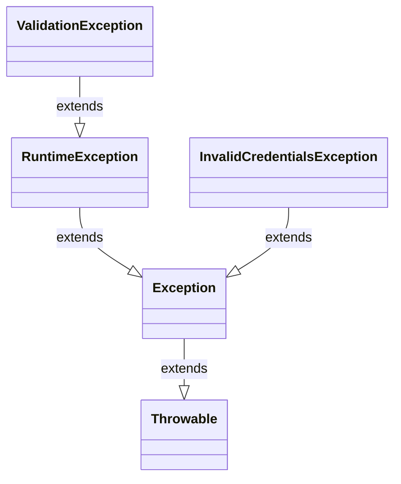

# ☕ Day 2 Exceptions, Error Handling & Defensive Checks

> **Module:** P00.M02.L02
> **Topic:** Java Exception Hierarchy, Multi-Catch Blocks & Defensive Programming

A concise, practical reference for understanding how Java's exception system works — from the root `Throwable` class down to custom, domain-specific exceptions.

---

## 📖 Table of Contents

- [Key Concepts](#-key-concepts)
  - [The Ultimate Exception Hierarchy](#1-the-ultimate-exception-hierarchy)
  - [Catch Ordering & Sequential Matching](#2-the-catch-ordering--sequential-matching-rule)
- [Technical Implementations](#-technical-implementations)
  - [Exercise 1: Warm-up Parsing Check](#exercise-1-warm-up-parsing-check)
  - [Exercise 2: Cascading Multiple Exception Handlers](#exercise-2-cascading-multiple-exception-handlers)
- [Real-World & Engineering Insights](#-real-world--engineering-insights)
- [Reflections Captured](#-reflections-captured)

---

## 🧩 Key Concepts

### 1. The Ultimate Exception Hierarchy

| Class | Extends | Description |
|---|---|---|
| `Throwable` | — | The absolute parent of all errors and exceptions in Java |
| `Error` | `Throwable` | Serious, fatal JVM-internal problems (e.g. `OutOfMemoryError`, `StackOverflowError`) |
| `Exception` | `Throwable` | Conditions a reasonable application might want to catch |
| `RuntimeException` | `Exception` | Base class for all **unchecked** exceptions |

> ⚠️ **Rule of thumb:** Application code should **never** try to catch `Throwable` or `Error` — the system needs to fail loudly and safely when they occur.



---

### 2. The Catch Ordering & Sequential Matching Rule

- Exceptions are evaluated by the JVM **top to bottom**, sequentially through each `catch` block.
- The **first** matching block (exact type or superclass) is executed.
- 🚫 **Compilation Constraint:** A superclass catch (e.g. `Exception`) must **never** sit above a subclass catch (e.g. `NullPointerException`). Doing so makes the subclass block **unreachable**, which is a **compile-time error**.

```
✅ Correct order            ❌ Incorrect order
─────────────────           ───────────────────
catch (NullPointerException) catch (Exception)        ← swallows everything below
catch (NumberFormatException) catch (NullPointerException)  ← unreachable, won't compile
catch (Exception)             catch (NumberFormatException)
```

---

## 🛠 Technical Implementations

### Exercise 1: Warm-up Parsing Check

A simple utility method to safely parse a string into an integer.

```java
public int parseInteger(String val) {
    try {
        return Integer.parseInt(val);
    } catch (NumberFormatException e) {
        return -1;
    }
}
```

---

### Exercise 2: Cascading Multiple Exception Handlers

Clean validation **guard clauses** inside a service class, paired with structured, cascading `catch` blocks in the driver code.

**Service Class**

```java
public class DataProcessor {
    public int processData(String input, int index) {
        if (input == null) {
            throw new NullPointerException("Input string value cannot be null.");
        }

        if (index < 0 || index >= input.length()) {
            throw new StringIndexOutOfBoundsException("Bounds check error");
        }

        return Integer.parseInt(input);
    }
}
```

**Multi-Catch Driver Loop**

```java
public class MainTester {
    public static void main(String[] args) {
        DataProcessor dp = new DataProcessor();

        String[] testInputs = {null, "hello", "abcd", "123"};
        int[] testIndices = {9, -1, 0, 0};

        for (int i = 0; i < testInputs.length; i++) {
            try {
                int result = dp.processData(testInputs[i], testIndices[i]);
                System.out.println("Success! Parsed Value: " + result);
            } catch (NullPointerException e) {
                System.out.println("Specific Catch: Handled missing input -> " + e.getMessage());
            } catch (StringIndexOutOfBoundsException e) {
                System.out.println("Specific Catch: Bounds check error -> " + e.getMessage());
            } catch (NumberFormatException e) {
                System.out.println("Specific Catch: Number parse error -> " + e.getMessage());
            } catch (Exception e) {
                // Ultimate safety net must stay at the bottom!
                System.out.println("Generic Catch: Handled unexpected exception -> " + e.getMessage());
            }
        }
    }
}
```

> 💡 The generic `catch (Exception e)` block is placed **last**, acting as an ultimate safety net without swallowing the more specific handlers above it.

---

## 🌍 Real-World & Engineering Insights

### The "Handle or Declare" Rule

Checked exceptions enforce a strict **compile-time contract**. The caller must either:

1. Wrap the risky code in a `try-catch` immediately, **or**
2. Declare the failure onward via a `throws Exception` clause on its own method signature.

This contract is enforced by the compiler **regardless** of whether runtime exceptions occur further down the line.

### Why Custom Exceptions Win

Throwing generic, standard exceptions reduces the semantic clarity of a backend codebase. Custom exceptions:

- ✅ Provide granular context for application failure states
- ✅ Allow targeted global error mappings (e.g. mapping domain exceptions directly to HTTP status codes like `400 Bad Request` or `404 Not Found`)
- ✅ Greatly ease debugging by keeping trace logic highly specific

### Open Source Connection — JUnit 5 Engine

The internal test execution loop of the **JUnit 5 Engine** explicitly leverages multi-catch blocks. It handles subclass failures sequentially to differentiate between:

| Failure Type | Meaning |
|---|---|
| `AssertionError` | Custom/failed test assertions |
| `AssumptionViolatedException` | Skipped tests |
| `Throwable` | Unhandled test framework crashes |

This gives developers precise, structured test reports.

---

## 🪞 Reflections Captured

- **Control Flow Interruptions** — When a `throw` statement executes, the JVM immediately halts further execution in that local frame and pivots directly to the nearest compatible catch structure up the call stack.
- **UML Representation** — Inherited exception relationships are modeled with a direct generalization line, using an **open triangular arrowhead** pointing toward the parent superclass.

---

<p align="center"><sub>📘 Personal study notes · Java Exception Handling</sub></p>