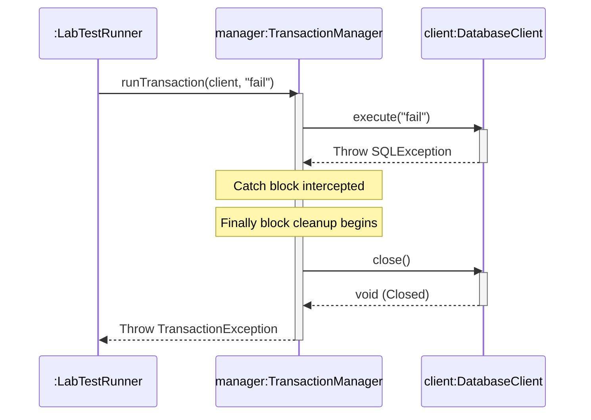

# 📝 Study Notes: P00.M02.L02

## Day 3 Exceptions, Error Handling & Defensive Resource Management


## 📖 Table of Contents

- [1. Warm-Up & Quick Recall](#-1-warm-up--quick-recall)
- [2. Video Lecture Notes: UML Sequence Diagrams](#-2-video-lecture-notes-uml-sequence-diagrams)
- [3. Reading Section: Exception Chaining Mechanics](#-3-reading-section-exception-chaining-mechanics)
- [4. Coding Practice & Lab Notes](#-4-coding-practice--lab-notes)
- [5. UML Sequence Diagram](#-5-uml-sequence-diagram)
- [6. Engineering Insight & Open Source Connection](#-6-engineering-insight--open-source-connection)
- [7. Minute Chat Discussions & Clarifications](#-7-minute-chat-discussions--clarifications)
- [8. End-of-Day Reflection](#-8-end-of-day-reflection)

---

## 🛑 1. Warm-Up & Quick Recall

### Quick Recall Questions & Core Concepts

| Concept | Takeaway |
|---|---|
| **Catch Block Order** | Must go from **most specific → most generic**. A parent class (e.g. `Exception`) above a child class (e.g. `IOException`) causes a **compile-time error** ("unreachable code") |
| **Method Signatures & Throws Contracts** | Rethrowing a *new checked exception* requires declaring it with `throws`. Rethrowing an *unchecked* (`RuntimeException`) exception requires **no** signature change |
| **The `finally` Guarantee** | Executes **no matter what** — even across `return` statements or a new exception. The JVM pauses, runs `finally`, then resumes control |
| **Custom vs. Generic Exceptions** | Custom types add domain-specific context, making logs explicit and dramatically speeding up production debugging |

### Warm-Up Coding Exercise: Defensive Guard Clauses

An unchecked validation exception ensuring inputs stay within the bounded range of **18 to 150**.

```java
// Custom Unchecked Exception
class ValidationException extends RuntimeException {
    public ValidationException(String message) {
        super(message);
    }
}

// Validation Logic
public class AgeValidator {
    public void validateAge(int age) {
        if (age < 18 || age > 150) {
            throw new ValidationException("Age is not within limits: " + age);
        }
        System.out.println("Age is valid.");
    }
}
```

---

## 🎥 2. Video Lecture Notes: UML Sequence Diagrams

- **Focus:** Modeling dynamic alternative flows and conditional exceptional logic.
- **Key Tool — `alt` and `break` Fragments:**
  - The **`alt`** (alternative) fragment box partitions happy paths (success) from exceptional catch paths (error handling), separated by a dashed line — showing exactly where control forks when a method aborts by throwing.
  - Cleanup execution (`finally` blocks) sits explicitly along the object lifeline, showing it persists **regardless** of which `alt` branch fires.

---

## 📖 3. Reading Section: Exception Chaining Mechanics

**Core Objective:** Safely wrap low-level checked technical errors (e.g. `SQLException`) into high-level domain-specific unchecked exceptions **without destroying the original diagnostic history**.

**The Constructor Pattern:** Pass the caught root exception directly into the constructor of your custom exception wrapper.

```java
try {
    client.execute(query);
} catch (SQLException e) {
    // Correct Exception Chaining Pattern
    throw new TransactionException("Transaction failed and aborted.", e);
}
```

> ⚠️ **Critical Trap — Swallowing Traces:** Throwing `new TransactionException("Failed")` **without** passing the original exception `e` permanently wipes out the root stack trace, making deep-level production crashes impossible to diagnose.

---

## 💻 4. Coding Practice & Lab Notes

### Practice: `PropagationPlayground.java`

Catches a simulated low-level checked exception and securely bubbles it up as an anchored runtime exception via the constructor chain.

```java
import java.sql.SQLException;

public class PropagationPlayground {

    // Simulates a low-level database error
    public void queryDatabase() throws SQLException {
        throw new SQLException("Simulated Database disk I/O failure.");
    }

    // Catches, chains, and rethrows cleanly as Unchecked
    public void runTask() {
        try {
            queryDatabase();
        } catch (SQLException e) {
            throw new RuntimeException("DB query failed", e);
        }
    }

    public static void main(String[] args) {
        PropagationPlayground playground = new PropagationPlayground();
        try {
            playground.runTask();
        } catch (RuntimeException e) {
            // Verifies the presence of the "Caused by: java.sql.SQLException"
            e.printStackTrace();
        }
    }
}
```

### Lab: Resilient Database Transaction Simulator

A production-grade transaction management pattern enforcing strict resource reclamation contracts via standard `try-catch-finally` layouts.

| Class / Component | Responsibility |
|---|---|
| **`DatabaseClient`** | Tracks connection state, simulates SQL calls, and exposes a manual cleanup channel |
| **`TransactionException`** | Custom unchecked wrapper decoupling implementation details from API signatures |
| **`TransactionManager`** | Implements the processing context; guarantees clean closing of resources under all conditions |
| **`LabTestRunner`** | Executes isolated automated tests validating state changes and trace continuity |

#### Compilation & Execution Instructions

Run from the root project directory `src/`:

```bash
# Compile core files and unit runners into target binaries
javac main/java/handbook/phase00/p00m02l02/*.java test/java/handbook/phase00/p00m02l02/*.java -d bin

# Execute with explicit assertions enabled (-ea)
java -ea -cp bin handbook.phase00.p00m02l02.LabTestRunner
```

---

## 📊 5. UML Sequence Diagram

Maps the execution path when a faulty query is supplied — showing how cleanup runs **before** the exception escapes back to the runner client.



---

## 💡 6. Engineering Insight & Open Source Connection

- **The Execution Masking Paradox** — While `finally` guarantees cleanup, an unhandled exception thrown *inside* a `finally` block completely **overrides and swallows** whatever exception was previously thrown in the `try` block. Enterprise codebases guard against this with nested micro try-catches or Java's `addSuppressed()` mechanism to preserve multiple errors.

- **Apache Tomcat Ecosystem Parallel** — Open-source servers like **Apache Tomcat** lean heavily on this defensive pattern. When loading lifecycle components or deployment configs, Tomcat enforces strict `try-finally` sequences so boot crashes immediately release temporary registers and system descriptors — preventing catastrophic memory leaks in containerized cloud hosts.

---

## 💬 7. Minute Chat Discussions & Clarifications

From today's architectural code review:

- **Signature Contract Verification** — Catching an exception and throwing a *new checked exception* requires the outer layer to explicitly track it via `throws`, which is exactly why frameworks lean toward custom **unchecked** runtime overrides to protect architectural decoupling.
- **Compilation State Tracking** — Out-of-order catch chains manifest as explicit **compile errors**, not silent runtime faults — keeping the system safe before anything ever deploys.
- **Defensive Exception Mechanics** — Modern clean architectures keep base logic free of implementation-specific errors by wrapping raw exception instances inside custom exception types.

---

## 🏁 8. End-of-Day Reflection

**Q1. If an exception is thrown inside a `try` block, what happens to the lines after it?**
Sequential processing halts immediately; remaining statements in that `try` block are skipped entirely, and control jumps straight to the matching catch handler.

**Q2. Why is exception chaining crucial for debugging enterprise systems?**
It preserves an explicit trace via the `Caused by:` payload. Without it, original technical context — like database error codes or network timeouts — is erased, leaving engineers with no way to trace the root failure.

**Q3. Can a `finally` block throw an exception itself? What happens to the original?**
Yes. If it does, the new exception propagates upward, completely **suppressing and masking** the original exception from the `try` or `catch` blocks.

**Q4. How does the UML sequence diagram show `finally` executing regardless of an exception?**
The `close()` call occurs after the exception is handled internally and *before* control returns to the runner — illustrating resource management that sits outside the conditional forks.

**Q5. Why are custom unchecked wrappers (like `TransactionException`) useful in framework libraries?**
They encapsulate concrete implementation exceptions, preventing infrastructure-specific dependencies (like low-level SQL modules) from polluting top-level service signatures and client business code.

---

<p align="center"><sub>📘 Personal study notes · Java Exception Chaining & Resource Management</sub></p>