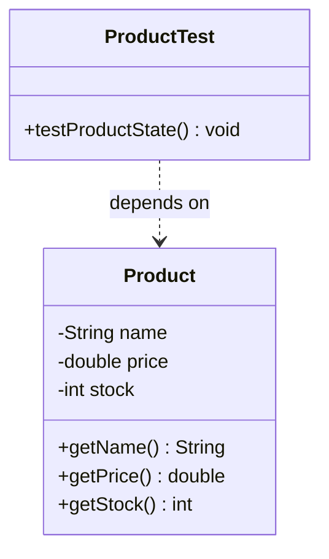

# 📘 P00.M02.L03 — Day 2 Advanced JUnit 5 Assertions & Test Architecture

> **Date:** July 24, 2026
> **Focus:** Grouped assertions, lifecycle management, iterables vs. arrays, timeouts, and project structure conventions.

---

## 🗂️ Table of Contents

1. [Warm-Up Recall & Lifecycle Review](#1-️-warm-up-recall--lifecycle-review)
2. [Video Lecture Notes](#2-️-video-lecture-notes-grouped-assertions--lifecycle)
3. [Reading Section — Assertion Deep Dive](#3--reading-section-notes-junit-5-assertion-deep-dive)
4. [Coding Exercises](#4--coding-exercises)
5. [UML Class Diagram](#5-️-static-uml-class-diagram)
6. [Engineering Insight & OSS Connection](#6--engineering-insight--open-source-connection)
7. [End-of-Day Reflection Summary](#7--end-of-day-reflection-summary)
8. [Deep-Dive Q&A](#8--deep-dive-discussion--qa)
9. [Quick-Reference Cheat Sheet](#-quick-reference-cheat-sheet)

---

## 1. 🔄 Warm-Up Recall & Lifecycle Review

### Key Concepts

| Concept | Explanation |
|---|---|
| **Test Isolation** (`PER_METHOD`, default) | JUnit creates a **new instance** of the test class before *every* `@Test` method. This prevents shared mutable state from leaking between tests. |
| **`@BeforeEach`** | Runs setup logic before *every single* test method in the class. |
| **`assert` (Java keyword)** | `assert <condition> : "Message";` → condition first, message last. |
| **`assertEquals` (JUnit 5)** | `assertEquals(expected, actual, "Message");` → expected & actual first, message last. |
| **`assertThrows`** | Takes an `ExceptionClass` + `Executable` (functional interface). Catches the exception, passes the test, and **returns the exception instance** so you can assert further on it (e.g., check the message). |
| **Tests as documentation** | Unlike static docs (Markdown/Confluence), tests are *executable specs* — if behavior changes, failing tests force docs to stay honest. |

### 💻 Warm-Up Code Template

```java
import org.junit.jupiter.api.BeforeEach;
import org.junit.jupiter.api.Test;
import static org.junit.jupiter.api.Assertions.assertNotNull;

public class WarmUpExerciseTest {

    private StringBuilder str;

    @BeforeEach
    void setup() {
        // Instantiate helper class before every test
        str = new StringBuilder("JUnit 5");
    }

    @Test
    void testInstanceIsNotNull() {
        assertNotNull(str, "StringBuilder instance should not be null after setup");
    }
}
```

---

## 2. 🎥 Video Lecture Notes (Grouped Assertions & Lifecycle)

- **Fail-Fast vs. Grouped Execution**
  - Standard assertions stop dead at the first failure.
  - `assertAll` bundles multiple assertions (as lambdas) and evaluates **all of them**, regardless of individual failures.
- **Syntax:**
  ```java
  assertAll("heading", Executable... executables)
  ```
- **Diagnostic Value:** Aggregates every failure into one unified report — a `MultipleFailuresError`.

---

## 3. 📖 Reading Section Notes (JUnit 5 Assertion Deep Dive)

### Grouped Assertions — `assertAll`
Runs every assertion block even if earlier ones fail, then reports **all** failures together.

### Iterable vs. Array Assertions

| Method | What it Checks | Type-Strict? |
|---|---|---|
| `assertIterableEquals` | Same elements, same order | ❌ No — a `List` can equal a `Set` in content |
| `assertArrayEquals` | Contents, length, **and** exact component type | ✅ Yes |

### ⏱️ Timeouts: `assertTimeout` vs. `assertTimeoutPreemptively`

| Feature | `assertTimeout` | `assertTimeoutPreemptively` |
|---|---|---|
| **Execution Thread** | Same thread as the test | Separate background thread |
| **On Limit Exceeded** | Waits for code to finish, *then* reports failure | Kills execution immediately at the time limit |
| **Best For** | DB/Spring code relying on `ThreadLocal` state | Infinite loops, deadlocks, hanging-thread detection |

> 💡 **Memory hook:** *"Preemptively PREEMPTS the thread"* — it doesn't wait around.

---

## 4. 💻 Coding Exercises

### Exercise 1 — Constructor Exception Validation Recall

```java
@Test
void shouldThrowExceptionWhenAgeIsInvalid() {
    IllegalArgumentException exception = assertThrows(
        IllegalArgumentException.class,
        () -> new User("Burhan", -1)
    );
    assertEquals("Age cannot be negative", exception.getMessage());
}
```

### Exercise 2 — Grouped Assertions with `assertAll`

```java
import org.junit.jupiter.api.Test;
import static org.junit.jupiter.api.Assertions.assertAll;
import static org.junit.jupiter.api.Assertions.assertEquals;

public class ProductTest {

    @Test
    void testProductState() {
        Product product = new Product("Laptop", 999.99, 50);

        assertAll("Verify Product State",
            () -> assertEquals("Laptop", product.getName(), "Name mismatch"),
            () -> assertEquals(999.99, product.getPrice(), "Price mismatch"),
            () -> assertEquals(50, product.getStock(), "Stock mismatch")
        );
    }
}
```

---

## 5. 🗺️ Static UML Class Diagram



---

## 6. 🛠️ Engineering Insight & Open Source Connection

- **Insight:** Sequential assertions hide bugs — you fix one, rerun, find the next, rerun again. `assertAll` surfaces **every broken property in one pass**, dramatically shortening the feedback loop.
- **Real-world pattern:** Frameworks like **Spring Framework** lean on `assertAll` when validating HTTP responses — status code, headers, and payload can all be checked in a single grouped assertion instead of three separate test runs.

---

## 7. 🌙 End-of-Day Reflection Summary

1. **`assertAll` execution model** — evaluates *all* lambdas before aggregating results; no fail-fast shortcut.
2. **Unhandled exceptions inside `assertAll`** — e.g., a stray `NullPointerException` is caught, recorded as an error, and execution **continues** through the remaining assertions.
3. **Decoupled test scope** — production code must have **zero compile-time dependency** on test code, so test frameworks never leak into release artifacts.
4. **Package visibility matching** — placing tests in `src/test/java/com/example/` mirrors `src/main/java/com/example/`, giving tests **package-private access** to production classes without making anything public.
5. **Timeout utility** — essential for catching performance regressions, network latency issues, or hanging loops *before* they hit production.

---

## 8. ❓ Deep-Dive Discussion & Q&A

### Q1: Why did the JUnit Console CLI report `0 tests found` for `WarmUpExercise`?
- **Reason:** `--scan-classpath` uses strict naming conventions — it only picks up classes ending in `Test`, `Tests`, or `TestCase`.
- **Fix:** Rename the class to `WarmUpExerciseTest`, or explicitly target it with `--select-class WarmUpExercise`.

### Q2: How does `assertAll` handle non-assertion errors (like `NullPointerException`)?
- Treated as an **Error**, not an **Assertion Failure**. JUnit catches the `Throwable`, logs it into the failure report, and keeps running the rest of the assertion list.

### Q3: Why does Java use `src/main/java/com/company/app`?
- **`src/main` vs `src/test`** — keeps production code separate so build tools (Maven/Gradle) only bundle `src/main` into the deployable artifact.
- **`java/`** — isolates `.java` source from other resources/languages.
- **Reverse-domain packages (`com.company.app`)** — avoids naming collisions with classes pulled in via `pom.xml`/`build.gradle`.

### Q4: Why distinguish "Project Name" from "Application Name"?
- **Project/Repo name** — identifies the local folder or Git repo (e.g., `payment-service-repo`).
- **Java package namespace** — identifies the app's unique JVM package boundary (e.g., `com.company.payment`). Full domain packaging is required *even in single-service repos* to avoid runtime class collisions with third-party dependencies.

---

## ⚡ Quick-Reference Cheat Sheet

| When you need to... | Use |
|---|---|
| Check multiple properties without stopping at the first failure | `assertAll("label", () -> ..., () -> ...)` |
| Compare a `List` to a `Set` by content only | `assertIterableEquals` |
| Compare arrays strictly (contents + type) | `assertArrayEquals` |
| Time-box code that might hang forever | `assertTimeoutPreemptively` |
| Time-box code using `ThreadLocal`/Spring context | `assertTimeout` |
| Assert an exception was thrown *and* inspect it | `assertThrows(Class, Executable)` → returns exception |
| Fix "0 tests found" in CLI scan | Rename class to end in `Test`/`Tests`/`TestCase`, or use `--select-class` |

---

### 🧠 Revision Tip
Before your next session, try to explain **without looking**:
1. Why `assertAll` is better than a chain of plain `assertEquals` calls.
2. The difference between `assertTimeout` and `assertTimeoutPreemptively` — and *when* you'd pick each.
3. Why `src/test` mirrors `src/main`'s package structure.

If you can explain all three clearly, you've retained today's lesson. ✅