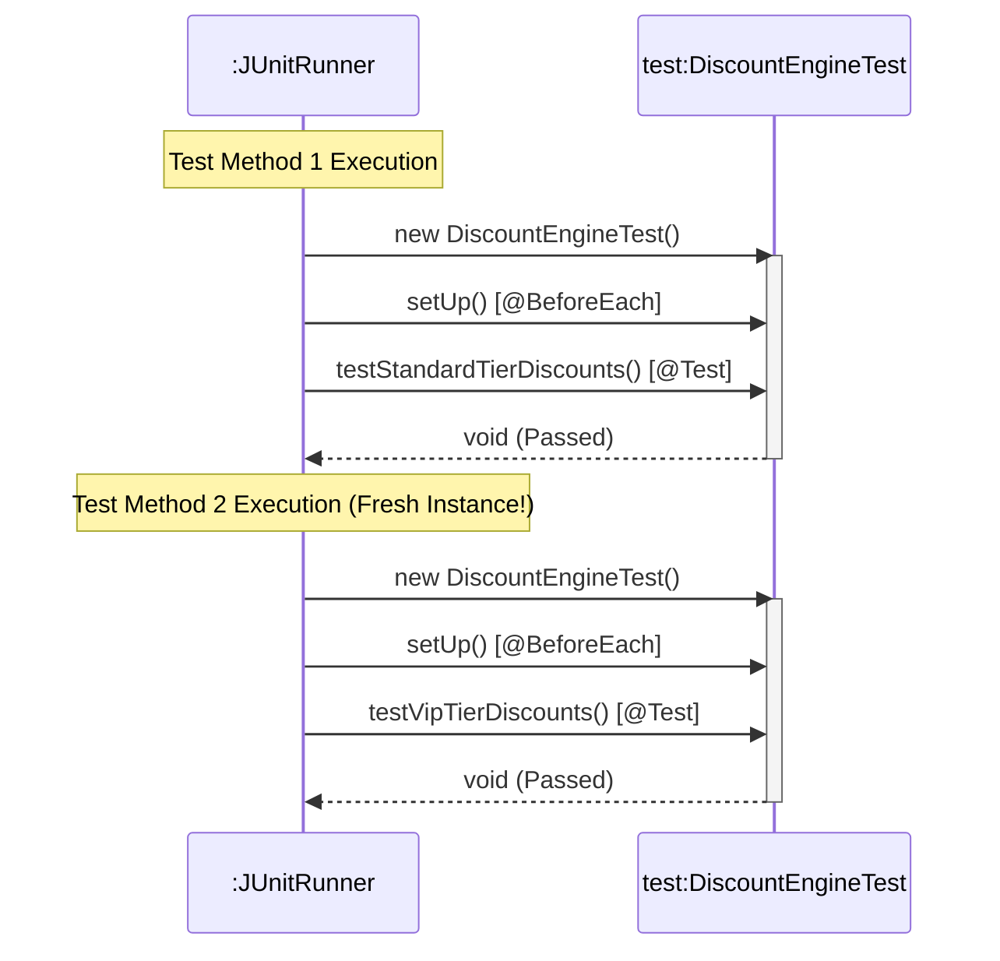

# 📘 Day 3 JUnit Basics, Lifecycle Hooks & Executable Examples
> **Module:** P00.M02.L03
> **Focus:** JUnit 5 fundamentals — assertions, test lifecycle, state isolation, and a hands-on pricing engine lab.

---

## 🧭 Quick-Recall Cheat Sheet

| Concept | One-Line Takeaway |
|---|---|
| `assertAll` | Runs *every* assertion, collects *all* failures, reports them together. |
| Sequential `assertEquals` | **Fail-fast** — stops at the first failure. |
| Test → Production dependency | **One-way, dashed arrow** (`TestClass ┄▶ ProductionClass`). Production code never knows tests exist. |
| Default lifecycle | **New instance per `@Test` method** → guarantees isolation. |
| `@BeforeAll` / `@AfterAll` | **Class-level**, run once, must be `static` (unless `PER_CLASS` lifecycle). |
| `@BeforeEach` / `@AfterEach` | **Instance-level**, run before/after *every* test. |
| Static mutable fields in tests | ⚠️ Common cause of **flaky, order-dependent tests**. |

---

## 1. Warm-Up & Recall

### 🔹 `assertAll` vs. Sequential `assertEquals`

| | Sequential `assertEquals` | `assertAll` |
|---|---|---|
| **Execution model** | Fail-fast — stops at first failure | Runs all executables, no matter what |
| **Debugging experience** | Tedious "fix → re-run → fix again" loop | See *all* problems in one run |
| **Readability** | Scattered failure info | Aggregated, grouped failure report |

### 🔹 UML Relationship: Test ↔ Production Code

```
TestClass ┄┄┄▶ ProductionClass
   (dashed arrow = Dependency)
```

- The **Test Class depends on** the Production Class (it needs to call its methods to verify behavior).
- The **Production Class has zero knowledge** of the test suite — no compile-time dependency on JUnit, ever.
- This is why you can ship production `.jar` files **without** the test code or JUnit library at all.

### 🔹 Required Static Imports

```java
import static org.junit.jupiter.api.Assertions.assertAll;
import static org.junit.jupiter.api.Assertions.assertEquals;

// Or, more commonly, the wildcard version:
import static org.junit.jupiter.api.Assertions.*;
```

> 💡 **Why static imports?** They let you write `assertEquals(...)` instead of the clunkier `Assertions.assertEquals(...)`.

### 🔹 Warm-Up Exercise — Solution

```java
import java.util.ArrayList;
import java.util.List;
import org.junit.jupiter.api.Test;

import static org.junit.jupiter.api.Assertions.assertFalse;

public class WarmUpExerciseTest {

    private List<Integer> list = new ArrayList<>();

    @Test
    void testListIsNotEmpty() {
        // Arrange: Add an element so the list is not empty
        list.add(42);

        // Assert: list.isEmpty() evaluates to false, passing assertFalse
        assertFalse(list.isEmpty(), "List should not be empty");
    }
}
```

---

## 2. Core Concepts — The JUnit 5 Test Lifecycle

| Annotation | Level | When It Runs | Requirement |
|---|---|---|---|
| `@BeforeAll` | Class | **Once**, before any test instance exists | `static` (unless `@TestInstance(Lifecycle.PER_CLASS)`) |
| `@BeforeEach` | Instance | Before **every** `@Test` | Instance method |
| `@Test` | Instance | The test itself | Instance method |
| `@AfterEach` | Instance | After **every** `@Test` | Instance method |
| `@AfterAll` | Class | **Once**, after all tests finish | `static` (unless `@TestInstance(Lifecycle.PER_CLASS)`) |

> 🔑 **Key Takeaway:** With the default lifecycle (`@TestInstance(Lifecycle.PER_METHOD)`), JUnit creates a **brand-new instance** of the test class for *every single* `@Test` method. This is the foundation of test isolation.

**Execution order under the hood:**

```
@BeforeAll → Constructor → @BeforeEach → @Test → @AfterEach → @AfterAll
```

---

## 3. Coding Exercise — State Leakage Debugging

### 🚩 The Problem
Using `static` mutable fields across tests causes **state pollution** — because static state is shared at the *class* level, it persists across test instances instead of resetting.

### ✅ The Fix: `@BeforeEach` Fixture Reset

```java
import java.util.ArrayList;
import java.util.List;
import org.junit.jupiter.api.BeforeEach;
import org.junit.jupiter.api.Test;

import static org.junit.jupiter.api.Assertions.assertEquals;

public class StateLeakageDemoTest {

    private List<Integer> list;

    @BeforeEach
    void setup() {
        // Fresh fixture allocation before every test execution
        list = new ArrayList<>();
    }

    @Test
    void test1() {
        list.add(3);
        assertEquals(1, list.size(), "List size should be one!");
    }

    @Test
    void test2() {
        list.add(2);
        assertEquals(1, list.size(), "List size should be one!");
    }
}
```

> 🧠 **Mental model:** treat `list` like a whiteboard that gets wiped clean (`@BeforeEach`) before each test writes on it. Never let one test's leftovers bleed into the next.

---

## 4. Hands-On Lab — Discount Engine & Pricing Test Suite

### 🏗️ Production Code — `DiscountEngine.java`

```java
package handbook.phase00.p00m02l03;

public class DiscountEngine {

    public double calculateDiscount(double orderTotal, String tier) {
        if (orderTotal < 0) {
            throw new IllegalArgumentException("Order total cannot be negative.");
        }
        if (tier == null || tier.trim().isEmpty()) {
            throw new IllegalArgumentException("Customer tier is required.");
        }

        String normalizedTier = tier.trim().toUpperCase();
        if (normalizedTier.equals("STANDARD")) {
            return orderTotal >= 100.0 ? orderTotal * 0.05 : 0.0;
        } else if (normalizedTier.equals("VIP")) {
            return orderTotal >= 100.0 ? orderTotal * 0.20 : orderTotal * 0.10;
        } else {
            throw new IllegalArgumentException("Unknown customer tier: " + tier);
        }
    }
}
```

#### 📐 Business Rules at a Glance

| Tier | Order < $100 | Order ≥ $100 |
|---|---|---|
| **STANDARD** | 0% discount | 5% discount |
| **VIP** | 10% discount | 20% discount |
| Invalid tier / negative total | — | Throws `IllegalArgumentException` |

### 🧪 Test Code — `DiscountEngineTest.java`

```java
package handbook.phase00.p00m02l03;

import org.junit.jupiter.api.BeforeEach;
import org.junit.jupiter.api.Test;

import static org.junit.jupiter.api.Assertions.*;

public class DiscountEngineTest {

    private DiscountEngine engine;

    @BeforeEach
    void setUp() {
        // Fixture Setup: Fresh engine instance before every test
        engine = new DiscountEngine();
    }

    @Test
    void testStandardTierDiscounts() {
        assertAll("Standard Tier Verification",
            () -> assertEquals(0.0, engine.calculateDiscount(50.0, "STANDARD")),
            () -> assertEquals(10.0, engine.calculateDiscount(200.0, "STANDARD"))
        );
    }

    @Test
    void testVipTierDiscounts() {
        assertAll("VIP Tier Verification",
            () -> assertEquals(5.0, engine.calculateDiscount(50.0, "VIP")),
            () -> assertEquals(40.0, engine.calculateDiscount(200.0, "VIP"))
        );
    }

    @Test
    void testInvalidOrderTotalThrowsException() {
        assertThrows(IllegalArgumentException.class, () -> engine.calculateDiscount(-10.0, "STANDARD"));
    }

    @Test
    void testInvalidTierThrowsException() {
        assertThrows(IllegalArgumentException.class, () -> engine.calculateDiscount(100.0, "UNKNOWN"));
    }
}
```

> ✏️ **Why `assertAll` here?** Each test checks *two related scenarios* (below/above the $100 threshold). Grouping them means one failed threshold doesn't hide info about the other.

---

## 5. UML Sequence Diagram — Framework Test Lifecycle in Action

Shows how `:JUnitRunner` creates a **fresh instance** for each `@Test` method:



**Reading this diagram:** notice the *same lifeline* (`test:DiscountEngineTest`) is activated and deactivated **twice** — once per test — proving each test gets a brand-new object, not a reused one.

---

## 6. Engineering Insight & Open-Source Connection

### 🛡️ Test Isolation & Execution Independence
- A fresh object per `@Test` means tests **cannot leak state** into each other and **cannot depend on run order**.
- **Flaky tests** (tests that pass/fail unpredictably due to shared state or ordering) erode trust in CI/CD pipelines — teams start ignoring red builds, which defeats the whole purpose of automated testing.

### ⚙️ Under the Hood — `JupiterTestEngine`
- JUnit scans your test classes and builds a **hierarchical tree of test descriptors** at startup.
- It then uses **reflection** to dynamically drive the invocation chain:

```
@BeforeAll → Constructor → @BeforeEach → @Test → @AfterEach → @AfterAll
```

---

## 7. Chat Discussion & Reflection Summary

1. **Static vs. Class Lifecycle**
   `@BeforeAll` runs *before any object instance exists* — that's precisely why it must be `static` by default (there's no instance yet to call it on).

2. **`@TestInstance` Configuration**
   `@TestInstance(Lifecycle.PER_CLASS)` shares a **single test instance** across all test methods in the class, which lifts the `static` requirement from `@BeforeAll`/`@AfterAll`. Trade-off: you lose some isolation guarantees, so shared mutable fields need extra care.

3. **Preventing Flaky Tests**
   Clean fixture initialization via `@BeforeEach` + avoiding static mutable state = reliable test suites, even under multi-threaded or parallel CI execution.

---

## 🎯 Revision Checklist

- [ ] I can explain the difference between `assertAll` and sequential `assertEquals`.
- [ ] I can draw the dependency arrow between test and production classes correctly (direction matters!).
- [ ] I know which lifecycle annotations are class-level vs. instance-level.
- [ ] I understand *why* `@BeforeAll`/`@AfterAll` must be `static` by default.
- [ ] I can explain why static mutable fields in test classes cause flaky tests.
- [ ] I can trace the full lifecycle order: `@BeforeAll → Constructor → @BeforeEach → @Test → @AfterEach → @AfterAll`.
- [ ] I understand what `@TestInstance(Lifecycle.PER_CLASS)` changes.