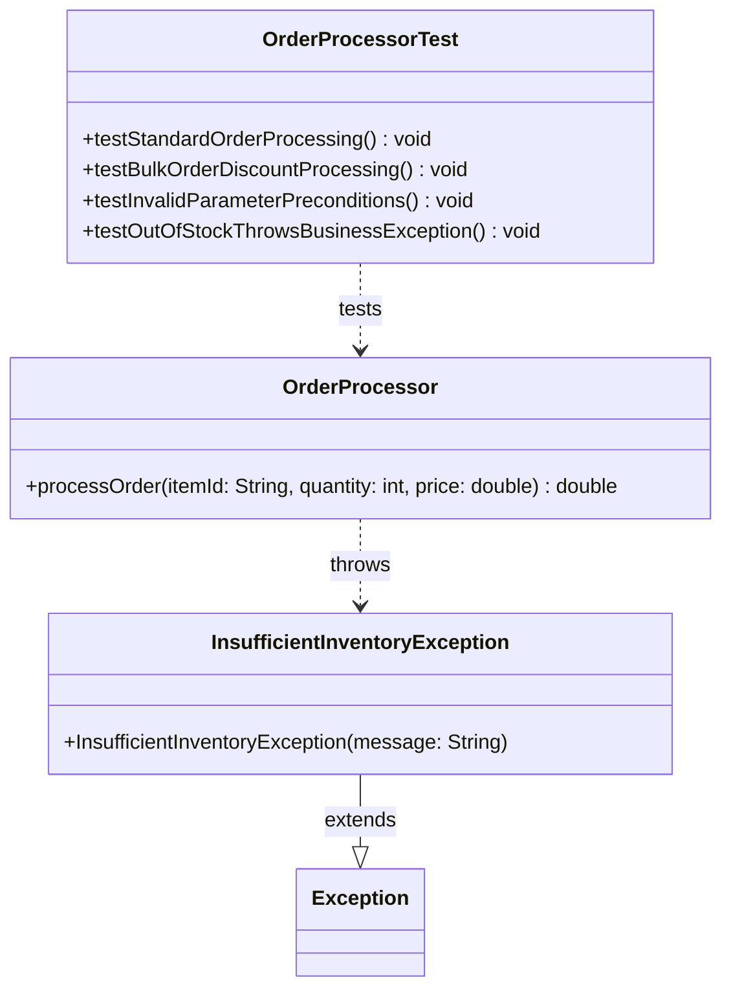

# 📦 Module 00.02 Project — Resilient Order Validation & Processing Subsystem

> **Topic:** Defensive Guard Clauses · Custom Exceptions · JUnit 5 Testing
> **Date:** July 26, 2026
> **Status:** ✅ Complete — ready for review/revision

A quick-reference, self-contained study guide for the concepts and code built in this module. Read top-down for a full refresher, or jump straight to the **[Cheat Sheet](#-cheat-sheet-30-second-recall)** if you just need a memory jog.

---

## 🎯 TL;DR — What This Project Is About

You built a small but *enterprise-realistic* order-processing subsystem that demonstrates three layers of defense working together:

| Layer | Mechanism | Purpose |
|---|---|---|
| 1️⃣ Input validation | `IllegalArgumentException` (unchecked) | Catch programmer/caller mistakes, **fail fast** |
| 2️⃣ Business rules | `InsufficientInventoryException` (checked) | Handle expected, recoverable real-world failures |
| 3️⃣ Verification | JUnit 5 (`assertThrows`, `assertAll`, `@BeforeEach`) | Prove the above two layers actually work, automatically |

**Core lesson:** *Defensive programming + explicit domain exceptions + automated tests = self-testing, fault-tolerant Java code.*

---

## 🧠 Concept Refresher

### 1. JVM Stack & Method Calls
- Every method call gets its own **stack frame** holding local variables + parameters.
- Frames stack up (push) as methods call other methods, and pop off in reverse order when a method `return`s.
- 🔑 *Why it matters:* explains why a variable inside one method is invisible to another, and why deep recursion can cause a `StackOverflowError`.

### 2. Checked vs. Unchecked Exceptions
| | Checked (`Exception`) | Unchecked (`RuntimeException`) |
|---|---|---|
| Compiler enforcement | Must catch or declare (`throws`) | No enforcement |
| Represents | Recoverable external failure (I/O, DB, network, **out-of-stock**) | Developer bug (null input, bad argument) |
| Philosophy | "This *might* happen — handle it gracefully" | "This *should never* happen — fail fast and fix the bug" |
| Example in this project | `InsufficientInventoryException` | `IllegalArgumentException` |

> 💡 **Memory hook:** *Checked = "checked at compile time, expected at runtime." Unchecked = "unchecked by compiler, unexpected in a correct program."*

### 3. Exception Chaining
- Wrap a low-level cause inside a high-level, meaningful exception:
  ```java
  throw new CustomException("Readable message", cause);
  ```
- Passing `cause` preserves the **original stack trace** for debugging — you get the domain-level story *and* the technical root cause.

### 4. Test Isolation with `@BeforeEach`
- Runs **before every single test method**.
- Re-creates a clean object (e.g., a fresh `OrderValidator`) so no test's leftover state can leak into another → no flaky, order-dependent tests.

### 5. Grouped Assertions — `assertAll`
- Plain `assertEquals` **stops at the first failure**, hiding any others.
- `assertAll(...)` runs **every** assertion and reports **all** failures together in one go — much faster debugging when several things break at once.

---

## 📖 Lecture & Reading Takeaways

- **`assertThrows(ExpectedException.class, () -> executable)`** — verifies that a specific block of code throws the expected exception, *without* crashing the test run. This is the standard way to test failure paths.
- **Given–When–Then (a.k.a. Arrange–Act–Assert)** — the standard shape of a good unit test:
  - **Given** → set up inputs / mocks / initial state
  - **When** → call the method under test
  - **Then** → assert the result, side effect, or thrown exception

---

## 💻 Coding Practice — `OrderValidator`

Simple precondition checker demonstrating guard clauses.

### `OrderValidator.java`
```java
public class OrderValidator {

    public void validateOrder(String itemId, int qty, double price) {
        if (itemId == null || itemId.trim().isEmpty()) {
            throw new IllegalArgumentException("The item id can't be null or empty.");
        }

        if (qty <= 0) {
            throw new IllegalArgumentException("The quantity can't be negative or equal to zero.");
        }

        if (price <= 0.0) {
            throw new IllegalArgumentException("The price can't be negative or equal to zero.");
        }
    }
}
```

### `OrderValidatorTest.java`
```java
import static org.junit.jupiter.api.Assertions.assertThrows;
import org.junit.jupiter.api.BeforeEach;
import org.junit.jupiter.api.Test;

public class OrderValidatorTest {

    private OrderValidator validator;

    @BeforeEach
    void setup() {
        validator = new OrderValidator();
    }

    @Test
    void testForNullOrEmptyItemId() {
        assertThrows(IllegalArgumentException.class,
            () -> validator.validateOrder(null, 23, 3.3), "Should throw for null item id");
        assertThrows(IllegalArgumentException.class,
            () -> validator.validateOrder("    ", 32, 30.3), "Should throw for empty item id");
    }

    @Test
    void testForNegativeOrZeroQty() {
        assertThrows(IllegalArgumentException.class,
            () -> validator.validateOrder("1", 0, 43.3), "Should throw for quantity equals zero");
        assertThrows(IllegalArgumentException.class,
            () -> validator.validateOrder("1", -1, 43.3), "Should throw for negative quantity");
    }

    @Test
    void testForNegativeOrZeroPrice() {
        assertThrows(IllegalArgumentException.class,
            () -> validator.validateOrder("2", 2, 0.0), "Should throw for price equals zero");
        assertThrows(IllegalArgumentException.class,
            () -> validator.validateOrder("2", 2, -3.0), "Should throw for negative price");
    }
}
```

**What to notice:** each test groups *related* invalid inputs together (null/empty, negative/zero qty, negative/zero price) rather than one test per assertion — keeps the test suite readable and organized by *behavior*, not by line count.

---

## 🛠️ Project Milestone — Resilient Order Processing Subsystem

This is the "real" deliverable: a full pipeline combining unchecked guards, a checked business exception, and a discount calculation.

### `InsufficientInventoryException.java`
```java
package handbook.phase00.project02;

public class InsufficientInventoryException extends Exception {
    public InsufficientInventoryException(String message) {
        super(message);
    }
}
```
> Extends `Exception` (not `RuntimeException`) → **checked**. Any caller of a method that throws this *must* handle it or declare it.

### `OrderProcessor.java`
```java
package handbook.phase00.project02;

public class OrderProcessor {

    public double processOrder(String itemId, int quantity, double price) throws InsufficientInventoryException {
        // Guard Clauses (Unchecked)
        if (itemId == null || itemId.trim().isEmpty()) {
            throw new IllegalArgumentException("Item ID is required.");
        }
        if (quantity <= 0) {
            throw new IllegalArgumentException("Quantity must be greater than zero.");
        }
        if (price <= 0.0) {
            throw new IllegalArgumentException("Price must be positive.");
        }

        // Business Logic Error (Checked)
        if (itemId.trim().equalsIgnoreCase("OUT_OF_STOCK")) {
            throw new InsufficientInventoryException("Item " + itemId + " is out of stock.");
        }

        // Bulk Discount Calculation (5% off for 10+ items)
        double subtotal = quantity * price;
        if (quantity >= 10) {
            return subtotal * 0.95;
        }
        return subtotal;
    }
}
```

**Execution order to remember:**
1. Guard clauses run first (fail fast on bad input — no point computing anything with garbage data).
2. Business rule check (`OUT_OF_STOCK`) runs next (a legitimate input that simply can't be fulfilled).
3. Only if both pass does the discount math execute.

**Discount rule:** `quantity >= 10` → 5% off subtotal. This exact threshold is what the corresponding test suite (`OrderProcessorTest`) locks in as a regression guard.

---

## 📐 UML Class Diagram



---

## 💡 Engineering Insights & Real-World Connections

### Floating-Point Arithmetic in Tests
Doubles use IEEE 754 binary representation, so simple sums can produce tiny rounding errors:
```java
// 0.1 + 0.2 == 0.30000000000000004 (not exactly 0.3!)
```
➡️ **Never** use `assertEquals(expected, actual)` for doubles. Always specify a **delta tolerance**:
```java
assertEquals(expected, actual, 0.001);
```

### Spring MVC / Enterprise Integration
In a real Spring Boot service, this pattern extends naturally:
- Service layer throws `InsufficientInventoryException` (checked, meaningful).
- A global `@ExceptionHandler` intercepts it and converts it into a proper HTTP response — e.g., **`409 Conflict`** — instead of leaking a raw stack trace to the client.

➡️ This is *why* checked business exceptions matter beyond the JVM: they map cleanly onto HTTP semantics at the API boundary.

---

## 📝 Reflection Notes

- **API usability:** `IllegalArgumentException` protects against *caller/programmer* mistakes (fail fast, fix the bug). `InsufficientInventoryException` protects against *legitimate runtime business realities* (handle gracefully, inform the user).
- **Regression protection:** A dedicated test for the discount threshold means if someone later changes `>= 10` to `> 10`, the build **fails immediately** — before it ever reaches production.
- **Architecture Decision Records (ADR):** Worth writing one here to document *why* the checked/unchecked boundary was drawn where it was — future maintainers (including future-you) won't have to reverse-engineer the reasoning.

---

## 🧪 Running Tests via CLI (JUnit Console Launcher)

```bash
java -jar "junit-platform-console-standalone.jar" --class-path .\bin --select-class handbook.phase00.project02.OrderProcessorTest
```
- `--class-path .\bin` → points to your compiled `.class` files.
- `--select-class` → takes the **fully qualified class name** (package + class).

## 📦 Git Commit

```bash
git add .
git commit -m "project(P00.M02): complete module 0.2 project"
```

---

## ✅ Cheat Sheet (30-Second Recall)

- **Guard clause →** `IllegalArgumentException`, unchecked, fail fast, developer bug.
- **Business exception →** `InsufficientInventoryException`, checked (`extends Exception`), expected real-world failure.
- **`assertThrows`** → tests that bad input correctly throws.
- **`assertAll`** → runs *all* assertions, reports *all* failures (vs. `assertEquals` which stops at the first).
- **`@BeforeEach`** → fresh, isolated object before every test.
- **Discount rule** → `qty >= 10` → ×0.95 on subtotal.
- **Doubles in tests** → always use a delta: `assertEquals(expected, actual, 0.001)`.
- **Checked exception + Spring** → `@ExceptionHandler` maps it to an HTTP status (e.g., 409 Conflict).

---

*Suggested location: `projects/module-02-project/docs/architecture.md` or your personal study notes folder.*