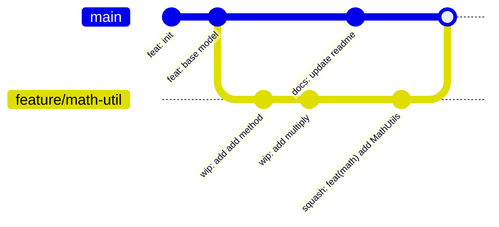

# 📚 Day 2 Git Workflow & Code History
### `P00.M03.L01` — Interactive Rebasing, DAG History Control & Merge Strategies

> **One-line summary:** Git stores full snapshots (not diffs) in a content-addressable DAG. Branches are just pointers. Rebase rewrites history for a clean line; merge preserves the true, tangled timeline.

---

## 🗂️ Table of Contents

1. [Mental Model: Git's Internal Object Graph](#-mental-model-gits-internal-object-graph)
2. [Pointer Mechanics: Branches & HEAD](#-pointer-mechanics-branches--head)
3. [Quick Recall Flashcards](#-quick-recall-flashcards)
4. [Daily Driver Command](#-daily-driver-command)
5. [Merge vs. Rebase vs. Squash](#-merge-vs-rebase-vs-squash--merge)
6. [Interactive Rebasing Cheat Sheet](#️-interactive-rebasing-git-rebase--i)
7. [Visual DAG Example](#-visual-dag-example)
8. [Deep-Dive Insights & Edge Cases](#-deep-dive-insights--edge-cases)
9. [Open Source Connection](#-open-source-connection)
10. [Final Recall Check](#-final-recall-check-close-book-and-answer)

---

## 🧠 Mental Model: Git's Internal Object Graph

Traditional VCS tools (like SVN) store history as a **sequence of line-by-line diffs**. Git does something fundamentally different: it stores **full snapshots** of your project at every commit, linked together in a **Directed Acyclic Graph (DAG)**, addressed by content hash (SHA).

```
   [ Commit Object ] ──▶ points to: Root Tree Hash, Parent Commit(s), Author, Message
          │
          ▼
   [ Tree Object ]   ──▶ a directory listing (sub-tree hashes + blob hashes)
          │
          ▼
   [ Blob Object ]   ──▶ raw file content, identified purely by its SHA hash
```

**Why this matters:** because storage is content-addressable, identical file content across commits is *never duplicated* — Git just re-points to the same blob hash. This is also *why* rebasing changes SHAs (see [Deep-Dive](#-deep-dive-insights--edge-cases)).

---

## 📍 Pointer Mechanics: Branches & HEAD

| Concept | What it actually is |
|---|---|
| **Branch** | A tiny 41-byte text file at `.git/refs/heads/<branch_name>` holding **only the 40-char SHA of the tip commit**. It does *not* store the full commit list — Git walks backward via each commit's `parent` pointer. |
| **HEAD** | A pointer to your *current* branch (or commit). |
| **Detached HEAD** | Happens when `HEAD` points directly at a commit SHA instead of a branch ref — you're no longer "on" any branch. |

> 💡 **Mental trick:** a branch is a **sticky note with one address on it**, not a folder full of history. History is reconstructed by walking parent links backward from that one address.

---

## 🔬 Quick Recall Flashcards

| Q | A |
|---|---|
| Why are atomic commits valuable? | Easier code review, faster `git bisect` debugging, and clean reverts of single features. |
| What does `<<<<<<< HEAD` mark? | Start of your local/current branch's conflicting changes. |
| What does `=======` mark? | The boundary between "your changes" and "incoming changes" in a conflict. |
| What does `>>>>>>> <branch>` mark? | End of the incoming branch's conflicting changes. |

---

## 🖥️ Daily Driver Command

```bash
git log --oneline --graph --decorate
```

| Flag | Effect |
|---|---|
| `--oneline` | Condenses each commit to short SHA + message |
| `--graph` | Draws the ASCII branch/merge structure on the left |
| `--decorate` | Labels commits with `HEAD`, branch names, and tags |

> Run this constantly — it's the fastest way to *see* the DAG instead of imagining it.

---

## 🔀 Merge vs. Rebase vs. Squash & Merge

### 1️⃣ `git merge` — the 3-Way Merge
Creates a **new commit with two parents**.

- ✅ **Pros:** Non-destructive; preserves the true historical timeline, including exactly when branches split and rejoined.
- ❌ **Cons:** Produces a "spider-web" DAG cluttered with `Merge branch '...'` noise.

### 2️⃣ `git rebase`
**Replays** your feature commits one-by-one on top of another branch's tip — **rewriting every replayed commit's SHA**.

- ✅ **Pros:** Perfectly linear history — clean, readable, and trivially bisectable.
- ❌ **Cons:** Rewrites SHAs. **Dangerous on shared/public branches.**

### 3️⃣ `git merge --squash`
Bundles **all** cumulative changes from a feature branch into **one new commit** on the target branch.

- ✅ **Pros:** Keeps `main` spotless; a feature reverts with a single `git revert`.
- ❌ **Cons:** Destroys the intermediate WIP commit history permanently.

### 🧭 At-a-Glance Comparison

| Strategy | New commit? | Parents | History shape | Rewrites SHAs? | Safe on shared branch? |
|---|---|---|---|---|---|
| `merge` | Yes (merge commit) | 2 | Web / non-linear | No | ✅ Yes |
| `rebase` | No new, but SHAs change | 1 (relinked) | Linear | ✅ Yes | ❌ No |
| `merge --squash` | Yes (1 commit) | 1 | Linear, history collapsed | N/A (discards history) | ✅ Yes |

---

## 🛠️ Interactive Rebasing (`git rebase -i`)

```bash
git rebase -i HEAD~N          # rebase the last N commits
git rebase -i --root          # rebase all the way back to the first commit
```

Use this to clean up messy local commits **before** opening a Pull Request.

| Command | Shortcut | Effect |
|---|---|---|
| `pick` | `p` | Keep the commit unchanged |
| `squash` | `s` | Merge this commit's changes **into the commit above it** (keeps both messages, combined) |
| `fixup` | `f` | Same as `squash`, but **discards** this commit's message |
| `reword` | `r` | Edit the commit message only — files untouched |
| `drop` | `d` | Delete the commit entirely |

> 🧠 **Memory hook:** *squash* = "merge and keep talking," *fixup* = "merge and shut up."

---

## 📐 Visual DAG Example



This shows a typical feature-branch workflow: work happens in parallel on `feature/math-util`, intermediate `wip:` commits get squashed into one clean commit, and the result is merged back into `main`.

---

## 💡 Deep-Dive Insights & Edge Cases

### ⚠️ The Golden Rule of Rebasing
> **Never rebase public, shared branches.**

Rebasing recalculates SHAs, which breaks history sync for every teammate who already pulled the old commits — resulting in duplicate commits and merge-conflict chaos.

### 🔑 Why do commit SHAs change on rebase?
A commit's SHA hash is derived from **four inputs**:

1. File tree content
2. Author/committer timestamp
3. Commit message
4. **Parent commit hash**

Rebasing changes the base → changes the **parent hash** → forces a **new SHA** for that commit **and every commit after it** in the chain (cascading effect).

### 🧩 Other Edge Cases Worth Remembering

| Situation | What happens / how to handle it |
|---|---|
| **Nested `.git` repos** | Running `git init` inside a subdirectory creates a broken/untracked nested repo. Fix: delete the nested `.git`, or properly use `git submodule add <url>` for external dependencies. |
| **Empty conflict markers** | If one side of a conflict marker block is blank, that branch deleted or altered those exact lines relative to the common base. Inspect with `git checkout --conflict=diff3 <file>` to see the original 3-way base. |
| **Empty commits during rebase** | If replaying a commit produces **zero net diff** (the change already exists in the target branch), Git silently **drops** that commit — unless you pass `--keep-empty`. |

---

## 🌐 Open Source Connection

Projects like **JUnit 5** and **Spring Framework** require contributors to **squash local WIP commits into one conventional commit** before merging. This keeps `git blame` pointing to a meaningful commit explaining *why* a change was made — instead of an unhelpful `"fix typo"` or `"wip"`.

---

## 📝 Final Recall Check (close book and answer)

1. What's the core structural difference between `merge` and `rebase` in terms of parent commits?
2. In `rebase -i`, what's the difference between `squash` and `fixup`?
3. What does `squash` actually do to two commits sitting in the interactive buffer?
4. Why should you never rebase a branch other people have already pulled?
5. What four inputs determine a commit's SHA hash?

<details>
<summary>▶️ Reveal Answers</summary>

1. `merge` creates a new commit with **two parents**, preserving the parallel timeline. `rebase` replays commits **sequentially onto a new base**, giving each replayed commit a single new parent — resulting in linear history.
2. `squash` combines a commit into the one above it **and keeps both commit messages** for editing. `fixup` does the same merge but **silently discards** the message of the commit being folded in.
3. It fuses the commit's diff into the commit directly above it in the rebase buffer, collapsing them into a single commit.
4. Because rebasing changes commit SHAs; anyone who already has the old SHAs will get duplicate/conflicting history when they pull.
5. File tree content, author/committer timestamp, commit message, and parent commit hash.

</details>

---

*Save this file as `notes/P00.M03.L01.md` for easy reference during future revision sessions.*