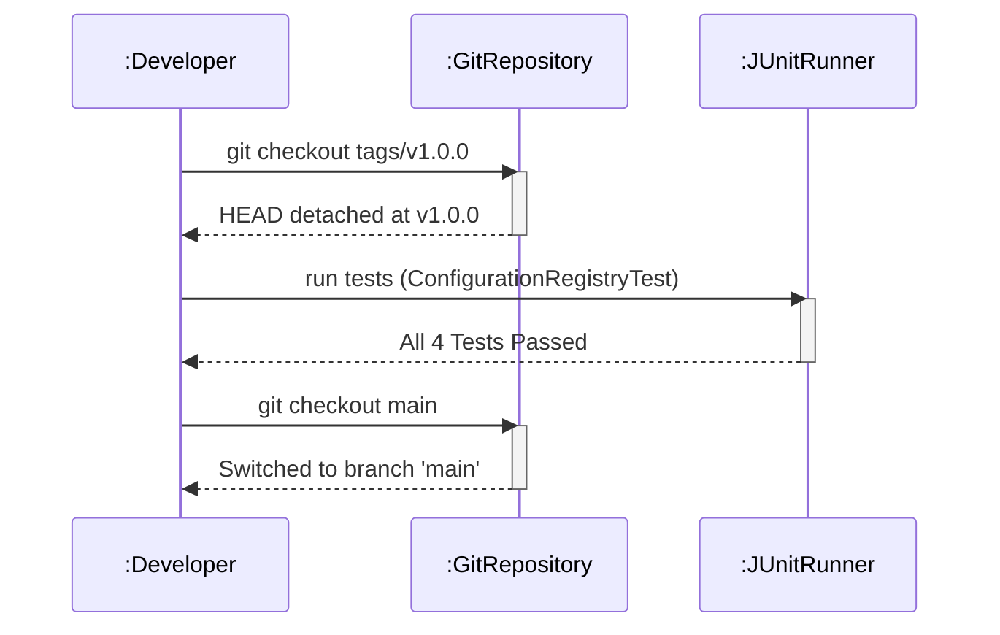

# 📝 P00.M03.L01 — Git Workflow, Tagging & Code History

> **A revision-ready guide to Git releases, detached HEAD recovery, and Semantic Versioning — built around a Java `ConfigurationRegistry` project.**

| | |
|---|---|
| **Date** | July 29, 2026 |
| **Module** | `P00.M03.L01` |
| **Focus** | Tagged Releases · Detached HEAD Recovery · Interactive Rebase · Semantic Versioning |

---

## 📚 Table of Contents

1. [Objective](#-objective)
2. [Core Concepts — Quick Recall](#-core-concepts--quick-recall)
3. [Essential Tagging Commands](#-essential-tagging-commands)
4. [Detached HEAD State](#-detached-head-state)
5. [Tag Types: Lightweight vs. Annotated](#-tag-types-lightweight-vs-annotated)
6. [Hands-on Lab: ConfigurationRegistry](#-hands-on-lab-configurationregistry)
7. [Git Workflow Executed](#-git-workflow-executed)
8. [Release Sequence Diagram](#-release-sequence-diagram)
9. [Semantic Versioning](#-semantic-versioning)
10. [CI/CD & Real-World Connection](#-cicd--real-world-connection)
11. [Reflection Summary (Q&A Recall)](#-reflection-summary-qa-recall)
12. [Daily Checklist](#-daily-checklist)

---

## 🎯 Objective

Understand how production software releases are tied to **immutable points in Git history** — by building a Java configuration registry, recovering from a detached `HEAD` state, using interactive rebase, and tagging a release with **Semantic Versioning** (`v1.0.0`).

---

## 🧠 Core Concepts — Quick Recall

### `git merge` vs. `git rebase`

| | `git merge` | `git rebase` |
|---|---|---|
| **What it does** | Combines histories via a new **merge commit** with two parents | Replays commits on top of the target base branch |
| **Result** | Non-linear history, fully preserved | Clean, linear history |
| **Best for** | Shared/public branches | Local, private feature branches |

> ⚠️ **The Golden Rule of Rebasing**
> **Never rebase public/shared branches.** Rewriting commit hashes breaks history for collaborators and causes severe merge conflicts.

### Interactive Rebase

```bash
git rebase -i HEAD~3
```

- **Squashing**: melds a commit into the one directly above it in the rebase buffer — used to clean up noisy/redundant commits before merging.

### Why Rebasing Changes SHA Hashes

A commit hash is computed from its **tree + message + timestamp + parent commit ID**. Since rebase changes the parent, the **hash changes completely** — this is why rewritten history is dangerous to share.

---

## 🏷️ Essential Tagging Commands

| Goal | Command | Description |
|---|---|---|
| List Tags | `git tag` | Lists all local tags |
| Create Annotated Tag | `git tag -a v1.0.0 -m "Release message"` | Full Git object with tagger info, date, message |
| Push Specific Tag | `git push origin v1.0.0` | Pushes a single tag to remote |
| Push All Tags | `git push origin --tags` | Pushes all local tags to remote |
| Delete Local Tag | `git tag -d v1.0.0` | Removes tag locally |
| Delete Remote Tag | `git push origin --delete v1.0.0` | Removes tag from remote |

---

## 🌀 Detached HEAD State

**Definition:** `HEAD` points directly at a commit hash or tag (e.g. `git checkout <hash>`) instead of a branch reference like `main`.

**The Risk:** Commits made here are **unanchored**. Switching away (`git checkout main`) leaves them orphaned and eligible for Git garbage collection (`git gc`).

**Recovery Pattern:**

```bash
# While inside detached HEAD state, after making commits:
git checkout -b fix/historical-patch
```

This attaches a **new branch pointer** to the current commit — safely anchoring the work so it isn't lost.

> 💡 **Mental model:** Detached HEAD = standing on a floating platform. Creating a branch = dropping an anchor so the platform doesn't drift away when you leave.

---

## 🔖 Tag Types: Lightweight vs. Annotated

| Type | What it is | Use case |
|---|---|---|
| **Lightweight** | A simple bookmark/pointer to a commit hash | Quick, informal local markers |
| **Annotated** | A real object in the Git database — stores tagger name, email, date, message, optional GPG signature | ✅ **Always use for production releases** |

---

## 💻 Hands-on Lab: ConfigurationRegistry

**Goal:** Build a case-insensitive, validated key-value configuration registry in Java, backed by JUnit 5 tests, under package `handbook.phase00.p00m03l01`.

### `ConfigurationRegistry.java`

```java
package handbook.phase00.p00m03l01;

import java.util.HashMap;
import java.util.Map;

public class ConfigurationRegistry {
    private final Map<String, String> settings = new HashMap<>();

    public void set(String key, String value) {
        if (key == null || key.trim().isEmpty()) {
            throw new IllegalArgumentException("Configuration key cannot be null or empty.");
        }
        if (value == null) {
            throw new IllegalArgumentException("Configuration value cannot be null.");
        }
        settings.put(key.trim().toLowerCase(), value.trim());
    }

    public String get(String key) {
        if (key == null || key.trim().isEmpty()) {
            throw new IllegalArgumentException("Configuration key cannot be null or empty.");
        }
        return settings.get(key.trim().toLowerCase());
    }

    public boolean containsKey(String key) {
        if (key == null || key.trim().isEmpty()) return false;
        return settings.containsKey(key.trim().toLowerCase());
    }

    public int size() {
        return settings.size();
    }
}
```

**Design notes to remember:**
- Keys are **normalized**: trimmed + lowercased → case-insensitive lookups.
- Values are trimmed but **not** lowercased (case-sensitive values preserved).
- Null/blank keys and null values throw `IllegalArgumentException` — fail fast on bad input.
- Backed by a plain `HashMap<String, String>` — no external dependencies.

---

## 🔧 Git Workflow Executed

```bash
# 1. Create a feature branch
git checkout -b feature/config-registry

# 2. Commit implementation & test suite
git add .
git commit -m "feat: implement ConfigurationRegistry with validation"

# 3. Merge into main
git checkout main
git merge feature/config-registry

# 4. Tag the release (annotated!)
git tag -a v1.0.0-p00m03l01 -m "Release version 1.0.0 of Configuration Registry"
```

---

## 🎨 Release Sequence Diagram



**Reading it:** Checking out a tag detaches `HEAD` → tests are run against that exact immutable snapshot → developer returns to `main` once verification is complete.

---

## 🔢 Semantic Versioning

Format: **`MAJOR.MINOR.PATCH`**

| Segment | Meaning | Example |
|---|---|---|
| **MAJOR** | Incompatible / breaking API changes | `1.0.0` → `2.0.0` |
| **MINOR** | Backward-compatible new features | `1.0.0` → `1.1.0` |
| **PATCH** | Backward-compatible bug fixes | `1.0.0` → `1.0.1` |

> 🧩 **Rule of thumb:** If existing code using your API would break → bump MAJOR. If you only added something new without breaking anything → bump MINOR. If you just fixed a bug → bump PATCH.

---

## ⚙️ CI/CD & Real-World Connection

- **JUnit 5** (`junit-team/junit5`): official releases (e.g. `r5.9.0`) are backed by **annotated Git tags**.
- **Pipeline trigger:** running `git push origin --tags` sends release tags to the remote.
- CI/CD runners (GitHub Actions, Jenkins, etc.) detect the new tag and automatically:
  1. Execute the test suite
  2. Compile production JARs
  3. Publish release artifacts

**Why this matters:** tagging isn't just bookkeeping — it's the trigger that turns a commit into a *shippable, automated release*.

---

## 🔄 Reflection Summary (Q&A Recall)

Use these as self-test flashcards.

1. **What is a Detached HEAD state, and how do you recover from it?**
   `HEAD` points directly to a commit SHA instead of a branch. Recover by running `git checkout -b <branch-name>` *before* switching away, to anchor the work.

2. **Lightweight vs. Annotated tags — what's the difference?**
   Lightweight = a plain pointer to a commit. Annotated = a full Git object storing author, date, and a release message — always preferred for releases.

3. **Break down Semantic Versioning.**
   `MAJOR` = breaking changes · `MINOR` = new backward-compatible features · `PATCH` = bug fixes.

4. **How does CI/CD tie into tagging?**
   Pushing tags (`git push origin --tags`) triggers automated builds, test runs, artifact packaging (e.g. JARs), and deployments.

5. **Why run tests before tagging a release?**
   Pre-release testing ensures code stability before the release is marked **immutable**, preventing broken builds from reaching production.

---

## ✅ Daily Checklist

- [x] Warm-up recall & command exercise
- [x] Detached HEAD recovery exercise completed
- [x] `ConfigurationRegistry` & JUnit 5 tests implemented
- [x] Feature branch merged & annotated tag created (`v1.0.0-p00m03l01`)
- [x] UML sequence diagram drawn
- [x] End-of-day reflection answered

---

### 🗂️ Quick-Reference Cheat Sheet

```
git tag                              # list tags
git tag -a v1.0.0 -m "msg"           # create annotated tag
git push origin v1.0.0               # push one tag
git push origin --tags               # push all tags
git tag -d v1.0.0                    # delete local tag
git push origin --delete v1.0.0      # delete remote tag
git checkout -b <branch>             # anchor detached HEAD
git rebase -i HEAD~3                 # interactive rebase
```

> 📌 **Golden Rules to Never Forget**
> 1. Never rebase shared/public branches.
> 2. Always use annotated tags for production releases.
> 3. Anchor detached HEAD work with a new branch *before* switching away.