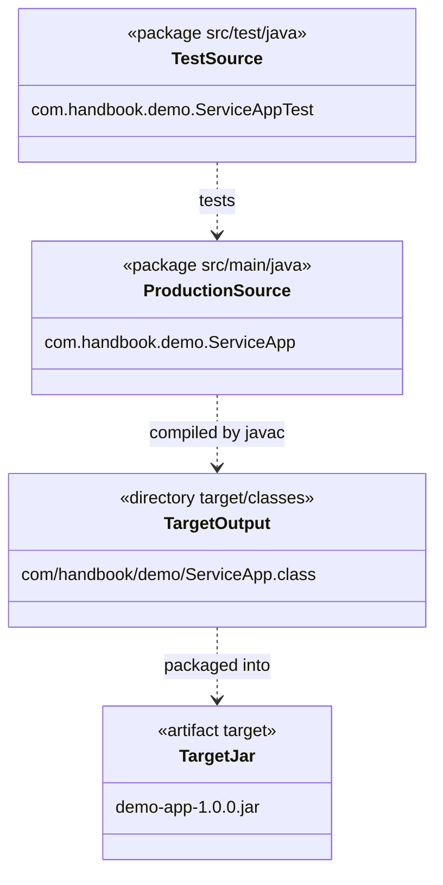

# 📦 P00.M03.L02 — Day 2 Maven Build Lifecycles, Plugins & Execution

> **One-line summary:** Maven turns your source code into a runnable artifact by walking through a strict, ordered sequence of *phases* — and every phase is actually powered by *plugin goals* doing the real work underneath.

---

## 🗺️ Table of Contents

- [TL;DR — Key Takeaways](#-tldr--key-takeaways)
- [Core Recall: The Fundamentals](#-core-recall-the-fundamentals)
- [The Big Picture: Lifecycles & Plugins](#-the-big-picture-lifecycles--plugins)
- [The Default Lifecycle Phases](#-the-default-lifecycle-phases-in-order)
- [Phase vs. Plugin Goal](#-phase-vs-plugin-goal--the-crucial-distinction)
- [Test Skipping Flags](#-test-skipping-flags)
- [Documentation Highlights](#-documentation-highlights)
- [Terminal Command Cheat Sheet](#-terminal-command-cheat-sheet)
- [Project Structure Diagram](#-project-structure-diagram)
- [Engineering Insight](#-engineering-insight--why-this-matters)
- [Deep Dive Q&A](#-deep-dive-qa)
- [Self-Test: End-of-Day Reflection](#-self-test-end-of-day-reflection)

---

## ⚡ TL;DR — Key Takeaways

| # | Concept | Why it matters |
|---|---------|-----------------|
| 1 | **Maven is an orchestrator**, not a compiler | It sits on top of JDK tools (`javac`, `java`), resolving dependencies, building classpaths, and calling the right tools in the right order |
| 2 | **Three independent lifecycles** | `clean` → wipe output, `default` → build/test/package/deploy, `site` → generate docs |
| 3 | **Phases are labels, plugins do the work** | A phase like `compile` is just a named slot; the actual work is done by a bound plugin goal like `compiler:compile` |
| 4 | **Sequential execution = safety net** | If tests fail in `test`, the build stops *before* `package` — a broken build can never become a shippable artifact |

---

## 🧠 Core Recall: The Fundamentals

### 📁 The Four Standard Directories
Maven's "convention over configuration" philosophy means every project looks the same:

```
src/main/java          → your production code
src/main/resources      → non-code files needed at runtime (configs, etc.)
src/test/java           → your test code
src/test/resources      → non-code files needed only for testing
```
No path configuration needed — Maven already expects this shape.

### 🏷️ GAV Coordinates (how Maven identifies *any* artifact)

| Coordinate | Meaning | Example |
|---|---|---|
| `groupId` | Organization / domain | `org.junit.jupiter` |
| `artifactId` | Project / module name | `junit-jupiter-api` |
| `version` | Release version | `5.9.2` |

### 🎯 Dependency Scopes

| Scope | Available on | Typical use |
|---|---|---|
| `compile` *(default)* | Compile + test + runtime classpaths | Libraries your app actually needs to run |
| `test` | Test compile + test execution **only** | Testing libraries (JUnit, Mockito) — excluded from the final production JAR |

**Correct JUnit 5 dependency snippet:**
```xml
<dependency>
    <groupId>org.junit.jupiter</groupId>
    <artifactId>junit-jupiter-api</artifactId>
    <version>5.9.2</version>
    <scope>test</scope>
</dependency>
```

### 🔗 Transitive Dependencies
Dependencies *your* dependencies need — Maven resolves, downloads, and manages the whole tree automatically, so you never manually chase down a "dependency of a dependency."

---

## 🏗️ The Big Picture: Lifecycles & Plugins

```
                     Maven Architecture
                             │
            ┌────────────────┴────────────────┐
            │                                 │
     Lifecycle (Workflow)             Plugins (Workers)
            │                                 │
         Phases                            Goals
            │                                 │
            ├── compile ────────────────► compiler:compile
            ├── test ───────────────────► surefire:test
            ├── package ────────────────► jar:jar / war:war
            ├── clean ──────────────────► clean:clean
            └── site ───────────────────► site:site
```

**Mental model:** Lifecycles are the *menu*, phases are the *courses*, and plugin goals are the *chefs* actually cooking each dish.

### The Three Built-in Lifecycles

| Lifecycle | Purpose |
|---|---|
| `clean` | Deletes generated files (removes `target/`) |
| `default` | The main event — build, test, package, deploy |
| `site` | Generates project documentation & reports |

---

## 🔢 The Default Lifecycle Phases (in order)

Running any phase automatically runs **every phase before it**:

```
validate → compile → test-compile → test → package → verify → install → deploy
```

> 💡 So `mvn package` doesn't just package — it silently runs validate → compile → test-compile → test first. This is *why* tests always run before packaging.

---

## ⚖️ Phase vs. Plugin Goal — The Crucial Distinction

| Type | Example | Behavior |
|---|---|---|
| **Lifecycle phase** | `mvn compile` | Runs the full lifecycle up to and including this milestone; triggers all bound goals |
| **Direct plugin goal** | `mvn compiler:compile` | Jumps straight to one plugin's task, **bypassing** the lifecycle sequence |

Use phases for normal builds. Use direct goals when you want to run *just one specific task* without the overhead of the full pipeline.

---

## 🚦 Test Skipping Flags

| Flag | Effect |
|---|---|
| `-DskipTests` | Compiles test code, but **does not run** it |
| `-Dmaven.test.skip=true` | Skips **both** compiling and running test code |

---

## 📖 Documentation Highlights

- **Universal commands:** Because every Maven project follows the same lifecycle, `mvn compile` / `mvn test` work identically across *any* Maven codebase.
- **Packaging binding:** Setting `<packaging>jar</packaging>` or `<packaging>war</packaging>` in `pom.xml` auto-binds the matching plugin goal (`jar:jar`, `war:war`) to the `package` phase.
- **Dependency resolution timing:** Dependencies are resolved and downloaded into `~/.m2/repository` during the *early* validation phases — well before any packaging happens.

---

## 🖥️ Terminal Command Cheat Sheet

| Task | Command |
|---|---|
| Compile production code | `mvn compile` |
| Compile test code | `mvn test-compile` |
| Run unit tests | `mvn test` |
| Run a single test class | `mvn test -Dtest=ServiceAppTest` |
| Package application | `mvn package` |
| Run main class via Maven | `mvn compile exec:java -Dexec.mainClass="com.handbook.demo.ServiceApp"` |
| Run compiled class directly | `java -cp target/classes com.handbook.demo.ServiceApp` |
| Run packaged executable JAR | `java -jar target/demo-app-1.0.0.jar` |

**Exercise recap:** Built `ServiceApp.java` (production) + `ServiceAppTest.java` (test), then manually mirrored what Maven does internally via `javac -d` into `target/classes` and `target/test-classes`.

---

## 📐 Project Structure Diagram



**Read it as:** Tests point at production code → production code gets compiled into `.class` files → those get zipped into the final JAR.

---

## 🔍 Engineering Insight — Why This Matters

- **Sequential Protection Guarantee:** Because `default` is strictly sequential, a failing unit test during `mvn test` **immediately aborts** the build. A broken artifact can never reach `package`.
- **Enterprise Quality Gates:** Real-world projects (JUnit 5, Spring Boot) stack extra plugins onto the pipeline:
  - `maven-surefire-plugin` → unit tests
  - `maven-failsafe-plugin` → integration tests
  - `jacoco-maven-plugin` → code coverage, often enforced during `verify` to **fail the CI/CD build** if coverage drops too low.

---

## 💬 Deep Dive Q&A

**Q1: What is `<modelVersion>4.0.0</modelVersion>`?**
It's the schema version identifier for the POM's Object Model — mandatory for Maven 2/3, always `4.0.0`, ensuring backward compatibility.

**Q2: Why does `pom.xml` include `xmlns` / `xsi:schemaLocation`?**
They are **not** downloaded at build time. They just point your IDE to the `.xsd` schema for autocomplete, validation, and syntax highlighting — purely a developer-tooling convenience.

**Q3: What if JUnit exists in both `pom.xml` *and* manually-added "Reference Libraries"?**
You get duplicate JARs on the classpath. The ClassLoader silently picks the *first* one it finds and ignores the rest — a recipe for silent version-mismatch bugs (e.g., IDE running `5.8.0` while CLI runs `5.9.2`). **Rule of thumb:** let Maven be the single source of truth; delete manual reference libraries.

**Q4: How does `java -jar` know which class to run?**
Maven bakes a `META-INF/MANIFEST.MF` file into the executable JAR containing:
```manifest
Main-Class: com.handbook.demo.ServiceApp
```
The JVM reads this line and calls that class's `public static void main(String[] args)`.

---

## 🪞 Self-Test: End-of-Day Reflection

Try answering these from memory before checking the notes above:

1. What phases run, in order, when you execute `mvn package`?
2. Why is `target/` in `.gitignore`?
3. What does `maven-surefire-plugin` actually do, and where does it write results?
4. How does Maven's sequential pipeline prevent a broken package from ever being built?
5. What's the value of a package/UML diagram like the one above?

<details>
<summary>▶️ Click to reveal answers</summary>

1. `validate → compile → test-compile → test → package` — tests always run *before* packaging.
2. `target/` holds **generated** output (`.class` files, JARs) — version control should only track hand-written source, not build artifacts.
3. It discovers and runs unit tests during the `test` phase, writing detailed XML/text reports to `target/surefire-reports`.
4. Because phases run strictly in sequence, any compile or test failure halts the build immediately — execution never reaches `package`.
5. It visually separates production vs. test code and shows exactly how raw source maps to compiled output and final artifacts — useful for onboarding and architecture review.

</details>

---

*Notes consolidated from lecture, official docs, and hands-on exercises — keep this as your quick-reference for Maven lifecycle revision.*