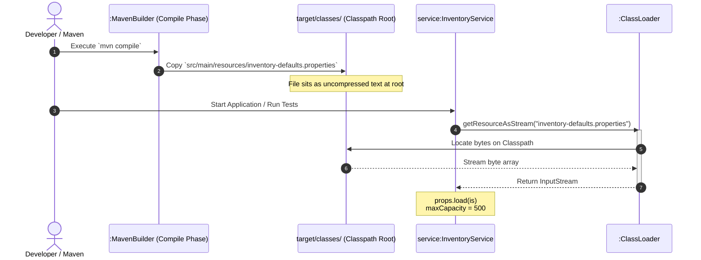

# 📘 P00.M03.L02 — Day 3 Maven Standard Layout & Classpath Resource Loading

> **Module:** P00.M03 — Java Build Systems & Maven Layouts
> **Lesson:** L02 — Standard Layout Inventory Component & Build Package Lab
> **Date:** August 1, 2026

---

## 🎯 TL;DR — The One Thing to Remember

> Production Java apps run **inside a compressed `.jar` file**, not on your local disk.
> `new File("src/main/resources/...")` **will crash in production** because that disk path doesn't exist anymore once things are packaged.
> ✅ **Always use** `ClassLoader.getResourceAsStream()` to read config/resource files — it pulls bytes straight from the classpath (memory), whether you're in your IDE or inside a JAR.

```
  DEVELOPMENT (IDE / Disk)                      PRODUCTION (Packaged JAR / RAM)
┌────────────────────────────────┐             ┌────────────────────────────────┐
│ src/main/resources/config.prop │             │  myapp.jar                     │
│  └── Physical OS Disk File     │   mvn        │   ├── App.class                │
│      Read via: new File(...)   │──package──▶ │   └── config.prop (Compressed) │
└────────────────────────────────┘             │       Read via: ClassLoader    │
                                                └────────────────────────────────┘
```

---

## 🗂️ Table of Contents

1. [Warm-up Recall — Build Lifecycle Basics](#1-warm-up-recall--build-lifecycle-basics)
2. [Core Concepts](#2-core-concepts)
3. [Code Walkthrough: Basic Classpath Loader](#3-code-walkthrough-basic-classpath-loader)
4. [Hands-on Lab: Inventory Service](#4-hands-on-lab-inventory-service)
5. [Sequence Diagram: Build-Time vs Runtime](#5-sequence-diagram-build-time-vs-runtime)
6. [Engineering Insight & Real-World Connection](#6-engineering-insight--real-world-connection)
7. [Q&A — Common Gotchas](#7-qa--common-gotchas)
8. [Quick-Recall Cheat Sheet](#8-quick-recall-cheat-sheet)

---

## 1. Warm-up Recall — Build Lifecycle Basics

### `mvn package` Lifecycle Order

```
validate → compile → test-compile → test → package
```

| Phase | What Happens |
|---|---|
| `validate` | Checks project structure is correct |
| `compile` | Compiles `src/main/java` → `target/classes/` |
| `test-compile` | Compiles `src/test/java` → `target/test-classes/` |
| `test` | Runs unit tests via **Surefire plugin** |
| `package` | Bundles everything into a `.jar` |

### Key Facts

- **Output dirs:**
  - Production classes → `target/classes/`
  - Test classes → `target/test-classes/`
- **`maven-surefire-plugin`** → runs tests in the `test` phase, generates pass/fail/error reports.
- **Fail-Fast Gate** → if *one* test fails, Maven **halts the build**. Nothing gets packaged or deployed. This is a safety net against shipping broken code.
- **UML relationship:** `src/main/java` ──`<<builds>>`/`<<creates>>`──▶ `target/app.jar`

---

## 2. Core Concepts

### 📁 Standard Maven Directory Structure

| Folder | Purpose |
|---|---|
| `src/main/java/` | Production Java source code |
| `src/main/resources/` | Config files: `.properties`, `.xml`, `.json`, `.sql` |
| `target/classes/` | Where Maven copies **both** compiled `.class` files **and** raw resource files |

> 💡 Resources aren't compiled — they're just **copied as-is** into `target/classes/` so they sit next to the compiled bytecode on the classpath.

### 🔑 `java.util.Properties`

- A specialized key-value store, subclassed from `Hashtable`.
- Both keys **and** values are always `String`.
- Parsed line-by-line via `props.load(inputStream)`.

### 🧩 Resource Filtering

- Maven feature: `<filtering>true</filtering>`
- Acts like a template engine — replaces placeholders (e.g. `${project.version}`) with real values.
- Happens during the **`process-resources`** phase, *before* files land in `target/classes/`.

---

## 3. Code Walkthrough: Basic Classpath Loader

```java
package com.handbook.demo;

import java.io.InputStream;
import java.io.IOException;
import java.util.Properties;

public class AppConfig {
    private final Properties props = new Properties();

    public void load() throws Exception {
        // ClassLoader expects path RELATIVE to classpath root (NO leading slash '/')
        try (InputStream is = getClass().getClassLoader().getResourceAsStream("app.properties")) {
            if (is == null) {
                throw new IllegalStateException("app.properties not found on classpath!");
            }
            props.load(is);
        }
    }

    public String getAppName() {
        return props.getProperty("app.name");
    }

    public static void main(String[] args) throws Exception {
        AppConfig config = new AppConfig();
        config.load();
        System.out.println("Loaded App Name: " + config.getAppName());
    }
}
```

**What to notice:**
- ✅ `getClassLoader().getResourceAsStream("app.properties")` — **no leading slash**.
- ✅ Wrapped in `try (...)` — auto-closes the stream (avoids resource leaks).
- ⚠️ Always **null-check** `is` — a missing resource returns `null`, not an exception.

---

## 4. Hands-on Lab: Inventory Service

### Directory Layout

```text
scratch/maven-demo/
├── src/main/resources/
│   └── inventory-defaults.properties
├── src/main/java/handbook/phase00/p00m03l02/
│   └── InventoryService.java
└── src/test/java/handbook/phase00/p00m03l02/
    └── InventoryServiceTest.java
```

### `inventory-defaults.properties`

```properties
default.max_capacity=500
default.low_stock_threshold=10
```

### `InventoryService.java` — Key Behaviors

```java
public class InventoryService {
    private final Map<String, Integer> stock = new HashMap<>();
    private int maxCapacity = 500; // Fallback default

    public InventoryService() {
        loadDefaults();
    }

    private void loadDefaults() {
        try (InputStream is = getClass().getClassLoader()
                .getResourceAsStream("inventory-defaults.properties")) {
            if (is != null) {
                Properties props = new Properties();
                props.load(is);
                this.maxCapacity = Integer.parseInt(
                    props.getProperty("default.max_capacity", "500"));
            }
        } catch (Exception e) {
            System.err.println("Warning: Failed to load inventory-defaults.properties, using fallback limit.");
        }
    }
    // ... addItem(), getQuantity(), getMaxCapacity()
}
```

### 🧠 Design Patterns Worth Remembering

| Pattern | Where | Why |
|---|---|---|
| **Graceful degradation** | `maxCapacity = 500` fallback | If the properties file is missing, the app still runs (with a warning) instead of crashing |
| **Defensive validation** | `addItem()` throws on blank names / non-positive quantities | Prevents corrupt state entering the map |
| **Normalization** | `item.trim().toLowerCase()` | Keys are consistent regardless of casing/whitespace from caller |
| **Capacity guard** | Checks `currentTotal + quantity > maxCapacity` before insert | Business rule enforced at the data layer, not just UI |

---

## 5. Sequence Diagram: Build-Time vs Runtime



**Two distinct phases to keep separate in your head:**

1. **Build-time (disk → disk):** Maven physically copies the resource file into `target/classes/`.
2. **Runtime (classpath → RAM):** The `ClassLoader` streams those bytes into memory when the app actually asks for them.

---

## 6. Engineering Insight & Real-World Connection

### Why This Matters: OS Filesystem vs JVM Classpath

- `java.io.File` needs a real OS path (absolute or relative). Fine on your laptop.
- Inside a packaged `.jar`, everything is a **ZIP entry** — the OS can't open a path like `app.jar!/config.properties` because that's not a real filesystem path.
- **`ClassLoader.getResourceAsStream()`** solves this by asking the *JVM itself* (not the OS) to locate and stream the bytes — it works identically whether the resource sits in a loose folder (dev) or a zipped Uber-JAR (prod).

### 🌱 Spring Framework Connection

Spring Boot's `@PropertySource` and `ResourceLoader` are built **on top of exactly this mechanism**. That's how `application.properties` gets injected into `@Value` fields consistently across:
- Your local IDE
- Docker containers
- Kubernetes pods

Same underlying trick, just wrapped in nicer annotations.

---

## 7. Q&A — Common Gotchas

### ❓ Why aren't `.properties` files compiled into bytecode?

`javac` only compiles `.java` → `.class`. Maven's **`maven-resources-plugin`** just copies `.properties`/`.xml`/`.json` files as **plain text** into `target/classes/` — no transformation.

### ❓ `Class.getResourceAsStream()` vs `ClassLoader.getResourceAsStream()` — what's the difference?

| Method | Leading `/` | Base path |
|---|---|---|
| `ClassLoader.getResourceAsStream("config.properties")` | ❌ Must NOT have one | Always relative to **classpath root** |
| `Class.getResourceAsStream("/config.properties")` | ✅ Needed for root-relative | With `/` → classpath root. **Without `/`** → relative to that class's **package** |

> 🧠 **Memory trick:** *"ClassLoader = always root. Class = relative to you, unless you say `/`."*

### ❓ How do third-party dependencies even run in prod without a local `.m2` repo?

**Fat/Uber JARs** (built via the Spring Boot Maven Plugin or Shadow Plugin) bundle your app's bytecode **plus every dependency JAR** into one single archive. A custom classloader unpacks and loads all of it into memory at runtime.

---

## 8. Quick-Recall Cheat Sheet

| Concept | One-liner |
|---|---|
| Why `new File(...)` fails in prod | `src/` doesn't exist inside a packaged JAR — it's zipped bytes, not OS files |
| Where Maven copies resources | `target/classes/`, during `process-resources`/`compile` |
| How `getResourceAsStream()` works | Asks the JVM to fetch bytes from the active classpath, returns an `InputStream` |
| Missing resource behavior | Returns **`null`** — NOT a `FileNotFoundException`. Always null-check! |
| `ClassLoader` path rule | No leading `/`, always relative to classpath root |
| `Class` path rule | Leading `/` = classpath root; no `/` = relative to that class's package |
| Fail-fast build gate | One failing test = no `package` phase = nothing ships |
| Resource filtering | `<filtering>true</filtering>` swaps `${...}` placeholders before copy |
| Real-world parallel | Spring Boot's `@PropertySource` uses this exact mechanism internally |

---

### 🧭 Revision Tip
Before your next review session, try to **redraw the sequence diagram from memory** (Section 5) and **explain out loud** why `File` breaks in a JAR but `ClassLoader` doesn't. If you can do both without peeking, this lesson has stuck. ✅